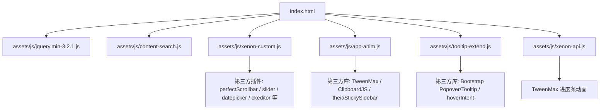
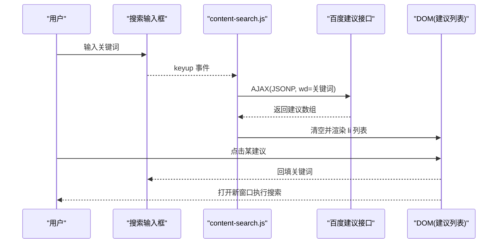
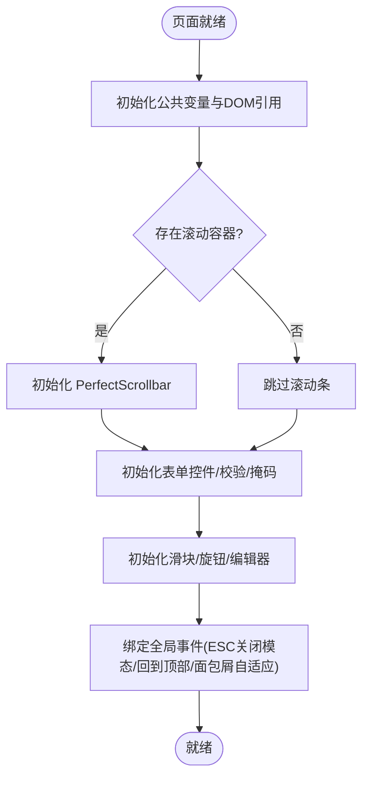
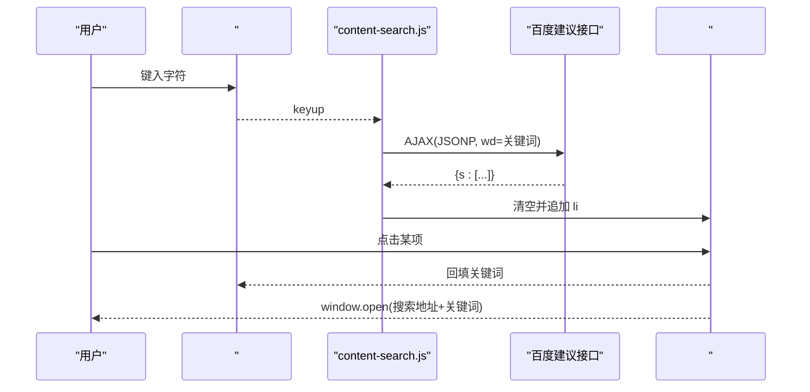
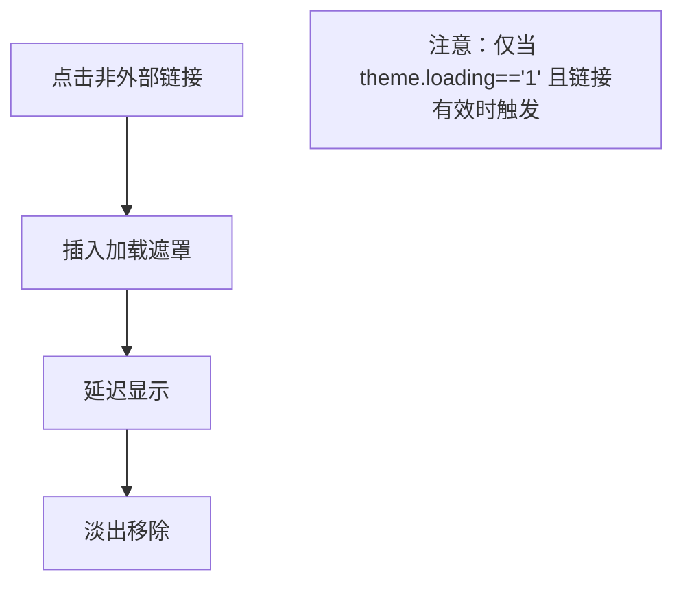
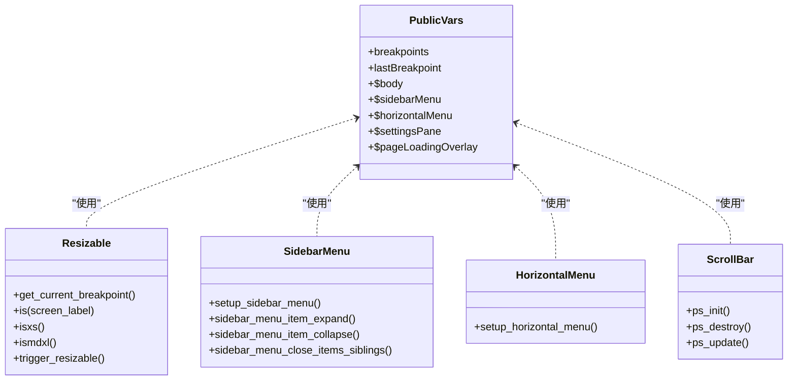
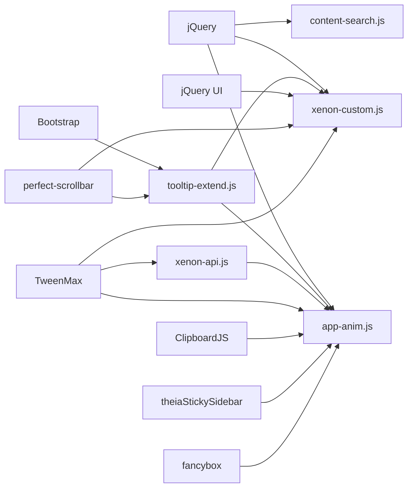

# JavaScript模块

<cite>
**本文引用的文件**
- [assets/js/xenon-custom.js](file://assets/js/xenon-custom.js)
- [assets/js/content-search.js](file://assets/js/content-search.js)
- [assets/js/app-anim.js](file://assets/js/app-anim.js)
- [assets/js/tooltip-extend.js](file://assets/js/tooltip-extend.js)
- [assets/js/xenon-api.js](file://assets/js/xenon-api.js)
- [index.html](file://index.html)
</cite>

## 目录
1. [简介](#简介)
2. [项目结构](#项目结构)
3. [核心组件](#核心组件)
4. [架构总览](#架构总览)
5. [详细组件分析](#详细组件分析)
6. [依赖关系分析](#依赖关系分析)
7. [性能考量](#性能考量)
8. [故障排查指南](#故障排查指南)
9. [结论](#结论)
10. [附录：代码组织规范与最佳实践](#附录代码组织规范与最佳实践)

## 简介
本仓库为基于 jQuery 的前端导航站点，JavaScript 层围绕四大模块构建：
- 核心交互逻辑（xenon-custom.js）：负责页面初始化、侧边栏/水平菜单、滚动条、表单控件、滑块、编辑器等 UI 行为。
- 搜索功能（content-search.js）：实现关键词联想与跳转，调用百度建议接口，使用 JSONP 跨域获取数据并渲染建议列表。
- 动画与交互增强（app-anim.js）：提供页面过渡加载、夜间模式切换、粘性页脚、侧边栏折叠/展开、搜索智能提示、弹窗与确认框等。
- 工具函数库（tooltip-extend.js）：封装断点检测、侧边栏/水平菜单的展开收起、滚动条初始化/销毁、全局事件触发等通用能力；同时提供 Xenon API（loading bar）。

该文档将深入解析各模块的实现机制、数据流、DOM 操作优化与动画控制，并提供可操作的排错与扩展建议。

## 项目结构
前端资源位于 assets/js 目录，入口 index.html 引入关键脚本与样式。核心 JS 职责划分清晰：
- xenon-custom.js：UI 组件装配与交互主流程
- content-search.js：搜索联想与结果展示
- app-anim.js：页面级动画、主题切换、搜索智能提示、弹窗工具
- tooltip-extend.js：响应式断点、菜单行为、滚动条管理、API 辅助
- xenon-api.js：进度条 loading 工具

图表来源
- [index.html:30-31](file://index.html#L30-L31)
- [assets/js/xenon-custom.js:75-132](file://assets/js/xenon-custom.js#L75-L132)
- [assets/js/app-anim.js:1-25](file://assets/js/app-anim.js#L1-L25)
- [assets/js/tooltip-extend.js:275-322](file://assets/js/tooltip-extend.js#L275-L322)
- [assets/js/xenon-api.js:20-91](file://assets/js/xenon-api.js#L20-L91)

章节来源
- [index.html:30-31](file://index.html#L30-L31)

## 核心组件
- 核心交互逻辑（xenon-custom.js）
  - 初始化公共变量与 DOM 引用，统一挂载到 public_vars
  - 处理页面加载遮罩、错误兜底移除遮罩
  - 初始化侧边栏菜单、水平菜单、粘性页脚、Perfect Scrollbar、用户信息搜索按钮、自动高度面包屑、Esc 关闭模态、输入组聚焦、数字步进器、Select2/SelectBoxIt、日期/时间/颜色选择器、表单校验、输入掩码、表单向导、滑块、Knob、富文本编辑器、Dropzone、Tocify、登录表单标签聚焦等
  - 通过属性读取配置（attrDefault），减少硬编码，提高可扩展性
- 搜索功能（content-search.js）
  - 监听输入框 keyup，发起 AJAX 请求至百度建议接口，使用 JSONP 跨域
  - 成功回调中清空并显示建议列表，动态绑定点击事件，回填输入框并打开新窗口执行搜索
  - 失败时隐藏建议列表，避免残留状态
- 动画模块（app-anim.js）
  - 页面加载过渡、点赞/收藏异步交互、夜间模式切换、返回顶部、滑块菜单、粘性页脚、侧边栏最小化/展开、二级悬浮菜单、AJAX 懒加载内容、本地存储的“我的链接”与“实时列表”增删改查、搜索智能提示（支持百度/Google）、URL 信息抓取、弹窗/确认框工具等
- 工具函数库（tooltip-extend.js）
  - 断点检测与响应式事件触发
  - 聊天面板、设置面板、侧边栏、移动端菜单等开关逻辑
  - 面板关闭/重载/折叠、Popover/Tooltip 初始化与样式注入
  - 侧边栏/水平菜单展开收起动画、滚动条初始化/更新/销毁
  - Xenon API：show_loading_bar/hide_loading_bar 进度条动画

章节来源
- [assets/js/xenon-custom.js:13-1116](file://assets/js/xenon-custom.js#L13-L1116)
- [assets/js/content-search.js:1-91](file://assets/js/content-search.js#L1-L91)
- [assets/js/app-anim.js:1-1060](file://assets/js/app-anim.js#L1-L1060)
- [assets/js/tooltip-extend.js:13-86](file://assets/js/tooltip-extend.js#L13-L86)
- [assets/js/tooltip-extend.js:91-322](file://assets/js/tooltip-extend.js#L91-L322)
- [assets/js/tooltip-extend.js:446-768](file://assets/js/tooltip-extend.js#L446-L768)
- [assets/js/xenon-api.js:20-91](file://assets/js/xenon-api.js#L20-L91)

## 架构总览
整体采用“模块化 + 事件驱动”的前端架构：
- 入口 index.html 按顺序引入 jQuery 与各模块脚本
- 各模块在 DOMContentLoaded 或 $(document).ready 中完成自身初始化
- 通过 jQuery 事件委托与全局对象（如 public_vars）共享状态
- 大量使用第三方插件（Bootstrap、jQuery UI、perfect-scrollbar、TweenMax、ClipboardJS、theiaStickySidebar 等）进行 UI 增强
- 网络请求以 jQuery.ajax/jQuery.post 为主，JSONP 用于跨域建议接口

图表来源
- [assets/js/content-search.js:5-73](file://assets/js/content-search.js#L5-L73)

章节来源
- [index.html:30-31](file://index.html#L30-L31)
- [assets/js/content-search.js:5-73](file://assets/js/content-search.js#L5-L73)

## 详细组件分析

### 核心交互逻辑（xenon-custom.js）
- 事件处理机制
  - 使用 $(document).ready 集中初始化，避免重复绑定
  - 对动态元素采用事件委托（如 body.on('click', 'a[rel="go-top"]')）
  - 通过 attrDefault 读取 data-* 属性，降低耦合度
- DOM 操作优化
  - 缓存常用节点到 public_vars，减少重复查询
  - 条件初始化插件（如 $.isFunction($.fn.perfectScrollbar)），避免无依赖报错
  - 滚动区域按需初始化与更新（dropdown 打开后 update PS）
- 动画效果控制
  - 使用 TweenLite/TweenMax 实现平滑滚动、面板高度动画、菜单展开收起
  - 结合 CSS class 切换（如 settings-pane-open、with-animation）控制显隐与过渡
- 表单与控件
  - 统一初始化 Select2、Datepicker、Timepicker、Colorpicker、CKEditor、WYSIWYG、Input Mask、Form Wizard、Slider、Knob 等
  - 表单校验规则从 data-validate 动态解析，支持 required/url/email/number/date/creditcard 及 min/max/minlength/maxlength/equalTo
- 错误处理
  - window.onerror 兜底移除加载遮罩
  - 插件初始化前检查可用性，防止未加载时报错

图表来源
- [assets/js/xenon-custom.js:13-132](file://assets/js/xenon-custom.js#L13-L132)
- [assets/js/xenon-custom.js:236-246](file://assets/js/xenon-custom.js#L236-L246)
- [assets/js/xenon-custom.js:170-181](file://assets/js/xenon-custom.js#L170-L181)
- [assets/js/xenon-custom.js:578-667](file://assets/js/xenon-custom.js#L578-L667)
- [assets/js/xenon-custom.js:806-935](file://assets/js/xenon-custom.js#L806-L935)

章节来源
- [assets/js/xenon-custom.js:13-1116](file://assets/js/xenon-custom.js#L13-L1116)

### 搜索功能（content-search.js）
- 技术实现要点
  - 监听 #search-text 的 keyup 事件，防抖未实现但通过空值判断减少无效请求
  - 使用 jQuery.ajax 发起 JSONP 请求至百度建议接口，jsonp 参数名为 cb
  - success 回调中清空并显示 #word 列表，动态生成 li 并绑定点击事件
  - 点击建议项回填输入框并打开新窗口执行搜索，同时隐藏建议列表
  - error 回调隐藏建议列表，避免残留
- 跨域与兼容性
  - 通过 JSONP 解决跨域限制，兼容旧版浏览器
  - 建议列表仅在前 N 项做高亮样式（前三项不同背景色）
- 用户体验优化
  - 空输入时隐藏建议列表
  - 点击空白区域（.io-grey-mode）时清理建议列表

图表来源
- [assets/js/content-search.js:5-73](file://assets/js/content-search.js#L5-L73)
- [assets/js/content-search.js:75-83](file://assets/js/content-search.js#L75-L83)

章节来源
- [assets/js/content-search.js:1-91](file://assets/js/content-search.js#L1-L91)

### 动画模块（app-anim.js）
- 页面过渡与加载
  - 点击非外部链接时插入加载遮罩，延迟隐藏，提升感知速度
  - 提供 loadingShow/loadingHid 计数式加载显示/隐藏，避免多层叠加闪烁
- 元素动画
  - 数字计数器动画（.count-a）
  - 侧边栏最小化/展开动画（animate-nav、宽度变化）
  - 二级悬浮菜单定位与动画
- 性能优化
  - 使用 requestAnimationFrame 思想（setTimeout 节流 resize）
  - 按需初始化 Tooltip（PC 环境）
  - 懒加载图片包裹 fancybox
- 主题与交互
  - 夜间模式切换，持久化状态（类名切换）
  - 粘性页脚计算与调整
  - 搜索智能提示（百度/Google），键盘上下导航选中项
  - 弹窗/确认框（ioPopup/ioConfirm）统一样式与生命周期
  - 本地存储“我的链接”与“实时列表”，支持增删改查与排序同步

图表来源
- [assets/js/app-anim.js:58-64](file://assets/js/app-anim.js#L58-L64)
- [assets/js/app-anim.js:1156-1173](file://assets/js/app-anim.js#L1156-L1173)

章节来源
- [assets/js/app-anim.js:1-1060](file://assets/js/app-anim.js#L1-L1060)

### 工具函数库（tooltip-extend.js）
- 断点检测与响应式
  - 定义 breakpoints，提供 is/isxs/ismdxl/get_current_breakpoint
  - 监听窗口 resize，触发 xenon.resize 事件供其他模块订阅
- 侧边栏与水平菜单
  - setup_sidebar_menu/setup_horizontal_menu 统一管理子菜单展开/收起
  - 支持点击展开、悬停展开、移动端特殊处理
  - 使用 TweenLite 实现高度动画，配合 ps_update 保持滚动条同步
- 滚动条管理
  - ps_init/ps_destroy/ps_update 封装 perfect-scrollbar 的初始化、销毁与更新
  - 在菜单展开/收起、下拉打开时及时更新滚动条
- 通用 UI 行为
  - 聊天面板、设置面板、移动端菜单、用户信息菜单的开关逻辑
  - 面板关闭/重载/折叠、Popover/Tooltip 初始化与样式注入
- Xenon API
  - show_loading_bar/hide_loading_bar 提供进度条动画，支持回调与重置

图表来源
- [assets/js/tooltip-extend.js:3-12](file://assets/js/tooltip-extend.js#L3-L12)
- [assets/js/tooltip-extend.js:43-86](file://assets/js/tooltip-extend.js#L43-L86)
- [assets/js/tooltip-extend.js:446-768](file://assets/js/tooltip-extend.js#L446-L768)

章节来源
- [assets/js/tooltip-extend.js:13-86](file://assets/js/tooltip-extend.js#L13-L86)
- [assets/js/tooltip-extend.js:91-322](file://assets/js/tooltip-extend.js#L91-L322)
- [assets/js/tooltip-extend.js:446-768](file://assets/js/tooltip-extend.js#L446-L768)

## 依赖关系分析
- 外部依赖
  - jQuery 为核心事件与 DOM 操作基础
  - Bootstrap 提供 Modal、Dropdown、Tooltip、Popover 等组件
  - jQuery UI 提供 Slider、Datepicker、Timepicker、Autocomplete 等
  - perfect-scrollbar 提供高性能滚动条
  - TweenMax/TweenLite 提供动画引擎
  - ClipboardJS 提供复制功能
  - theiaStickySidebar 提供粘性侧边栏
  - fancybox 提供图片灯箱
- 内部依赖
  - xenon-custom.js 依赖 tooltip-extend.js 提供的断点与菜单逻辑
  - app-anim.js 依赖 tooltip-extend.js 的滚动条与菜单逻辑
  - content-search.js 独立运行，依赖 jQuery.ajax JSONP
  - xenon-api.js 被其他模块调用以显示进度条

图表来源
- [index.html:30-31](file://index.html#L30-L31)
- [assets/js/xenon-custom.js:75-132](file://assets/js/xenon-custom.js#L75-L132)
- [assets/js/app-anim.js:1-25](file://assets/js/app-anim.js#L1-L25)
- [assets/js/tooltip-extend.js:275-322](file://assets/js/tooltip-extend.js#L275-L322)
- [assets/js/xenon-api.js:20-91](file://assets/js/xenon-api.js#L20-L91)

章节来源
- [assets/js/xenon-custom.js:75-132](file://assets/js/xenon-custom.js#L75-L132)
- [assets/js/app-anim.js:1-25](file://assets/js/app-anim.js#L1-L25)
- [assets/js/tooltip-extend.js:275-322](file://assets/js/tooltip-extend.js#L275-L322)
- [assets/js/xenon-api.js:20-91](file://assets/js/xenon-api.js#L20-L91)

## 性能考量
- 事件与 DOM
  - 使用事件委托减少监听器数量
  - 缓存 DOM 引用到 public_vars，避免重复查询
  - 条件初始化插件，减少不必要的开销
- 动画与渲染
  - 使用 TweenMax 进行硬件加速友好的动画
  - 滚动条仅在必要时初始化/更新，避免频繁重排
  - 图片懒加载与灯箱按需加载
- 网络请求
  - 搜索建议使用 JSONP 跨域，减少代理成本
  - 局部刷新与缓存策略（如 Ajax 列表缓存）
- 内存管理
  - 动态创建的 DOM 在完成后及时移除（如加载遮罩、弹窗）
  - 插件销毁（如 perfect-scrollbar destroy）避免内存泄漏

[本节为通用性能指导，不直接分析具体文件]

## 故障排查指南
- 搜索建议不显示
  - 检查控制台是否有跨域错误或网络异常
  - 确认 #search-text 与 #word 元素存在
  - 验证 JSONP 回调参数是否正确（cb）
  - 参考：[assets/js/content-search.js:5-73](file://assets/js/content-search.js#L5-L73)
- 滚动条异常
  - 确认 perfect-scrollbar 已加载且目标元素存在
  - 在动态内容变更后调用 ps_update
  - 参考：[assets/js/tooltip-extend.js:718-758](file://assets/js/tooltip-extend.js#L718-L758)
- 菜单无法展开/收起
  - 检查是否处于 collapsed 状态且未正确初始化
  - 确认 TweenLite 可用，避免动画阻塞
  - 参考：[assets/js/tooltip-extend.js:446-696](file://assets/js/tooltip-extend.js#L446-L696)
- 加载遮罩不消失
  - 检查 window.onerror 是否触发
  - 确认 show_loading_bar 的 resetOnEnd 与 hide_loading_bar 调用
  - 参考：[assets/js/xenon-api.js:20-91](file://assets/js/xenon-api.js#L20-L91)
- 夜间模式切换无效
  - 检查 theme.ajaxurl 是否配置正确
  - 确认 body 类名切换与 tooltip 标题更新
  - 参考：[assets/js/app-anim.js:201-237](file://assets/js/app-anim.js#L201-L237)

章节来源
- [assets/js/content-search.js:5-73](file://assets/js/content-search.js#L5-L73)
- [assets/js/tooltip-extend.js:718-758](file://assets/js/tooltip-extend.js#L718-L758)
- [assets/js/tooltip-extend.js:446-696](file://assets/js/tooltip-extend.js#L446-L696)
- [assets/js/xenon-api.js:20-91](file://assets/js/xenon-api.js#L20-L91)
- [assets/js/app-anim.js:201-237](file://assets/js/app-anim.js#L201-L237)

## 结论
本项目以 jQuery 为核心，结合多个成熟插件构建了完整的导航站点前端。xenon-custom.js 承担主要 UI 装配与交互，content-search.js 提供简洁高效的搜索联想，app-anim.js 增强页面动效与用户体验，tooltip-extend.js 提供响应式与通用工具能力。整体架构清晰、职责分明，便于维护与扩展。建议在后续迭代中引入更现代的模块化工具（如 ES Modules、构建工具）以提升可测试性与可维护性。

[本节为总结性内容，不直接分析具体文件]

## 附录：代码组织规范与最佳实践
- 模块化与命名空间
  - 使用 IIFE 包裹模块代码，避免污染全局作用域
  - 通过 public_vars 共享必要状态，减少全局变量散落
- 事件处理
  - 优先使用事件委托，减少监听器数量
  - 对高频事件（resize、scroll）进行节流/防抖
- DOM 操作
  - 缓存常用节点，避免重复查询
  - 批量更新 DOM，减少重排重绘
- 动画与性能
  - 使用 transform/opacity 等 GPU 加速属性
  - 避免在动画回调中进行昂贵计算
- 网络请求
  - 统一错误处理与用户反馈
  - 合理使用缓存与去重，避免重复请求
- 可访问性与兼容性
  - 确保键盘可达与屏幕阅读器友好
  - 渐进增强，降级方案完善

[本节为通用实践指导，不直接分析具体文件]