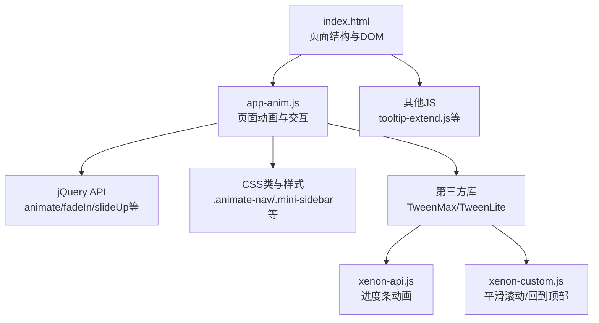
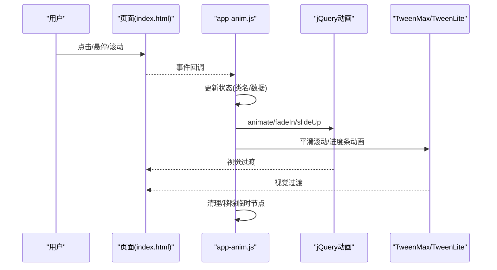
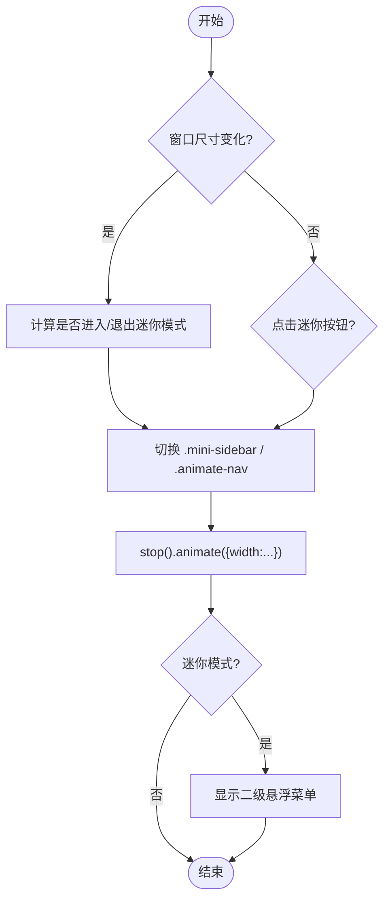
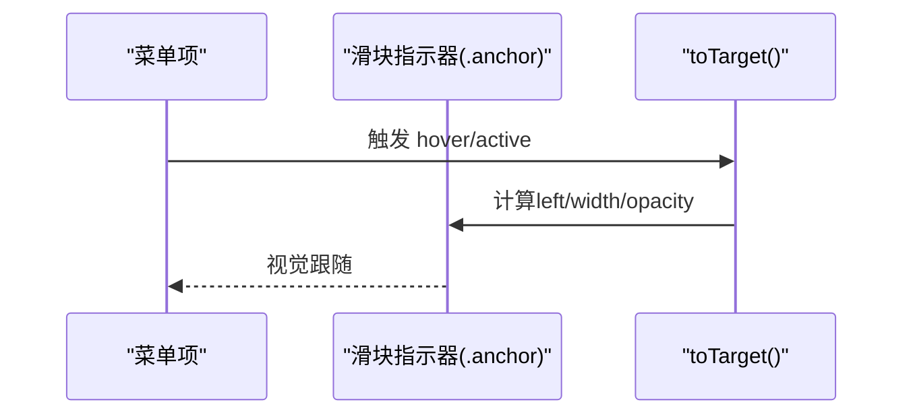
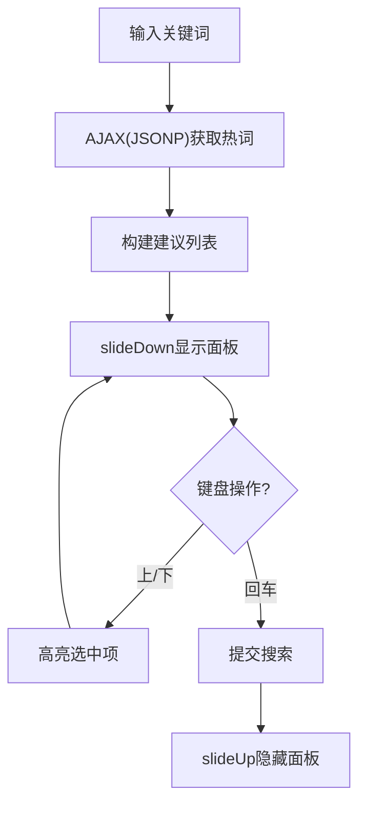
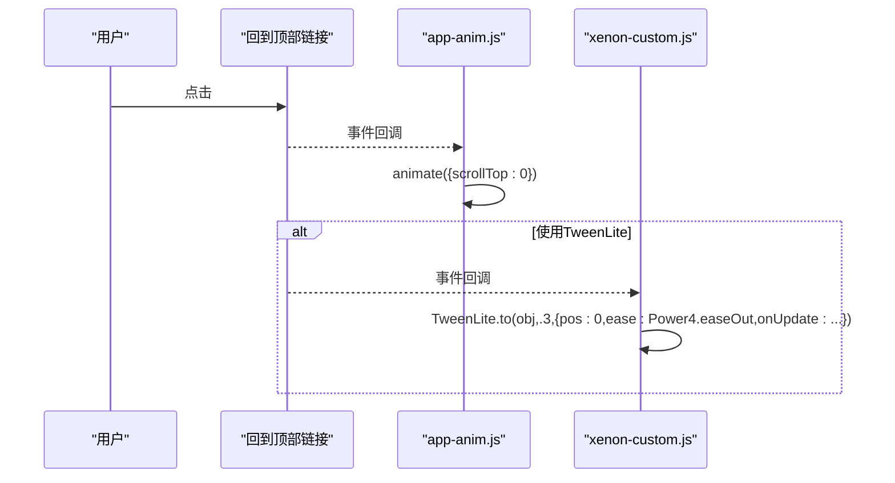
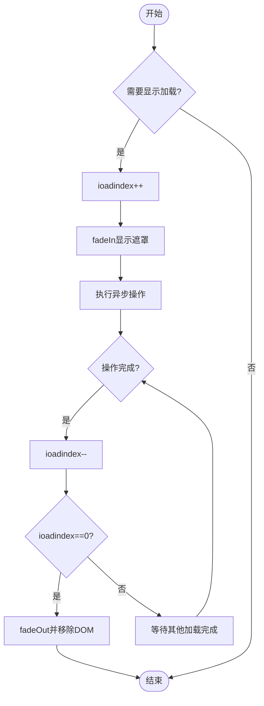
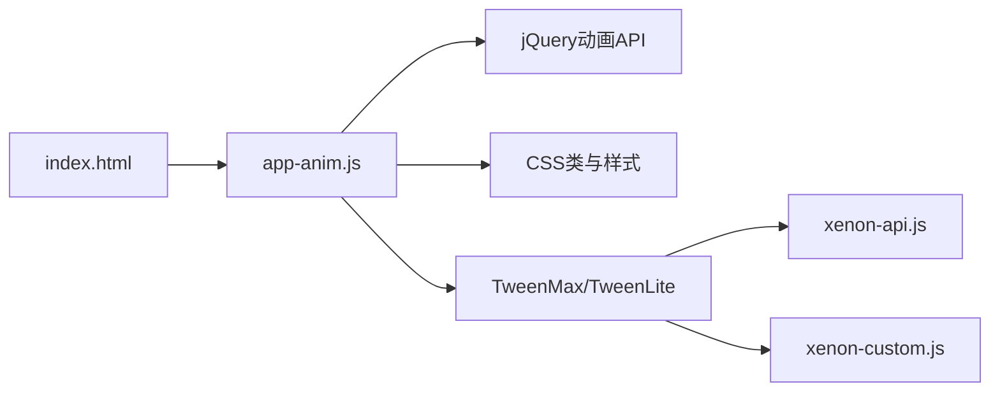

# 动画效果系统

<cite>
**本文引用的文件**
- [assets/js/app-anim.js](file://assets/js/app-anim.js)
- [assets/js/TweenMax.min.js](file://assets/js/TweenMax.min.js)
- [assets/js/xenon-api.js](file://assets/js/xenon-api.js)
- [assets/js/tooltip-extend.js](file://assets/js/tooltip-extend.js)
- [assets/js/xenon-custom.js](file://assets/js/xenon-custom.js)
- [index.html](file://index.html)
</cite>

## 目录
1. [简介](#简介)
2. [项目结构](#项目结构)
3. [核心组件](#核心组件)
4. [架构总览](#架构总览)
5. [详细组件分析](#详细组件分析)
6. [依赖关系分析](#依赖关系分析)
7. [性能考量](#性能考量)
8. [故障排查指南](#故障排查指南)
9. [结论](#结论)
10. [附录：配置与自定义开发指南](#附录：配置与自定义开发指南)

## 简介
本文件围绕页面动画与过渡效果，系统性梳理并文档化 assets/js/app-anim.js 的实现机制。内容涵盖：
- 页面过渡效果的实现原理（淡入淡出、滑动切换、缩放等）
- TweenMax 库的集成使用（动画序列控制、缓动函数应用、性能优化技巧）
- 响应式动画适配（不同屏幕尺寸下的动画调整、移动端性能考虑、触摸交互支持）
- 动画生命周期管理（动画队列控制、内存释放、错误恢复机制）
- 动画配置选项与自定义动画开发指南

目标是帮助开发者理解现有动画体系，并在不破坏既有行为的前提下扩展或替换为更高级的动画方案。

## 项目结构
- 入口与布局：index.html 定义了侧边栏、主内容区、搜索模块、导航等结构，并为动画提供 DOM 节点与类名约定（如 .sidebar-nav、.slider_menu、.s-type-list.big 等）。
- 动画主逻辑：assets/js/app-anim.js 集中处理页面交互与动画，包括侧边栏展开/收起、滑块菜单指示器移动、搜索建议面板的滑入滑出、返回顶部滚动、加载提示等。
- 第三方动画库：assets/js/TweenMax.min.js 提供高性能动画能力；assets/js/xenon-api.js 和 assets/js/xenon-custom.js 中部分功能（如进度条、回到顶部）使用了 TweenLite/TweenMax 进行平滑滚动与进度条动画。
- 辅助脚本：assets/js/tooltip-extend.js 等对 Tooltip、滚动等行为做了增强。

图表来源
- [index.html:42-216](file://index.html#L42-L216)
- [assets/js/app-anim.js:1-120](file://assets/js/app-anim.js#L1-L120)
- [assets/js/xenon-api.js:20-91](file://assets/js/xenon-api.js#L20-L91)
- [assets/js/xenon-custom.js:170-181](file://assets/js/xenon-custom.js#L170-L181)

章节来源
- [index.html:42-216](file://index.html#L42-L216)
- [assets/js/app-anim.js:1-120](file://assets/js/app-anim.js#L1-L120)

## 核心组件
- 侧边栏动画与状态切换
  - 通过监听窗口 resize 与按钮点击，动态切换 .mini-sidebar 与宽度，配合 CSS 过渡类 .animate-nav 实现平滑收缩/展开。
  - 二级悬浮菜单在迷你模式下以绝对定位弹出，并使用 stop().animate() 控制 top 位置。
- 滑块菜单指示器（锚点）
  - 通过 toTarget 计算 active/hover 目标的位置与宽度，驱动 .anchor 元素移动，形成“滑动切换”的视觉效果。
- 搜索建议面板
  - 基于 AJAX 获取热词，使用 slideDown/slideUp 控制面板的显示与隐藏，结合键盘上下键高亮选择。
- 返回顶部与滚动
  - 使用 jQuery animate 或 TweenLite 实现平滑滚动到顶部。
- 加载与提示
  - 统一的 loadingShow/loadingHid 与 ioPopupTips/ioPopup/ioConfirm 提供加载遮罩与弹窗提示，内部使用 fadeIn/fadeOut 与 setTimeout 控制生命周期。

章节来源
- [assets/js/app-anim.js:318-426](file://assets/js/app-anim.js#L318-L426)
- [assets/js/app-anim.js:256-292](file://assets/js/app-anim.js#L256-L292)
- [assets/js/app-anim.js:814-996](file://assets/js/app-anim.js#L814-L996)
- [assets/js/app-anim.js:238-253](file://assets/js/app-anim.js#L238-L253)
- [assets/js/app-anim.js:1155-1294](file://assets/js/app-anim.js#L1155-L1294)

## 架构总览
整体动画架构由“事件触发 -> 状态更新 -> 动画执行 -> 生命周期管理”构成：
- 事件层：用户交互（点击、悬停、键盘）与系统事件（resize、scroll）。
- 状态层：通过类名切换（如 .mini-sidebar）、数据缓存（localStorage）维护 UI 状态。
- 动画层：jQuery animate/fade/slide 与 TweenMax/TweenLite 组合，负责视觉过渡。
- 生命周期层：loading 计数、定时器清理、DOM 节点移除，避免内存泄漏。

图表来源
- [assets/js/app-anim.js:318-426](file://assets/js/app-anim.js#L318-L426)
- [assets/js/xenon-api.js:20-91](file://assets/js/xenon-api.js#L20-L91)
- [assets/js/xenon-custom.js:170-181](file://assets/js/xenon-custom.js#L170-L181)

## 详细组件分析

### 侧边栏动画与迷你模式
- 触发条件：窗口尺寸变化、按钮点击、移动端最小化状态。
- 实现要点：
  - trigger_resizable 根据屏幕宽度与 theme.minNav 配置决定进入/退出迷你模式。
  - trigger_lsm_mini 控制 .sidebar-nav 的宽度与 .animate-nav 类，使用 stop().animate({width:...}) 实现平滑过渡。
  - 二级菜单在迷你模式下以 .sidebar-popup.second 形式弹出，并通过 stop().animate({"top":top}, 50) 控制位置。
- 性能考虑：
  - 使用 stop() 中断前一次动画，避免队列堆积。
  - 在迷你模式下禁用 tooltip 以减少重排重绘。

图表来源
- [assets/js/app-anim.js:318-426](file://assets/js/app-anim.js#L318-L426)

章节来源
- [assets/js/app-anim.js:318-426](file://assets/js/app-anim.js#L318-L426)

### 滑块菜单指示器（滑动切换）
- 功能：当鼠标悬停或激活某个 tab 时，指示器 .anchor 移动到对应项，形成“滑动切换”的视觉效果。
- 实现要点：
  - intoSlider 初始化时插入 .anchor 并设置初始位置。
  - toTarget 根据 hover/active 目标计算 left、width、opacity，驱动指示器移动。
  - 使用 jQuery 直接操作 CSS 属性，保证轻量与兼容。
- 性能考虑：
  - 仅在必要时更新 .anchor 样式，避免频繁重排。
  - 可考虑将 transform: translateX 替代 left 以提升合成性能（当前实现未使用）。

图表来源
- [assets/js/app-anim.js:256-292](file://assets/js/app-anim.js#L256-L292)
- [assets/js/app-anim.js:1124-1154](file://assets/js/app-anim.js#L1124-L1154)

章节来源
- [assets/js/app-anim.js:256-292](file://assets/js/app-anim.js#L256-L292)
- [assets/js/app-anim.js:1124-1154](file://assets/js/app-anim.js#L1124-L1154)

### 搜索建议面板（淡入淡出与滑动）
- 功能：输入关键词时，从百度/Google 获取热词建议，下拉展示；支持键盘上下选择与回车提交。
- 实现要点：
  - getSmartTipsBaidu/getSmartTipsGoogle 发起 JSONP 请求，构建列表项。
  - 使用 slideDown/slideUp 控制面板显隐，配合 delay 与 hide 完成生命周期。
  - 键盘事件处理上下键高亮与值回填。
- 性能考虑：
  - 防抖/节流未在代码中体现，建议在高频输入场景加入节流以降低请求频率。
  - 列表渲染后及时绑定事件，避免重复绑定。

图表来源
- [assets/js/app-anim.js:868-996](file://assets/js/app-anim.js#L868-L996)

章节来源
- [assets/js/app-anim.js:868-996](file://assets/js/app-anim.js#L868-L996)

### 返回顶部与平滑滚动
- 功能：点击“回到顶部”链接或使用快捷键时，平滑滚动至页面顶部。
- 实现要点：
  - app-anim.js 使用 $('body,html').animate({scrollTop:0}, 500) 实现基础滚动。
  - xenon-custom.js 与 tooltip-extend.js 使用 TweenLite.to 与 Power4.easeOut 实现更自然的缓动曲线。
- 性能考虑：
  - 使用 requestAnimationFrame 或 TweenMax 的 onUpdate 减少布局抖动。
  - 避免在滚动过程中触发大量重排。

图表来源
- [assets/js/app-anim.js:238-253](file://assets/js/app-anim.js#L238-L253)
- [assets/js/xenon-custom.js:170-181](file://assets/js/xenon-custom.js#L170-L181)
- [assets/js/tooltip-extend.js:406-415](file://assets/js/tooltip-extend.js#L406-L415)

章节来源
- [assets/js/app-anim.js:238-253](file://assets/js/app-anim.js#L238-L253)
- [assets/js/xenon-custom.js:170-181](file://assets/js/xenon-custom.js#L170-L181)
- [assets/js/tooltip-extend.js:406-415](file://assets/js/tooltip-extend.js#L406-L415)

### 加载与提示（淡入淡出与遮罩）
- 功能：统一加载遮罩与弹窗提示，提升用户体验与反馈。
- 实现要点：
  - loadingShow/loadingHid 使用计数器 ioadindex 管理多个并发加载，fadeIn/fadeOut 控制显隐。
  - ioPopupTips/ioPopup/ioConfirm 生成模态框 HTML，使用 setTimeout 控制生命周期，并在完成后移除 DOM。
- 性能考虑：
  - 确保所有异步回调中正确调用 loadingHid，避免遮罩残留。
  - 弹窗关闭后及时移除 DOM，防止内存泄漏。

图表来源
- [assets/js/app-anim.js:1155-1173](file://assets/js/app-anim.js#L1155-L1173)
- [assets/js/app-anim.js:1174-1294](file://assets/js/app-anim.js#L1174-L1294)

章节来源
- [assets/js/app-anim.js:1155-1173](file://assets/js/app-anim.js#L1155-L1173)
- [assets/js/app-anim.js:1174-1294](file://assets/js/app-anim.js#L1174-L1294)

### TweenMax 集成与使用
- 进度条动画：xenon-api.js 中的 show_loading_bar 使用 TweenMax.to 控制进度条宽度，配合 Expo.easeIn/easeOut 实现加速/减速效果。
- 平滑滚动：xenon-custom.js 与 tooltip-extend.js 使用 TweenLite.to 与 Power4.easeOut 实现自然滚动曲线。
- 优势：
  - 高性能：基于 GPU 加速的属性动画。
  - 灵活：支持时间轴、缓动函数、回调钩子。
- 注意事项：
  - 避免在同一元素上同时运行多个冲突动画。
  - 合理使用 onComplete/onUpdate 清理资源。

章节来源
- [assets/js/xenon-api.js:20-91](file://assets/js/xenon-api.js#L20-L91)
- [assets/js/xenon-custom.js:170-181](file://assets/js/xenon-custom.js#L170-L181)
- [assets/js/tooltip-extend.js:406-415](file://assets/js/tooltip-extend.js#L406-L415)

## 依赖关系分析
- app-anim.js 依赖 jQuery 提供的 animate/fade/slide 等方法，以及 CSS 类名约定（如 .animate-nav、.mini-sidebar）。
- 部分功能（进度条、平滑滚动）依赖 TweenMax/TweenLite，需确保在页面中引入 assets/js/TweenMax.min.js。
- index.html 作为入口，组织各脚本加载顺序与 DOM 结构，影响动画行为的生效范围。

图表来源
- [index.html:30-35](file://index.html#L30-L35)
- [assets/js/app-anim.js:1-120](file://assets/js/app-anim.js#L1-L120)
- [assets/js/xenon-api.js:20-91](file://assets/js/xenon-api.js#L20-L91)
- [assets/js/xenon-custom.js:170-181](file://assets/js/xenon-custom.js#L170-L181)

章节来源
- [index.html:30-35](file://index.html#L30-L35)
- [assets/js/app-anim.js:1-120](file://assets/js/app-anim.js#L1-L120)

## 性能考量
- 动画队列管理
  - 使用 stop() 中断前一次动画，避免队列堆积（如侧边栏宽度动画）。
  - 合理拆分动画，避免在同一帧内执行过多重排重绘。
- 缓动函数选择
  - 使用 Power4.easeOut、Expo.easeIn/easeOut 等缓动函数提升观感。
  - 避免过长的持续时间导致用户感知延迟。
- 响应式适配
  - 根据窗口尺寸切换动画策略（如迷你模式），减少不必要的动画开销。
  - 在移动端禁用复杂动画或降低帧率，优先保证流畅性。
- 内存释放
  - 弹窗与加载遮罩在完成后及时移除 DOM，避免内存泄漏。
  - 事件解绑与定时器清理，确保无残留引用。

[本节为通用性能指导，无需特定文件来源]

## 故障排查指南
- 常见问题
  - 侧边栏无法收缩：检查 .animate-nav 类是否正确添加，确认 CSS 过渡是否生效。
  - 滑块指示器错位：确认 toTarget 计算的 left/width 是否与容器滚动相关。
  - 搜索建议不显示：检查 JSONP 请求是否成功，列表构建与 slideDown 是否执行。
  - 加载遮罩不消失：确认 loadingHid 在所有异步回调中被调用，且 ioadindex 计数正确。
- 调试建议
  - 使用浏览器控制台查看网络请求与 DOM 变更。
  - 逐步注释相关动画代码，定位问题所在。
  - 检查是否有 JavaScript 错误阻止后续脚本执行。

章节来源
- [assets/js/app-anim.js:318-426](file://assets/js/app-anim.js#L318-L426)
- [assets/js/app-anim.js:868-996](file://assets/js/app-anim.js#L868-L996)
- [assets/js/app-anim.js:1155-1173](file://assets/js/app-anim.js#L1155-L1173)

## 结论
该动画系统以 jQuery 动画为基础，辅以 TweenMax/TweenLite 提供更丰富的缓动与时间轴控制。通过合理的状态管理与生命周期控制，实现了侧边栏、滑块菜单、搜索建议、返回顶部等常见交互的流畅体验。未来可在以下方面进一步优化：
- 将更多动画迁移至 CSS transform 与 will-change，提升合成性能。
- 引入节流/防抖机制，减少高频事件触发的动画与请求。
- 统一动画配置中心，便于全局调整持续时间与缓动函数。

[本节为总结性内容，无需特定文件来源]

## 附录：配置与自定义开发指南
- 配置项
  - theme.minNav：控制默认是否启用迷你模式。
  - theme.loading：控制页面加载时的加载提示。
  - theme.ajaxurl：后端接口地址，用于点赞、收藏、搜索建议等异步操作。
- 自定义动画
  - 新增页面过渡：可在路由切换前后插入 fade/slide 动画，结合 TweenMax timeline 编排多段动画。
  - 扩展滑块菜单：在 toTarget 中增加 transform: translateX 替代 left，提升性能。
  - 优化搜索建议：加入节流与缓存，减少重复请求。
- 最佳实践
  - 保持动画时长在 200-500ms 之间，避免过长影响交互。
  - 使用 GPU 加速属性（transform、opacity）而非 layout 属性（width、height）。
  - 在移动端检测并降级复杂动画，确保基本可用性。

章节来源
- [assets/js/app-anim.js:1-120](file://assets/js/app-anim.js#L1-L120)
- [assets/js/app-anim.js:256-292](file://assets/js/app-anim.js#L256-L292)
- [assets/js/app-anim.js:868-996](file://assets/js/app-anim.js#L868-L996)