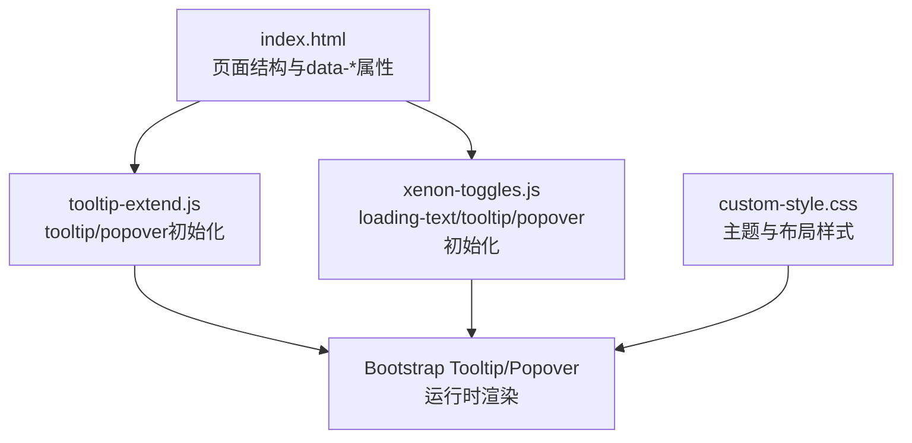
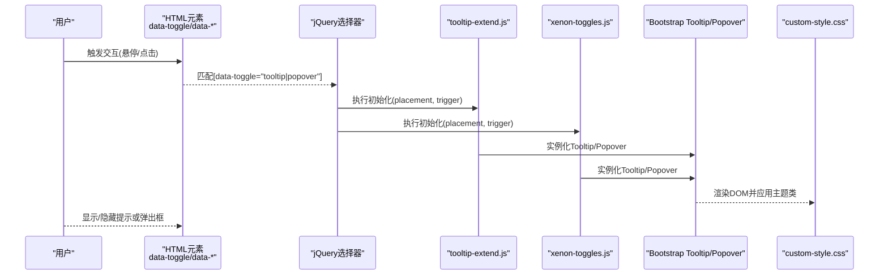
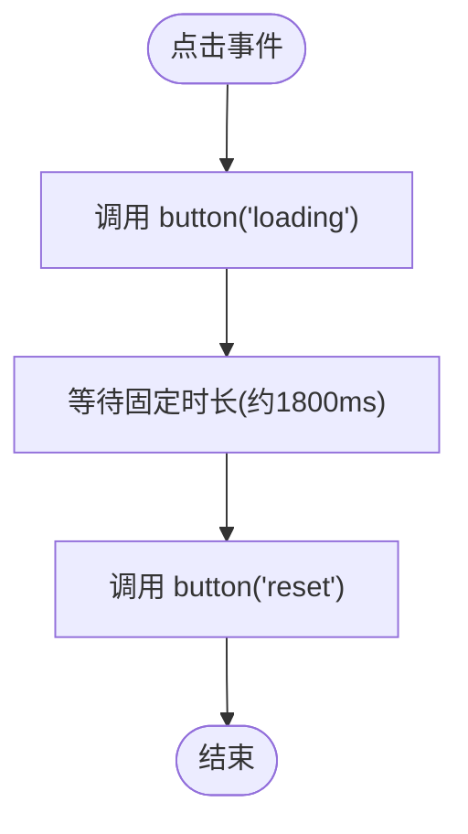
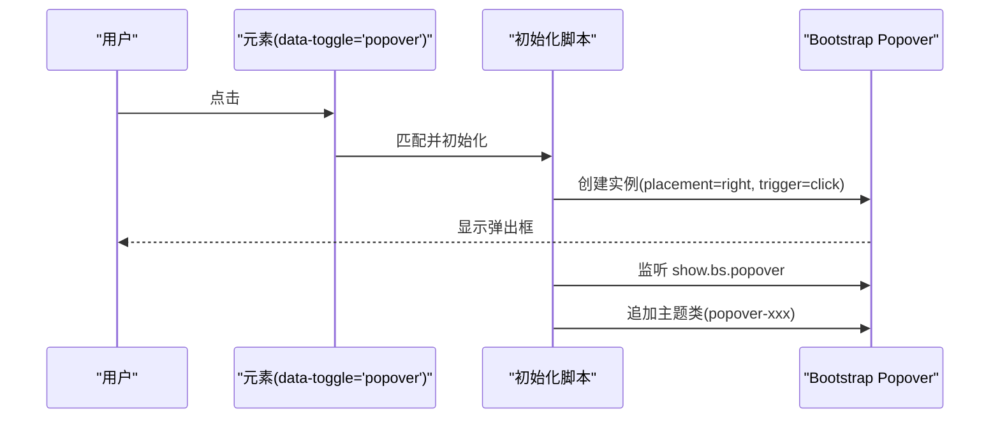
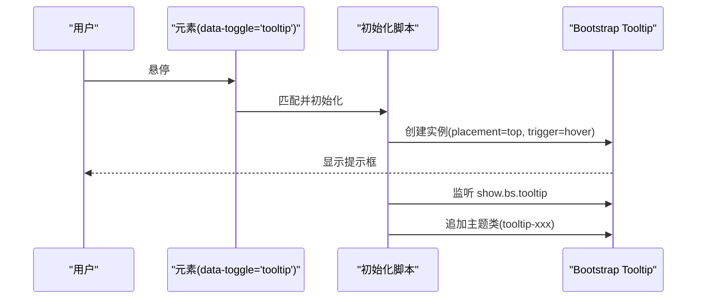
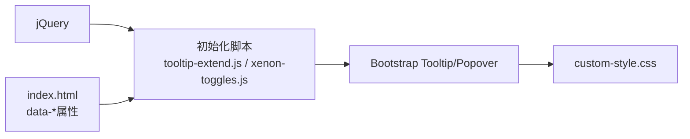

# UI组件切换

<cite>
**本文引用的文件**
- [index.html](file://index.html)
- [tooltip-extend.js](file://assets/js/tooltip-extend.js)
- [xenon-toggles.js](file://assets/js/xenon-toggles.js)
- [custom-style.css](file://assets/css/custom-style.css)
</cite>

## 目录
1. [简介](#简介)
2. [项目结构](#项目结构)
3. [核心组件](#核心组件)
4. [架构总览](#架构总览)
5. [详细组件分析](#详细组件分析)
6. [依赖关系分析](#依赖关系分析)
7. [性能考量](#性能考量)
8. [故障排查指南](#故障排查指南)
9. [结论](#结论)
10. [附录：集成示例与最佳实践](#附录：集成示例与最佳实践)

## 简介
本文件聚焦于本项目中UI组件的“切换”能力，覆盖以下要点：
- 按钮加载状态切换（loading-text）
- 弹出框（popover）初始化与配置
- 提示框（tooltip）初始化与配置
- Bootstrap 组件扩展方式：自定义样式类、事件处理、配置选项
- data-* 数据属性的使用规范与最佳实践
- 完整组件集成示例与常见问题解决方案

## 项目结构
与UI组件切换直接相关的资源分布如下：
- HTML入口：index.html 中大量使用了 data-toggle="tooltip" 等属性来启用提示功能
- JS逻辑：
  - assets/js/tooltip-extend.js：对 tooltip/popover 进行统一初始化，并支持通过 className 注入主题类
  - assets/js/xenon-toggles.js：提供 loading-text 按钮切换、以及 popover/tooltip 的初始化逻辑（与 tooltip-extend.js 重复实现）
- CSS样式：
  - assets/css/custom-style.css：全局样式与局部定制（如侧边栏宽度、搜索热词样式等）

图表来源
- [index.html:590-820](file://index.html#L590-L820)
- [tooltip-extend.js:275-321](file://assets/js/tooltip-extend.js#L275-L321)
- [xenon-toggles.js:246-317](file://assets/js/xenon-toggles.js#L246-L317)
- [custom-style.css:1-126](file://assets/css/custom-style.css#L1-L126)

章节来源
- [index.html:590-820](file://index.html#L590-L820)
- [tooltip-extend.js:275-321](file://assets/js/tooltip-extend.js#L275-L321)
- [xenon-toggles.js:246-317](file://assets/js/xenon-toggles.js#L246-L317)
- [custom-style.css:1-126](file://assets/css/custom-style.css#L1-L126)

## 核心组件
- 按钮加载状态切换（loading-text）
  - 通过 data-loading-text 标记的元素在点击时进入“加载中”状态，并在固定时长后自动恢复
  - 由 xenon-toggles.js 与 tooltip-extend.js 共同实现，均调用 Bootstrap Button 插件的 loading/reset 方法
- 弹出框（popover）
  - 通过 data-toggle="popover" 启用，placement 默认 right，trigger 默认 click
  - 支持通过 className 中的 popover-xxx 动态为弹出层追加主题类
- 提示框（tooltip）
  - 通过 data-toggle="tooltip" 启用，placement 默认 top，trigger 默认 hover
  - 支持通过 className 中的 tooltip-xxx 动态为提示层追加主题类

章节来源
- [xenon-toggles.js:246-317](file://assets/js/xenon-toggles.js#L246-L317)
- [tooltip-extend.js:265-321](file://assets/js/tooltip-extend.js#L265-L321)

## 架构总览
下图展示了从页面元素到组件初始化的整体流程：

图表来源
- [tooltip-extend.js:275-321](file://assets/js/tooltip-extend.js#L275-L321)
- [xenon-toggles.js:262-317](file://assets/js/xenon-toggles.js#L262-L317)
- [custom-style.css:1-126](file://assets/css/custom-style.css#L1-L126)

## 详细组件分析

### 按钮加载状态切换（loading-text）
- 行为说明
  - 当元素包含 data-loading-text 时，点击会切换到“加载中”状态，并在固定延时后自动恢复
  - 该逻辑在 xenon-toggles.js 与 tooltip-extend.js 中均有实现，二者行为一致
- 关键流程
  - 绑定点击事件
  - 调用 Bootstrap Button 的 loading 方法
  - 使用 setTimeout 在固定时间后调用 reset 方法恢复文本

图表来源
- [xenon-toggles.js:246-257](file://assets/js/xenon-toggles.js#L246-L257)
- [tooltip-extend.js:265-274](file://assets/js/tooltip-extend.js#L265-L274)

章节来源
- [xenon-toggles.js:246-257](file://assets/js/xenon-toggles.js#L246-L257)
- [tooltip-extend.js:265-274](file://assets/js/tooltip-extend.js#L265-L274)

### 弹出框（popover）初始化与配置
- 启用方式
  - 在元素上添加 data-toggle="popover"
  - placement 默认 right；trigger 默认 click
- 自定义样式类
  - 若元素 class 中包含 popover-xxx，则会在 show.bs.popover 事件中将该类名添加到实际弹出的 DOM 节点上，从而实现主题化
- 事件钩子
  - 监听 show.bs.popover，用于延迟追加主题类

图表来源
- [xenon-toggles.js:262-289](file://assets/js/xenon-toggles.js#L262-L289)
- [tooltip-extend.js:275-298](file://assets/js/tooltip-extend.js#L275-L298)

章节来源
- [xenon-toggles.js:262-289](file://assets/js/xenon-toggles.js#L262-L289)
- [tooltip-extend.js:275-298](file://assets/js/tooltip-extend.js#L275-L298)

### 提示框（tooltip）初始化与配置
- 启用方式
  - 在元素上添加 data-toggle="tooltip"
  - placement 默认 top；trigger 默认 hover
- 自定义样式类
  - 若元素 class 中包含 tooltip-xxx，则会在 show.bs.tooltip 事件中将该类名添加到实际提示的 DOM 节点上
- 事件钩子
  - 监听 show.bs.tooltip，用于延迟追加主题类

图表来源
- [xenon-toggles.js:291-317](file://assets/js/xenon-toggles.js#L291-L317)
- [tooltip-extend.js:299-321](file://assets/js/tooltip-extend.js#L299-L321)

章节来源
- [xenon-toggles.js:291-317](file://assets/js/xenon-toggles.js#L291-L317)
- [tooltip-extend.js:299-321](file://assets/js/tooltip-extend.js#L299-L321)

### Bootstrap 组件扩展使用方法
- 自定义样式类
  - 通过 className 中的 tooltip-xxx / popover-xxx 模式，在 show 事件中动态将类名附加到生成的提示/弹出层 DOM 上，实现主题化
- 事件处理
  - 使用 show.bs.tooltip / show.bs.popover 事件钩子，在显示后追加样式类
- 配置选项
  - placement：控制位置（top/right/bottom/left），默认值分别由 tooltip-extend.js 和 xenon-toggles.js 指定
  - trigger：控制触发方式（hover/click），默认值分别由两个脚本指定

章节来源
- [tooltip-extend.js:275-321](file://assets/js/tooltip-extend.js#L275-L321)
- [xenon-toggles.js:262-317](file://assets/js/xenon-toggles.js#L262-L317)

### data-* 使用规范与最佳实践
- 常用属性
  - data-toggle：声明要启用的组件类型（tooltip/popover）
  - data-placement：控制显示位置
  - data-trigger：控制触发方式
  - data-original-title / title：提示内容
  - data-loading-text：按钮加载状态切换
- 最佳实践
  - 保持语义清晰：仅使用必要的 data-* 属性，避免冗余
  - 统一默认值：通过初始化脚本集中管理默认 placement/trigger，减少重复配置
  - 主题化：通过 className 约定（tooltip-xxx/popover-xxx）集中管理样式，避免内联样式
  - 可访问性：确保 title/original-title 提供有意义的描述信息

章节来源
- [index.html:590-820](file://index.html#L590-L820)
- [xenon-toggles.js:262-317](file://assets/js/xenon-toggles.js#L262-L317)
- [tooltip-extend.js:275-321](file://assets/js/tooltip-extend.js#L275-L321)

## 依赖关系分析
- 组件初始化依赖
  - jQuery：用于选择器和事件绑定
  - Bootstrap Tooltip/Popover：提供基础组件能力
  - 自定义脚本：tooltip-extend.js 与 xenon-toggles.js 负责统一初始化与主题类注入
- 样式依赖
  - custom-style.css：提供全局与局部样式，影响组件外观与布局

图表来源
- [tooltip-extend.js:275-321](file://assets/js/tooltip-extend.js#L275-L321)
- [xenon-toggles.js:262-317](file://assets/js/xenon-toggles.js#L262-L317)
- [custom-style.css:1-126](file://assets/css/custom-style.css#L1-L126)
- [index.html:590-820](file://index.html#L590-L820)

章节来源
- [tooltip-extend.js:275-321](file://assets/js/tooltip-extend.js#L275-L321)
- [xenon-toggles.js:262-317](file://assets/js/xenon-toggles.js#L262-L317)
- [custom-style.css:1-126](file://assets/css/custom-style.css#L1-L126)
- [index.html:590-820](file://index.html#L590-L820)

## 性能考量
- 避免重复初始化
  - tooltip-extend.js 与 xenon-toggles.js 同时实现了 tooltip/popover 的初始化，可能导致重复绑定。建议保留单一初始化入口，或在其中一个文件中移除重复逻辑
- 事件委托与批量处理
  - 当前使用遍历每个匹配元素进行初始化，建议在大规模场景下考虑事件委托以减少开销
- 样式类注入时机
  - 在 show 事件中追加主题类是合理的，但应避免频繁操作DOM；必要时可缓存目标节点引用

[本节为通用性能建议，不直接分析具体文件]

## 故障排查指南
- 提示/弹出框不显示
  - 检查是否已引入 Bootstrap Tooltip/Popover 相关脚本与样式
  - 确认元素上是否正确设置 data-toggle 及必要属性（如 title/original-title）
  - 检查是否有其他脚本覆盖了初始化逻辑（tooltip-extend.js 与 xenon-toggles.js 重复实现）
- 主题类未生效
  - 确认 className 是否符合 tooltip-xxx / popover-xxx 约定
  - 检查 show.bs.tooltip / show.bs.popover 事件是否被正确触发
- 按钮加载状态异常
  - 确认元素包含 data-loading-text
  - 检查 Bootstrap Button 插件是否可用
  - 确认 setTimeout 回调未被其他逻辑中断

章节来源
- [xenon-toggles.js:246-317](file://assets/js/xenon-toggles.js#L246-L317)
- [tooltip-extend.js:265-321](file://assets/js/tooltip-extend.js#L265-L321)

## 结论
本项目通过 data-* 属性与自定义初始化脚本，实现了对 Bootstrap Tooltip/Popover 的统一管理与主题化扩展，并提供按钮加载状态切换能力。为确保稳定性与可维护性，建议：
- 统一初始化入口，消除重复实现
- 明确 data-* 使用规范，提升可读性与一致性
- 结合 custom-style.css 集中管理主题样式，便于后续扩展与维护

[本节为总结性内容，不直接分析具体文件]

## 附录：集成示例与最佳实践
- 按钮加载状态切换
  - 在按钮上添加 data-loading-text，点击后将自动进入加载状态并恢复
  - 参考路径：[xenon-toggles.js:246-257](file://assets/js/xenon-toggles.js#L246-L257)、[tooltip-extend.js:265-274](file://assets/js/tooltip-extend.js#L265-L274)
- 提示框（tooltip）
  - 在元素上添加 data-toggle="tooltip"，并通过 data-placement 与 data-trigger 控制行为
  - 如需主题化，可在元素 class 中添加 tooltip-xxx，脚本会自动在显示时追加该类到提示层
  - 参考路径：[index.html:590-820](file://index.html#L590-L820)、[xenon-toggles.js:291-317](file://assets/js/xenon-toggles.js#L291-L317)、[tooltip-extend.js:299-321](file://assets/js/tooltip-extend.js#L299-L321)
- 弹出框（popover）
  - 在元素上添加 data-toggle="popover"，并通过 data-placement 与 data-trigger 控制行为
  - 如需主题化，可在元素 class 中添加 popover-xxx，脚本会自动在显示时追加该类到弹出层
  - 参考路径：[xenon-toggles.js:262-289](file://assets/js/xenon-toggles.js#L262-L289)、[tooltip-extend.js:275-298](file://assets/js/tooltip-extend.js#L275-L298)
- 样式定制
  - 在 custom-style.css 中定义主题类，或通过现有类名调整布局与外观
  - 参考路径：[custom-style.css:1-126](file://assets/css/custom-style.css#L1-L126)

章节来源
- [xenon-toggles.js:246-317](file://assets/js/xenon-toggles.js#L246-L317)
- [tooltip-extend.js:265-321](file://assets/js/tooltip-extend.js#L265-L321)
- [index.html:590-820](file://index.html#L590-L820)
- [custom-style.css:1-126](file://assets/css/custom-style.css#L1-L126)