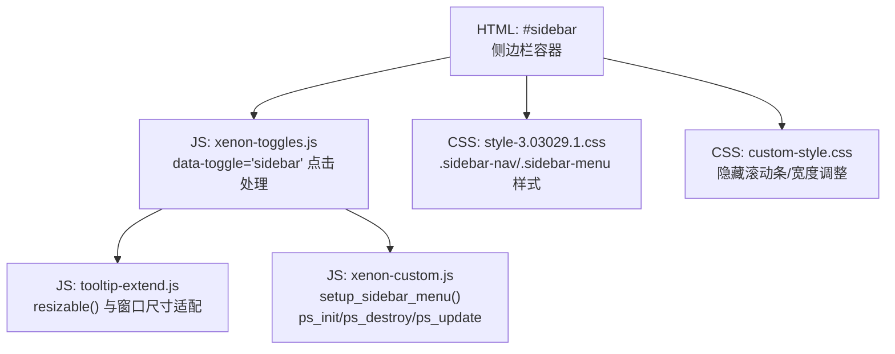
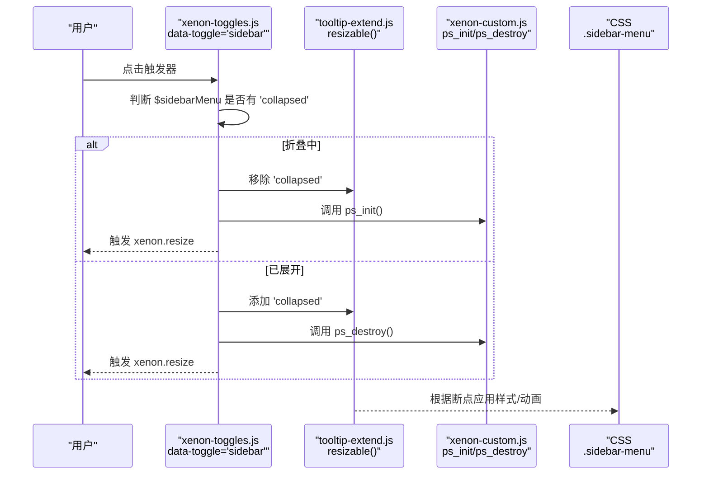
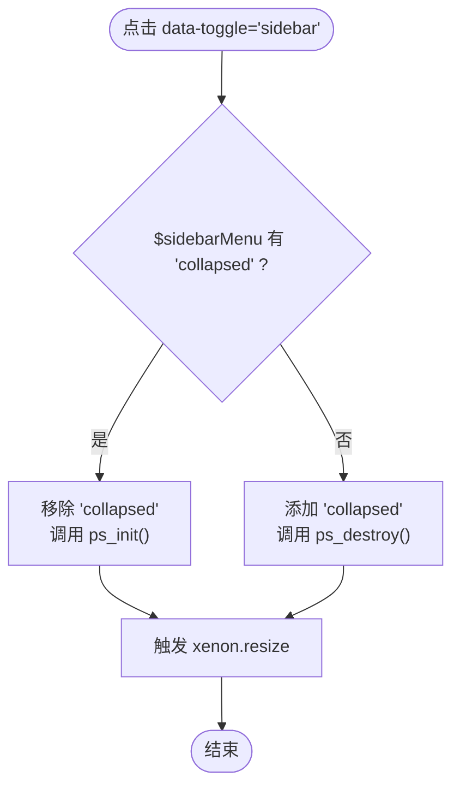
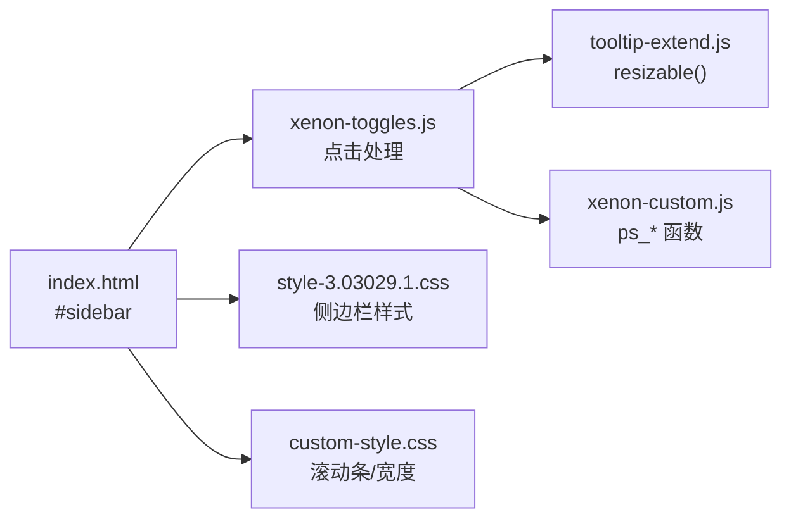

# 侧边栏切换

<cite>
**本文引用的文件**
- [index.html](file://index.html)
- [xenon-toggles.js](file://assets/js/xenon-toggles.js)
- [tooltip-extend.js](file://assets/js/tooltip-extend.js)
- [xenon-custom.js](file://assets/js/xenon-custom.js)
- [style-3.03029.1.css](file://assets/css/style-3.03029.1.css)
- [custom-style.css](file://assets/css/custom-style.css)
</cite>

## 目录
1. [简介](#简介)
2. [项目结构](#项目结构)
3. [核心组件](#核心组件)
4. [架构总览](#架构总览)
5. [详细组件分析](#详细组件分析)
6. [依赖关系分析](#依赖关系分析)
7. [性能考量](#性能考量)
8. [故障排查指南](#故障排查指南)
9. [结论](#结论)
10. [附录](#附录)

## 简介
本文件详细说明项目中“侧边栏切换”功能的实现机制，重点覆盖：
- data-toggle="sidebar" 属性的工作机制与事件绑定
- 侧边栏展开/折叠状态管理（collapsed 类名切换）
- 滚动条生命周期管理（ps_init / ps_destroy / ps_update）
- 与窗口 resize 事件的集成，确保布局正确响应
- 扩展能力：状态持久化、自定义动画效果等

## 项目结构
侧边栏切换功能由 HTML 结构与多段 JavaScript/CSS 协同完成：
- HTML 提供侧边栏容器与触发入口
- JS 负责监听点击、切换状态、维护滚动条、响应窗口尺寸变化
- CSS 控制侧边栏的显隐、过渡动画与样式

图表来源
- [index.html:42-216](file://index.html#L42-L216)
- [xenon-toggles.js:111-132](file://assets/js/xenon-toggles.js#L111-L132)
- [tooltip-extend.js:14-41](file://assets/js/tooltip-extend.js#L14-L41)
- [xenon-custom.js:1124-1150](file://assets/js/xenon-custom.js#L1124-L1150)
- [style-3.03029.1.css:56-74](file://assets/css/style-3.03029.1.css#L56-L74)
- [custom-style.css:4-10](file://assets/css/custom-style.css#L4-L10)

章节来源
- [index.html:42-216](file://index.html#L42-L216)
- [xenon-toggles.js:111-132](file://assets/js/xenon-toggles.js#L111-L132)
- [tooltip-extend.js:14-41](file://assets/js/tooltip-extend.js#L14-L41)
- [xenon-custom.js:1124-1150](file://assets/js/xenon-custom.js#L1124-L1150)
- [style-3.03029.1.css:56-74](file://assets/css/style-3.03029.1.css#L56-L74)
- [custom-style.css:4-10](file://assets/css/custom-style.css#L4-L10)

## 核心组件
- 触发器与事件绑定：通过 data-toggle="sidebar" 选择器为所有匹配元素绑定点击事件，阻止默认行为并执行切换逻辑。
- 状态管理：通过 public_vars.$sidebarMenu 的 collapsed 类名表示折叠状态；展开时移除该类，折叠时添加该类。
- 滚动条管理：使用 perfect-scrollbar 插件封装的 ps_init / ps_destroy / ps_update 函数，根据侧边栏可见性与固定定位决定是否初始化或销毁滚动条。
- 窗口适配：在窗口尺寸变化时，根据断点自动折叠/展开侧边栏，并同步滚动条状态。

章节来源
- [xenon-toggles.js:111-132](file://assets/js/xenon-toggles.js#L111-L132)
- [tooltip-extend.js:172-190](file://assets/js/tooltip-extend.js#L172-L190)
- [xenon-custom.js:1459-1507](file://assets/js/xenon-custom.js#L1459-L1507)
- [tooltip-extend.js:14-41](file://assets/js/tooltip-extend.js#L14-L41)

## 架构总览
数据流与控制流如下：
- 用户点击带有 data-toggle="sidebar" 的元素
- 事件处理器检查当前侧边栏是否处于折叠状态
- 若折叠则移除 collapsed 并初始化滚动条；若展开则添加 collapsed 并销毁滚动条
- 触发窗口 resize 事件以通知其他模块更新布局
- 窗口尺寸变化时，根据断点自动折叠/展开并同步滚动条

图表来源
- [xenon-toggles.js:111-132](file://assets/js/xenon-toggles.js#L111-L132)
- [tooltip-extend.js:172-190](file://assets/js/tooltip-extend.js#L172-L190)
- [xenon-custom.js:1459-1507](file://assets/js/xenon-custom.js#L1459-L1507)
- [style-3.03029.1.css:56-74](file://assets/css/style-3.03029.1.css#L56-L74)

## 详细组件分析

### data-toggle="sidebar" 的工作机制
- 选择器匹配所有带 data-toggle="sidebar" 的元素并绑定 click 事件
- 阻止默认跳转行为
- 读取 public_vars.$sidebarMenu 的 collapsed 类名决定分支逻辑
- 展开：移除 collapsed，调用 ps_init() 初始化滚动条
- 折叠：添加 collapsed，调用 ps_destroy() 销毁滚动条
- 最后触发 $(window).trigger('xenon.resize') 通知全局布局更新

图表来源
- [xenon-toggles.js:111-132](file://assets/js/xenon-toggles.js#L111-L132)
- [tooltip-extend.js:172-190](file://assets/js/tooltip-extend.js#L172-L190)

章节来源
- [xenon-toggles.js:111-132](file://assets/js/xenon-toggles.js#L111-L132)
- [tooltip-extend.js:172-190](file://assets/js/tooltip-extend.js#L172-L190)

### 侧边栏展开/折叠状态管理（collapsed）
- 状态标志：public_vars.$sidebarMenu 的 collapsed 类名
- 展开：removeClass('collapsed')
- 折叠：addClass('collapsed')
- 样式联动：CSS 中对 .sidebar-menu 及其子项定义 transition 与显示逻辑，配合 collapsed 类实现平滑过渡

章节来源
- [xenon-toggles.js:111-132](file://assets/js/xenon-toggles.js#L111-L132)
- [style-3.03029.1.css:56-74](file://assets/css/style-3.03029.1.css#L56-L74)

### 滚动条生命周期管理（ps_init / ps_destroy / ps_update）
- ps_init：当侧边栏未折叠且为 fixed 定位时，对 .sidebar-menu-inner 初始化 perfectScrollbar，配置 wheelSpeed 与 wheelPropagation
- ps_destroy：销毁 .sidebar-menu-inner 上的 perfectScrollbar 实例
- ps_update：在非 xs 设备且侧边栏未折叠时更新滚动条；必要时可先销毁再重建
- 注意：移动端（xs）会跳过滚动条初始化以避免冲突

章节来源
- [xenon-custom.js:1459-1507](file://assets/js/xenon-custom.js#L1459-L1507)
- [xenon-custom.js:1124-1150](file://assets/js/xenon-custom.js#L1124-L1150)

### 与窗口 resize 事件的集成
- 在 tooltip-extend.js 中注册 window.resize，延迟触发 trigger_resizable
- resizable 根据断点判断是否为 tabletscreen/largescreen，并在 tabletscreen 时自动折叠侧边栏并销毁滚动条
- 在 setup_sidebar_menu 中，针对大屏初始状态监听 resize，在 tabletscreen 时折叠并销毁滚动条，在大屏时展开并初始化滚动条
- 每次切换后统一触发 xenon.resize，保证其他模块（如 sticky footer、内容区域）重新计算布局

章节来源
- [tooltip-extend.js:14-41](file://assets/js/tooltip-extend.js#L14-L41)
- [tooltip-extend.js:447-473](file://assets/js/tooltip-extend.js#L447-L473)
- [xenon-custom.js:1124-1150](file://assets/js/xenon-custom.js#L1124-L1150)

### 扩展：侧边栏状态持久化
- 可在切换逻辑中添加本地存储读写，将 collapsed 状态保存到 localStorage
- 页面加载时读取该值并设置 initial collapsed 状态
- 示例思路（概念性说明）：
  - 在点击事件中保存状态：localStorage.setItem('sidebar_collapsed', collapsed)
  - 在文档就绪时读取并应用：if (localStorage.getItem('sidebar_collapsed') === 'true') addClass('collapsed');

[本节为概念性扩展说明，不直接引用具体代码]

### 扩展：自定义动画效果
- 当前切换主要依赖 CSS transition（.sidebar-menu 的 all .3s），以及菜单项展开/收起时的 TweenMax 动画
- 可通过修改 CSS transition-duration/easing 或使用更复杂的动画库来定制
- 如需在切换侧边栏整体时加入入场/出场动画，可在切换 collapsed 前后插入动画钩子（例如在 remove/add class 前后调用动画函数）

章节来源
- [style-3.03029.1.css:56-74](file://assets/css/style-3.03029.1.css#L56-L74)
- [xenon-custom.js:1206-1265](file://assets/js/xenon-custom.js#L1206-L1265)

## 依赖关系分析
- HTML 结构：#sidebar 作为侧边栏容器，包含 logo、菜单、底部操作区
- JS 依赖：
  - jQuery：事件绑定与 DOM 操作
  - perfect-scrollbar：滚动条插件（通过 ps_init/ps_destroy/ps_update 封装）
  - TweenMax/TweenLite：用于菜单项展开/收起动画
- CSS 依赖：
  - style-3.03029.1.css：定义侧边栏基础样式与过渡
  - custom-style.css：隐藏滚动条、调整宽度等

图表来源
- [index.html:42-216](file://index.html#L42-L216)
- [xenon-toggles.js:111-132](file://assets/js/xenon-toggles.js#L111-L132)
- [tooltip-extend.js:14-41](file://assets/js/tooltip-extend.js#L14-L41)
- [xenon-custom.js:1459-1507](file://assets/js/xenon-custom.js#L1459-L1507)
- [style-3.03029.1.css:56-74](file://assets/css/style-3.03029.1.css#L56-L74)
- [custom-style.css:4-10](file://assets/css/custom-style.css#L4-L10)

章节来源
- [index.html:42-216](file://index.html#L42-L216)
- [xenon-toggles.js:111-132](file://assets/js/xenon-toggles.js#L111-L132)
- [tooltip-extend.js:14-41](file://assets/js/tooltip-extend.js#L14-L41)
- [xenon-custom.js:1459-1507](file://assets/js/xenon-custom.js#L1459-L1507)
- [style-3.03029.1.css:56-74](file://assets/css/style-3.03029.1.css#L56-L74)
- [custom-style.css:4-10](file://assets/css/custom-style.css#L4-L10)

## 性能考量
- 滚动条初始化与销毁：避免在折叠状态下重复初始化，减少内存占用与重排
- 窗口 resize 防抖：使用 setTimeout 延迟触发，降低高频 resize 带来的性能开销
- 动画优化：菜单项展开/收起使用 TweenMax 控制高度与过渡，避免强制同步布局
- 移动端适配：在 xs 设备下跳过滚动条初始化，防止不必要的 DOM 操作

[本节提供通用指导，不直接分析具体文件]

## 故障排查指南
- 侧边栏无法折叠/展开
  - 检查是否存在多个 data-toggle="sidebar" 元素导致事件冲突
  - 确认 public_vars.$sidebarMenu 是否正确指向侧边栏容器
  - 查看控制台是否有 perfect-scrollbar 相关错误
- 滚动条异常
  - 确认 ps_init/ps_destroy 是否在正确的时机调用
  - 检查侧边栏是否具备 fixed 定位与可见性
  - 在 xs 设备上滚动条被禁用属预期行为
- 窗口尺寸变化后布局错乱
  - 确认 xenon.resize 事件是否被触发
  - 检查 setup_sidebar_menu 中的 resize 监听是否生效
  - 验证 CSS transition 与动画是否被中断

章节来源
- [xenon-toggles.js:111-132](file://assets/js/xenon-toggles.js#L111-L132)
- [xenon-custom.js:1459-1507](file://assets/js/xenon-custom.js#L1459-L1507)
- [tooltip-extend.js:14-41](file://assets/js/tooltip-extend.js#L14-L41)

## 结论
本项目通过简洁的事件绑定与类名切换实现了侧边栏的展开/折叠，结合 perfect-scrollbar 的生命周期管理与窗口 resize 适配，保证了在不同屏幕尺寸下的稳定表现。通过扩展本地存储与动画钩子，可进一步增强用户体验与可定制性。

[本节总结性内容，不直接分析具体文件]

## 附录
- 关键路径参考
  - 触发器与事件：[xenon-toggles.js:111-132](file://assets/js/xenon-toggles.js#L111-L132)、[tooltip-extend.js:172-190](file://assets/js/tooltip-extend.js#L172-L190)
  - 滚动条管理：[xenon-custom.js:1459-1507](file://assets/js/xenon-custom.js#L1459-L1507)
  - 窗口适配：[tooltip-extend.js:14-41](file://assets/js/tooltip-extend.js#L14-L41)、[xenon-custom.js:1124-1150](file://assets/js/xenon-custom.js#L1124-L1150)
  - 样式与动画：[style-3.03029.1.css:56-74](file://assets/css/style-3.03029.1.css#L56-L74)、[custom-style.css:4-10](file://assets/css/custom-style.css#L4-L10)

[本节为索引性质，不直接分析具体文件]