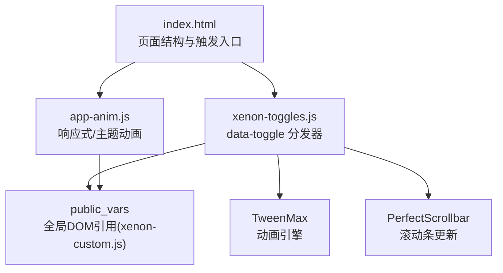
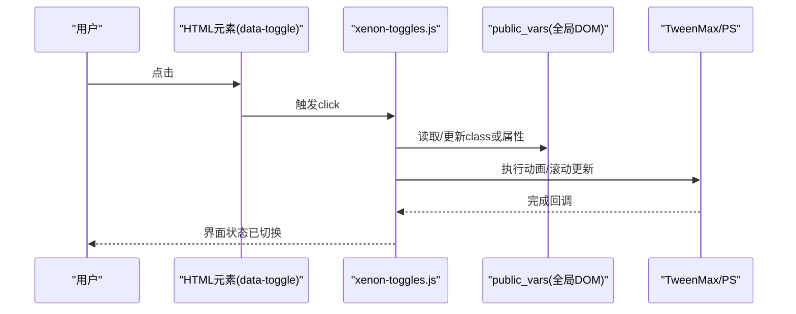
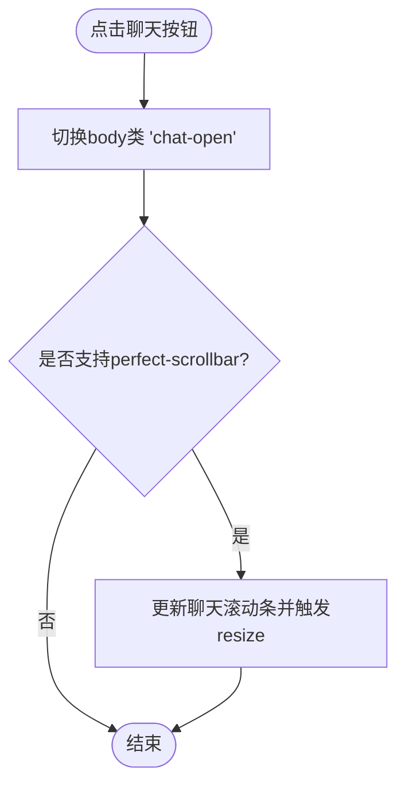
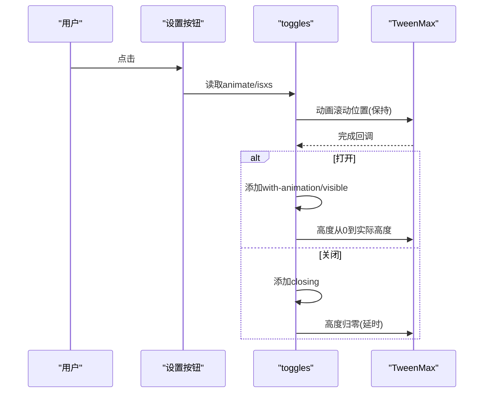
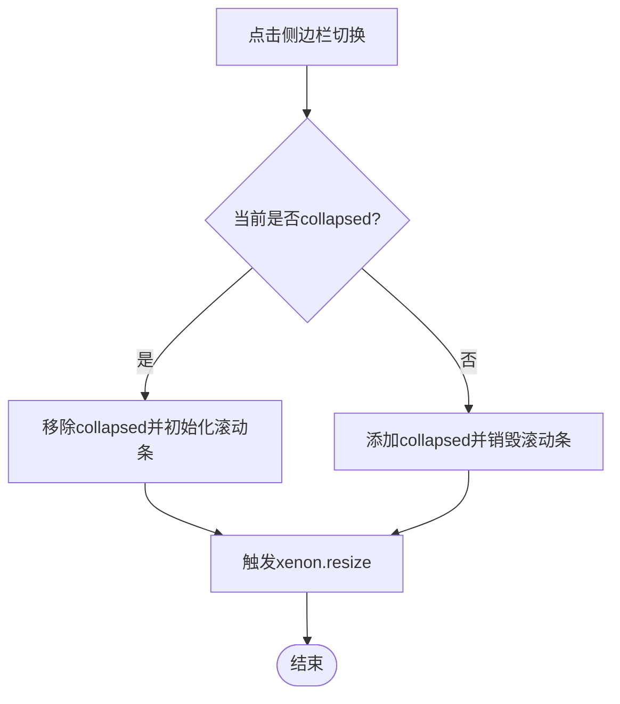
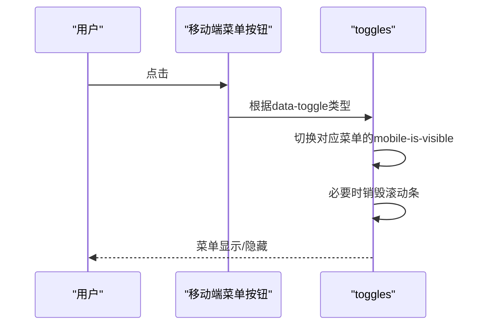
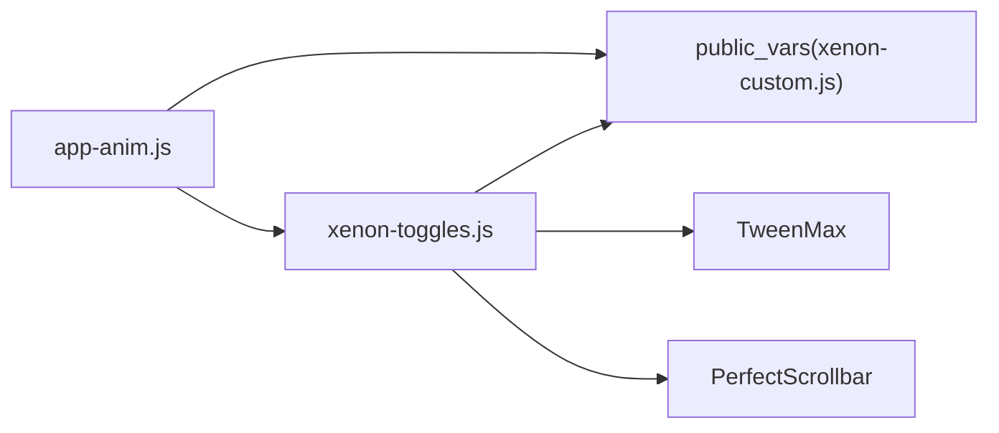

# 切换功能模块

<cite>
**本文引用的文件**
- [assets/js/xenon-toggles.js](file://assets/js/xenon-toggles.js)
- [assets/js/xenon-custom.js](file://assets/js/xenon-custom.js)
- [assets/js/app-anim.js](file://assets/js/app-anim.js)
- [index.html](file://index.html)
- [README.md](file://README.md)
</cite>

## 目录
1. [简介](#简介)
2. [项目结构](#项目结构)
3. [核心组件](#核心组件)
4. [架构总览](#架构总览)
5. [详细组件分析](#详细组件分析)
6. [依赖关系分析](#依赖关系分析)
7. [性能考量](#性能考量)
8. [故障排查指南](#故障排查指南)
9. [结论](#结论)
10. [附录：API参考与使用示例](#附录api参考与使用示例)

## 简介
本模块聚焦于页面中的各类“切换”交互，包括聊天面板、设置面板、侧边栏、移动端菜单等。其核心由 xenon-toggles.js 提供统一的 data-toggle 驱动机制，配合全局状态对象 public_vars 与动画库 TweenMax，实现平滑的展开/折叠、滚动同步、响应式适配与键盘交互优化。本文从系统架构、数据流、处理逻辑到扩展方式进行全面说明，帮助开发者理解并扩展切换能力。

## 项目结构
- 切换逻辑集中在 assets/js/xenon-toggles.js，按 data-toggle 值分发不同行为（chat、settings-pane、sidebar、mobile-menu 等）。
- 全局 DOM 引用与初始化在 assets/js/xenon-custom.js 中维护 public_vars，供切换逻辑复用。
- 主题级动画与响应式行为在 assets/js/app-anim.js 中补充（如侧边栏最小化、粘性页脚、窗口尺寸变化处理）。
- 页面结构与触发入口在 index.html 中定义（例如导航按钮、模态开关等）。
- README.md 提供项目背景与部署信息，便于定位资源路径与环境。

图表来源
- [assets/js/xenon-toggles.js:12-319](file://assets/js/xenon-toggles.js#L12-L319)
- [assets/js/xenon-custom.js:13-40](file://assets/js/xenon-custom.js#L13-L40)
- [assets/js/app-anim.js:311-407](file://assets/js/app-anim.js#L311-L407)

章节来源
- [assets/js/xenon-toggles.js:12-319](file://assets/js/xenon-toggles.js#L12-L319)
- [assets/js/xenon-custom.js:13-40](file://assets/js/xenon-custom.js#L13-L40)
- [assets/js/app-anim.js:311-407](file://assets/js/app-anim.js#L311-L407)
- [index.html:322-325](file://index.html#L322-L325)

## 核心组件
- 聊天面板切换：通过 data-toggle="chat" 控制 body 类名 chat-open，并在支持时更新聊天区域滚动条。
- 设置面板切换：通过 data-toggle="settings-pane" 控制 body 类名 settings-pane-open，支持可选动画与滚动同步。
- 侧边栏切换：通过 data-toggle="sidebar" 控制侧边菜单 collapsed 状态，并联动滚动条初始化/销毁。
- 移动端菜单：通过 data-toggle="mobile-menu*" 系列控制主菜单、水平菜单、用户信息菜单的可见性。
- 面板操作：data-toggle="remove/reload/panel" 用于面板关闭、模拟加载、折叠/展开。
- 提示与气泡：data-toggle="tooltip/popover" 统一初始化。

章节来源
- [assets/js/xenon-toggles.js:15-319](file://assets/js/xenon-toggles.js#L15-L319)

## 架构总览
切换模块采用“声明式配置 + 事件分发”的架构：
- 声明式：在 HTML 元素上以 data-toggle 指定行为类型。
- 事件分发：文档就绪后，扫描所有匹配选择器并绑定 click 处理器。
- 状态管理：通过向 body 或目标容器添加/移除特定 class 来驱动样式与布局。
- 动画与滚动：使用 TweenMax 进行高度/滚动位置动画；必要时调用 PerfectScrollbar 更新滚动条。
- 响应式：结合 app-anim.js 的窗口 resize 监听与主题最小化逻辑，确保在不同屏幕下的正确表现。

图表来源
- [assets/js/xenon-toggles.js:15-107](file://assets/js/xenon-toggles.js#L15-L107)
- [assets/js/xenon-custom.js:13-40](file://assets/js/xenon-custom.js#L13-L40)

## 详细组件分析

### 聊天面板切换（data-toggle="chat"）
- 行为：点击后切换 body 的 chat-open 类，显示/隐藏聊天面板。
- 滚动：若存在 perfect-scrollbar，则在切换后延迟更新聊天内容区域的滚动条，并触发窗口 resize 事件以通知其他组件重排。
- 适用场景：浮动聊天窗口的快速打开/收起。

图表来源
- [assets/js/xenon-toggles.js:15-33](file://assets/js/xenon-toggles.js#L15-L33)

章节来源
- [assets/js/xenon-toggles.js:15-33](file://assets/js/xenon-toggles.js#L15-L33)

### 设置面板切换（data-toggle="settings-pane"）
- 行为：根据元素上的 animate 属性决定是否启用动画，同时考虑 isxs() 环境判断。
- 滚动同步：在动画期间保持页面滚动位置不变，避免抖动。
- 动画流程：
  - 打开：为 settingsPaneIn 添加 with-animation，设置初始高度为 0，再动画至实际高度，完成后清理内联样式并标记 visible。
  - 关闭：添加 closing 类，延时后高度归零，完成后移除相关类与 body 的 settings-pane-open。
- 无动画模式：直接切换 body 的 settings-pane-open，并清理 visible/with-animation。

图表来源
- [assets/js/xenon-toggles.js:36-107](file://assets/js/xenon-toggles.js#L36-L107)

章节来源
- [assets/js/xenon-toggles.js:36-107](file://assets/js/xenon-toggles.js#L36-L107)

### 侧边栏切换（data-toggle="sidebar"）
- 行为：切换 sidebarMenu 的 collapsed 类，并在展开时初始化滚动条、折叠时销毁滚动条，最后触发窗口 resize 以重新计算布局。
- 联动：与 app-anim.js 的最小化/展开逻辑互补，确保在不同断点下的一致体验。

图表来源
- [assets/js/xenon-toggles.js:111-132](file://assets/js/xenon-toggles.js#L111-L132)
- [assets/js/xenon-custom.js:75-132](file://assets/js/xenon-custom.js#L75-L132)

章节来源
- [assets/js/xenon-toggles.js:111-132](file://assets/js/xenon-toggles.js#L111-L132)
- [assets/js/xenon-custom.js:75-132](file://assets/js/xenon-custom.js#L75-L132)

### 移动端菜单（data-toggle="mobile-menu*"）
- mobile-menu：切换主菜单与用户信息区的 mobile-is-visible 类，并销毁滚动条以避免遮挡。
- mobile-menu-horizontal：切换水平菜单的 mobile-is-visible。
- mobile-menu-both：同时切换主菜单与水平菜单，并添加 both-menus-visible 类。
- user-info-menu / user-info-menu-horizontal：分别切换用户信息下拉菜单在不同布局下的可见性。

图表来源
- [assets/js/xenon-toggles.js:136-188](file://assets/js/xenon-toggles.js#L136-L188)

章节来源
- [assets/js/xenon-toggles.js:136-188](file://assets/js/xenon-toggles.js#L136-L188)

### 面板操作（data-toggle="remove/reload/panel"）
- remove：移除最近的面板及其父容器（若为空）。
- reload：插入一个遮罩与加载指示器，随机延时后移除，模拟异步刷新。
- panel：切换面板的 collapsed 类，实现折叠/展开。

章节来源
- [assets/js/xenon-toggles.js:192-242](file://assets/js/xenon-toggles.js#L192-L242)

### 提示与气泡（data-toggle="tooltip/popover"）
- tooltip：根据 placement/trigger 初始化，并支持自定义类名注入。
- popover：根据 placement/trigger 初始化，支持自定义类名注入。

章节来源
- [assets/js/xenon-toggles.js:262-317](file://assets/js/xenon-toggles.js#L262-L317)

### 响应式与主题联动（app-anim.js）
- 窗口尺寸变化：防抖触发 go_resize，调整粘性页脚与侧边栏最小化状态。
- 侧边栏最小化：通过 checkbox 控制 mini-sidebar 与宽度动画，兼容移动端与桌面端的不同断点。
- 二级悬浮菜单：在最小化模式下，hover 显示二级菜单浮层，并自动定位。

章节来源
- [assets/js/app-anim.js:311-430](file://assets/js/app-anim.js#L311-L430)

## 依赖关系分析
- 全局变量与DOM引用：public_vars 在 xenon-custom.js 中初始化，包含 $body、$sidebarMenu、$mainMenu、$horizontalMenu、$userInfoMenu、$settingsPane 等，被 xenon-toggles.js 广泛使用。
- 动画库：TweenMax 用于设置面板的高度与滚动位置动画。
- 滚动条插件：PerfectScrollbar 在聊天与侧边栏场景中按需 update/destroy。
- 事件委托：多处使用 $(document).ready 与 on('click', ...) 进行事件绑定，保证动态元素可用。

图表来源
- [assets/js/xenon-toggles.js:12-319](file://assets/js/xenon-toggles.js#L12-L319)
- [assets/js/xenon-custom.js:13-40](file://assets/js/xenon-custom.js#L13-L40)
- [assets/js/app-anim.js:311-430](file://assets/js/app-anim.js#L311-L430)

章节来源
- [assets/js/xenon-toggles.js:12-319](file://assets/js/xenon-toggles.js#L12-L319)
- [assets/js/xenon-custom.js:13-40](file://assets/js/xenon-custom.js#L13-L40)
- [assets/js/app-anim.js:311-430](file://assets/js/app-anim.js#L311-L430)

## 性能考量
- 滚动条更新时机：在聊天与设置面板切换后，使用 setTimeout 延迟更新滚动条，避免在 DOM 尚未完全渲染时测量导致抖动。
- 动画节流：设置面板动画仅在非 IE/旧环境且显式开启 animate 时启用，减少低端设备负担。
- 事件委托：对面板操作使用 $(body).on(...) 委托，降低重复绑定开销。
- 响应式防抖：app-anim.js 中对 window.resize 使用定时器防抖，避免频繁重排。
- 滚动条销毁：在移动端菜单打开时销毁滚动条，防止遮挡与内存泄漏。

章节来源
- [assets/js/xenon-toggles.js:24-31](file://assets/js/xenon-toggles.js#L24-L31)
- [assets/js/xenon-toggles.js:43-107](file://assets/js/xenon-toggles.js#L43-L107)
- [assets/js/app-anim.js:36-45](file://assets/js/app-anim.js#L36-L45)

## 故障排查指南
- 聊天面板滚动条不更新：检查是否加载了 perfect-scrollbar，并确保在切换后触发 update；确认 .chat_inner 是否存在。
- 设置面板动画无效：确认 animate 属性存在且 isxs() 返回 false；检查 TweenMax 是否正确加载。
- 侧边栏折叠后滚动异常：确认 collapsed 切换后调用了 ps_destroy，并在展开时调用 ps_init。
- 移动端菜单无法显示：检查 mobile-is-visible 类是否被正确切换；确认没有残留滚动条遮挡。
- 面板操作无效：确认元素位于 body 子树内，且 data-toggle 值匹配 remove/reload/panel。

章节来源
- [assets/js/xenon-toggles.js:15-319](file://assets/js/xenon-toggles.js#L15-L319)

## 结论
切换模块通过简洁的 data-toggle 约定与集中化的事件分发，实现了聊天、设置、侧边栏与移动端菜单的统一交互模型。借助 TweenMax 与滚动条插件，提供了流畅的动画与稳定的滚动体验。结合 app-anim.js 的响应式策略，确保了多端一致性与性能优化。开发者可基于此扩展新的切换类型，遵循相同的状态管理与动画规范即可无缝集成。

## 附录：API参考与使用示例

### data-toggle 类型与用法
- chat
  - 作用：切换聊天面板可见性
  - 配置：无需额外属性
  - 示例：在任意链接或按钮上添加 data-toggle="chat"
  - 参考：[assets/js/xenon-toggles.js:15-33](file://assets/js/xenon-toggles.js#L15-L33)

- settings-pane
  - 作用：切换设置面板可见性，支持动画与滚动同步
  - 配置：animate="true" 启用动画（默认false），isxs() 环境检测
  - 示例：data-toggle="settings-pane" animate="true"
  - 参考：[assets/js/xenon-toggles.js:36-107](file://assets/js/xenon-toggles.js#L36-L107)

- sidebar
  - 作用：切换侧边栏折叠/展开
  - 配置：无需额外属性
  - 示例：data-toggle="sidebar"
  - 参考：[assets/js/xenon-toggles.js:111-132](file://assets/js/xenon-toggles.js#L111-L132)

- mobile-menu
  - 作用：切换主菜单与用户信息区可见性
  - 配置：无需额外属性
  - 示例：data-toggle="mobile-menu"
  - 参考：[assets/js/xenon-toggles.js:136-143](file://assets/js/xenon-toggles.js#L136-L143)

- mobile-menu-horizontal
  - 作用：切换水平菜单可见性
  - 配置：无需额外属性
  - 示例：data-toggle="mobile-menu-horizontal"
  - 参考：[assets/js/xenon-toggles.js:147-154](file://assets/js/xenon-toggles.js#L147-L154)

- mobile-menu-both
  - 作用：同时切换主菜单与水平菜单可见性
  - 配置：无需额外属性
  - 示例：data-toggle="mobile-menu-both"
  - 参考：[assets/js/xenon-toggles.js:158-166](file://assets/js/xenon-toggles.js#L158-L166)

- user-info-menu / user-info-menu-horizontal
  - 作用：切换用户信息下拉菜单在不同布局下的可见性
  - 配置：无需额外属性
  - 示例：data-toggle="user-info-menu" 或 data-toggle="user-info-menu-horizontal"
  - 参考：[assets/js/xenon-toggles.js:170-188](file://assets/js/xenon-toggles.js#L170-L188)

- panel 相关（remove/reload/panel）
  - 作用：面板关闭、模拟加载、折叠/展开
  - 配置：无需额外属性
  - 示例：data-toggle="remove" | data-toggle="reload" | data-toggle="panel"
  - 参考：[assets/js/xenon-toggles.js:192-242](file://assets/js/xenon-toggles.js#L192-L242)

- tooltip / popover
  - 作用：统一初始化提示与气泡
  - 配置：placement、trigger、自定义类名
  - 示例：data-toggle="tooltip" placement="bottom"
  - 参考：[assets/js/xenon-toggles.js:262-317](file://assets/js/xenon-toggles.js#L262-L317)

### 使用示例（HTML片段）
- 聊天按钮
  - <a href="#" data-toggle="chat">打开聊天</a>
  - 参考：[assets/js/xenon-toggles.js:15-33](file://assets/js/xenon-toggles.js#L15-L33)

- 设置面板按钮
  - <a href="#" data-toggle="settings-pane" animate="true">设置</a>
  - 参考：[assets/js/xenon-toggles.js:36-107](file://assets/js/xenon-toggles.js#L36-L107)

- 侧边栏切换
  - <a href="#" data-toggle="sidebar">切换侧边栏</a>
  - 参考：[assets/js/xenon-toggles.js:111-132](file://assets/js/xenon-toggles.js#L111-L132)

- 移动端菜单
  - <a href="#" data-toggle="mobile-menu">菜单</a>
  - 参考：[assets/js/xenon-toggles.js:136-143](file://assets/js/xenon-toggles.js#L136-L143)

- 面板操作
  - <a href="#" data-toggle="remove">关闭</a>
  - <a href="#" data-toggle="reload">刷新</a>
  - <a href="#" data-toggle="panel">折叠/展开</a>
  - 参考：[assets/js/xenon-toggles.js:192-242](file://assets/js/xenon-toggles.js#L192-L242)

### 键盘导航与无障碍
- 关闭模态框：Esc 键可关闭打开的模态框（由 xenon-custom.js 监听 keydown）。
- 建议：为所有可交互元素添加 tabindex 与 aria-* 属性，确保键盘可达与屏幕阅读器友好。
- 参考：[assets/js/xenon-custom.js:236-246](file://assets/js/xenon-custom.js#L236-L246)

### 扩展指南
- 新增切换类型
  - 在 xenon-toggles.js 中添加新的选择器监听与事件处理。
  - 使用 public_vars 获取目标 DOM，通过添加/移除 class 控制状态。
  - 如需动画，使用 TweenMax 进行高度/位置过渡。
  - 如需滚动条，使用 perfectScrollbar('update') 或销毁/重建。
- 最佳实践
  - 避免在高频事件中执行昂贵计算，使用防抖/节流。
  - 在移动端优先禁用复杂动画以提升性能。
  - 保持状态与样式解耦，尽量通过 class 驱动 UI。

章节来源
- [assets/js/xenon-toggles.js:15-319](file://assets/js/xenon-toggles.js#L15-L319)
- [assets/js/xenon-custom.js:236-246](file://assets/js/xenon-custom.js#L236-L246)