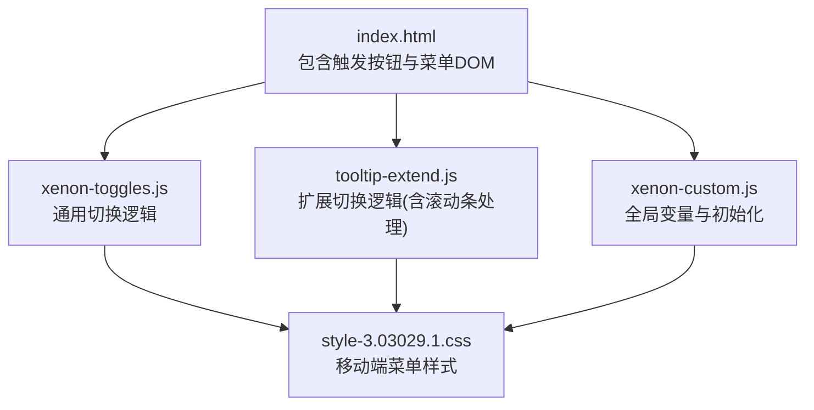
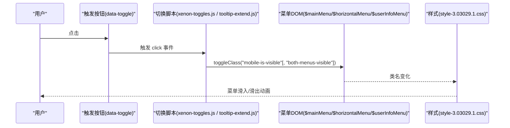
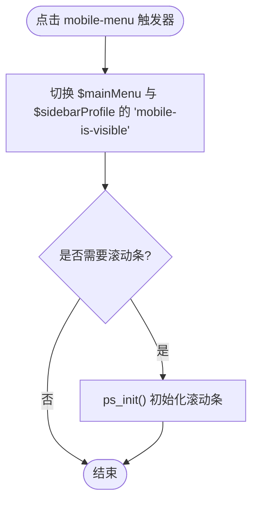
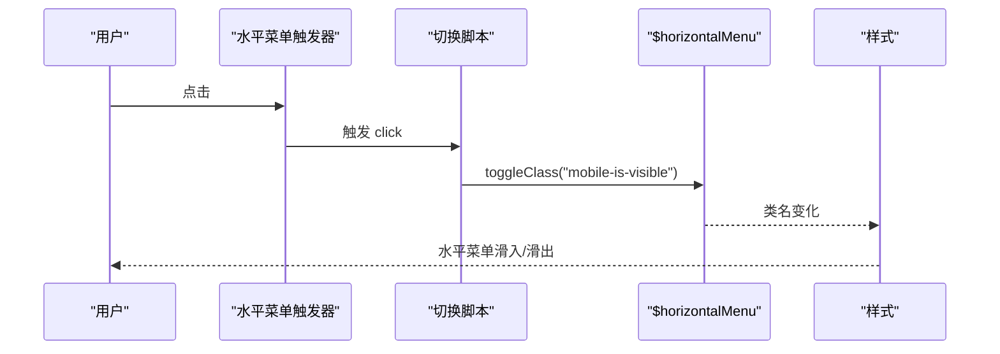
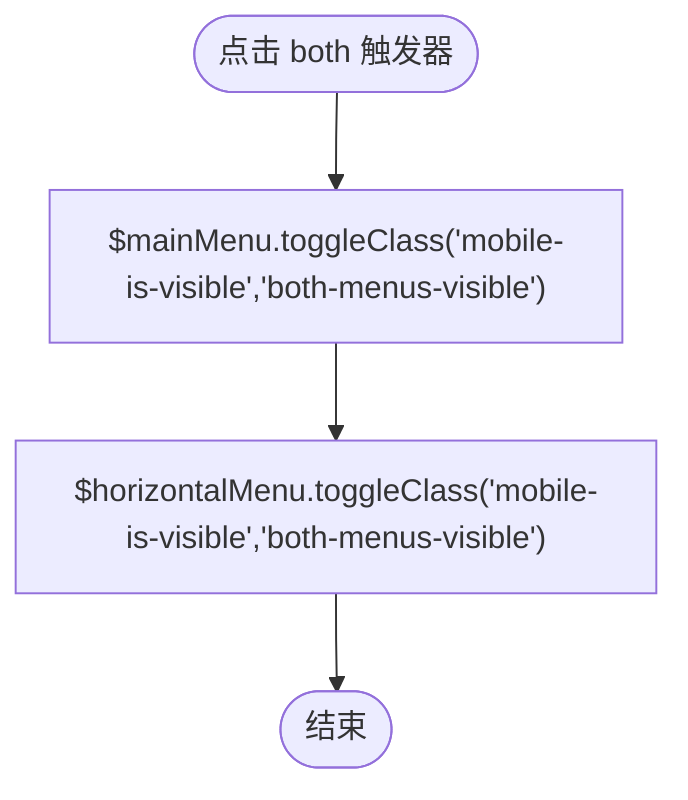
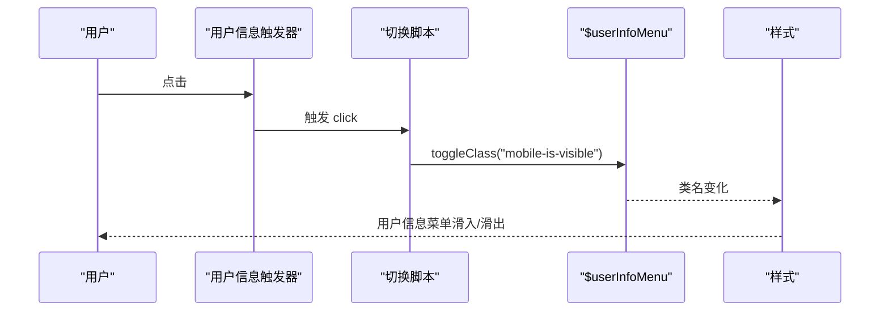
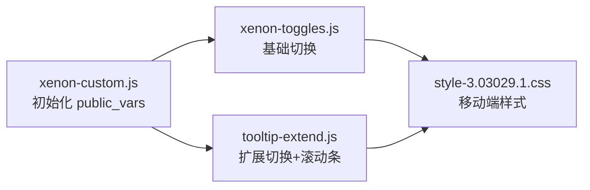

# 移动端菜单切换

<cite>
**本文引用的文件**
- [index.html](file://index.html)
- [xenon-toggles.js](file://assets/js/xenon-toggles.js)
- [tooltip-extend.js](file://assets/js/tooltip-extend.js)
- [xenon-custom.js](file://assets/js/xenon-custom.js)
- [style-3.03029.1.css](file://assets/css/style-3.03029.1.css)
- [custom-style.css](file://assets/css/custom-style.css)
</cite>

## 目录
1. [简介](#简介)
2. [项目结构](#项目结构)
3. [核心组件](#核心组件)
4. [架构总览](#架构总览)
5. [详细组件分析](#详细组件分析)
6. [依赖关系分析](#依赖关系分析)
7. [性能考量](#性能考量)
8. [故障排查指南](#故障排查指南)
9. [结论](#结论)
10. [附录](#附录)

## 简介
本文件聚焦于该项目的移动端菜单切换能力，覆盖四种类型：普通侧边菜单（mobile-menu）、水平菜单（mobile-menu-horizontal）、组合菜单（mobile-menu-both）以及用户信息菜单（user-info-menu）。文档将详细说明每种类型的触发机制、CSS类名操作（尤其是 mobile-is-visible 与 both-menus-visible）、样式适配与交互流程，并给出移动端用户体验优化建议。

## 项目结构
- 入口页面 index.html 中定义了顶部导航栏与侧边栏，包含用于触发不同菜单的按钮元素（data-toggle 属性标识）。
- JavaScript 逻辑集中在 assets/js 下的 xenon-toggles.js、tooltip-extend.js、xenon-custom.js，负责监听点击事件并切换相应菜单的可见状态。
- 样式定义在 assets/css 下，其中 style-3.03029.1.css 包含移动端菜单的基础样式与响应式规则；custom-style.css 提供局部定制样式。

图表来源
- [index.html:219-326](file://index.html#L219-L326)
- [xenon-toggles.js:136-177](file://assets/js/xenon-toggles.js#L136-L177)
- [tooltip-extend.js:191-229](file://assets/js/tooltip-extend.js#L191-L229)
- [xenon-custom.js:16-31](file://assets/js/xenon-custom.js#L16-L31)
- [style-3.03029.1.css:153-163](file://assets/css/style-3.03029.1.css#L153-L163)

章节来源
- [index.html:219-326](file://index.html#L219-L326)
- [style-3.03029.1.css:153-163](file://assets/css/style-3.03029.1.css#L153-L163)

## 核心组件
- 触发器：通过 data-toggle 属性指定不同类型的菜单切换行为，如 data-toggle="mobile-menu"、data-toggle="mobile-menu-horizontal"、data-toggle="mobile-menu-both"、data-toggle="user-info-menu"。
- 目标容器：
  - 主侧边菜单：public_vars.$mainMenu（对应 .sidebar-menu .main-menu）
  - 水平菜单：public_vars.$horizontalMenu（对应 .navbar.horizontal-menu .navbar-nav）
  - 用户信息菜单：public_vars.$userInfoMenu（对应 nav.navbar.user-info-navbar）
- 状态类：
  - mobile-is-visible：控制菜单显示/隐藏的核心类
  - both-menus-visible：组合模式下同时作用于侧边与水平菜单的附加类

章节来源
- [xenon-toggles.js:136-177](file://assets/js/xenon-toggles.js#L136-L177)
- [tooltip-extend.js:191-229](file://assets/js/tooltip-extend.js#L191-L229)
- [xenon-custom.js:16-31](file://assets/js/xenon-custom.js#L16-L31)

## 架构总览
整体采用“数据驱动 + 类名切换”的模式：点击触发器后，JS 读取对应的 DOM 引用，使用 toggleClass 添加或移除 mobile-is-visible（及 both-menus-visible），由 CSS 媒体查询与 transform 控制菜单滑入/滑出。

图表来源
- [xenon-toggles.js:136-177](file://assets/js/xenon-toggles.js#L136-L177)
- [tooltip-extend.js:191-229](file://assets/js/tooltip-extend.js#L191-L229)
- [style-3.03029.1.css:153-163](file://assets/css/style-3.03029.1.css#L153-L163)

## 详细组件分析

### 普通菜单（mobile-menu）
- 触发机制：点击带有 data-toggle="mobile-menu" 的元素时，切换 public_vars.$mainMenu 与 public_vars.$sidebarProfile 的 mobile-is-visible 类。
- 样式适配：在移动端（max-width:767.98px），侧边栏被设置为固定定位、全屏高度与宽度，并通过 transform 实现从左侧滑入/滑出；当菜单显示时，配合 show 类进行位移归位。
- 滚动条处理：部分实现会在打开菜单时调用 ps_init() 初始化滚动条，关闭时调用 ps_destroy() 销毁滚动条，避免滚动冲突。

图表来源
- [xenon-toggles.js:136-143](file://assets/js/xenon-toggles.js#L136-L143)
- [tooltip-extend.js:191-204](file://assets/js/tooltip-extend.js#L191-L204)
- [style-3.03029.1.css:153-163](file://assets/css/style-3.03029.1.css#L153-L163)

章节来源
- [xenon-toggles.js:136-143](file://assets/js/xenon-toggles.js#L136-L143)
- [tooltip-extend.js:191-204](file://assets/js/tooltip-extend.js#L191-L204)
- [style-3.03029.1.css:153-163](file://assets/css/style-3.03029.1.css#L153-L163)

### 水平菜单（mobile-menu-horizontal）
- 触发机制：点击 data-toggle="mobile-menu-horizontal" 的元素时，切换 public_vars.$horizontalMenu 的 mobile-is-visible 类。
- 样式适配：水平菜单在移动端同样受媒体查询影响，结合 transform 控制显示/隐藏。
- 注意：该模式仅针对水平菜单，不影响侧边菜单。

图表来源
- [xenon-toggles.js:147-154](file://assets/js/xenon-toggles.js#L147-L154)
- [tooltip-extend.js:205-210](file://assets/js/tooltip-extend.js#L205-L210)

章节来源
- [xenon-toggles.js:147-154](file://assets/js/xenon-toggles.js#L147-L154)
- [tooltip-extend.js:205-210](file://assets/js/tooltip-extend.js#L205-L210)

### 组合菜单（mobile-menu-both）
- 触发机制：点击 data-toggle="mobile-menu-both" 的元素时，同时切换 $mainMenu 与 $horizontalMenu 的 mobile-is-visible 与 both-menus-visible 类。
- 样式适配：both-menus-visible 作为附加类，使两个菜单在同一状态下显示/隐藏，便于在特定布局中统一控制。
- 适用场景：需要同时展示侧边与水平菜单的场景（例如双栏布局或特殊导航结构）。

图表来源
- [xenon-toggles.js:158-166](file://assets/js/xenon-toggles.js#L158-L166)
- [tooltip-extend.js:211-217](file://assets/js/tooltip-extend.js#L211-L217)

章节来源
- [xenon-toggles.js:158-166](file://assets/js/xenon-toggles.js#L158-L166)
- [tooltip-extend.js:211-217](file://assets/js/tooltip-extend.js#L211-L217)

### 用户信息菜单（user-info-menu）
- 触发机制：点击 data-toggle="user-info-menu" 的元素时，切换 public_vars.$userInfoMenu 的 mobile-is-visible 类。
- 样式适配：用户信息菜单在移动端以同样的方式通过类名切换控制显示/隐藏。
- 水平变体：存在 user-info-menu-horizontal 的触发器，用于切换水平导航中的用户信息区域。

图表来源
- [xenon-toggles.js:170-177](file://assets/js/xenon-toggles.js#L170-L177)
- [tooltip-extend.js:218-229](file://assets/js/tooltip-extend.js#L218-L229)

章节来源
- [xenon-toggles.js:170-177](file://assets/js/xenon-toggles.js#L170-L177)
- [tooltip-extend.js:218-229](file://assets/js/tooltip-extend.js#L218-L229)

## 依赖关系分析
- 全局变量与引用：
  - xenon-custom.js 初始化 public_vars，包括 $body、$pageContainer、$sidebarMenu、$mainMenu、$horizontalNavbar、$horizontalMenu、$userInfoMenu 等，供切换脚本使用。
- 切换脚本：
  - xenon-toggles.js 提供基础切换逻辑（不含滚动条处理）。
  - tooltip-extend.js 在此基础上扩展了滚动条初始化与销毁逻辑，确保菜单内容可滚动且无冲突。
- 样式：
  - style-3.03029.1.css 在移动端媒体查询中定义侧边栏的全屏、固定定位与 transform 动画；show 类用于位移归位。
  - custom-style.css 提供局部定制，不直接影响菜单切换逻辑。

图表来源
- [xenon-custom.js:16-31](file://assets/js/xenon-custom.js#L16-L31)
- [xenon-toggles.js:136-177](file://assets/js/xenon-toggles.js#L136-L177)
- [tooltip-extend.js:191-229](file://assets/js/tooltip-extend.js#L191-L229)
- [style-3.03029.1.css:153-163](file://assets/css/style-3.03029.1.css#L153-L163)

章节来源
- [xenon-custom.js:16-31](file://assets/js/xenon-custom.js#L16-L31)
- [xenon-toggles.js:136-177](file://assets/js/xenon-toggles.js#L136-L177)
- [tooltip-extend.js:191-229](file://assets/js/tooltip-extend.js#L191-L229)
- [style-3.03029.1.css:153-163](file://assets/css/style-3.03029.1.css#L153-L163)

## 性能考量
- 类名切换开销低：通过 toggleClass 切换 mobile-is-visible，避免频繁操作样式属性，提升渲染性能。
- 滚动条管理：在菜单打开/关闭时初始化/销毁滚动条，防止滚动事件冲突与内存泄漏。
- 动画与过渡：使用 CSS transform 与 transition 实现平滑滑入/滑出，减少重排与重绘。
- 媒体查询：仅在移动端启用全屏与固定定位，桌面端保持默认布局，降低不必要的计算。

[本节为通用指导，无需具体文件引用]

## 故障排查指南
- 菜单无法显示：
  - 检查触发器是否正确设置 data-toggle 属性。
  - 确认 public_vars.$mainMenu / $horizontalMenu / $userInfoMenu 是否成功引用到对应 DOM。
  - 查看控制台是否有 JS 错误导致事件未绑定。
- 滚动异常：
  - 若菜单内容不可滚动，确认是否在打开时调用了 ps_init()，关闭时调用了 ps_destroy()。
  - 检查是否存在多个滚动条实例导致的冲突。
- 样式不生效：
  - 确认移动端媒体查询条件（max-width:767.98px）是否匹配当前设备。
  - 检查 show 类是否被正确应用以实现位移归位。
- 组合菜单状态不一致：
  - 确保 both-menus-visible 同时应用于 $mainMenu 与 $horizontalMenu。
  - 验证 CSS 中是否有覆盖 both-menus-visible 的规则。

章节来源
- [xenon-toggles.js:136-177](file://assets/js/xenon-toggles.js#L136-L177)
- [tooltip-extend.js:191-229](file://assets/js/tooltip-extend.js#L191-L229)
- [style-3.03029.1.css:153-163](file://assets/css/style-3.03029.1.css#L153-L163)

## 结论
本项目通过简洁的 data-toggle + toggleClass 机制实现了多种移动端菜单切换，结合 CSS 媒体查询与 transform 提供了流畅的滑入/滑出体验。滚动条的按需初始化与销毁进一步提升了交互稳定性。对于复杂场景，可通过 both-menus-visible 统一控制多菜单状态。建议在开发中遵循统一的触发器命名与类名约定，确保可维护性与可扩展性。

[本节为总结，无需具体文件引用]

## 附录
- 触发器与目标映射速查：
  - data-toggle="mobile-menu" → $mainMenu 与 $sidebarProfile 切换 mobile-is-visible
  - data-toggle="mobile-menu-horizontal" → $horizontalMenu 切换 mobile-is-visible
  - data-toggle="mobile-menu-both" → $mainMenu 与 $horizontalMenu 同时切换 mobile-is-visible 与 both-menus-visible
  - data-toggle="user-info-menu" → $userInfoMenu 切换 mobile-is-visible
- 关键样式要点：
  - 移动端侧边栏全屏、固定定位与 transform 动画
  - show 类用于位移归位
  - 媒体查询限定移动端行为

章节来源
- [xenon-toggles.js:136-177](file://assets/js/xenon-toggles.js#L136-L177)
- [tooltip-extend.js:191-229](file://assets/js/tooltip-extend.js#L191-L229)
- [style-3.03029.1.css:153-163](file://assets/css/style-3.03029.1.css#L153-L163)