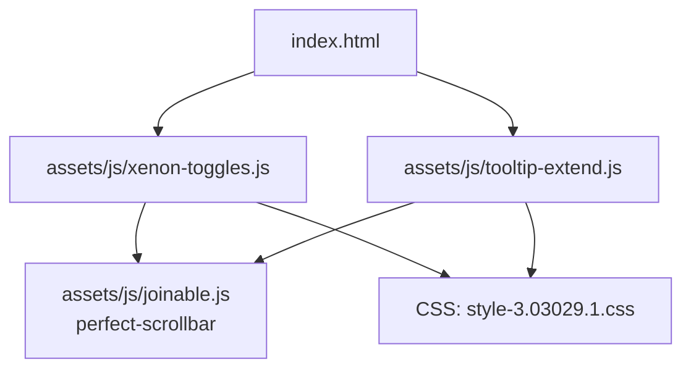
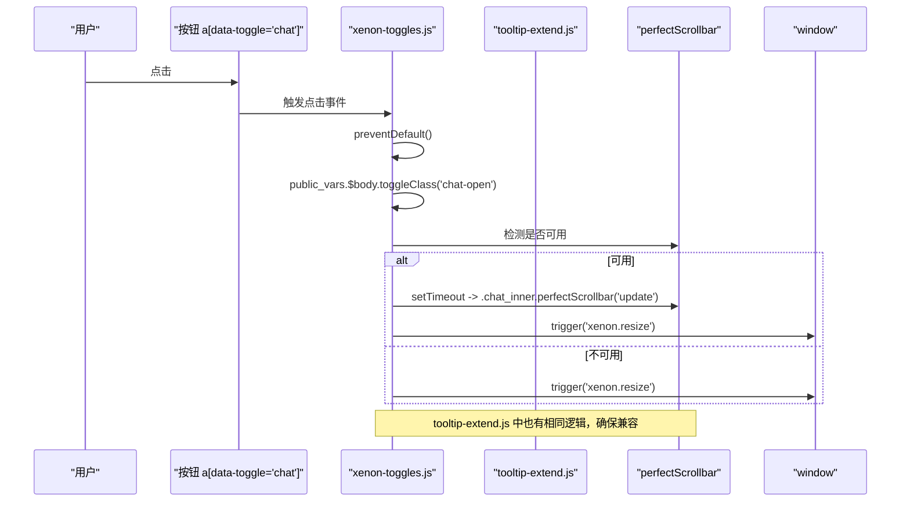
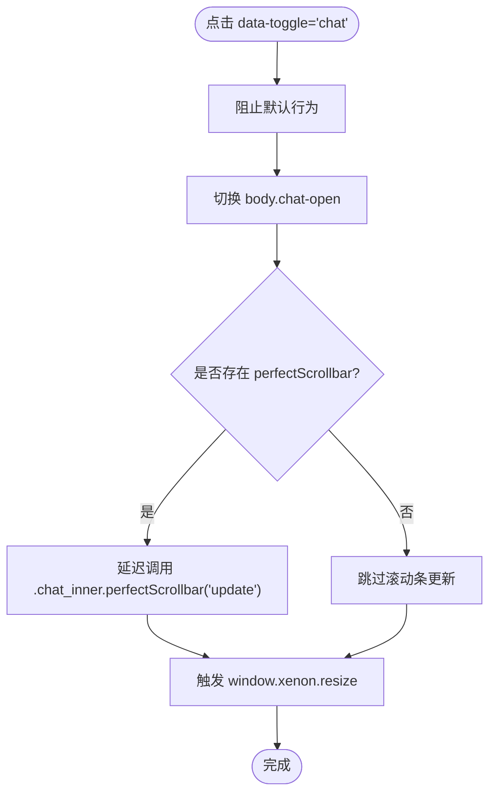
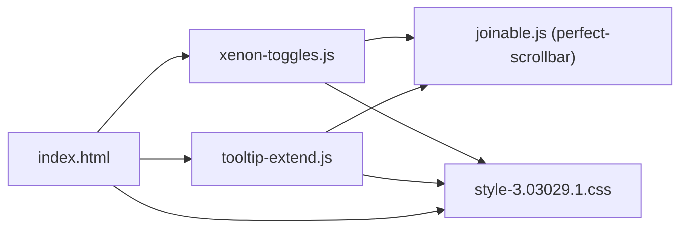

# 聊天面板切换

<cite>
**本文引用的文件**
- [assets/js/xenon-toggles.js](file://assets/js/xenon-toggles.js)
- [assets/js/tooltip-extend.js](file://assets/js/tooltip-extend.js)
- [assets/js/joinable.js](file://assets/js/joinable.js)
- [assets/css/style-3.03029.1.css](file://assets/css/style-3.03029.1.css)
- [index.html](file://index.html)
</cite>

## 目录
1. [简介](#简介)
2. [项目结构](#项目结构)
3. [核心组件](#核心组件)
4. [架构总览](#架构总览)
5. [详细组件分析](#详细组件分析)
6. [依赖关系分析](#依赖关系分析)
7. [性能考虑](#性能考虑)
8. [故障排查指南](#故障排查指南)
9. [结论](#结论)
10. [附录：使用示例与配置](#附录使用示例与配置)

## 简介
本文件详细说明项目中“聊天面板切换”功能的实现机制，重点包括：
- data-toggle="chat" 属性的触发与处理流程
- 聊天面板显示/隐藏逻辑（通过 body 的 chat-open 类名切换）
- 滚动条更新机制（基于 perfectScrollbar 插件的 update 调用）
- perfectScrollbar 的集成、初始化时机与性能优化策略
- 完整的使用示例与配置建议，帮助开发者正确集成聊天功能

## 项目结构
与聊天面板切换相关的代码主要分布在以下位置：
- 交互逻辑：assets/js/xenon-toggles.js、assets/js/tooltip-extend.js
- 滚动条插件：assets/js/joinable.js（包含 perfect-scrollbar 的实现）
- 样式基础：assets/css/style-3.03029.1.css（页面容器与布局）
- 入口页面：index.html（引入脚本与样式）

图表来源
- [index.html:1-800](file://index.html#L1-L800)
- [assets/js/xenon-toggles.js:15-33](file://assets/js/xenon-toggles.js#L15-L33)
- [assets/js/tooltip-extend.js:93-109](file://assets/js/tooltip-extend.js#L93-L109)
- [assets/js/joinable.js:27-29](file://assets/js/joinable.js#L27-L29)
- [assets/css/style-3.03029.1.css:19-22](file://assets/css/style-3.03029.1.css#L19-L22)

章节来源
- [index.html:1-800](file://index.html#L1-L800)
- [assets/js/xenon-toggles.js:15-33](file://assets/js/xenon-toggles.js#L15-L33)
- [assets/js/tooltip-extend.js:93-109](file://assets/js/tooltip-extend.js#L93-L109)
- [assets/js/joinable.js:27-29](file://assets/js/joinable.js#L27-L29)
- [assets/css/style-3.03029.1.css:19-22](file://assets/css/style-3.03029.1.css#L19-L22)

## 核心组件
- 数据属性触发器：a[data-toggle="chat"]
- 状态类名：body.chat-open（控制聊天面板显隐）
- 滚动条插件：perfectScrollbar（提供自定义滚动条与更新接口）
- 事件总线：window 事件 xenon.resize（用于通知各模块重新计算布局）

关键职责：
- 点击带有 data-toggle="chat" 的元素时，阻止默认行为并切换 body 的 chat-open 类名
- 若存在 perfectScrollbar，则在 DOM 变化后异步更新聊天内容区域的滚动条
- 在窗口尺寸变化或面板切换后，触发 xenon.resize 以同步其他组件布局

章节来源
- [assets/js/xenon-toggles.js:15-33](file://assets/js/xenon-toggles.js#L15-L33)
- [assets/js/tooltip-extend.js:93-109](file://assets/js/tooltip-extend.js#L93-L109)
- [assets/js/joinable.js:27-29](file://assets/js/joinable.js#L27-L29)

## 架构总览
聊天面板切换的整体流程如下：

图表来源
- [assets/js/xenon-toggles.js:15-33](file://assets/js/xenon-toggles.js#L15-L33)
- [assets/js/tooltip-extend.js:93-109](file://assets/js/tooltip-extend.js#L93-L109)
- [assets/js/joinable.js:27-29](file://assets/js/joinable.js#L27-L29)

## 详细组件分析

### data-toggle="chat" 的点击处理
- 选择器：$('a[data-toggle="chat"]')
- 行为：
  - 阻止默认跳转
  - 切换 body 的 chat-open 类名，从而驱动 CSS 控制聊天面板显示/隐藏
  - 如果存在 perfectScrollbar，则延迟调用 .chat_inner 的 perfectScrollbar('update') 以刷新滚动条
  - 触发 window 的 xenon.resize 事件，让其他组件感知布局变化

注意：该逻辑在两个文件中重复实现（xenon-toggles.js 与 tooltip-extend.js），保证在不同加载顺序下均能生效。

章节来源
- [assets/js/xenon-toggles.js:15-33](file://assets/js/xenon-toggles.js#L15-L33)
- [assets/js/tooltip-extend.js:93-109](file://assets/js/tooltip-extend.js#L93-L109)

### CSS 类名切换与面板显隐
- 通过 body.chat-open 控制聊天面板的可见性
- 页面容器采用 flex 布局，便于侧边/主内容区域随状态调整
- 建议在样式文件中定义 .chat-open 对应的过渡动画与定位规则（例如 transform、opacity、z-index 等），以获得平滑的显示/隐藏效果

章节来源
- [assets/js/xenon-toggles.js:22](file://assets/js/xenon-toggles.js#L22)
- [assets/css/style-3.03029.1.css:19-22](file://assets/css/style-3.03029.1.css#L19-L22)

### 滚动条更新机制（perfectScrollbar）
- 更新时机：
  - 每次点击 data-toggle="chat" 后，使用 setTimeout 延迟调用 .chat_inner.perfectScrollbar('update')
  - 同时触发 window.xenon.resize，使其他需要重算的区域（如侧边栏、下拉菜单）也能更新滚动条
- 初始化时机：
  - 在 tooltip-extend.js 中，当检测到 #chat .chat-inner 的父元素为 fixed 时，设置 maxHeight 并初始化 perfectScrollbar
- 插件能力：
  - joinable.js 提供了 perfect-scrollbar 的 jQuery 插件封装，支持 'update'、'destroy'、初始化选项等

章节来源
- [assets/js/xenon-toggles.js:24-31](file://assets/js/xenon-toggles.js#L24-L31)
- [assets/js/tooltip-extend.js:378-382](file://assets/js/tooltip-extend.js#L378-L382)
- [assets/js/joinable.js:27-29](file://assets/js/joinable.js#L27-L29)

### 事件总线与联动
- xenon.resize：在聊天面板切换后触发，通知其他模块（如下拉菜单、侧边栏）更新滚动条与布局
- 该事件由 xenon-toggles.js 和 tooltip-extend.js 共同触发，确保多入口场景下的稳定性

章节来源
- [assets/js/xenon-toggles.js:29](file://assets/js/xenon-toggles.js#L29)
- [assets/js/tooltip-extend.js:105](file://assets/js/tooltip-extend.js#L105)

### 流程图：聊天面板切换与滚动条更新

图表来源
- [assets/js/xenon-toggles.js:15-33](file://assets/js/xenon-toggles.js#L15-L33)
- [assets/js/tooltip-extend.js:93-109](file://assets/js/tooltip-extend.js#L93-L109)

## 依赖关系分析
- 交互层：
  - xenon-toggles.js：负责 data-toggle="chat" 的点击处理与状态切换
  - tooltip-extend.js：提供相同的聊天切换逻辑，增强兼容性
- 滚动条层：
  - joinable.js：提供 perfect-scrollbar 的 jQuery 插件封装，支持初始化、更新、销毁
- 样式层：
  - style-3.03029.1.css：定义页面容器与基础布局，配合 chat-open 类名实现视觉切换
- 入口：
  - index.html：引入上述脚本与样式，承载页面结构与交互

图表来源
- [assets/js/xenon-toggles.js:15-33](file://assets/js/xenon-toggles.js#L15-L33)
- [assets/js/tooltip-extend.js:93-109](file://assets/js/tooltip-extend.js#L93-L109)
- [assets/js/joinable.js:27-29](file://assets/js/joinable.js#L27-L29)
- [assets/css/style-3.03029.1.css:19-22](file://assets/css/style-3.03029.1.css#L19-L22)
- [index.html:1-800](file://index.html#L1-L800)

章节来源
- [assets/js/xenon-toggles.js:15-33](file://assets/js/xenon-toggles.js#L15-L33)
- [assets/js/tooltip-extend.js:93-109](file://assets/js/tooltip-extend.js#L93-L109)
- [assets/js/joinable.js:27-29](file://assets/js/joinable.js#L27-L29)
- [assets/css/style-3.03029.1.css:19-22](file://assets/css/style-3.03029.1.css#L19-L22)
- [index.html:1-800](file://index.html#L1-L800)

## 性能考虑
- 避免频繁重排：使用 setTimeout 延迟滚动条更新，确保 DOM 已稳定后再计算
- 统一事件：通过 xenon.resize 集中触发布局更新，减少重复计算
- 条件初始化：仅在 #chat .chat-inner 的父元素为 fixed 时初始化滚动条，降低不必要的开销
- 可配置项（来自 perfect-scrollbar）：
  - wheelPropagation：控制滚轮传播行为，避免与父容器滚动冲突
  - wheelSpeed：调整滚轮速度
  - suppressScrollX/Y：按需禁用某方向滚动
  - includePadding：将内边距纳入滚动计算

章节来源
- [assets/js/xenon-toggles.js:24-31](file://assets/js/xenon-toggles.js#L24-L31)
- [assets/js/tooltip-extend.js:378-382](file://assets/js/tooltip-extend.js#L378-L382)
- [assets/js/joinable.js:27-29](file://assets/js/joinable.js#L27-L29)

## 故障排查指南
- 问题：点击后聊天面板未显示
  - 检查是否正确添加 data-toggle="chat" 到触发元素
  - 确认 body.chat-open 是否被切换
  - 检查 CSS 中是否有 .chat-open 相关样式生效
- 问题：滚动条不更新或错位
  - 确认 perfectScrollbar 已加载（joinable.js）
  - 检查是否在切换后调用了 .chat_inner.perfectScrollbar('update')
  - 确保 .chat-inner 的父容器具备固定高度或 max-height，且为 fixed 布局时初始化滚动条
- 问题：与其他滚动区域冲突
  - 调整 perfect-scrollbar 的 wheelPropagation 与 suppressScrollX/Y 配置
  - 监听 window.xenon.resize，确保所有滚动区域同步更新

章节来源
- [assets/js/xenon-toggles.js:15-33](file://assets/js/xenon-toggles.js#L15-L33)
- [assets/js/tooltip-extend.js:93-109](file://assets/js/tooltip-extend.js#L93-L109)
- [assets/js/joinable.js:27-29](file://assets/js/joinable.js#L27-L29)

## 结论
本项目通过 data-toggle="chat" 实现了简洁可靠的聊天面板切换：
- 使用 body.chat-open 控制显隐，解耦了交互与样式
- 借助 perfectScrollbar 提供一致的滚动体验，并在切换后及时更新
- 通过 xenon.resize 事件协调多组件布局，提升整体一致性
按照本文提供的示例与配置，开发者可以快速集成并定制聊天功能。

## 附录：使用示例与配置

### HTML 示例
- 触发按钮：
  - 在任意位置添加 <a data-toggle="chat">打开聊天</a>
- 聊天面板容器：
  - 在页面中添加 id="chat" 的容器，内部包含 .chat-inner 作为滚动内容区
  - 若父容器为 fixed，需在初始化时设置 maxHeight 并调用 perfectScrollbar

章节来源
- [assets/js/tooltip-extend.js:378-382](file://assets/js/tooltip-extend.js#L378-L382)

### JavaScript 行为说明
- 点击触发：
  - 阻止默认行为
  - 切换 body.chat-open
  - 若存在 perfectScrollbar，则延迟更新 .chat_inner 的滚动条
  - 触发 window.xenon.resize
- 初始化滚动条：
  - 当 #chat .chat-inner 的父元素为 fixed 时，设置 maxHeight 并初始化 perfectScrollbar

章节来源
- [assets/js/xenon-toggles.js:15-33](file://assets/js/xenon-toggles.js#L15-L33)
- [assets/js/tooltip-extend.js:93-109](file://assets/js/tooltip-extend.js#L93-L109)
- [assets/js/tooltip-extend.js:378-382](file://assets/js/tooltip-extend.js#L378-L382)

### CSS 建议
- 为 body.chat-open 定义聊天面板的显示/隐藏样式（如 transform、opacity、z-index）
- 确保 .chat-inner 具有合适的高度限制（maxHeight），以便滚动条正常工作
- 利用页面容器的 flex 布局，使聊天面板与主内容区域协同变化

章节来源
- [assets/css/style-3.03029.1.css:19-22](file://assets/css/style-3.03029.1.css#L19-L22)

### perfectScrollbar 配置参考
- 常用选项：
  - wheelPropagation：true/false（控制滚轮传播）
  - wheelSpeed：数值（滚轮速度）
  - suppressScrollX/suppressScrollY：true/false（禁用某方向滚动）
  - includePadding：true/false（是否包含内边距）
- 方法：
  - 初始化：$(selector).perfectScrollbar(options)
  - 更新：$(selector).perfectScrollbar('update')
  - 销毁：$(selector).perfectScrollbar('destroy')

章节来源
- [assets/js/joinable.js:27-29](file://assets/js/joinable.js#L27-L29)