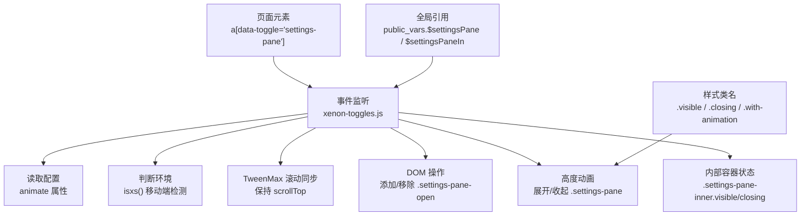
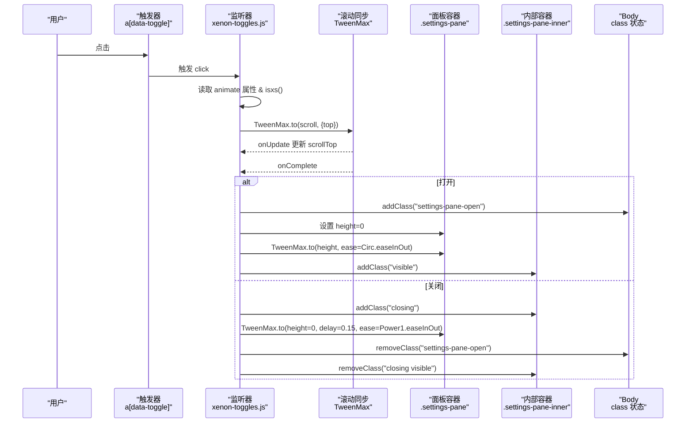
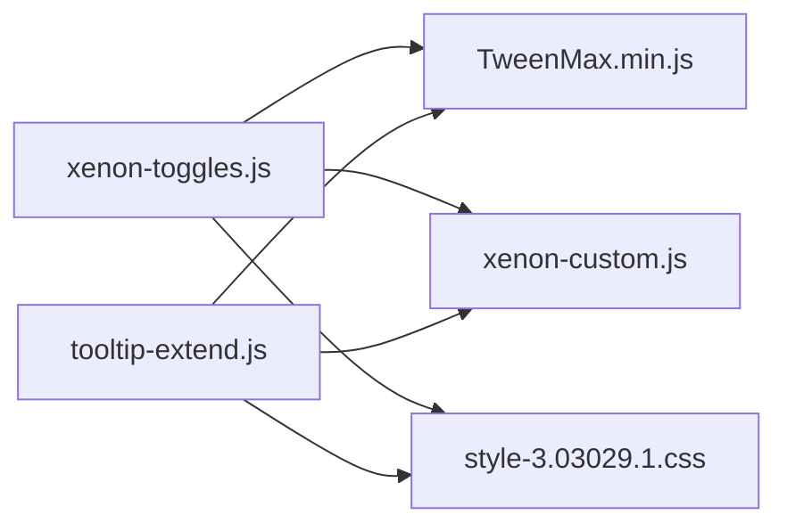

# 设置面板切换

<cite>
**本文引用的文件**
- [assets/js/xenon-toggles.js](file://assets/js/xenon-toggles.js)
- [assets/js/tooltip-extend.js](file://assets/js/tooltip-extend.js)
- [assets/js/xenon-custom.js](file://assets/js/xenon-custom.js)
- [assets/js/TweenMax.min.js](file://assets/js/TweenMax.min.js)
- [assets/css/style-3.03029.1.css](file://assets/css/style-3.03029.1.css)
</cite>

## 目录
1. [简介](#简介)
2. [项目结构](#项目结构)
3. [核心组件](#核心组件)
4. [架构总览](#架构总览)
5. [详细组件分析](#详细组件分析)
6. [依赖关系分析](#依赖关系分析)
7. [性能考量](#性能考量)
8. [故障排查指南](#故障排查指南)
9. [结论](#结论)
10. [附录：API与自定义动画指南](#附录api与自定义动画指南)

## 简介
本文件围绕 data-toggle="settings-pane" 的设置面板切换功能，系统性解析其实现原理与交互流程，重点包括：
- 动画效果控制（高度展开/收起、滚动同步）
- 状态管理（body 类名、内部容器可见性）
- TweenMax 动画库的使用（缓动函数、回调、属性动画）
- animate 属性的配置方法与移动端兼容性处理
- 完整的 API 参考与自定义动画扩展指南

该功能通过点击触发器元素，驱动设置面板的打开/关闭，并在启用动画时提供平滑的高度过渡与滚动位置保持。

## 项目结构
与设置面板切换相关的代码主要分布在以下文件中：
- 交互逻辑：assets/js/xenon-toggles.js（主逻辑）、assets/js/tooltip-extend.js（备用/重复实现）
- 全局变量与 DOM 引用：assets/js/xenon-custom.js
- 动画引擎：assets/js/TweenMax.min.js
- 样式与类名：assets/css/style-3.03029.1.css（主题样式）

图表来源
- [assets/js/xenon-toggles.js:37-107](file://assets/js/xenon-toggles.js#L37-L107)
- [assets/js/xenon-custom.js:32-33](file://assets/js/xenon-custom.js#L32-L33)
- [assets/js/TweenMax.min.js](file://assets/js/TweenMax.min.js)

章节来源
- [assets/js/xenon-toggles.js:37-107](file://assets/js/xenon-toggles.js#L37-L107)
- [assets/js/xenon-custom.js:32-33](file://assets/js/xenon-custom.js#L32-L33)

## 核心组件
- 触发器选择器：a[data-toggle="settings-pane"]
- 目标面板：.settings-pane（外部容器）
- 内部内容容器：.settings-pane-inner（用于可见性与动画状态）
- 状态类名：
  - body.settings-pane-open：表示面板处于打开状态
  - .settings-pane-inner.visible：面板已显示
  - .settings-pane-inner.closing：面板正在关闭中
  - .settings-pane-inner.with-animation：当前动画模式生效
- 动画引擎：TweenMax（GSAP），用于滚动同步与高度动画

章节来源
- [assets/js/xenon-toggles.js:37-107](file://assets/js/xenon-toggles.js#L37-L107)
- [assets/js/xenon-custom.js:32-33](file://assets/js/xenon-custom.js#L32-L33)

## 架构总览
设置面板切换的整体流程如下：
1. 用户点击 a[data-toggle="settings-pane"]
2. 阻止默认行为，读取 animate 属性与环境检测
3. 使用 TweenMax 对滚动位置进行极短时间的同步动画（避免抖动）
4. 根据面板是否可见决定打开或关闭分支
5. 打开分支：
   - 为 body 添加 .settings-pane-open
   - 计算面板高度并初始化为 0
   - 使用 TweenMax 以缓动函数展开到实际高度
   - 为内部容器添加 .visible
6. 关闭分支：
   - 为内部容器添加 .closing
   - 使用 TweenMax 将高度收缩至 0
   - 在动画完成后移除 body 的状态类与内部容器的状态类

图表来源
- [assets/js/xenon-toggles.js:37-107](file://assets/js/xenon-toggles.js#L37-L107)
- [assets/js/TweenMax.min.js](file://assets/js/TweenMax.min.js)

## 详细组件分析

### 事件绑定与配置读取
- 选择器：$('a[data-toggle="settings-pane"]')
- 事件：click
- 配置：
  - animate：布尔值，决定是否启用动画
  - isxs()：移动端检测，若为真则禁用动画以提升性能与体验
- 滚动同步：
  - 使用 TweenMax.to 对 scroll.top 进行极短时间动画，避免在动画期间出现滚动抖动
  - 当面板已打开时，toTop 设置为当前 scrollTop，确保关闭时不跳变

章节来源
- [assets/js/xenon-toggles.js:37-58](file://assets/js/xenon-toggles.js#L37-L58)
- [assets/js/tooltip-extend.js:111-128](file://assets/js/tooltip-extend.js#L111-L128)

### 打开流程（高度展开）
- 为 body 添加 .settings-pane-open
- 获取面板真实高度 outerHeight(true)
- 将面板高度初始化为 0
- 使用 TweenMax 以 Circ.easeInOut 缓动函数展开到真实高度
- 动画完成后清除内联 height，交由 CSS 接管布局
- 为内部容器添加 .visible 标记可见状态

章节来源
- [assets/js/xenon-toggles.js:67-83](file://assets/js/xenon-toggles.js#L67-L83)
- [assets/js/tooltip-extend.js:136-148](file://assets/js/tooltip-extend.js#L136-L148)

### 关闭流程（高度收起）
- 为内部容器添加 .closing 标记关闭中
- 使用 TweenMax 以 Power1.easeInOut 缓动函数将高度收缩至 0，延迟 0.15s 以增强视觉层次
- 动画完成后：
  - 移除 body 的 .settings-pane-open
  - 清除内联 height
  - 移除内部容器的 .closing 与 .visible

章节来源
- [assets/js/xenon-toggles.js:85-95](file://assets/js/xenon-toggles.js#L85-L95)
- [assets/js/tooltip-extend.js:150-159](file://assets/js/tooltip-extend.js#L150-L159)

### 无动画模式
- 当未启用动画或检测到移动端时：
  - 直接 toggleClass('settings-pane-open')
  - 移除内部容器的 .visible 与 .with-animation

章节来源
- [assets/js/xenon-toggles.js:97-103](file://assets/js/xenon-toggles.js#L97-L103)
- [assets/js/tooltip-extend.js:161-167](file://assets/js/tooltip-extend.js#L161-L167)

### 全局变量与 DOM 引用
- public_vars.$settingsPane：指向 .settings-pane
- public_vars.$settingsPaneIn：指向 .settings-pane-inner
- 这些引用在 xenon-custom.js 初始化时建立，供切换逻辑复用

章节来源
- [assets/js/xenon-custom.js:32-33](file://assets/js/xenon-custom.js#L32-L33)

### 样式与类名约定
- .settings-pane-open：控制 body 级状态，影响布局与可见性
- .settings-pane-inner.visible：标记面板已显示
- .settings-pane-inner.closing：标记面板正在关闭中
- .settings-pane-inner.with-animation：标记当前动画模式生效
- 具体样式定义位于主题样式文件中，由 CSS 控制面板外观与过渡效果

章节来源
- [assets/css/style-3.03029.1.css](file://assets/css/style-3.03029.1.css)

## 依赖关系分析
- 事件绑定与状态管理：xenon-toggles.js
- 全局 DOM 引用：xenon-custom.js
- 动画引擎：TweenMax.min.js（GSAP）
- 样式：style-3.03029.1.css（主题样式）
- 备用实现：tooltip-extend.js（包含相同逻辑，可能为兼容或历史版本）

图表来源
- [assets/js/xenon-toggles.js:37-107](file://assets/js/xenon-toggles.js#L37-L107)
- [assets/js/tooltip-extend.js:111-169](file://assets/js/tooltip-extend.js#L111-L169)
- [assets/js/xenon-custom.js:32-33](file://assets/js/xenon-custom.js#L32-L33)
- [assets/js/TweenMax.min.js](file://assets/js/TweenMax.min.js)
- [assets/css/style-3.03029.1.css](file://assets/css/style-3.03029.1.css)

章节来源
- [assets/js/xenon-toggles.js:37-107](file://assets/js/xenon-toggles.js#L37-L107)
- [assets/js/tooltip-extend.js:111-169](file://assets/js/tooltip-extend.js#L111-L169)
- [assets/js/xenon-custom.js:32-33](file://assets/js/xenon-custom.js#L32-L33)

## 性能考量
- 移动端禁用动画：isxs() 检测后关闭动画，减少重排与重绘开销
- 滚动同步使用极短时长（0.1s）以避免明显跳动，同时降低动画成本
- 高度动画采用硬件加速友好的属性（height），配合缓动函数提升流畅度
- 动画完成后清理内联样式，避免累积不必要的样式覆盖

[本节为通用指导，无需特定文件来源]

## 故障排查指南
- 面板无法打开/关闭：
  - 检查是否正确引入 TweenMax 与 jQuery
  - 确认 public_vars.$settingsPane 与 public_vars.$settingsPaneIn 已正确初始化
  - 验证 HTML 结构包含 .settings-pane 与 .settings-pane-inner
- 动画不生效：
  - 检查 animate 属性是否为 true
  - 检查 isxs() 是否返回真导致禁用动画
  - 查看控制台是否有 GSAP 相关错误
- 滚动位置异常：
  - 确认 TweenMax.to(scroll) 的 onUpdate 回调正常执行
  - 检查页面是否存在多个滚动容器导致 scrollTop 不同步
- 样式冲突：
  - 检查 .settings-pane-open、.visible、.closing、.with-animation 是否被其他样式覆盖
  - 确认主题样式文件已加载且未被缓存干扰

章节来源
- [assets/js/xenon-toggles.js:37-107](file://assets/js/xenon-toggles.js#L37-L107)
- [assets/js/xenon-custom.js:32-33](file://assets/js/xenon-custom.js#L32-L33)

## 结论
data-toggle="settings-pane" 的实现以事件驱动为核心，结合 TweenMax 提供平滑的滚动同步与高度动画。通过状态类名管理面板可见性与动画阶段，兼顾了桌面端与移动端的体验差异。该方案具备良好的可扩展性，便于替换缓动函数、调整时序与扩展更多动画效果。

[本节为总结性内容，无需特定文件来源]

## 附录：API与自定义动画指南

### 触发器配置
- 基本用法：
  - <a href="#" data-toggle="settings-pane">设置</a>
- 启用动画：
  - <a href="#" data-toggle="settings-pane" data-animate="true">设置</a>
- 禁用动画（移动端自动禁用）：
  - 不设置 data-animate 或在移动端环境下

章节来源
- [assets/js/xenon-toggles.js:43-44](file://assets/js/xenon-toggles.js#L43-L44)
- [assets/js/tooltip-extend.js:116-117](file://assets/js/tooltip-extend.js#L116-L117)

### TweenMax 动画参数参考
- 滚动同步：
  - 目标对象：scroll = { top: currentScroll }
  - 时长：use_animation ? 0.1 : 0
  - 缓动：Sine.easeOut（当滚动距离较大时）
  - 回调：onUpdate 实时设置 window.scrollTop
- 高度展开：
  - 目标：.settings-pane
  - 时长：0.25
  - 缓动：Circ.easeInOut
  - 回调：onComplete 清理内联 height
- 高度收起：
  - 目标：.settings-pane
  - 时长：0.25
  - 延迟：0.15
  - 缓动：Power1.easeInOut
  - 回调：onComplete 清理状态类与内联 height

章节来源
- [assets/js/xenon-toggles.js:55-95](file://assets/js/xenon-toggles.js#L55-L95)
- [assets/js/tooltip-extend.js:125-159](file://assets/js/tooltip-extend.js#L125-L159)

### 自定义动画效果
- 替换缓动函数：
  - 将 Circ.easeInOut 或 Power1.easeInOut 替换为其他 GSAP 缓动（如 Elastic.easeOut、Back.easeInOut）
- 调整时长与时序：
  - 修改 TweenMax.to 的时长参数以加快或放慢动画
  - 调整 delay 以改变关闭时的视觉节奏
- 增加额外动画：
  - 在 onComplete 中插入新的 TweenMax 动画（如透明度、位移）
  - 通过 .settings-pane-inner 的类名变化触发 CSS 过渡

章节来源
- [assets/js/xenon-toggles.js:77-95](file://assets/js/xenon-toggles.js#L77-L95)
- [assets/js/tooltip-extend.js:143-159](file://assets/js/tooltip-extend.js#L143-L159)

### 移动端兼容性
- 自动禁用动画：isxs() 检测后关闭动画，保证交互响应速度
- 建议：
  - 在移动端优先使用无动画模式
  - 如需动画，尽量缩短时长与复杂度
  - 避免在动画过程中触发大量重排

章节来源
- [assets/js/xenon-toggles.js:43-44](file://assets/js/xenon-toggles.js#L43-L44)
- [assets/js/tooltip-extend.js:116-117](file://assets/js/tooltip-extend.js#L116-L117)