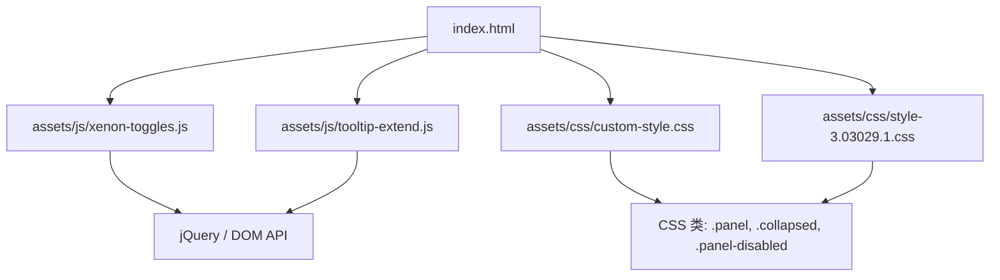
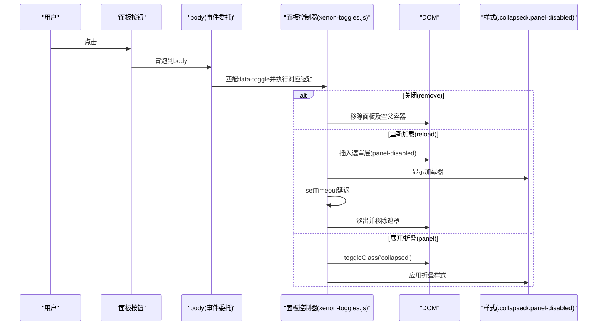
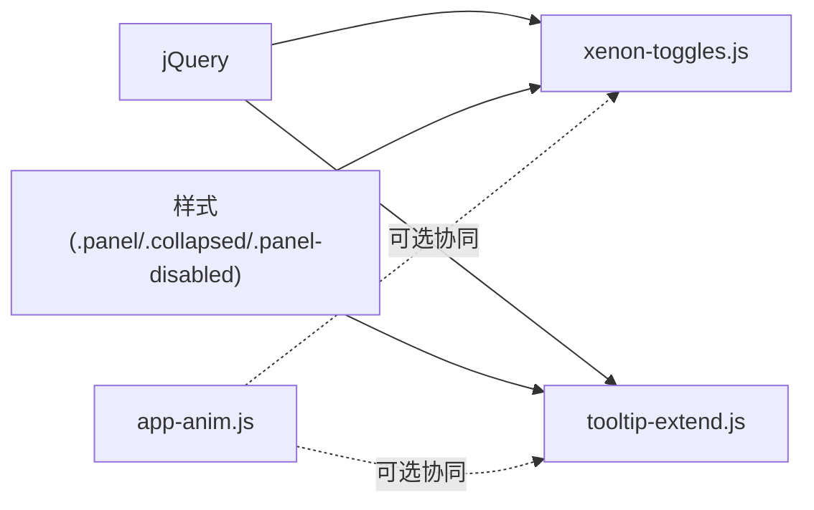

# 面板控制功能

<cite>
**本文引用的文件**
- [index.html](file://index.html)
- [xenon-toggles.js](file://assets/js/xenon-toggles.js)
- [tooltip-extend.js](file://assets/js/tooltip-extend.js)
- [app-anim.js](file://assets/js/app-anim.js)
- [custom-style.css](file://assets/css/custom-style.css)
- [style-3.03029.1.css](file://assets/css/style-3.03029.1.css)
</cite>

## 目录
1. [简介](#简介)
2. [项目结构](#项目结构)
3. [核心组件](#核心组件)
4. [架构总览](#架构总览)
5. [详细组件分析](#详细组件分析)
6. [依赖关系分析](#依赖关系分析)
7. [性能考量](#性能考量)
8. [故障排查指南](#故障排查指南)
9. [结论](#结论)
10. [附录：扩展与最佳实践](#附录：扩展与最佳实践)

## 简介
本文件面向“面板控制功能”的完整说明，覆盖以下能力：
- 关闭（remove）：移除面板及其空父容器
- 重新加载（reload）：模拟加载并展示遮罩与动画反馈
- 展开/折叠（panel）：切换面板的收起状态
同时解释实现机制（事件委托、DOM操作、动画效果）、状态管理、错误处理与用户体验优化策略，并提供自定义扩展方法与最佳实践。

## 项目结构
- 入口页面 index.html 提供整体布局与资源引入，包含侧边栏、主内容区等结构。
- 面板交互逻辑集中在两个脚本中：
  - assets/js/xenon-toggles.js：面板 remove/reload/panel 的核心实现
  - assets/js/tooltip-extend.js：对面板交互的重复实现（兼容/扩展）
- 样式方面：
  - assets/css/custom-style.css：面板内链接样式等定制
  - assets/css/style-3.03029.1.css：全局样式，包含 panel-body 排版等
- 动画与通用交互：
  - assets/js/app-anim.js：页面级动画、滚动、主题切换等

图表来源
- [index.html:1-35](file://index.html#L1-L35)
- [xenon-toggles.js:192-242](file://assets/js/xenon-toggles.js#L192-L242)
- [tooltip-extend.js:230-264](file://assets/js/tooltip-extend.js#L230-L264)
- [custom-style.css:102-103](file://assets/css/custom-style.css#L102-L103)
- [style-3.03029.1.css:633-646](file://assets/css/style-3.03029.1.css#L633-L646)

章节来源
- [index.html:1-35](file://index.html#L1-L35)

## 核心组件
- 事件委托：通过 $(document).on('click', '.panel a[data-toggle="..."]', handler) 统一捕获面板按钮点击，支持动态新增的面板元素。
- DOM 操作：
  - 关闭：查找最近的面板节点并移除；若其父容器无子节点则一并移除父容器。
  - 重新加载：在面板内追加一个带加载器的遮罩层，延时后淡出并移除。
  - 展开/折叠：切换面板节点的 collapsed 类名以改变显示状态。
- 动画与反馈：
  - 使用 jQuery 的 fadeOut 进行遮罩层的淡出过渡。
  - 通过 CSS 类 .collapsed 控制面板折叠态（由样式文件定义）。
- 状态管理：
  - 面板状态通过 class 切换维护（如 .collapsed），便于样式与后续逻辑读取。
- 错误处理：
  - 当前实现为纯前端演示，未包含网络请求的错误分支；可在 reload 钩入真实数据获取并增加 try/catch 或 Promise 失败回调。

章节来源
- [xenon-toggles.js:192-242](file://assets/js/xenon-toggles.js#L192-L242)
- [tooltip-extend.js:230-264](file://assets/js/tooltip-extend.js#L230-L264)
- [custom-style.css:102-103](file://assets/css/custom-style.css#L102-L103)
- [style-3.03029.1.css:633-646](file://assets/css/style-3.03029.1.css#L633-L646)

## 架构总览
面板控制采用“事件委托 + 类名状态 + DOM 操作”的轻量模式：
- 所有面板按钮统一通过 data-toggle 属性标识行为类型（remove/reload/panel）。
- 事件监听绑定在 body 上，确保动态插入的面板也能响应。
- 状态通过 CSS 类名表达，避免额外状态存储。
- 动画与视觉反馈通过 jQuery 动画和 CSS 类组合完成。

图表来源
- [xenon-toggles.js:192-242](file://assets/js/xenon-toggles.js#L192-L242)
- [tooltip-extend.js:230-264](file://assets/js/tooltip-extend.js#L230-L264)
- [custom-style.css:102-103](file://assets/css/custom-style.css#L102-L103)
- [style-3.03029.1.css:633-646](file://assets/css/style-3.03029.1.css#L633-L646)

## 详细组件分析

### 关闭（remove）
- 触发条件：点击面板内带有 data-toggle="remove" 的按钮。
- 实现要点：
  - 使用 closest('.panel') 定位目标面板。
  - 移除面板节点；若其父容器已无子节点，则一并移除父容器，保持 DOM 整洁。
- 用户体验：
  - 即时移除，无多余过渡，适合“不再需要”的场景。
- 可扩展点：
  - 可加入确认对话框、撤销恢复、本地状态同步等。

章节来源
- [xenon-toggles.js:192-206](file://assets/js/xenon-toggles.js#L192-L206)
- [tooltip-extend.js:230-241](file://assets/js/tooltip-extend.js#L230-L241)

### 重新加载（reload）
- 触发条件：点击面板内带有 data-toggle="reload" 的按钮。
- 实现要点：
  - 在面板内追加一个带加载器的遮罩层（class: panel-disabled）。
  - 使用 setTimeout 模拟异步过程，随后调用 fadeOut 并移除遮罩。
  - 随机延时增强“真实感”。
- 用户体验：
  - 遮罩+加载器明确告知用户正在刷新，避免误操作。
- 可扩展点：
  - 替换为真实 AJAX/Fetch 请求，成功/失败分别处理 UI 状态。
  - 增加重试、错误提示、缓存策略。

章节来源
- [xenon-toggles.js:210-230](file://assets/js/xenon-toggles.js#L210-L230)
- [tooltip-extend.js:242-257](file://assets/js/tooltip-extend.js#L242-L257)

### 展开/折叠（panel）
- 触发条件：点击面板内带有 data-toggle="panel" 的按钮。
- 实现要点：
  - 切换面板节点的 collapsed 类名，从而驱动 CSS 变化实现折叠/展开。
- 用户体验：
  - 简洁直观，配合样式可实现平滑过渡（由 CSS 控制）。
- 可扩展点：
  - 记录最后状态到 localStorage，刷新后保持一致。
  - 结合高度动画或内容懒加载提升体验。

章节来源
- [xenon-toggles.js:234-242](file://assets/js/xenon-toggles.js#L234-L242)
- [tooltip-extend.js:258-264](file://assets/js/tooltip-extend.js#L258-L264)

### 事件委托与选择器
- 统一使用 $('body').on('click', '.panel a[data-toggle="..."]', ...) 的方式，保证：
  - 动态创建的面板同样具备交互能力。
  - 减少重复绑定，提高性能。
- 选择器精确限定在 .panel 内部，避免误触其他区域。

章节来源
- [xenon-toggles.js:192-242](file://assets/js/xenon-toggles.js#L192-L242)
- [tooltip-extend.js:230-264](file://assets/js/tooltip-extend.js#L230-L264)

### 动画与样式
- 遮罩层淡出：使用 jQuery 的 fadeOut('fast') 提供平滑消失效果。
- 折叠状态：通过 .collapsed 类名切换，具体样式由 CSS 文件定义。
- 面板内链接样式：在 custom-style.css 中对 .panel .panel-body a 进行了颜色与悬停色定制。

章节来源
- [xenon-toggles.js:210-230](file://assets/js/xenon-toggles.js#L210-L230)
- [custom-style.css:102-103](file://assets/css/custom-style.css#L102-L103)
- [style-3.03029.1.css:633-646](file://assets/css/style-3.03029.1.css#L633-L646)

## 依赖关系分析
- 运行时依赖：
  - jQuery：用于事件绑定、DOM 操作与动画。
  - CSS 类：.panel、.collapsed、.panel-disabled 等由样式文件提供。
- 模块耦合：
  - xenon-toggles.js 与 tooltip-extend.js 均实现了相同的面板控制逻辑，存在重复。建议合并或建立统一模块以避免冲突与维护成本。
- 外部库：
  - app-anim.js 负责页面级动画与交互，不直接参与面板控制，但可与面板动画协同（如页面级 loading）。

图表来源
- [xenon-toggles.js:192-242](file://assets/js/xenon-toggles.js#L192-L242)
- [tooltip-extend.js:230-264](file://assets/js/tooltip-extend.js#L230-L264)
- [app-anim.js:1-25](file://assets/js/app-anim.js#L1-L25)

章节来源
- [xenon-toggles.js:192-242](file://assets/js/xenon-toggles.js#L192-L242)
- [tooltip-extend.js:230-264](file://assets/js/tooltip-extend.js#L230-L264)
- [app-anim.js:1-25](file://assets/js/app-anim.js#L1-L25)

## 性能考量
- 事件委托降低绑定开销，适合大量面板场景。
- 仅通过 class 切换状态，避免复杂状态对象，减少内存占用。
- 遮罩层仅在 reload 时临时插入，完成后立即移除，避免长期驻留影响渲染。
- 建议在大数据量面板列表中使用虚拟滚动或分页加载，减少初始 DOM 压力。

[本节为通用指导，无需特定文件引用]

## 故障排查指南
- 面板按钮无效：
  - 检查是否使用了正确的 data-toggle 值（remove/reload/panel）。
  - 确认按钮位于 .panel 内部，且选择器能匹配到。
- 折叠不生效：
  - 检查 .collapsed 类是否正确添加/移除。
  - 核对样式文件中是否有覆盖规则导致折叠无效。
- 遮罩无法移除：
  - 检查 setTimeout 回调是否执行，是否存在异常中断。
  - 确认面板中存在 .panel-disabled 节点。
- 重复实现冲突：
  - 由于 xenon-toggles.js 与 tooltip-extend.js 都实现了相同逻辑，可能出现重复绑定或行为不一致。建议统一到一个模块。

章节来源
- [xenon-toggles.js:192-242](file://assets/js/xenon-toggles.js#L192-L242)
- [tooltip-extend.js:230-264](file://assets/js/tooltip-extend.js#L230-L264)

## 结论
本项目的面板控制功能采用简洁高效的事件委托与类名状态管理模式，实现了关闭、重新加载、展开/折叠三大核心能力。通过遮罩与动画提供良好反馈，易于扩展至真实数据流与更丰富的交互。建议整合重复实现、完善错误处理与状态持久化，以获得更健壮的体验。

[本节为总结性内容，无需特定文件引用]

## 附录：扩展与最佳实践
- 统一模块：
  - 将 xenon-toggles.js 与 tooltip-extend.js 中的面板逻辑合并为一个模块，避免重复绑定与潜在冲突。
- 真实数据加载：
  - 在 reload 中接入 fetch/AJAX，成功更新面板内容，失败显示错误提示并允许重试。
- 状态持久化：
  - 使用 localStorage 保存面板折叠状态，刷新后恢复。
- 无障碍与可访问性：
  - 为按钮添加 aria-label、role 等属性，提升屏幕阅读器友好度。
- 性能优化：
  - 对大面板内容使用懒加载或虚拟列表。
  - 避免频繁重排重绘，批量更新 DOM。
- 测试与回归：
  - 为 remove/reload/panel 编写单元测试与端到端测试，覆盖边界情况（空面板、网络失败、快速多次点击等）。

[本节为通用指导，无需特定文件引用]