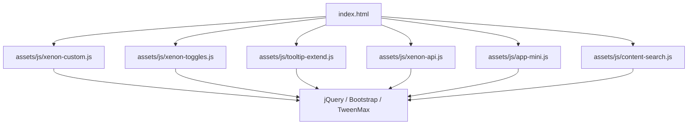
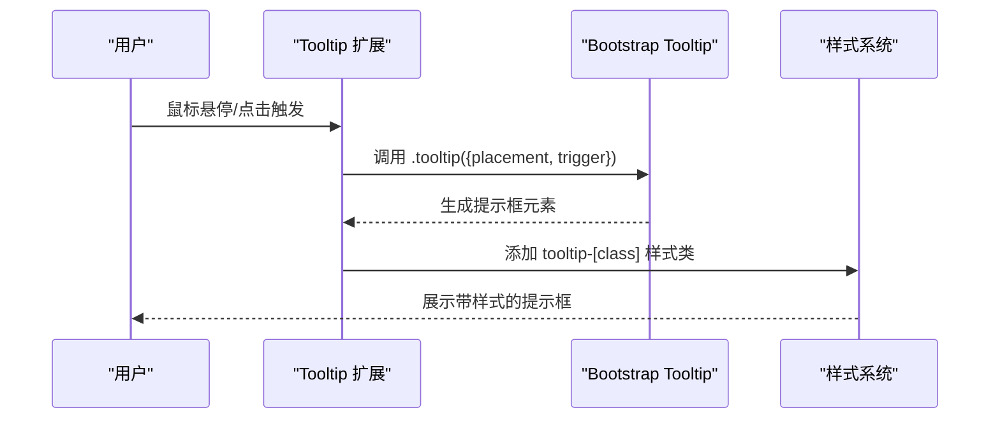
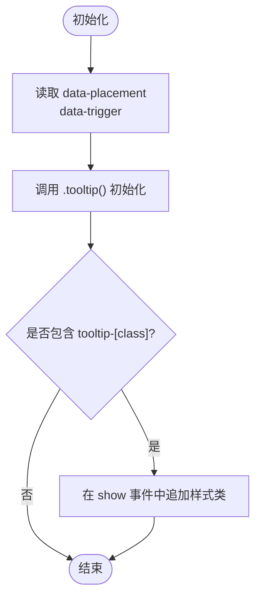
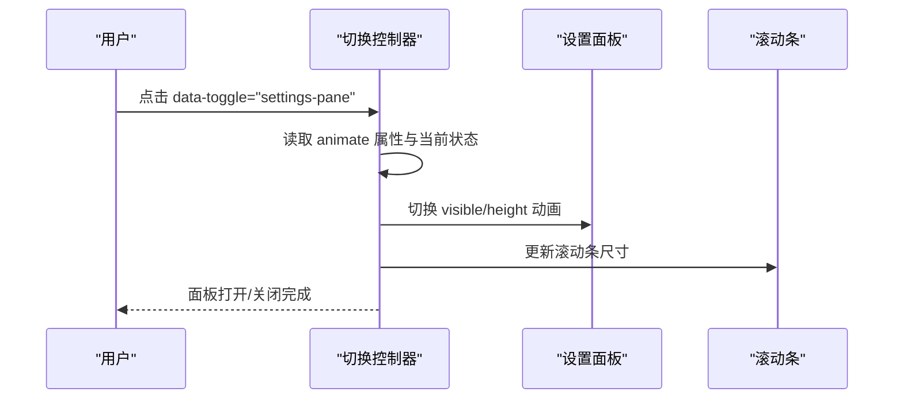
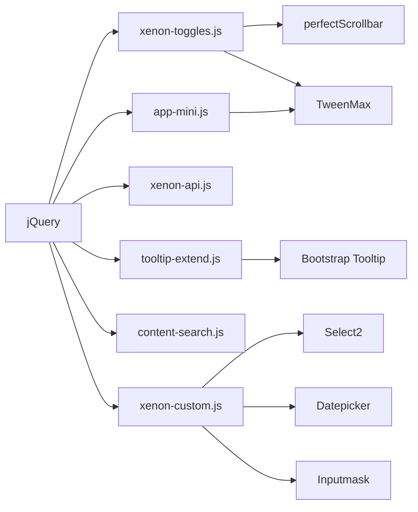

# 工具函数库

<cite>
**本文引用的文件**
- [tooltip-extend.js](file://assets/js/tooltip-extend.js)
- [xenon-toggles.js](file://assets/js/xenon-toggles.js)
- [xenon-api.js](file://assets/js/xenon-api.js)
- [xenon-custom.js](file://assets/js/xenon-custom.js)
- [app-mini.js](file://assets/js/app-mini.js)
- [content-search.js](file://assets/js/content-search.js)
- [README.md](file://README.md)
</cite>

## 目录
1. [简介](#简介)
2. [项目结构](#项目结构)
3. [核心组件](#核心组件)
4. [架构总览](#架构总览)
5. [详细组件分析](#详细组件分析)
6. [依赖关系分析](#依赖关系分析)
7. [性能考量](#性能考量)
8. [故障排查指南](#故障排查指南)
9. [结论](#结论)
10. [附录：使用示例与扩展指南](#附录使用示例与扩展指南)

## 简介
本仓库是一个基于 HTML/CSS/JavaScript 的在线网址导航工具，前端以 jQuery 为核心，集成 Bootstrap、Font Awesome、TweenMax 等第三方库。本文聚焦于“工具函数库”部分，重点解析 tooltip 扩展功能与切换功能（xenon-toggles）的技术实现，并总结工具函数的设计模式、错误处理、日志记录最佳实践，以及第三方库集成策略与版本管理建议。

## 项目结构
前端资源集中在 assets 目录：
- CSS：主题样式与自定义样式
- JS：核心交互逻辑（tooltip 扩展、切换控制、API 工具、页面定制脚本、搜索建议等）
- 图标与字体：Font Awesome 5.x

图表来源
- [README.md:298-314](file://README.md#L298-L314)

章节来源
- [README.md:298-314](file://README.md#L298-L314)

## 核心组件
- Tooltip 扩展：在 Bootstrap Tooltip 基础上提供统一的初始化入口、触发条件控制、样式类注入与响应式适配。
- 切换功能（xenon-toggles）：统一处理聊天面板、设置面板、侧边栏、移动端菜单等的显示/隐藏与动画。
- API 工具：提供 RTL 检测、加载进度条等通用能力。
- 页面定制脚本：表单验证、日期选择器、颜色选择器、滚动条、粘性页脚等增强体验。
- 搜索建议：基于百度建议接口的关键词联想。

章节来源
- [tooltip-extend.js:275-322](file://assets/js/tooltip-extend.js#L275-L322)
- [xenon-toggles.js:15-318](file://assets/js/xenon-toggles.js#L15-L318)
- [xenon-api.js:8-91](file://assets/js/xenon-api.js#L8-L91)
- [xenon-custom.js:578-742](file://assets/js/xenon-custom.js#L578-L742)
- [content-search.js:1-91](file://assets/js/content-search.js#L1-L91)

## 架构总览
整体采用“模块化脚本 + jQuery 事件驱动”的架构：
- 各脚本在 DOMContentLoaded 后注册事件监听与初始化逻辑
- 通过 data-* 属性声明行为（如 data-toggle="tooltip"），降低耦合
- 使用公共变量对象 public_vars 共享 DOM 引用与状态
- 借助 TweenMax 完成平滑过渡动画
- 通过 perfectScrollbar 优化滚动体验

图表来源
- [tooltip-extend.js:299-321](file://assets/js/tooltip-extend.js#L299-L321)
- [xenon-toggles.js:291-317](file://assets/js/xenon-toggles.js#L291-L317)

## 详细组件分析

### Tooltip 扩展功能
- 定位算法与触发条件
  - 通过 data-placement 指定方向，默认 top；data-trigger 指定触发方式，默认 hover。
  - 使用 Bootstrap 原生 tooltip 插件进行定位计算与显示/隐藏。
- 样式定制选项
  - 支持通过 class 名匹配 tooltip-[a-z0-9]+ 动态注入自定义样式类。
  - 在 show.bs.tooltip 事件中延迟添加样式类，确保 DOM 已就绪。
- 响应式与兼容性
  - 在 app-mini.js 中根据设备类型调整 tooltip 的触发范围（PC 端对链接启用 hover，移动端仅对二维码图片启用）。
  - 在 AJAX 动态加载内容后重新初始化 tooltip，保证新节点生效。

图表来源
- [tooltip-extend.js:299-321](file://assets/js/tooltip-extend.js#L299-L321)
- [app-mini.js:12](file://assets/js/app-mini.js#L12)
- [app-mini.js:449](file://assets/js/app-mini.js#L449)
- [app-mini.js:496](file://assets/js/app-mini.js#L496)
- [app-mini.js:592](file://assets/js/app-mini.js#L592)

章节来源
- [tooltip-extend.js:299-321](file://assets/js/tooltip-extend.js#L299-L321)
- [xenon-toggles.js:291-317](file://assets/js/xenon-toggles.js#L291-L317)
- [app-mini.js:12](file://assets/js/app-mini.js#L12)
- [app-mini.js:449](file://assets/js/app-mini.js#L449)
- [app-mini.js:496](file://assets/js/app-mini.js#L496)
- [app-mini.js:592](file://assets/js/app-mini.js#L592)

### 切换功能（xenon-toggles）
- 状态管理
  - 通过 body 上的类名（如 settings-pane-open、chat-open）表示全局状态。
  - 使用 public_vars 缓存关键 DOM 引用，避免重复查询。
- 事件处理
  - 统一监听 data-toggle 属性，按类型分发到对应处理器。
  - 对移动端与桌面端分别处理，必要时禁用动画以提升性能。
- 兼容性处理
  - 检测 perfectScrollbar 是否存在再调用，避免未引入时的报错。
  - 使用 isxs()/ismdxl() 判断屏幕尺寸，决定交互策略。
- 动画与滚动
  - 使用 TweenMax 控制高度变化与滚动位置，保证视觉连贯性。
  - 在面板打开/关闭后更新滚动条尺寸，防止错位。

图表来源
- [xenon-toggles.js:36-107](file://assets/js/xenon-toggles.js#L36-L107)
- [xenon-toggles.js:111-132](file://assets/js/xenon-toggles.js#L111-L132)
- [xenon-toggles.js:136-188](file://assets/js/xenon-toggles.js#L136-L188)

章节来源
- [xenon-toggles.js:15-318](file://assets/js/xenon-toggles.js#L15-L318)
- [tooltip-extend.js:91-322](file://assets/js/tooltip-extend.js#L91-L322)

### 工具函数设计模式与最佳实践
- 函数封装
  - 将通用能力封装为独立函数（如 rtl()、show_loading_bar()、hide_loading_bar()），便于复用与维护。
- 参数验证
  - 对输入参数进行边界检查与类型判断（如百分比限制在 0-100）。
- 错误处理
  - 在异步请求失败时给出友好提示，并在异常情况下恢复 UI（如移除加载遮罩）。
- 日志记录
  - 在关键路径输出调试信息（如控制台日志），便于问题定位。
- 渐进增强与降级
  - 通过 $.isFunction() 检测插件可用性，避免缺失依赖导致崩溃。
  - 针对移动端禁用复杂动画，提升性能。

章节来源
- [xenon-api.js:8-91](file://assets/js/xenon-api.js#L8-L91)
- [xenon-custom.js:578-742](file://assets/js/xenon-custom.js#L578-L742)
- [app-mini.js:202-237](file://assets/js/app-mini.js#L202-L237)

### 第三方库集成方式
- 依赖管理
  - jQuery、Bootstrap、Popper、TweenMax、perfectScrollbar、Select2、Datepicker、Inputmask 等按需引入。
- 版本控制
  - 文件名中包含版本号（如 bootstrap.min-4.3.1.js、fancybox.min-3.5.7.js），便于升级与回滚。
- 冲突解决
  - 通过命名空间隔离（public_vars）、条件初始化（$.isFunction）避免全局污染与重复绑定。
  - 在动态内容加载后重新初始化插件实例，确保一致性。

章节来源
- [README.md:343-350](file://README.md#L343-L350)
- [xenon-custom.js:312-337](file://assets/js/xenon-custom.js#L312-L337)
- [xenon-custom.js:361-400](file://assets/js/xenon-custom.js#L361-L400)
- [xenon-custom.js:482-521](file://assets/js/xenon-custom.js#L482-L521)
- [xenon-custom.js:525-573](file://assets/js/xenon-custom.js#L525-L573)
- [xenon-custom.js:672-742](file://assets/js/xenon-custom.js#L672-L742)

## 依赖关系分析
- 模块间耦合度较低，主要通过 jQuery 事件与 data-* 属性通信。
- 公共变量 public_vars 作为轻量级状态中心，减少全局变量污染。
- 动画与滚动插件按需启用，避免不必要的开销。

图表来源
- [xenon-toggles.js:15-318](file://assets/js/xenon-toggles.js#L15-L318)
- [tooltip-extend.js:275-322](file://assets/js/tooltip-extend.js#L275-L322)
- [xenon-api.js:20-91](file://assets/js/xenon-api.js#L20-L91)
- [app-mini.js:12](file://assets/js/app-mini.js#L12)
- [xenon-custom.js:312-742](file://assets/js/xenon-custom.js#L312-L742)

章节来源
- [xenon-toggles.js:15-318](file://assets/js/xenon-toggles.js#L15-L318)
- [tooltip-extend.js:275-322](file://assets/js/tooltip-extend.js#L275-L322)
- [xenon-api.js:20-91](file://assets/js/xenon-api.js#L20-L91)
- [app-mini.js:12](file://assets/js/app-mini.js#L12)
- [xenon-custom.js:312-742](file://assets/js/xenon-custom.js#L312-L742)

## 性能考量
- 防抖与节流
  - 窗口 resize 事件使用定时器合并多次触发，减少重排重绘。
- 按需初始化
  - 仅在检测到插件存在时初始化，避免无效开销。
- 移动端优化
  - 在小屏设备上禁用复杂动画，提升交互流畅度。
- 滚动优化
  - 使用 perfectScrollbar 统一管理滚动区域，避免浏览器默认滚动带来的抖动。

章节来源
- [tooltip-extend.js:439-444](file://assets/js/tooltip-extend.js#L439-L444)
- [xenon-toggles.js:24-31](file://assets/js/xenon-toggles.js#L24-L31)
- [xenon-custom.js:75-132](file://assets/js/xenon-custom.js#L75-L132)

## 故障排查指南
- 提示框不显示
  - 检查是否正确引入 Bootstrap Tooltip 与 jQuery。
  - 确认元素包含 data-toggle="tooltip" 及必要的 title/data-original-title。
  - 若通过 AJAX 动态加载内容，需在回调中重新初始化 tooltip。
- 切换面板无动画或错位
  - 检查 TweenMax 与 perfectScrollbar 是否成功加载。
  - 在面板打开/关闭后调用滚动条 update。
- 移动端交互异常
  - 确认 isxs()/ismdxl() 判断逻辑正确。
  - 在移动端禁用复杂动画，改用简单切换。

章节来源
- [tooltip-extend.js:299-321](file://assets/js/tooltip-extend.js#L299-L321)
- [xenon-toggles.js:36-107](file://assets/js/xenon-toggles.js#L36-L107)
- [app-mini.js:12](file://assets/js/app-mini.js#L12)

## 结论
本项目通过清晰的模块化设计与 jQuery 事件驱动模型，实现了可扩展的工具函数库。Tooltip 扩展与切换功能提供了良好的用户体验与可配置性；工具函数遵循参数验证、错误处理与渐进增强的最佳实践；第三方库集成采用版本化与条件初始化策略，有效降低冲突风险。建议在后续迭代中继续完善日志体系与单元测试，进一步提升可维护性与稳定性。

## 附录：使用示例与扩展指南
- 使用 Tooltip
  - 在元素上添加 data-toggle="tooltip"、data-placement、data-trigger 与 title。
  - 如需自定义样式，可为元素添加 tooltip-[your-class]，并在 show 事件中自动应用。
  - 动态内容加载后，需重新初始化 tooltip。
- 扩展切换功能
  - 新增 data-toggle 类型时，参照现有模式在 xenon-toggles.js 中添加事件处理器。
  - 使用 public_vars 缓存 DOM 引用，避免重复查询。
  - 在移动端禁用动画以提升性能。
- 集成第三方库
  - 使用文件名中的版本号管理依赖，便于升级与回滚。
  - 通过 $.isFunction() 检测插件可用性后再初始化。
  - 在动态内容加载后重新初始化相关插件实例。

章节来源
- [tooltip-extend.js:299-321](file://assets/js/tooltip-extend.js#L299-L321)
- [xenon-toggles.js:15-318](file://assets/js/xenon-toggles.js#L15-L318)
- [xenon-custom.js:312-742](file://assets/js/xenon-custom.js#L312-L742)
- [app-mini.js:12](file://assets/js/app-mini.js#L12)