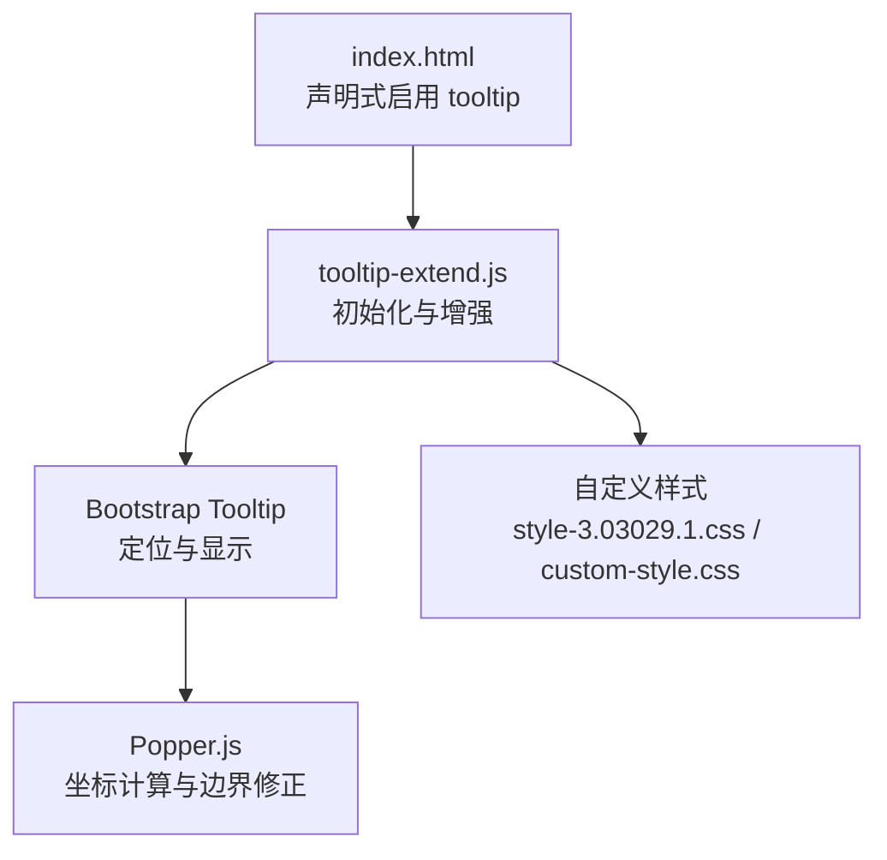
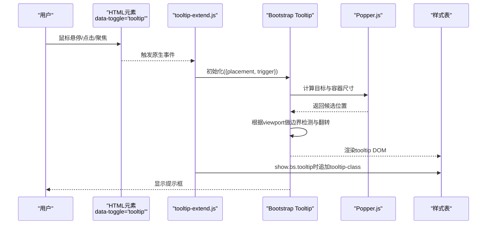
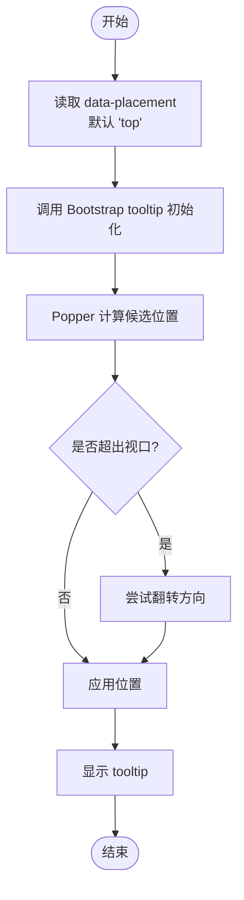
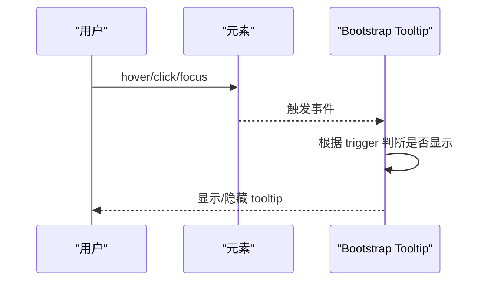
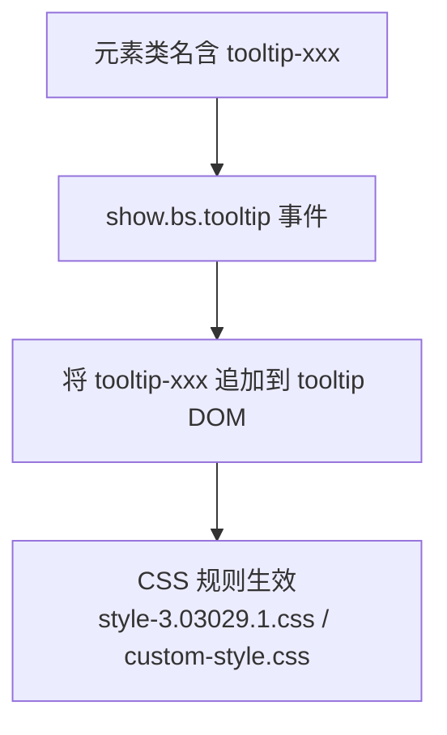
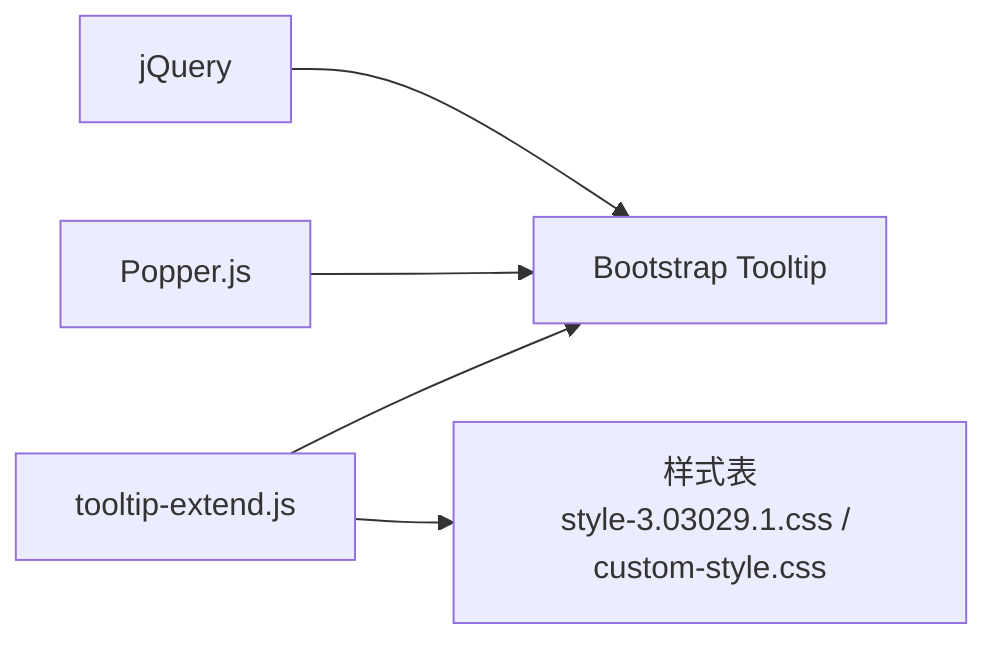

# 提示框扩展功能

<cite>
**本文引用的文件**
- [tooltip-extend.js](file://assets/js/tooltip-extend.js)
- [bootstrap.min-4.3.1.css](file://assets/css/bootstrap.min-4.3.1.css)
- [style-3.03029.1.css](file://assets/css/style-3.03029.1.css)
- [custom-style.css](file://assets/css/custom-style.css)
- [index.html](file://index.html)
</cite>

## 目录
1. [简介](#简介)
2. [项目结构](#项目结构)
3. [核心组件](#核心组件)
4. [架构总览](#架构总览)
5. [详细组件分析](#详细组件分析)
6. [依赖关系分析](#依赖关系分析)
7. [性能考量](#性能考量)
8. [故障排查指南](#故障排查指南)
9. [结论](#结论)
10. [附录：使用示例与最佳实践](#附录使用示例与最佳实践)

## 简介
本文件围绕 assets/js/tooltip-extend.js 中的提示框扩展能力进行系统化说明，重点覆盖以下方面：
- 定位算法与 placement 处理逻辑、动态位置计算、边界检测
- 触发条件控制（hover、click、focus）的实现方式
- 样式定制选项（如 tooltip_class 的自动识别与应用、主题切换支持）
- 与 Bootstrap tooltip 的集成细节（事件绑定、配置参数传递、兼容性处理）
- 使用示例与最佳实践，帮助开发者正确启用和扩展提示框功能

## 项目结构
本项目采用前端资源分层组织：
- 脚本层：assets/js 下包含业务脚本与第三方库。其中 tooltip-extend.js 负责页面级 Tooltip/Popover 初始化与增强。
- 样式层：assets/css 下包含 Bootstrap 基础样式与主题样式，用于定义 tooltip 外观与主题适配。
- 页面层：index.html 通过 data-* 属性声明式启用 tooltip，并指定 placement、trigger、title 等配置。

图表来源
- [tooltip-extend.js:299-321](file://assets/js/tooltip-extend.js#L299-L321)
- [index.html:596-620](file://index.html#L596-L620)
- [bootstrap.min-4.3.1.css:1-200](file://assets/css/bootstrap.min-4.3.1.css#L1-L200)
- [style-3.03029.1.css:286-287](file://assets/css/style-3.03029.1.css#L286-L287)
- [custom-style.css:1-126](file://assets/css/custom-style.css#L1-L126)

章节来源
- [tooltip-extend.js:299-321](file://assets/js/tooltip-extend.js#L299-L321)
- [index.html:596-620](file://index.html#L596-L620)

## 核心组件
- 初始化入口：在文档就绪后遍历所有带 data-toggle="tooltip" 的元素，读取 data-placement、data-trigger 等属性，调用 Bootstrap tooltip 初始化。
- 样式增强：若元素类名匹配 tooltip-[a-z0-9]+，则在 show.bs.tooltip 事件中为生成的 tooltip DOM 追加该类名，实现“按类名自动应用主题样式”的能力。
- 触发控制：默认 trigger 为 hover；可通过 data-trigger 设置为 click、focus 或 manual 等。
- 定位策略：placement 默认 top；可设置为 bottom、left、right 等；实际定位由 Bootstrap + Popper 完成，具备自动翻转与边界检测能力。

章节来源
- [tooltip-extend.js:299-321](file://assets/js/tooltip-extend.js#L299-L321)

## 架构总览
下图展示了从用户交互到提示框显示的完整流程，包括事件绑定、配置解析、Bootstrap 初始化、样式注入以及定位计算。

图表来源
- [tooltip-extend.js:299-321](file://assets/js/tooltip-extend.js#L299-L321)
- [bootstrap.min-4.3.1.css:1-200](file://assets/css/bootstrap.min-4.3.1.css#L1-L200)
- [style-3.03029.1.css:286-287](file://assets/css/style-3.03029.1.css#L286-L287)

## 详细组件分析

### 定位算法与 placement 处理
- placement 解析：从 data-placement 读取，未设置时默认 top。
- 动态位置计算：由 Bootstrap 内部基于 Popper 完成，会根据目标元素与视口大小计算最优位置。
- 边界检测与翻转：当提示框可能溢出视口时，会自动尝试翻转方向（如 top→bottom、left→right），确保始终可见。
- 容器与偏移：可通过 Bootstrap 的 container、offset、boundary 等选项进一步调整（本扩展未强制覆盖，遵循 Bootstrap 默认行为）。

图表来源
- [tooltip-extend.js:299-321](file://assets/js/tooltip-extend.js#L299-L321)

章节来源
- [tooltip-extend.js:299-321](file://assets/js/tooltip-extend.js#L299-L321)

### 触发条件控制机制
- 默认触发：hover（鼠标悬停即显示）。
- 其他触发：可通过 data-trigger 设置为 click、focus、manual。
- 事件绑定：由 Bootstrap tooltip 内部根据 trigger 值绑定 mouseenter/mouseleave 或 focusin/focusout 等事件。
- 手动控制：当 trigger 为 manual 时，需通过 API 显式 show/hide。

图表来源
- [tooltip-extend.js:299-321](file://assets/js/tooltip-extend.js#L299-L321)

章节来源
- [tooltip-extend.js:299-321](file://assets/js/tooltip-extend.js#L299-L321)

### 样式定制与主题切换
- 自动识别 tooltip_class：若元素类名匹配 tooltip-[a-z0-9]+，则在 show.bs.tooltip 事件中将该类名添加到生成的 tooltip DOM 上，从而实现“按类名应用主题样式”。
- 主题样式：可在 style-3.03029.1.css 中定义 .tooltip-inner 等选择器以统一风格；也可在 custom-style.css 中进行全局覆盖。
- 主题切换：通过切换父容器或 body 的主题类（例如深色模式），配合 CSS 变量或选择器即可实现 tooltip 主题联动。

图表来源
- [tooltip-extend.js:309-319](file://assets/js/tooltip-extend.js#L309-L319)
- [style-3.03029.1.css:286-287](file://assets/css/style-3.03029.1.css#L286-L287)
- [custom-style.css:1-126](file://assets/css/custom-style.css#L1-L126)

章节来源
- [tooltip-extend.js:309-319](file://assets/js/tooltip-extend.js#L309-L319)
- [style-3.03029.1.css:286-287](file://assets/css/style-3.03029.1.css#L286-L287)
- [custom-style.css:1-126](file://assets/css/custom-style.css#L1-L126)

### 与 Bootstrap tooltip 的集成
- 事件绑定：通过 data-toggle="tooltip" 声明式启用，tooltip-extend.js 在 document ready 时统一初始化。
- 配置参数传递：
  - placement：来自 data-placement，默认 top。
  - trigger：来自 data-trigger，默认 hover。
  - title：来自 data-original-title 或 title 属性。
- 兼容性处理：
  - 兼容移动端：部分场景下会针对移动端调整触发方式（如仅在 PC 上启用 hover）。
  - 兼容动态内容：对 AJAX 加载的内容，需在插入 DOM 后重新初始化 tooltip。
  - 兼容主题：通过 show.bs.tooltip 事件注入类名，避免与 Bootstrap 默认样式冲突。

章节来源
- [tooltip-extend.js:299-321](file://assets/js/tooltip-extend.js#L299-L321)
- [index.html:596-620](file://index.html#L596-L620)

## 依赖关系分析
- 外部依赖：
  - jQuery：事件与 DOM 操作基础。
  - Bootstrap Tooltip：提供 tooltip 的核心能力（初始化、事件、API）。
  - Popper.js：提供高性能的定位与边界检测。
- 内部依赖：
  - tooltip-extend.js：封装初始化与样式增强逻辑。
  - 样式表：定义 tooltip 外观与主题适配。

图表来源
- [tooltip-extend.js:299-321](file://assets/js/tooltip-extend.js#L299-L321)
- [bootstrap.min-4.3.1.css:1-200](file://assets/css/bootstrap.min-4.3.1.css#L1-L200)
- [style-3.03029.1.css:286-287](file://assets/css/style-3.03029.1.css#L286-L287)
- [custom-style.css:1-126](file://assets/css/custom-style.css#L1-L126)

章节来源
- [tooltip-extend.js:299-321](file://assets/js/tooltip-extend.js#L299-L321)

## 性能考量
- 批量初始化：在 document ready 时一次性遍历并初始化所有 tooltip，减少重复开销。
- 事件委托：对于动态插入的元素，建议采用事件委托或在插入后按需初始化，避免全量重算。
- 样式合并：通过类名注入而非内联样式，利于浏览器缓存与复用。
- 定位优化：Popper 已内置高效定位与边界检测，通常无需额外干预；如需频繁更新，可使用 update API。

## 故障排查指南
- 提示框不显示：
  - 检查是否正确引入 jQuery、Bootstrap Tooltip 与 Popper。
  - 确认元素包含 data-toggle="tooltip" 且设置了 title 或 data-original-title。
  - 检查 trigger 是否为 manual，若是则需手动调用 show。
- 定位异常或被遮挡：
  - 检查父容器是否有 overflow:hidden 或 transform 影响定位上下文。
  - 必要时设置 container 或 boundary 选项以限定计算范围。
- 样式未生效：
  - 确认 show.bs.tooltip 事件是否成功追加了 tooltip-xxx 类名。
  - 检查 CSS 选择器优先级与主题切换逻辑。
- 移动端体验不佳：
  - 将 trigger 改为 click 或 focus，避免 hover 在触摸设备上不可用。

章节来源
- [tooltip-extend.js:299-321](file://assets/js/tooltip-extend.js#L299-L321)
- [style-3.03029.1.css:286-287](file://assets/css/style-3.03029.1.css#L286-L287)

## 结论
tooltip-extend.js 通过对 Bootstrap tooltip 的轻量封装，实现了：
- 声明式启用与配置（placement、trigger、title）
- 自动样式注入（tooltip_class 识别与追加）
- 可靠的定位与边界检测（依托 Popper）
- 良好的主题与兼容性支持
结合 index.html 中的数据属性用法，开发者可以便捷地在项目中启用高质量、可定制的提示框功能。

## 附录：使用示例与最佳实践
- 基本用法（悬停显示）：
  - 在 HTML 元素上添加 data-toggle="tooltip"、data-placement="bottom"、data-original-title="提示文本"。
  - 由 tooltip-extend.js 自动初始化，默认 hover 触发。
- 点击触发：
  - 设置 data-trigger="click"，适用于移动端或需要明确交互的场景。
- 焦点触发：
  - 设置 data-trigger="focus"，适用于表单控件的可访问性提升。
- 主题定制：
  - 为元素添加 tooltip-xxx 类名，并在 CSS 中定义对应样式；show.bs.tooltip 事件会自动将其应用到 tooltip DOM。
- 动态内容：
  - 在 AJAX 插入新元素后，重新初始化这些元素的 tooltip。
- 定位优化：
  - 若出现遮挡，可设置 container 或 boundary 以限制计算范围；必要时使用 flipEnabled 等选项微调。

章节来源
- [index.html:596-620](file://index.html#L596-L620)
- [tooltip-extend.js:299-321](file://assets/js/tooltip-extend.js#L299-L321)
- [style-3.03029.1.css:286-287](file://assets/css/style-3.03029.1.css#L286-L287)