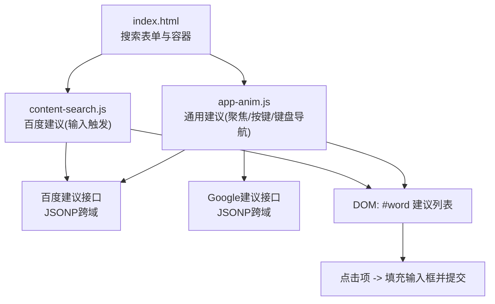
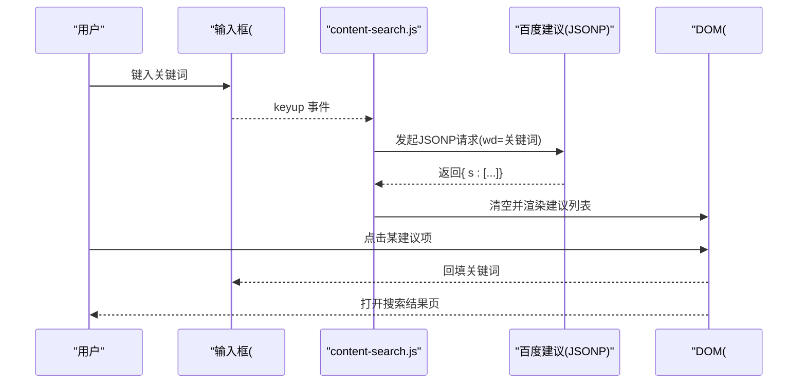
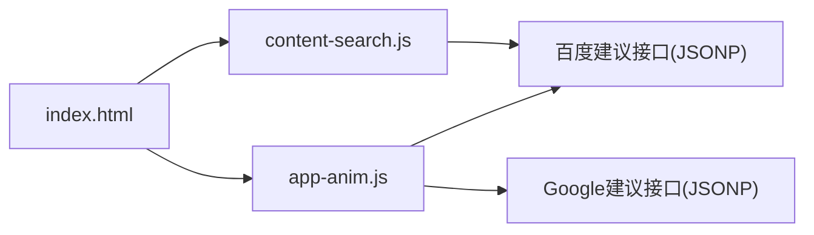

# 搜索功能模块

<cite>
**本文引用的文件**
- [content-search.js](file://assets/js/content-search.js)
- [index.html](file://index.html)
- [app-anim.js](file://assets/js/app-anim.js)
</cite>

## 目录
1. [简介](#简介)
2. [项目结构](#项目结构)
3. [核心组件](#核心组件)
4. [架构总览](#架构总览)
5. [详细组件分析](#详细组件分析)
6. [依赖关系分析](#依赖关系分析)
7. [性能考量](#性能考量)
8. [故障排查指南](#故障排查指南)
9. [结论](#结论)
10. [附录：API调用示例与配置选项](#附录api调用示例与配置选项)

## 简介
本模块实现网站全局搜索建议功能，核心基于百度智能提示接口（JSONP）提供关键词联想。用户在输入框键入内容时，前端通过异步请求获取建议列表并渲染为下拉菜单；支持点击选择、键盘上下导航、失焦隐藏等交互。同时，页面还集成了多搜索引擎跳转逻辑，便于用户快速切换目标站点进行搜索。

## 项目结构
- 入口页面 index.html 中定义了搜索表单、建议列表容器以及各搜索引擎的跳转地址。
- content-search.js 监听输入事件，调用百度建议接口，渲染建议列表并处理点击行为。
- app-anim.js 提供了更通用的搜索建议能力（含 Google/百度双源），包含键盘导航、焦点管理、动画显示/隐藏等。

图表来源
- [index.html:351-570](file://index.html#L351-L570)
- [content-search.js:5-73](file://assets/js/content-search.js#L5-L73)
- [app-anim.js:859-996](file://assets/js/app-anim.js#L859-L996)

章节来源
- [index.html:351-570](file://index.html#L351-L570)
- [content-search.js:1-91](file://assets/js/content-search.js#L1-L91)
- [app-anim.js:859-996](file://assets/js/app-anim.js#L859-L996)

## 核心组件
- 输入监听与请求触发：在输入框 keyup 事件中读取关键词，发起 JSONP 请求。
- 数据渲染：将返回的建议数组逐项插入到建议列表中，并对前几名做高亮样式处理。
- 交互处理：点击建议项回填输入框并触发搜索提交；点击遮罩或空白区域关闭建议列表。
- 键盘导航：支持上下键移动高亮项并回填输入框（由通用逻辑实现）。
- 错误处理：网络异常或无结果时清空并隐藏建议列表。

章节来源
- [content-search.js:5-73](file://assets/js/content-search.js#L5-L73)
- [content-search.js:76-88](file://assets/js/content-search.js#L76-L88)
- [app-anim.js:936-996](file://assets/js/app-anim.js#L936-L996)

## 架构总览
搜索建议采用“事件驱动 + JSONP 异步请求 + DOM 渲染”的轻量架构。输入事件作为触发点，跨域通过 JSONP 获取建议数据，成功后更新 UI；失败则清理状态。通用层负责键盘导航、焦点管理与动画展示，增强可访问性与用户体验。

图表来源
- [content-search.js:5-73](file://assets/js/content-search.js#L5-L73)
- [content-search.js:76-83](file://assets/js/content-search.js#L76-L83)
- [index.html:351-570](file://index.html#L351-L570)

## 详细组件分析

### 百度 API 集成（JSONP 跨域）
- 请求方式：使用 jQuery.ajax 指定 dataType 为 jsonp，jsonp 参数名为 cb，向百度建议接口发送跨域请求。
- 数据格式：成功回调接收对象，其中建议数组位于 s 字段。
- 错误处理：error 回调中清空并隐藏建议列表，避免残留 UI。

章节来源
- [content-search.js:8-12](file://assets/js/content-search.js#L8-L12)
- [content-search.js:16-71](file://assets/js/content-search.js#L16-L71)

### 搜索建议算法（匹配、排序、缓存）
- 关键词匹配：由服务端完成，前端仅消费返回结果。
- 结果排序：直接按接口返回顺序渲染，未在前端进行二次排序。
- 缓存策略：当前实现未包含本地缓存；每次输入都会触发新请求。

章节来源
- [content-search.js:16-55](file://assets/js/content-search.js#L16-L55)

### 用户界面交互设计
- 下拉建议列表展示：根据返回长度动态创建 li 元素，对前三名设置不同背景色以突出热门词。
- 键盘导航支持：通过通用逻辑实现上下键移动高亮项并回填输入框（focus/keyup/keyDown 事件）。
- 鼠标事件处理：点击建议项回填输入框并触发搜索；点击遮罩或灰色模式区域关闭建议列表。

章节来源
- [content-search.js:18-55](file://assets/js/content-search.js#L18-L55)
- [content-search.js:76-88](file://assets/js/content-search.js#L76-L88)
- [app-anim.js:936-996](file://assets/js/app-anim.js#L936-L996)

### 搜索提交流程
- 表单 action 指向所选搜索引擎的查询 URL，提交时将输入值拼接至 URL 并在新窗口打开。
- 点击建议项后同样会回填输入框并触发提交逻辑。

章节来源
- [index.html:351-355](file://index.html#L351-L355)
- [index.html:357-570](file://index.html#L357-L570)
- [app-anim.js:859-867](file://assets/js/app-anim.js#L859-L867)

## 依赖关系分析
- 页面依赖 jQuery 与 Bootstrap 等基础库。
- content-search.js 依赖 index.html 中的 #search-text 与 #word 节点。
- app-anim.js 提供通用搜索建议能力，与 content-search.js 并行存在，分别服务于不同场景或版本。

图表来源
- [index.html:30-31](file://index.html#L30-L31)
- [content-search.js:8-12](file://assets/js/content-search.js#L8-L12)
- [app-anim.js:868-931](file://assets/js/app-anim.js#L868-L931)

章节来源
- [index.html:30-31](file://index.html#L30-L31)
- [content-search.js:8-12](file://assets/js/content-search.js#L8-L12)
- [app-anim.js:868-931](file://assets/js/app-anim.js#L868-L931)

## 性能考量
- 请求去重：当前未实现相同关键词的去重机制，频繁输入可能产生重复请求。
- 防抖处理：未对 keyup 事件进行防抖，建议在高频输入场景加入节流/防抖以减少请求次数。
- 内存管理：每次成功回调会清空并重建列表，避免 DOM 累积；但缺少对历史数据的缓存，可能增加网络开销。
- 渲染优化：对每个 li 绑定 click 事件，若建议数量较大，建议使用事件委托以提升性能。

[本节为通用性能建议，不直接分析具体代码]

## 故障排查指南
- 接口不可用或跨域失败：检查 error 回调是否执行，确认网络连通与 CORS/JSONP 配置。
- 建议列表不显示：确认 #word 容器是否存在且可见；检查 success 回调是否正确渲染。
- 点击无效：确认建议项的点击事件已绑定；检查是否有其他事件阻止冒泡。
- 键盘导航异常：确认 focus/keyup/keyDown 事件已正确注册；检查 listIndex 与 tipsList 变量状态。

章节来源
- [content-search.js:67-71](file://assets/js/content-search.js#L67-L71)
- [content-search.js:76-88](file://assets/js/content-search.js#L76-L88)
- [app-anim.js:936-996](file://assets/js/app-anim.js#L936-L996)

## 结论
该搜索建议模块以简洁的事件驱动与 JSONP 跨域方案实现了基础的关键词联想功能，具备清晰的 UI 交互与错误处理。当前实现未包含缓存与防抖等优化，建议在高频输入场景下引入防抖与本地缓存，并通过事件委托优化大量 DOM 操作，从而提升整体性能与稳定性。

[本节为总结性内容，不直接分析具体代码]

## 附录：API调用示例与配置选项
- 百度建议接口
  - 类型：JSONP
  - 参数：wd（关键词）、cb（回调函数名）
  - 返回：对象中包含 s 数组（建议列表）
  - 参考路径：[content-search.js:8-12](file://assets/js/content-search.js#L8-L12)、[content-search.js:16-55](file://assets/js/content-search.js#L16-L55)
- Google 建议接口（通用逻辑）
  - 类型：JSONP
  - 参数：q（关键词）、callback（回调函数名）
  - 返回：数组结构，建议列表位于索引 1
  - 参考路径：[app-anim.js:868-899](file://assets/js/app-anim.js#L868-L899)
- 自定义配置选项
  - theme.hotWords：用于切换建议源（baidu/google），影响通用逻辑的请求源选择。
  - 参考路径：[app-anim.js:944-952](file://assets/js/app-anim.js#L944-L952)
- 搜索跳转配置
  - 表单 action 与多个搜索引擎的查询 URL 在页面中定义，支持切换不同目标站点。
  - 参考路径：[index.html:351-570](file://index.html#L351-L570)

章节来源
- [content-search.js:8-12](file://assets/js/content-search.js#L8-L12)
- [content-search.js:16-55](file://assets/js/content-search.js#L16-L55)
- [app-anim.js:868-899](file://assets/js/app-anim.js#L868-L899)
- [app-anim.js:944-952](file://assets/js/app-anim.js#L944-L952)
- [index.html:351-570](file://index.html#L351-L570)