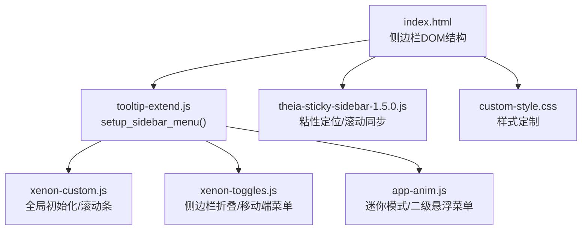
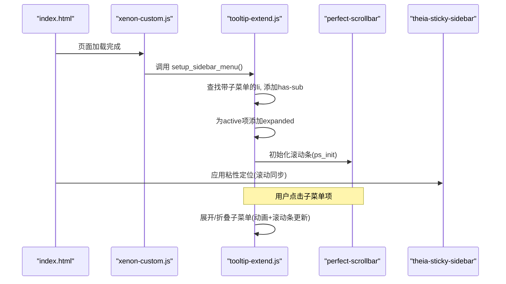
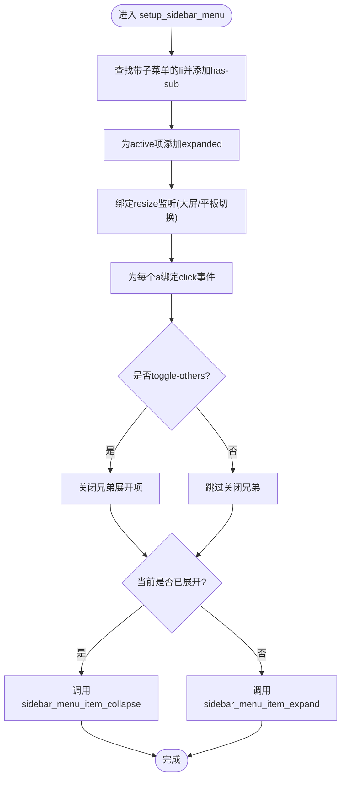
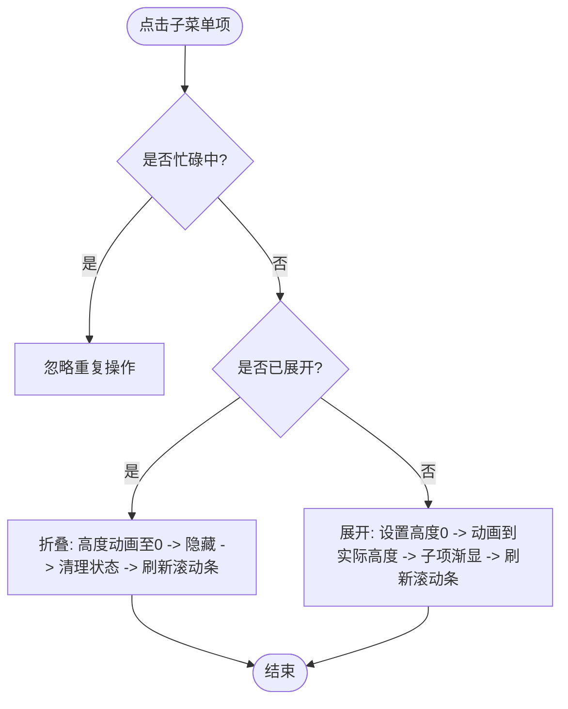
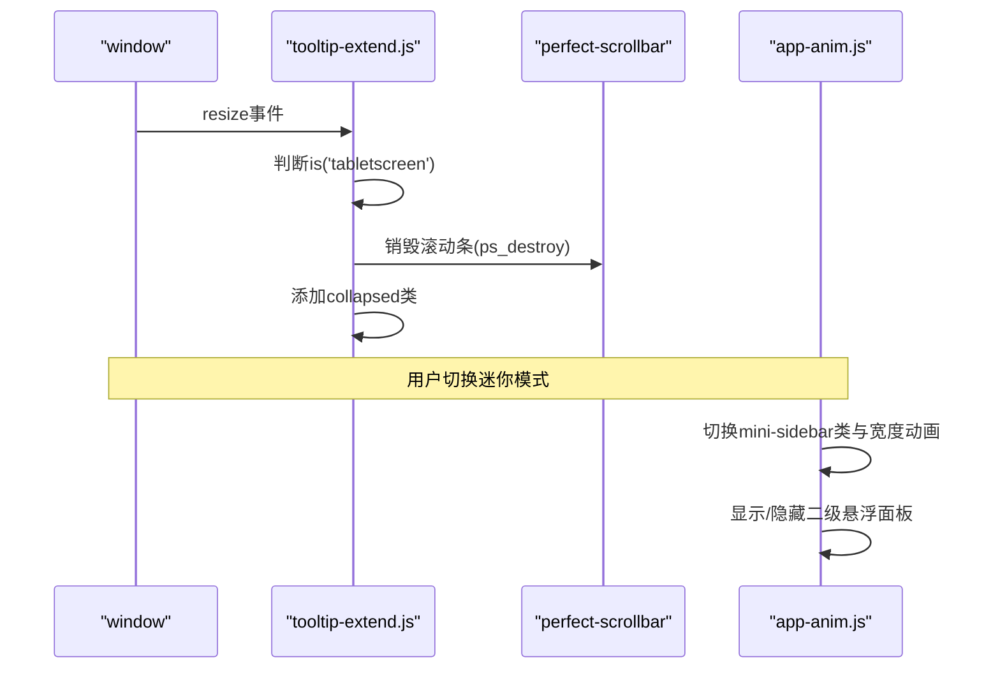
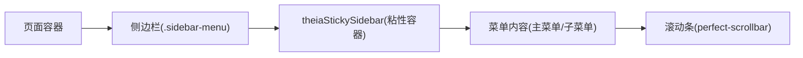
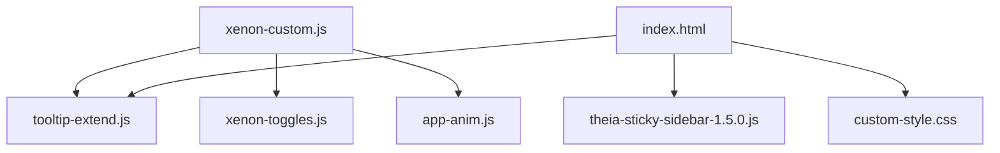

# 侧边栏菜单系统

<cite>
**本文引用的文件**
- [index.html](file://index.html)
- [tooltip-extend.js](file://assets/js/tooltip-extend.js)
- [xenon-custom.js](file://assets/js/xenon-custom.js)
- [xenon-toggles.js](file://assets/js/xenon-toggles.js)
- [app-anim.js](file://assets/js/app-anim.js)
- [theia-sticky-sidebar-1.5.0.js](file://assets/js/theia-sticky-sidebar-1.5.0.js)
- [custom-style.css](file://assets/css/custom-style.css)
</cite>

## 目录
1. [简介](#简介)
2. [项目结构](#项目结构)
3. [核心组件](#核心组件)
4. [架构总览](#架构总览)
5. [详细组件分析](#详细组件分析)
6. [依赖关系分析](#依赖关系分析)
7. [性能考量](#性能考量)
8. [故障排查指南](#故障排查指南)
9. [结论](#结论)
10. [附录：扩展指南](#附录扩展指南)

## 简介
本文件围绕侧边栏菜单系统的实现进行深入技术文档化，重点解析 setup_sidebar_menu 函数的初始化流程、子菜单展开与折叠逻辑、响应式适配机制、事件处理（点击、键盘、触摸）、状态管理（激活项高亮、展开状态保持、本地存储持久化）以及与页面布局的集成（固定定位、滚动同步、高度自适应）。同时提供扩展指南，帮助开发者添加新菜单项和自定义交互行为。

## 项目结构
- 入口页面 index.html 定义了侧边栏 DOM 结构与菜单项，包含多级菜单与底部工具区。
- JavaScript 层：
  - tooltip-extend.js：定义并执行 setup_sidebar_menu，负责子菜单展开/折叠、响应式折叠、滚动条初始化等。
  - xenon-custom.js：全局初始化，调用 setup_sidebar_menu 与水平菜单初始化，并统一初始化滚动条。
  - xenon-toggles.js：处理侧边栏折叠开关、移动端菜单显示等切换逻辑。
  - app-anim.js：处理迷你侧边栏模式下的二级悬浮菜单、动画过渡与交互。
  - theia-sticky-sidebar-1.5.0.js：实现侧边栏“粘性”固定定位与滚动同步。
- CSS 层：
  - custom-style.css：对侧边栏弹出面板宽度、滚动条隐藏、二级菜单缩进等进行样式定制。

图表来源
- [index.html:42-216](file://index.html#L42-L216)
- [tooltip-extend.js:449-493](file://assets/js/tooltip-extend.js#L449-L493)
- [xenon-custom.js:59-64](file://assets/js/xenon-custom.js#L59-L64)
- [xenon-toggles.js:111-132](file://assets/js/xenon-toggles.js#L111-L132)
- [app-anim.js:349-426](file://assets/js/app-anim.js#L349-L426)
- [theia-sticky-sidebar-1.5.0.js:152-178](file://assets/js/theia-sticky-sidebar-1.5.0.js#L152-L178)
- [custom-style.css:4-10](file://assets/css/custom-style.css#L4-L10)

章节来源
- [index.html:42-216](file://index.html#L42-L216)
- [tooltip-extend.js:449-493](file://assets/js/tooltip-extend.js#L449-L493)
- [xenon-custom.js:59-64](file://assets/js/xenon-custom.js#L59-L64)
- [xenon-toggles.js:111-132](file://assets/js/xenon-toggles.js#L111-L132)
- [app-anim.js:349-426](file://assets/js/app-anim.js#L349-L426)
- [theia-sticky-sidebar-1.5.0.js:152-178](file://assets/js/theia-sticky-sidebar-1.5.0.js#L152-L178)
- [custom-style.css:4-10](file://assets/css/custom-style.css#L4-L10)

## 核心组件
- setup_sidebar_menu：侧边栏菜单初始化函数，负责：
  - 查找带子菜单的 li 节点，为它们添加 has-sub 类；
  - 将当前 active 的子菜单项标记为 expanded；
  - 在较大屏幕时监听窗口 resize，根据断点自动折叠/展开侧边栏；
  - 为每个带子菜单的 a 绑定 click 事件，支持 toggle-others 互斥展开；
  - 调用展开/折叠函数完成动画与滚动条更新。
- 展开/折叠函数：
  - sidebar_menu_item_expand：展开子菜单（含动画与滚动条更新）；
  - sidebar_menu_item_collapse：折叠子菜单（清理状态与滚动条更新）；
  - sidebar_menu_close_items_siblings：关闭兄弟展开项（互斥模式）。
- 滚动条与粘性定位：
  - perfectScrollbar 初始化与销毁；
  - theia-sticky-sidebar 实现侧边栏粘性固定与滚动同步。
- 切换与移动端：
  - 侧边栏折叠按钮切换 collapsed 类，触发滚动条重建；
  - 移动端菜单显示/隐藏与横向菜单切换。

章节来源
- [tooltip-extend.js:449-568](file://assets/js/tooltip-extend.js#L449-L568)
- [xenon-custom.js:59-80](file://assets/js/xenon-custom.js#L59-L80)
- [xenon-toggles.js:111-132](file://assets/js/xenon-toggles.js#L111-L132)
- [theia-sticky-sidebar-1.5.0.js:152-178](file://assets/js/theia-sticky-sidebar-1.5.0.js#L152-L178)

## 架构总览
下图展示了从页面加载到侧边栏菜单可用的关键调用链与数据流：

图表来源
- [xenon-custom.js:59-80](file://assets/js/xenon-custom.js#L59-L80)
- [tooltip-extend.js:449-493](file://assets/js/tooltip-extend.js#L449-L493)
- [theia-sticky-sidebar-1.5.0.js:152-178](file://assets/js/theia-sticky-sidebar-1.5.0.js#L152-L178)

## 详细组件分析

### setup_sidebar_menu 初始化过程
- 查找所有包含 ul 子节点的 li，为其添加 has-sub 类以便样式识别；
- 若存在 .active 的子菜单项，则自动添加 expanded 类以展开；
- 在大屏模式下监听窗口 resize，当进入平板尺寸时折叠侧边栏并销毁滚动条，回到大屏时恢复；
- 遍历每个带子菜单的 a 元素，绑定 click 事件：
  - 阻止默认跳转；
  - 若配置了 toggle-others，先关闭其他展开项；
  - 根据当前是否已展开决定调用展开或折叠函数；
- 展开/折叠过程中通过 TweenMax 进行高度动画，并在完成后更新滚动条。

图表来源
- [tooltip-extend.js:449-493](file://assets/js/tooltip-extend.js#L449-L493)
- [tooltip-extend.js:544-568](file://assets/js/tooltip-extend.js#L544-L568)

章节来源
- [tooltip-extend.js:449-493](file://assets/js/tooltip-extend.js#L449-L493)

### 展开/折叠逻辑与动画
- 展开：
  - 计算子菜单高度，使用 TweenMax 平滑过渡到目标高度；
  - 在动画期间持续调用 ps_update 更新滚动条；
  - 子项依次显示，结束后清理临时类名；
- 折叠：
  - 移除 expanded 与 opened 类；
  - 将子菜单高度动画至 0，完成后隐藏并清理状态；
  - 递归清理嵌套展开项，确保状态一致；
  - 最终调用 ps_update(true) 刷新滚动条。

图表来源
- [tooltip-extend.js:495-568](file://assets/js/tooltip-extend.js#L495-L568)

章节来源
- [tooltip-extend.js:495-568](file://assets/js/tooltip-extend.js#L495-L568)

### 响应式适配机制
- 在大屏模式下，监听窗口 resize：
  - 当进入平板尺寸时，给侧边栏添加 collapsed 类并销毁滚动条；
  - 回到大屏时移除 collapsed 并重新初始化滚动条；
- 迷你模式（app-anim.js）：
  - 通过 mini-button 切换 mini-sidebar 类，控制宽度与动画；
  - 在迷你模式下，二级菜单以悬浮面板形式展示，避免遮挡。

图表来源
- [tooltip-extend.js:457-473](file://assets/js/tooltip-extend.js#L457-L473)
- [app-anim.js:369-426](file://assets/js/app-anim.js#L369-L426)

章节来源
- [tooltip-extend.js:457-473](file://assets/js/tooltip-extend.js#L457-L473)
- [app-anim.js:369-426](file://assets/js/app-anim.js#L369-L426)

### 事件处理机制
- 点击事件：
  - 子菜单项点击阻止默认跳转，依据状态展开/折叠；
  - 支持 toggle-others 互斥展开；
- 键盘导航：
  - 全局 ESC 键用于关闭模态框（非侧边栏专用），未实现专门的侧边栏键盘导航；
- 触摸手势：
  - 未直接实现触摸手势处理，但移动端通过迷你模式与悬浮面板提升触控体验；
  - 可结合第三方库（如 jQuery UI Touch Punch）增强触摸支持。

章节来源
- [tooltip-extend.js:474-493](file://assets/js/tooltip-extend.js#L474-L493)
- [xenon-custom.js:236-246](file://assets/js/xenon-custom.js#L236-L246)
- [app-anim.js:409-426](file://assets/js/app-anim.js#L409-L426)

### 菜单状态管理
- 当前激活项高亮：
  - 通过 .active 类标识当前激活项，并在初始化时将其子菜单展开（expanded）；
- 子菜单展开状态保持：
  - 展开/折叠通过 class 切换（expanded/opened）与高度动画维持视觉状态；
  - 折叠时会递归清理嵌套展开项，保证状态一致性；
- 本地存储持久化：
  - 本项目未在侧边栏模块中使用 localStorage/sessionStorage 持久化菜单状态；
  - 搜索与列表相关功能使用了本地存储，但与侧边栏菜单无关。

章节来源
- [tooltip-extend.js:453-456](file://assets/js/tooltip-extend.js#L453-L456)
- [tooltip-extend.js:544-568](file://assets/js/tooltip-extend.js#L544-L568)
- [app-anim.js:599-604](file://assets/js/app-anim.js#L599-L604)

### 与页面布局的集成
- 固定定位与滚动同步：
  - theia-sticky-sidebar 将侧边栏内容包裹为粘性容器，随页面滚动保持可见；
  - 在滚动过程中计算偏移量，确保顶部与底部留白正确；
- 高度自适应：
  - 子菜单展开/折叠通过高度动画实现自适应；
  - 滚动条在动画过程中实时更新，避免错位；
- 样式定制：
  - custom-style.css 调整二级菜单弹出面板宽度、隐藏滚动条、缩进等。

图表来源
- [theia-sticky-sidebar-1.5.0.js:105-121](file://assets/js/theia-sticky-sidebar-1.5.0.js#L105-L121)
- [theia-sticky-sidebar-1.5.0.js:152-178](file://assets/js/theia-sticky-sidebar-1.5.0.js#L152-L178)
- [custom-style.css:4-10](file://assets/css/custom-style.css#L4-L10)

章节来源
- [theia-sticky-sidebar-1.5.0.js:105-121](file://assets/js/theia-sticky-sidebar-1.5.0.js#L105-L121)
- [theia-sticky-sidebar-1.5.0.js:152-178](file://assets/js/theia-sticky-sidebar-1.5.0.js#L152-L178)
- [custom-style.css:4-10](file://assets/css/custom-style.css#L4-L10)

## 依赖关系分析
- 初始化顺序：
  - xenon-custom.js 在页面就绪后调用 setup_sidebar_menu 与水平菜单初始化；
  - tooltip-extend.js 定义并导出 setup_sidebar_menu；
  - xenon-toggles.js 提供侧边栏折叠与移动端菜单切换；
  - app-anim.js 提供迷你模式与二级悬浮菜单；
  - theia-sticky-sidebar-1.5.0.js 提供粘性定位；
  - custom-style.css 提供样式支持。
- 耦合与内聚：
  - setup_sidebar_menu 与滚动条、动画库（TweenMax/TweenLite）紧密耦合；
  - 响应式逻辑集中在 tooltip-extend.js，便于维护；
  - 迷你模式逻辑独立于主菜单逻辑，降低耦合。

图表来源
- [xenon-custom.js:59-64](file://assets/js/xenon-custom.js#L59-L64)
- [tooltip-extend.js:449-493](file://assets/js/tooltip-extend.js#L449-L493)
- [xenon-toggles.js:111-132](file://assets/js/xenon-toggles.js#L111-L132)
- [app-anim.js:349-426](file://assets/js/app-anim.js#L349-L426)
- [theia-sticky-sidebar-1.5.0.js:152-178](file://assets/js/theia-sticky-sidebar-1.5.0.js#L152-L178)
- [custom-style.css:4-10](file://assets/css/custom-style.css#L4-L10)

章节来源
- [xenon-custom.js:59-64](file://assets/js/xenon-custom.js#L59-L64)
- [tooltip-extend.js:449-493](file://assets/js/tooltip-extend.js#L449-L493)
- [xenon-toggles.js:111-132](file://assets/js/xenon-toggles.js#L111-L132)
- [app-anim.js:349-426](file://assets/js/app-anim.js#L349-L426)
- [theia-sticky-sidebar-1.5.0.js:152-178](file://assets/js/theia-sticky-sidebar-1.5.0.js#L152-L178)
- [custom-style.css:4-10](file://assets/css/custom-style.css#L4-L10)

## 性能考量
- 动画性能：
  - 使用 TweenMax/TweenLite 进行高度动画，减少重排重绘；
  - 在动画过程中调用滚动条更新，避免滚动条错位；
- 滚动性能：
  - perfect-scrollbar 提供高性能滚动体验；
  - 在折叠/展开时及时销毁/重建滚动条，避免内存泄漏；
- 响应式优化：
  - 仅在必要时监听 resize，并使用防抖（debounce）减少频繁计算；
  - 迷你模式减少 DOM 操作，提升移动端性能。

[本节为通用性能建议，不直接分析具体文件]

## 故障排查指南
- 子菜单无法展开：
  - 检查是否有 is-busy 标志导致重复操作被忽略；
  - 确认 has-sub 类是否正确添加；
  - 查看 toggle-others 配置是否导致兄弟项被关闭；
- 滚动条异常：
  - 确认 perfect-scrollbar 是否正确初始化与销毁；
  - 在折叠/展开后调用 ps_update 刷新滚动条；
- 响应式问题：
  - 检查 is('tabletscreen') 与 is('largescreen') 的判断逻辑；
  - 确认 collapsed 类切换与滚动条重建时机；
- 迷你模式异常：
  - 检查 mini-sidebar 类切换与宽度动画；
  - 确认二级悬浮面板显示/隐藏逻辑。

章节来源
- [tooltip-extend.js:495-568](file://assets/js/tooltip-extend.js#L495-L568)
- [xenon-custom.js:75-80](file://assets/js/xenon-custom.js#L75-L80)
- [app-anim.js:369-426](file://assets/js/app-anim.js#L369-L426)

## 结论
该侧边栏菜单系统通过清晰的初始化流程、完善的展开/折叠逻辑、良好的响应式适配以及高效的滚动与粘性定位，提供了稳定且易用的导航体验。尽管当前未实现键盘导航与本地存储持久化，但整体架构易于扩展与维护。开发者可基于现有接口快速添加新菜单项与自定义交互行为。

[本节为总结性内容，不直接分析具体文件]

## 附录：扩展指南
- 添加新菜单项：
  - 在 index.html 的侧边栏结构中新增 li 与 a 节点，如需子菜单，添加 ul 子节点；
  - 确保 a 节点包含必要的图标与文本；
- 自定义交互行为：
  - 在 setup_sidebar_menu 中扩展 click 事件处理逻辑；
  - 可通过 toggle-others 配置控制互斥展开；
  - 如需键盘导航，可在全局 keydown 事件中监听方向键并移动焦点；
- 本地存储持久化：
  - 在展开/折叠时读取/写入 localStorage，保存展开状态；
  - 在页面加载时恢复上次状态；
- 触摸手势增强：
  - 引入 jQuery UI Touch Punch 或其他触摸库，增强移动端手势支持；
- 样式定制：
  - 在 custom-style.css 中调整二级菜单弹出面板宽度、滚动条隐藏等；
  - 根据需要调整缩进与间距。

章节来源
- [index.html:68-184](file://index.html#L68-L184)
- [tooltip-extend.js:474-493](file://assets/js/tooltip-extend.js#L474-L493)
- [custom-style.css:4-10](file://assets/css/custom-style.css#L4-L10)