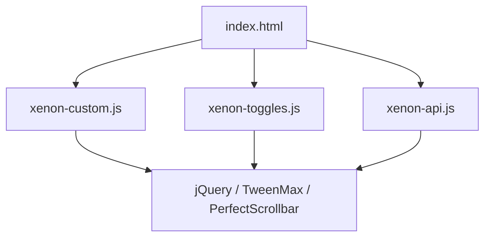
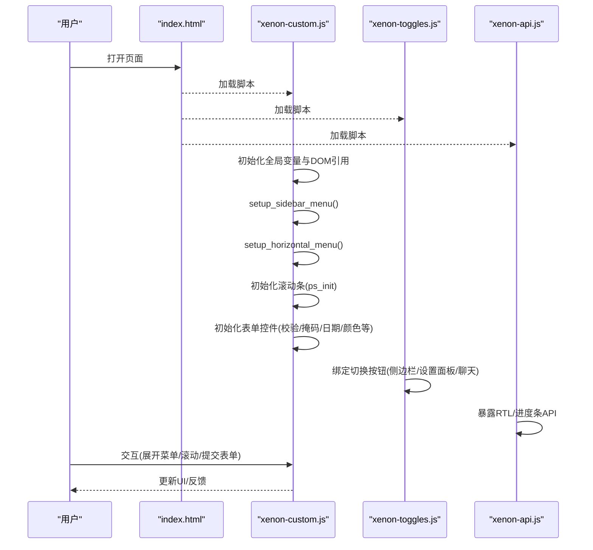
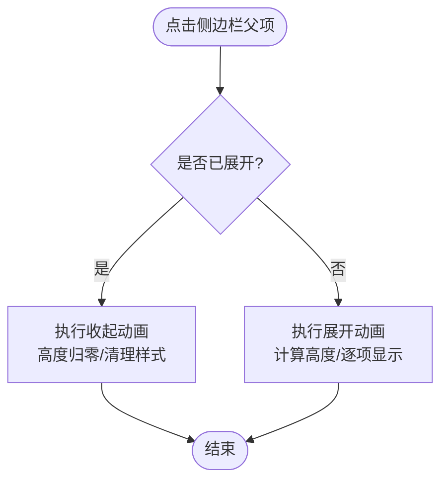
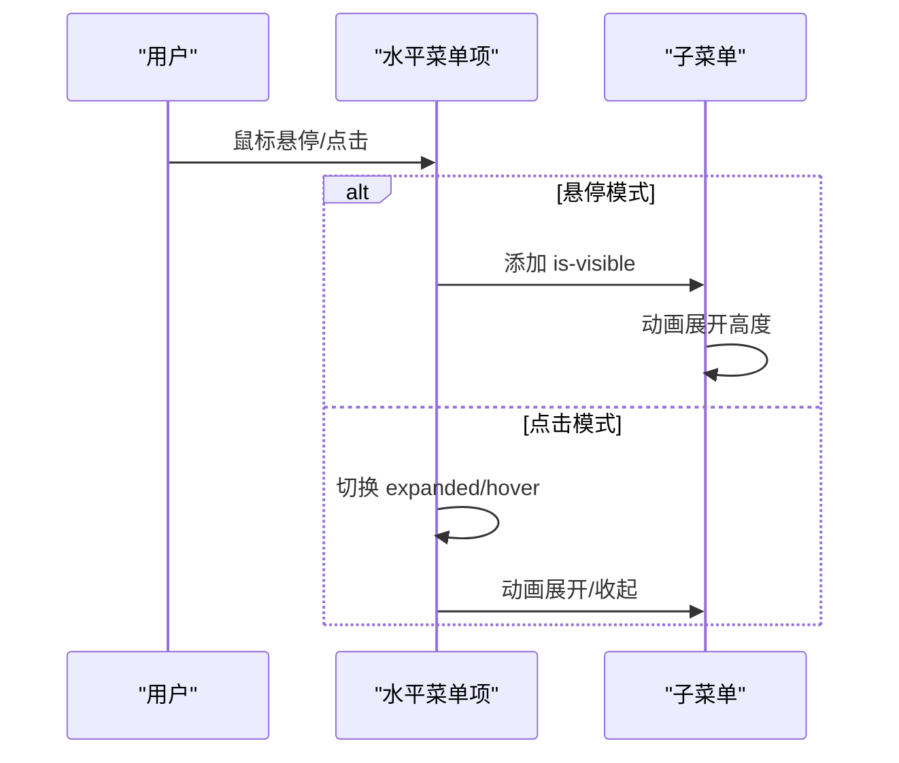
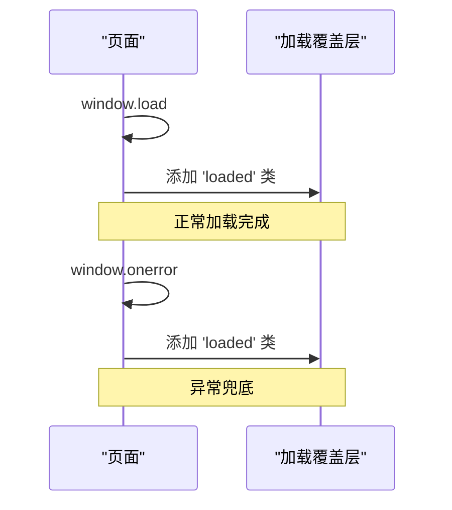
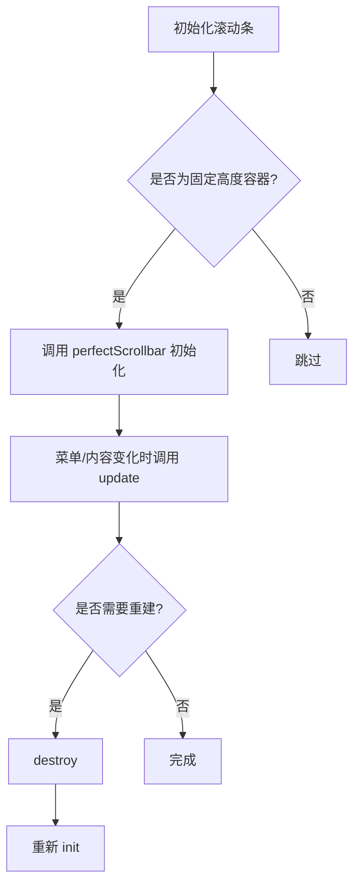
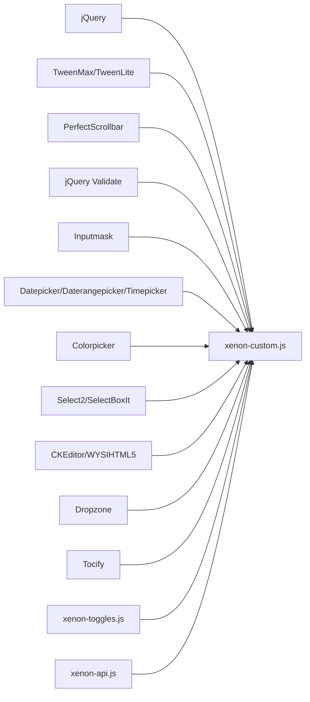

# 核心交互逻辑

<cite>
**本文引用的文件**
- [assets/js/xenon-custom.js](file://assets/js/xenon-custom.js)
- [assets/js/xenon-api.js](file://assets/js/xenon-api.js)
- [assets/js/xenon-toggles.js](file://assets/js/xenon-toggles.js)
- [index.html](file://index.html)
</cite>

## 目录
1. [简介](#简介)
2. [项目结构](#项目结构)
3. [核心组件](#核心组件)
4. [架构总览](#架构总览)
5. [详细组件分析](#详细组件分析)
6. [依赖关系分析](#依赖关系分析)
7. [性能考量](#性能考量)
8. [故障排查指南](#故障排查指南)
9. [结论](#结论)
10. [附录：扩展与定制指南](#附录：扩展与定制指南)

## 简介
本文件聚焦于 xenon 主题的核心交互逻辑，围绕侧边栏菜单设置、水平菜单初始化、页面加载覆盖层处理、滚动条优化、事件处理机制（DOM 绑定/委托/性能优化）、表单验证系统（输入掩码、日期选择器、颜色选择器等）以及响应式设计的 JavaScript 实现进行系统化说明。目标是帮助开发者快速理解并定制交互功能。

## 项目结构
- 入口 HTML 提供页面骨架与资源引用，包含侧边栏、主内容区、顶部导航等结构。
- 核心交互由三个 JS 模块协同完成：
  - xenon-custom.js：全局初始化、菜单、滚动条、表单控件、动画与工具函数。
  - xenon-toggles.js：面板/侧边栏/聊天窗口的切换与动画控制。
  - xenon-api.js：通用 API（RTL 检测、进度条加载器）。

图表来源
- [index.html:1-35](file://index.html#L1-L35)
- [assets/js/xenon-custom.js:1-120](file://assets/js/xenon-custom.js#L1-L120)
- [assets/js/xenon-toggles.js:1-40](file://assets/js/xenon-toggles.js#L1-L40)
- [assets/js/xenon-api.js:1-30](file://assets/js/xenon-api.js#L1-L30)

章节来源
- [index.html:1-35](file://index.html#L1-L35)

## 核心组件
- 全局变量与 DOM 引用：在文档就绪时收集关键节点（body、page-container、sidebar-menu、horizontal-navbar、main-content、footer、settings-pane、loading-overlay 等），供后续模块复用。
- 页面加载覆盖层：监听 window.load 与 window.onerror，统一为覆盖层添加 loaded 类以隐藏加载状态。
- 侧边栏菜单：setup_sidebar_menu 负责子菜单展开/收起、移动端折叠、滚动适配。
- 水平菜单：setup_horizontal_menu 支持点击展开、悬停展开、移动端交互。
- 滚动条优化：基于 perfect-scrollbar 的 ps_init/ps_update/ps_destroy，配合菜单展开/收起与窗口尺寸变化。
- 表单与控件：校验规则、输入掩码、日期/时间/范围选择器、颜色选择器、滑块、富文本编辑器等。
- 响应式与事件：resize 防抖触发自定义事件；键盘事件关闭模态；搜索框焦点交互等。

章节来源
- [assets/js/xenon-custom.js:13-132](file://assets/js/xenon-custom.js#L13-L132)
- [assets/js/xenon-custom.js:1120-1176](file://assets/js/xenon-custom.js#L1120-L1176)
- [assets/js/xenon-custom.js:1279-1429](file://assets/js/xenon-custom.js#L1279-L1429)
- [assets/js/xenon-custom.js:1458-1507](file://assets/js/xenon-custom.js#L1458-L1507)
- [assets/js/xenon-custom.js:578-742](file://assets/js/xenon-custom.js#L578-L742)
- [assets/js/xenon-custom.js:361-573](file://assets/js/xenon-custom.js#L361-L573)
- [assets/js/xenon-custom.js:1107-1116](file://assets/js/xenon-custom.js#L1107-L1116)

## 架构总览
整体采用“初始化 + 模块化”模式：
- 初始化阶段：收集 DOM、注册全局事件、启动各子系统（菜单、滚动条、表单控件）。
- 交互阶段：通过事件委托与动画库驱动 UI 变化（展开/收起、滚动、遮罩）。
- 工具阶段：提供 RTL、进度条、日期格式化等通用能力。

图表来源
- [assets/js/xenon-custom.js:13-132](file://assets/js/xenon-custom.js#L13-L132)
- [assets/js/xenon-toggles.js:15-107](file://assets/js/xenon-toggles.js#L15-L107)
- [assets/js/xenon-api.js:20-91](file://assets/js/xenon-api.js#L20-L91)

## 详细组件分析

### 侧边栏菜单设置（setup_sidebar_menu）
- 目标：为带子菜单的项添加交互，支持“仅展开一个”或“多开”模式，并在大屏/小屏间自适应折叠。
- 关键点：
  - 为含 ul 的 li 添加 has-sub 标记。
  - 点击父级 a 阻止默认跳转，根据当前状态调用展开/收起。
  - 若启用“toggle-others”，先关闭兄弟展开项。
  - 展开时使用动画高度增长，子项依次显示；收起时高度归零并清理样式。
  - 监听窗口 resize，在小屏自动折叠并销毁滚动条实例，在大屏恢复。

图表来源
- [assets/js/xenon-custom.js:1120-1176](file://assets/js/xenon-custom.js#L1120-L1176)
- [assets/js/xenon-custom.js:1178-1265](file://assets/js/xenon-custom.js#L1178-L1265)

章节来源
- [assets/js/xenon-custom.js:1120-1176](file://assets/js/xenon-custom.js#L1120-L1176)
- [assets/js/xenon-custom.js:1178-1265](file://assets/js/xenon-custom.js#L1178-L1265)

### 水平菜单初始化（setup_horizontal_menu）
- 目标：为顶部导航的子菜单提供交互，支持“点击展开”和“悬停展开”两种模式，并兼容移动端。
- 关键点：
  - 为含 ul 的 li 添加 has-sub 标记。
  - 移动端：点击父级 a 展开/收起子菜单，同时可关闭其他同级展开项。
  - 桌面端：
    - 点击展开：根级菜单项点击切换 hover 状态；子菜单通过动画高度展开/收起。
    - 悬停展开：使用 hoverIntent 提升体验，避免误触。
  - 展开/收起过程中对兄弟菜单进行清理，保证视觉一致性。

图表来源
- [assets/js/xenon-custom.js:1279-1429](file://assets/js/xenon-custom.js#L1279-L1429)

章节来源
- [assets/js/xenon-custom.js:1279-1429](file://assets/js/xenon-custom.js#L1279-L1429)

### 页面加载覆盖层处理
- 目标：在页面资源加载完成后隐藏覆盖层，并提供错误兜底。
- 关键点：
  - 监听 window.load，为覆盖层添加 loaded 类。
  - 捕获 window.onerror，确保异常情况下也能移除覆盖层。
  - 提供 show_loading_bar/hide_loading_bar 接口用于异步任务期间的进度提示。

图表来源
- [assets/js/xenon-custom.js:43-56](file://assets/js/xenon-custom.js#L43-L56)
- [assets/js/xenon-api.js:20-91](file://assets/js/xenon-api.js#L20-L91)

章节来源
- [assets/js/xenon-custom.js:43-56](file://assets/js/xenon-custom.js#L43-L56)
- [assets/js/xenon-api.js:20-91](file://assets/js/xenon-api.js#L20-L91)

### 滚动条优化（Perfect Scrollbar）
- 目标：为固定高度的容器提供平滑滚动，避免原生滚动条影响布局与动画。
- 关键点：
  - 初始化：检测 .fixed 的侧边栏与 .ps-scrollbar 元素，调用 perfectScrollbar 配置 wheelPropagation。
  - 动态更新：菜单展开/收起后调用 ps_update 刷新滚动区域；必要时销毁再重建以修复尺寸问题。
  - 移动端：isxs() 条件下跳过初始化，避免不必要的开销。

图表来源
- [assets/js/xenon-custom.js:75-132](file://assets/js/xenon-custom.js#L75-L132)
- [assets/js/xenon-custom.js:1458-1507](file://assets/js/xenon-custom.js#L1458-L1507)

章节来源
- [assets/js/xenon-custom.js:75-132](file://assets/js/xenon-custom.js#L75-L132)
- [assets/js/xenon-custom.js:1458-1507](file://assets/js/xenon-custom.js#L1458-L1507)

### 事件处理机制与设计模式
- DOM 元素绑定：
  - 直接绑定：如搜索框的 focus/blur、数字步进器的 click。
  - 事件委托：如 body 上对 .panel[data-toggle="remove/reload/panel"] 的委托，减少重复绑定。
- 性能优化策略：
  - 窗口 resize 防抖：使用 setTimeout 合并多次触发，降低重排重绘成本。
  - 条件初始化：仅在插件可用时初始化（如 $.fn.perfectScrollbar/$.fn.validate）。
  - 动画节流：展开/收起使用 TweenMax/TweenLite 控制过渡时长与回调，避免频繁 DOM 操作。
- 键盘与无障碍：
  - ESC 键关闭模态框，提升可访问性。

章节来源
- [assets/js/xenon-custom.js:170-181](file://assets/js/xenon-custom.js#L170-L181)
- [assets/js/xenon-custom.js:236-246](file://assets/js/xenon-custom.js#L236-L246)
- [assets/js/xenon-custom.js:1107-1116](file://assets/js/xenon-custom.js#L1107-L1116)
- [assets/js/xenon-toggles.js:192-242](file://assets/js/xenon-toggles.js#L192-L242)

### 表单验证系统与组件集成
- 表单验证：
  - 基于 jQuery Validate，遍历 data-validate 字段解析规则与消息，支持 required/url/email/number/date/creditcard 及 min/max/minlength/maxlength/equalTo 等参数。
  - 错误提示位置智能放置，适配 switch/checkbox/radio/input-group 等复杂结构。
- 输入掩码：
  - 基于 inputmask，支持 phone/currency/rcurrency/email/fdecimal 等预设，支持正则掩码与数值对齐。
- 日期/时间/范围选择器：
  - datepicker：支持格式、起止日期、禁用星期、RTL 方向。
  - daterangepicker：内置常用范围（今天/昨天/最近7天/本月/上月），支持最小/最大/起始/结束日期。
  - timepicker：支持模板、秒显示、默认时间、步长。
- 颜色选择器：
  - colorpicker：支持前后 addon 按钮触发，实时预览色块。
- 其他控件：
  - select2/selectBoxIt：下拉替换与滚动美化。
  - slider/knob/wysihtml5/ckeditor/dropzone/tocify：丰富交互能力。

章节来源
- [assets/js/xenon-custom.js:578-742](file://assets/js/xenon-custom.js#L578-L742)
- [assets/js/xenon-custom.js:361-573](file://assets/js/xenon-custom.js#L361-L573)
- [assets/js/xenon-custom.js:806-993](file://assets/js/xenon-custom.js#L806-L993)
- [assets/js/xenon-custom.js:998-1048](file://assets/js/xenon-custom.js#L998-L1048)

### 响应式设计的 JavaScript 实现
- 窗口大小监听：
  - 监听 window.resize，防抖后触发自定义事件（xenon.resized），供粘性页脚等模块订阅。
- 布局自适应：
  - 侧边栏在小屏自动折叠，销毁滚动条；大屏恢复展开并初始化滚动条。
  - 水平菜单在移动端点击展开，桌面端支持悬停/点击展开。
- 移动端交互优化：
  - 禁用不必要的滚动条与动画，减少性能开销。
  - 针对触摸设备优化菜单切换与面板展示。

章节来源
- [assets/js/xenon-custom.js:1107-1116](file://assets/js/xenon-custom.js#L1107-L1116)
- [assets/js/xenon-custom.js:1133-1150](file://assets/js/xenon-custom.js#L1133-L1150)
- [assets/js/xenon-custom.js:1304-1322](file://assets/js/xenon-custom.js#L1304-L1322)
- [assets/js/xenon-custom.js:1432-1455](file://assets/js/xenon-custom.js#L1432-L1455)

## 依赖关系分析
- 外部库依赖：
  - jQuery：DOM 操作与事件系统。
  - TweenMax/TweenLite：动画与缓动。
  - PerfectScrollbar：高性能滚动条。
  - jQuery Validate/Inputmask/Datepicker/Daterangepicker/Timepicker/Colorpicker/Select2/CKEditor/WYSIHTML5/Dropzone/Tocify：各类表单与交互组件。
- 内部模块耦合：
  - xenon-custom.js 作为中枢，协调菜单、滚动条、表单控件与全局事件。
  - xenon-toggles.js 专注面板/侧边栏/聊天窗口的切换逻辑。
  - xenon-api.js 提供通用 API（RTL、进度条）。

图表来源
- [assets/js/xenon-custom.js:1-120](file://assets/js/xenon-custom.js#L1-L120)
- [assets/js/xenon-toggles.js:1-40](file://assets/js/xenon-toggles.js#L1-L40)
- [assets/js/xenon-api.js:1-30](file://assets/js/xenon-api.js#L1-L30)

章节来源
- [assets/js/xenon-custom.js:1-120](file://assets/js/xenon-custom.js#L1-L120)
- [assets/js/xenon-toggles.js:1-40](file://assets/js/xenon-toggles.js#L1-L40)
- [assets/js/xenon-api.js:1-30](file://assets/js/xenon-api.js#L1-L30)

## 性能考量
- 防抖与节流：
  - 窗口 resize 使用 setTimeout 防抖，避免频繁计算布局。
- 条件初始化：
  - 仅在插件存在时初始化，减少无效开销。
- 动画优化：
  - 使用 TweenMax/TweenLite 控制过渡，避免同步阻塞。
- 滚动条管理：
  - 仅在需要时初始化/销毁滚动条，防止内存泄漏与卡顿。
- 事件委托：
  - 对大量相似元素使用委托，减少事件监听器数量。

[本节为通用指导，不直接分析具体文件]

## 故障排查指南
- 页面加载后仍显示覆盖层：
  - 检查 window.load 与 window.onerror 是否正确触发，确认覆盖层类名与 CSS 匹配。
- 侧边栏滚动条异常：
  - 确认容器具有 fixed 类且尺寸正确；在展开/收起后调用 ps_update；必要时 destroy 再 init。
- 表单验证不生效：
  - 确认 data-validate 属性值与支持的规则一致；检查 errorPlacement 与 highlight/unhighlight 钩子。
- 日期/时间选择器无法弹出：
  - 检查是否在 input-group-addon 中绑定了触发按钮；确认插件已加载。
- 移动端菜单无响应：
  - 确认 isxs() 判断逻辑；检查事件绑定是否被覆盖或阻止。

章节来源
- [assets/js/xenon-custom.js:43-56](file://assets/js/xenon-custom.js#L43-L56)
- [assets/js/xenon-custom.js:1458-1507](file://assets/js/xenon-custom.js#L1458-L1507)
- [assets/js/xenon-custom.js:578-742](file://assets/js/xenon-custom.js#L578-L742)
- [assets/js/xenon-custom.js:361-573](file://assets/js/xenon-custom.js#L361-L573)
- [assets/js/xenon-custom.js:1304-1322](file://assets/js/xenon-custom.js#L1304-L1322)

## 结论
该交互体系以 xenon-custom.js 为核心，结合 xenon-toggles.js 与 xenon-api.js，实现了完整的侧边栏/水平菜单、滚动条优化、表单控件与响应式交互。通过事件委托、防抖、条件初始化与动画库，兼顾了用户体验与性能。开发者可在此基础上按需扩展新的菜单项、表单控件与交互行为。

[本节为总结，不直接分析具体文件]

## 附录：扩展与定制指南
- 新增侧边栏菜单项：
  - 在 HTML 中添加 li > ul 结构，确保具备 has-sub 语义；如需“仅展开一个”，保持 toggle-others 类。
- 自定义表单验证规则：
  - 在 data-validate 中添加自定义规则，或在 opts.rules/messages 中扩展。
- 集成新组件：
  - 遵循“插件存在则初始化”的模式，在对应区块添加初始化代码。
- 响应式行为：
  - 利用 isxs()/tabletscreen/largescreen 判断，针对不同屏幕调整菜单与滚动条行为。
- 性能调优：
  - 合理拆分初始化逻辑，避免在 document.ready 中执行过多耗时操作；对高频事件使用防抖/节流。

章节来源
- [assets/js/xenon-custom.js:1120-1176](file://assets/js/xenon-custom.js#L1120-L1176)
- [assets/js/xenon-custom.js:578-742](file://assets/js/xenon-custom.js#L578-L742)
- [assets/js/xenon-custom.js:1107-1116](file://assets/js/xenon-custom.js#L1107-L1116)