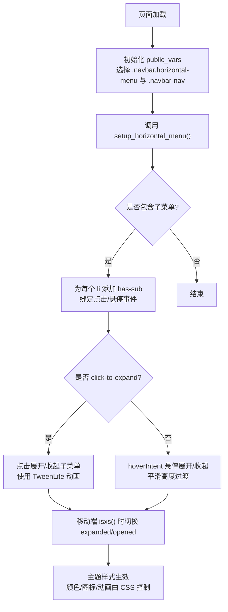
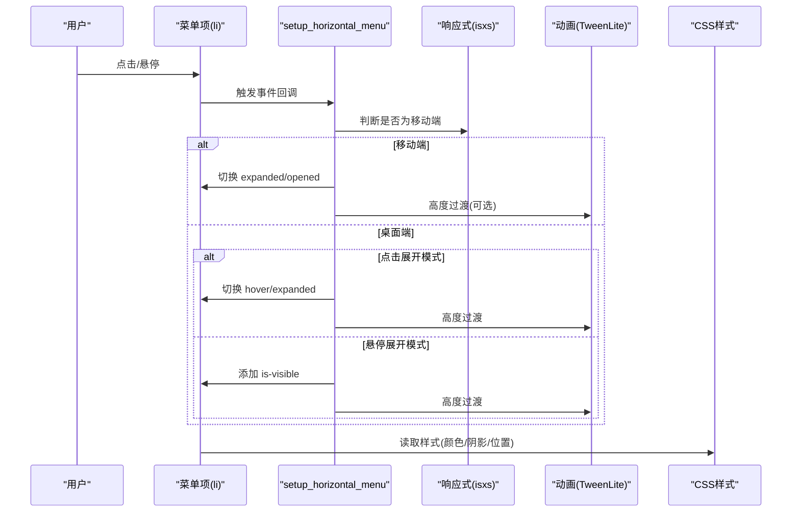
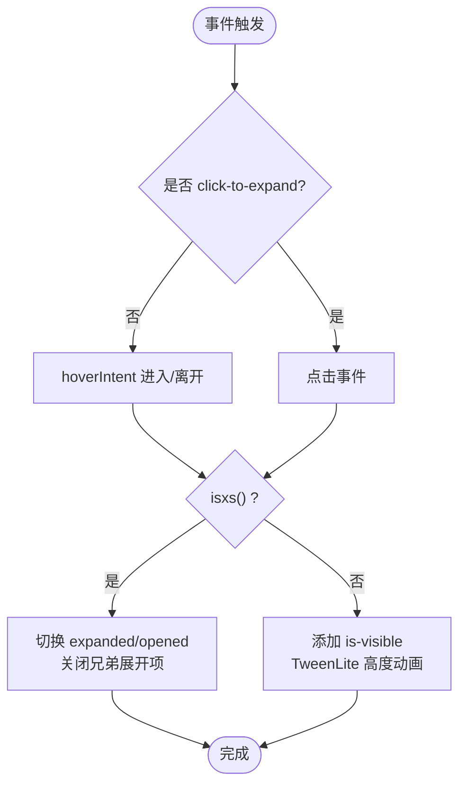
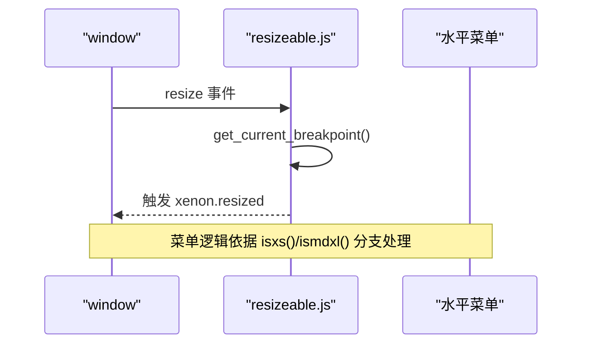
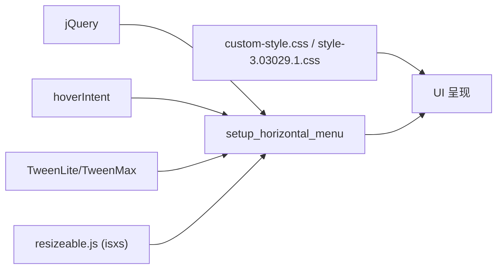

# 水平导航菜单

<cite>
**本文引用的文件**
- [xenon-custom.js](file://assets/js/xenon-custom.js)
- [tooltip-extend.js](file://assets/js/tooltip-extend.js)
- [resizeable.js](file://assets/js/resizeable.js)
- [custom-style.css](file://assets/css/custom-style.css)
- [style-3.03029.1.css](file://assets/css/style-3.03029.1.css)
</cite>

## 目录
1. [简介](#简介)
2. [项目结构](#项目结构)
3. [核心组件](#核心组件)
4. [架构总览](#架构总览)
5. [详细组件分析](#详细组件分析)
6. [依赖关系分析](#依赖关系分析)
7. [性能考量](#性能考量)
8. [故障排查指南](#故障排查指南)
9. [结论](#结论)
10. [附录：定制指南](#附录定制指南)

## 简介
本文件聚焦于水平导航菜单的实现机制，围绕 setup_horizontal_menu 函数展开，系统说明其初始化配置、下拉显示隐藏逻辑、多级菜单处理、响应式行为（移动端汉堡菜单切换、屏幕尺寸监听、布局自适应）、用户交互优化（悬停效果、点击反馈、键盘支持）以及与主题系统的集成（颜色主题切换、图标样式更新、动画控制）。文末提供面向开发者的定制指南。

## 项目结构
- 脚本层
  - assets/js/xenon-custom.js：主入口之一，初始化全局变量并调用 setup_horizontal_menu
  - assets/js/tooltip-extend.js：另一份实现与增强，包含响应式断点判断、移动端菜单触发器、setup_horizontal_menu 的完整逻辑
  - assets/js/resizeable.js：响应式断点工具，提供 isxs、ismdxl、trigger_resizable 等能力
- 样式层
  - assets/css/custom-style.css：自定义主题样式，覆盖顶部导航栏字体与图标颜色、二级导航箭头等
  - assets/css/style-3.03029.1.css：基础样式，包含下拉菜单阴影、悬浮态等通用样式
- HTML 结构约定
  - 水平导航容器类名：.navbar.horizontal-menu
  - 导航列表容器：.navbar-nav
  - 带子菜单项：li:has(> ul)，内部通过 a 标签触发交互
  - 移动端切换按钮：data-toggle="mobile-menu-horizontal"

图表来源
- [xenon-custom.js:23-24](file://assets/js/xenon-custom.js#L23-L24)
- [xenon-custom.js:64](file://assets/js/xenon-custom.js#L64)
- [xenon-custom.js:1280-1429](file://assets/js/xenon-custom.js#L1280-L1429)
- [tooltip-extend.js:341-355](file://assets/js/tooltip-extend.js#L341-L355)
- [tooltip-extend.js:570-696](file://assets/js/tooltip-extend.js#L570-L696)

章节来源
- [xenon-custom.js:23-24](file://assets/js/xenon-custom.js#L23-L24)
- [xenon-custom.js:64](file://assets/js/xenon-custom.js#L64)
- [tooltip-extend.js:341-355](file://assets/js/tooltip-extend.js#L341-L355)

## 核心组件
- 初始化与上下文
  - 在文档就绪后，设置 public_vars.$horizontalNavbar 与 public_vars.$horizontalMenu，随后调用 setup_horizontal_menu
- 菜单项识别与标记
  - 查找所有包含子菜单的 li:has(> ul)，统一添加 has-sub 类，便于样式与逻辑识别
- 交互模式
  - 若菜单根节点包含 click-to-expand 类，则启用“点击展开”模式；否则默认“悬停展开”
- 移动端适配
  - 在 isxs() 条件下，点击菜单项阻止默认跳转，切换 expanded/opened 状态以折叠/展开子菜单
- 动画与可见性
  - 使用 TweenLite/TweenMax 对子菜单高度进行平滑过渡，配合 is-visible 类控制显隐

章节来源
- [xenon-custom.js:23-24](file://assets/js/xenon-custom.js#L23-L24)
- [xenon-custom.js:1280-1429](file://assets/js/xenon-custom.js#L1280-L1429)
- [tooltip-extend.js:570-696](file://assets/js/tooltip-extend.js#L570-L696)

## 架构总览
水平菜单由“JS 行为 + CSS 样式 + 主题覆盖”三部分构成：
- JS 负责：选择器定位、事件绑定、状态切换、动画执行、响应式判断
- CSS 负责：布局、层级、阴影、悬浮态、移动端可见性
- 主题系统：通过 custom-style.css 覆盖导航颜色、图标样式，保持与整体主题一致

图表来源
- [xenon-custom.js:1280-1429](file://assets/js/xenon-custom.js#L1280-L1429)
- [tooltip-extend.js:570-696](file://assets/js/tooltip-extend.js#L570-L696)
- [style-3.03029.1.css:330-333](file://assets/css/style-3.03029.1.css#L330-L333)
- [custom-style.css:15-20](file://assets/css/custom-style.css#L15-L20)

## 详细组件分析

### 初始化配置
- 选择器与上下文
  - 通过 public_vars 缓存 .navbar.horizontal-menu 与 .navbar.navbar-nav，避免重复查询
- 菜单项预处理
  - 遍历所有含子菜单的 li，添加 has-sub 类，便于后续样式与逻辑识别
- 模式开关
  - 检测菜单根节点是否包含 click-to-expand 类，决定点击或悬停展开策略

章节来源
- [xenon-custom.js:23-24](file://assets/js/xenon-custom.js#L23-L24)
- [xenon-custom.js:1280-1302](file://assets/js/xenon-custom.js#L1280-L1302)
- [tooltip-extend.js:341-355](file://assets/js/tooltip-extend.js#L341-L355)
- [tooltip-extend.js:570-589](file://assets/js/tooltip-extend.js#L570-L589)

### 下拉菜单显示隐藏逻辑
- 桌面端悬停展开
  - 使用 hoverIntent 监听进入/离开，非移动端下为子菜单添加 is-visible，并通过 TweenLite 平滑展开/收起
- 桌面端点击展开
  - 当存在 click-to-expand 时，点击父级 a 阻止默认跳转，切换 hover/expanded 状态，子菜单通过 is-visible 与高度动画控制显隐
- 移动端点击切换
  - 在 isxs() 条件下，点击菜单项阻止默认跳转，切换 expanded/opened 状态，同时关闭兄弟展开项，保证一次仅一个子菜单展开

图表来源
- [xenon-custom.js:1382-1429](file://assets/js/xenon-custom.js#L1382-L1429)
- [xenon-custom.js:1324-1381](file://assets/js/xenon-custom.js#L1324-L1381)
- [tooltip-extend.js:607-696](file://assets/js/tooltip-extend.js#L607-L696)

章节来源
- [xenon-custom.js:1304-1322](file://assets/js/xenon-custom.js#L1304-L1322)
- [xenon-custom.js:1324-1429](file://assets/js/xenon-custom.js#L1324-L1429)
- [tooltip-extend.js:590-696](file://assets/js/tooltip-extend.js#L590-L696)

### 多级菜单的处理方式
- 根级与子级区分
  - 通过 is_root_element = $li.parent().is('.navbar-nav') 判断当前 li 是否为根级菜单项
- 根级菜单
  - 点击展开模式下，切换 hover 状态以驱动样式变化
- 子级菜单
  - 展开时先计算子菜单高度，设置初始高度为 0，再使用 TweenLite 过渡到实际高度；收起时反向操作
- 互斥展开
  - 展开当前子菜单前，会关闭同级其他已展开的子菜单，避免多个子菜单同时展开造成遮挡

章节来源
- [xenon-custom.js:1334-1381](file://assets/js/xenon-custom.js#L1334-L1381)
- [tooltip-extend.js:616-653](file://assets/js/tooltip-extend.js#L616-L653)

### 响应式设计实现
- 断点判断
  - 通过 resizeable.js 提供的 isxs()、ismdxl()、get_current_breakpoint()、trigger_resizable() 实现断点检测与事件派发
- 移动端汉堡菜单切换
  - data-toggle="mobile-menu-horizontal" 按钮点击时，切换 public_vars.$horizontalMenu 的 mobile-is-visible 类，实现显示/隐藏
- 布局自适应策略
  - 在 isxs() 条件下禁用悬停展开，改用点击切换；在非移动端使用悬停或点击展开策略
  - 滚动条与固定页脚等辅助功能在响应式过程中也会根据窗口尺寸调整

图表来源
- [resizeable.js:66-122](file://assets/js/resizeable.js#L66-L122)
- [tooltip-extend.js:14-86](file://assets/js/tooltip-extend.js#L14-L86)
- [tooltip-extend.js:206-217](file://assets/js/tooltip-extend.js#L206-L217)

章节来源
- [resizeable.js:66-122](file://assets/js/resizeable.js#L66-L122)
- [tooltip-extend.js:206-217](file://assets/js/tooltip-extend.js#L206-L217)
- [xenon-custom.js:1304-1322](file://assets/js/xenon-custom.js#L1304-L1322)

### 用户交互优化
- 鼠标悬停效果
  - 桌面端使用 hoverIntent 提升体验，减少误触；根级菜单项切换 hover 类，子级菜单通过 is-visible 显示
- 点击反馈
  - 点击展开模式下，点击父级 a 阻止默认跳转，切换状态并播放高度动画；移动端点击切换 expanded/opened
- 键盘导航支持
  - 代码中未直接实现键盘事件监听；可通过浏览器原生 Tab 焦点与 Enter/Space 触发链接行为获得基本支持；如需增强可补充 keydown 监听以管理 focus/blur 与展开状态

章节来源
- [xenon-custom.js:1382-1429](file://assets/js/xenon-custom.js#L1382-L1429)
- [xenon-custom.js:1324-1381](file://assets/js/xenon-custom.js#L1324-L1381)
- [tooltip-extend.js:590-696](file://assets/js/tooltip-extend.js#L590-L696)

### 与主题系统的集成
- 颜色主题切换
  - custom-style.css 覆盖顶部导航栏文字与图标颜色，确保在不同背景下的可读性与一致性
- 图标样式更新
  - 通过伪元素为二级导航添加箭头图标，保持视觉引导
- 动画效果控制
  - 使用 TweenLite/TweenMax 控制子菜单高度过渡；动画时长与缓动函数在 JS 中定义，CSS 不直接参与动画时序

章节来源
- [custom-style.css:15-20](file://assets/css/custom-style.css#L15-L20)
- [custom-style.css:39-41](file://assets/css/custom-style.css#L39-L41)
- [xenon-custom.js:1345-1381](file://assets/js/xenon-custom.js#L1345-L1381)
- [xenon-custom.js:1385-1429](file://assets/js/xenon-custom.js#L1385-L1429)

## 依赖关系分析
- 模块耦合
  - setup_horizontal_menu 依赖 public_vars 中的 DOM 引用，以及响应式工具 isxs()
  - 动画依赖 TweenLite/TweenMax 库（由项目引入）
  - 样式依赖 Bootstrap 与主题 CSS（dropdown、navbar 等类）
- 外部依赖
  - jQuery 用于 DOM 操作与事件绑定
  - hoverIntent 插件用于智能悬停检测
  - TweenLite/TweenMax 用于平滑动画

图表来源
- [xenon-custom.js:1280-1429](file://assets/js/xenon-custom.js#L1280-L1429)
- [tooltip-extend.js:570-696](file://assets/js/tooltip-extend.js#L570-L696)
- [resizeable.js:66-122](file://assets/js/resizeable.js#L66-L122)
- [custom-style.css:15-20](file://assets/css/custom-style.css#L15-L20)
- [style-3.03029.1.css:330-333](file://assets/css/style-3.03029.1.css#L330-L333)

章节来源
- [xenon-custom.js:1280-1429](file://assets/js/xenon-custom.js#L1280-L1429)
- [tooltip-extend.js:570-696](file://assets/js/tooltip-extend.js#L570-L696)
- [resizeable.js:66-122](file://assets/js/resizeable.js#L66-L122)

## 性能考量
- 事件委托与选择器优化
  - 使用缓存的 public_vars.$horizontalMenu 减少重复查询
- 动画性能
  - 使用硬件加速的 transform/opacity 更佳；当前采用高度动画，注意在大菜单时的重排开销
- 防抖与节流
  - 响应式事件已通过 trigger_resizable 进行断点去重，避免频繁计算
- 移动端交互
  - 在 isxs() 下禁用悬停逻辑，降低触摸设备上的误触与额外计算

[本节为通用指导，无需具体文件引用]

## 故障排查指南
- 子菜单无法展开
  - 检查菜单根节点是否包含 click-to-expand 类；确认 li 内是否存在 ul 子菜单
  - 确认 isxs() 判断是否正确，移动端需点击切换而非悬停
- 动画不生效
  - 确认 TweenLite/TweenMax 已正确引入；检查子菜单高度计算是否合理
- 主题颜色异常
  - 检查 custom-style.css 的覆盖规则优先级；确认 .big-header-banner 与 .page-header 类名匹配
- 移动端菜单不可见
  - 确认 data-toggle="mobile-menu-horizontal" 按钮存在且绑定点击事件；检查 mobile-is-visible 类是否被切换

章节来源
- [xenon-custom.js:1280-1429](file://assets/js/xenon-custom.js#L1280-L1429)
- [tooltip-extend.js:206-217](file://assets/js/tooltip-extend.js#L206-L217)
- [custom-style.css:15-20](file://assets/css/custom-style.css#L15-L20)

## 结论
setup_horizontal_menu 提供了健壮的水平菜单实现：支持点击/悬停两种展开模式、完善的移动端适配、平滑的高度动画与主题集成。通过合理的 DOM 缓存、响应式断点判断与事件绑定，保证了跨设备的一致体验。开发者可根据业务需求扩展键盘导航、无障碍支持与更丰富的动画效果。

[本节为总结性内容，无需具体文件引用]

## 附录：定制指南
- 修改交互模式
  - 在菜单根节点添加或移除 click-to-expand 类，即可切换点击/悬停展开
- 调整动画参数
  - 在展开/收起逻辑中调整 TweenLite.to 的持续时间与缓动函数，以获得更合适的动效节奏
- 自定义样式
  - 在 custom-style.css 中覆盖导航颜色、图标样式；在 style-3.03029.1.css 中调整下拉阴影与悬浮态
- 增强键盘导航
  - 为菜单项添加 keydown 监听，支持 Tab/Enter/Space 操作；必要时增加 aria-* 属性以提升可访问性
- 扩展多级菜单
  - 遵循 li:has(> ul) 的结构约定，确保 JS 能正确识别并绑定事件；如需更深层级，可在展开逻辑中加入递归处理

章节来源
- [xenon-custom.js:1280-1429](file://assets/js/xenon-custom.js#L1280-L1429)
- [tooltip-extend.js:570-696](file://assets/js/tooltip-extend.js#L570-L696)
- [custom-style.css:15-41](file://assets/css/custom-style.css#L15-L41)
- [style-3.03029.1.css:330-333](file://assets/css/style-3.03029.1.css#L330-L333)