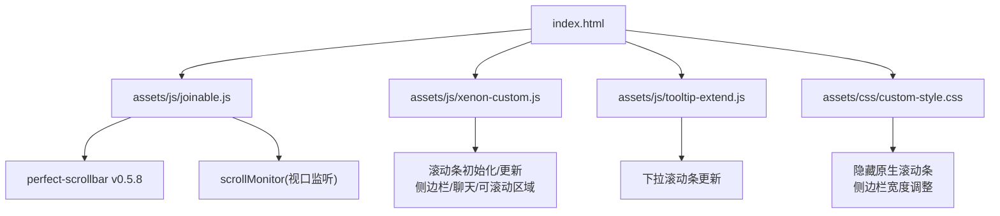
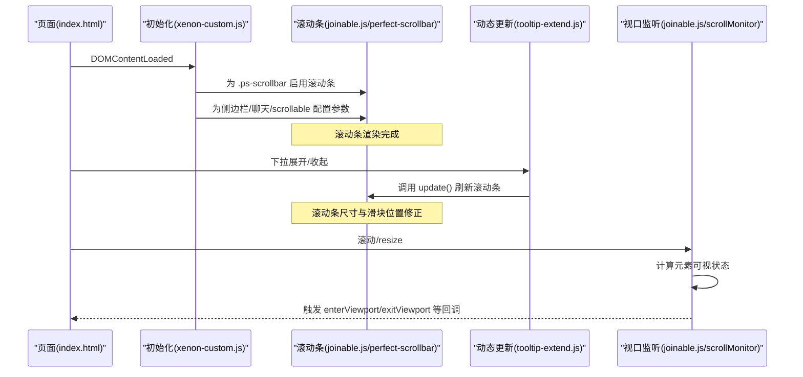
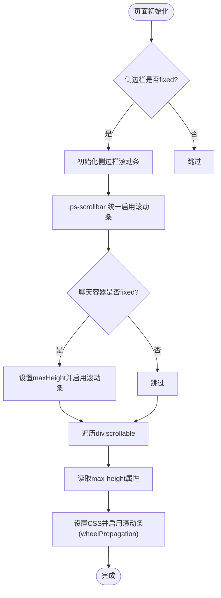
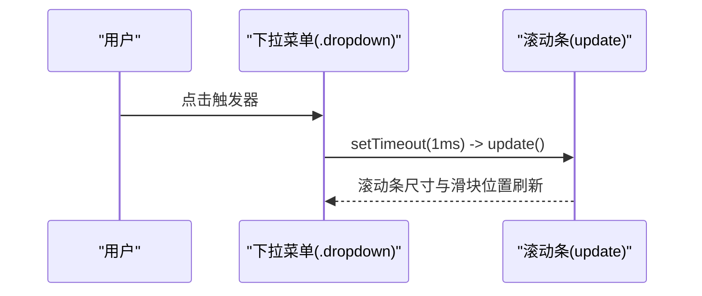
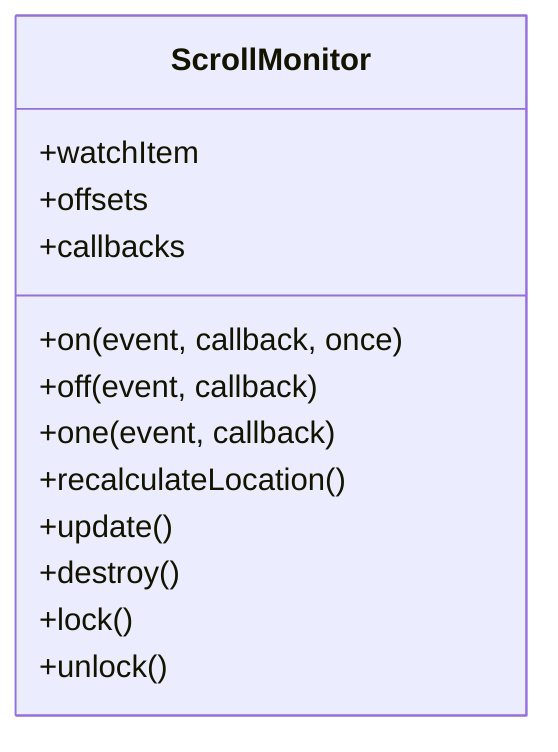
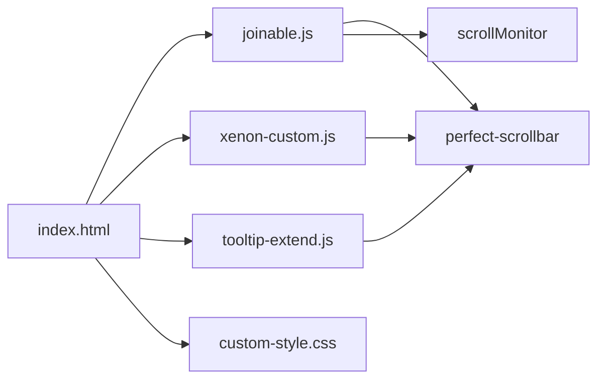

# 滚动优化系统

<cite>
**本文引用的文件**
- [index.html](file://index.html)
- [joinable.js](file://assets/js/joinable.js)
- [xenon-custom.js](file://assets/js/xenon-custom.js)
- [tooltip-extend.js](file://assets/js/tooltip-extend.js)
- [custom-style.css](file://assets/css/custom-style.css)
- [README.md](file://README.md)
</cite>

## 目录
1. [简介](#简介)
2. [项目结构](#项目结构)
3. [核心组件](#核心组件)
4. [架构总览](#架构总览)
5. [详细组件分析](#详细组件分析)
6. [依赖关系分析](#依赖关系分析)
7. [性能考量](#性能考量)
8. [故障排除指南](#故障排除指南)
9. [结论](#结论)
10. [附录](#附录)

## 简介
本文件系统性地梳理并文档化本项目中的滚动优化方案，重点围绕 Perfect Scrollbar 的集成与调优、不同滚动容器的差异化配置、滚动事件的性能优化（防抖/节流/事件委托）、滚动状态同步（多容器协调、位置保存恢复、平滑滚动），以及移动端触摸滚动与惯性处理。目标是帮助开发者快速理解现有实现，并在后续迭代中持续优化滚动体验与性能。

## 项目结构
- 入口页面 index.html 定义了侧边栏、主内容区、搜索区域等布局，并通过引入 assets/js 下的脚本与 assets/css 下的样式完成交互与视觉呈现。
- 滚动相关能力由多个脚本协作提供：
  - joinable.js：内嵌了 perfect-scrollbar v0.5.8 的实现，并提供 scrollMonitor（视口监听）与 hoverIntent、Cookies 等工具。
  - xenon-custom.js：主题初始化逻辑，负责在 DOM 就绪后为特定容器启用或更新滚动条。
  - tooltip-extend.js：对可滚动下拉框进行滚动条更新，避免动态内容变化导致滚动条错位。
  - custom-style.css：隐藏原生滚动条、调整侧边栏宽度等样式。
- README.md 提供了项目概览与部署说明，有助于理解整体运行环境。

图表来源
- [index.html:42-219](file://index.html#L42-L219)
- [joinable.js:27-30](file://assets/js/joinable.js#L27-L30)
- [xenon-custom.js:75-132](file://assets/js/xenon-custom.js#L75-L132)
- [tooltip-extend.js:386-404](file://assets/js/tooltip-extend.js#L386-L404)
- [custom-style.css:9-10](file://assets/css/custom-style.css#L9-L10)

章节来源
- [index.html:42-219](file://index.html#L42-L219)
- [README.md:1-15](file://README.md#L1-L15)

## 核心组件
- Perfect Scrollbar 集成
  - 通过 joinable.js 内嵌的 perfect-scrollbar v0.5.8 提供跨浏览器一致的滚动条体验。
  - 支持 wheelPropagation、键盘导航、触摸滑动、惯性滚动等特性。
- 滚动容器初始化
  - xenon-custom.js 在页面加载完成后，为 .ps-scrollbar 容器统一启用滚动条，并对固定高度的侧边栏、聊天窗口、通用 .scrollable 区域分别设置参数。
  - tooltip-extend.js 针对包含滚动条的下拉菜单，在展开时调用 update 刷新滚动条尺寸。
- 视口监听与懒加载
  - joinable.js 内置 scrollMonitor，用于监听元素进入/离开视口，便于后续扩展懒加载或滚动触发动作。
- 样式与原生滚动条控制
  - custom-style.css 隐藏侧边栏原生滚动条，确保使用自定义滚动条；同时调整侧边栏二级菜单宽度。

章节来源
- [joinable.js:27-30](file://assets/js/joinable.js#L27-L30)
- [xenon-custom.js:75-132](file://assets/js/xenon-custom.js#L75-L132)
- [tooltip-extend.js:386-404](file://assets/js/tooltip-extend.js#L386-L404)
- [custom-style.css:9-10](file://assets/css/custom-style.css#L9-L10)

## 架构总览
下图展示了滚动系统在页面生命周期中的关键流程：页面加载 → 初始化滚动条 → 动态更新滚动条 → 滚动事件处理 → 视口监听回调。

图表来源
- [xenon-custom.js:75-132](file://assets/js/xenon-custom.js#L75-L132)
- [joinable.js:27-30](file://assets/js/joinable.js#L27-L30)
- [tooltip-extend.js:386-404](file://assets/js/tooltip-extend.js#L386-L404)
- [joinable.js:18-29](file://assets/js/joinable.js#L18-L29)

## 详细组件分析

### 组件A：Perfect Scrollbar 初始化与配置
- 目标容器
  - 侧边栏：当具备 fixed 类时，调用 ps_init() 并启用滚动条。
  - 通用滚动容器：遍历 .ps-scrollbar，统一启用滚动条，关闭 wheelPropagation 以避免滚动冒泡干扰。
  - 聊天窗口：若父级为 fixed，则设置最大高度并启用滚动条。
  - 可滚动区域：遍历 div.scrollable，读取 max-height 属性，设置 CSS 并启用滚动条，开启 wheelPropagation 以允许滚到父容器。
- 关键参数
  - wheelPropagation：控制滚动是否向父容器传播，适用于嵌套滚动场景。
  - 其他默认参数（如 wheelSpeed、useKeyboard、suppressScrollX/Y 等）由 perfect-scrollbar 内部提供，可根据需要覆盖。

图表来源
- [xenon-custom.js:75-132](file://assets/js/xenon-custom.js#L75-L132)

章节来源
- [xenon-custom.js:75-132](file://assets/js/xenon-custom.js#L75-L132)

### 组件B：滚动条动态更新（下拉菜单）
- 问题背景：下拉菜单展开/收起会改变内容高度，若不更新滚动条会导致滑块位置错误。
- 解决方案：在点击触发器上绑定事件，延迟一帧后调用 $scrollbar.perfectScrollbar('update')，确保 DOM 更新后再刷新滚动条。

图表来源
- [tooltip-extend.js:386-393](file://assets/js/tooltip-extend.js#L386-L393)

章节来源
- [tooltip-extend.js:386-393](file://assets/js/tooltip-extend.js#L386-L393)

### 组件C：视口监听（scrollMonitor）
- 功能概述：封装了对元素进入/完全进入/离开视口的监听，支持一次性回调与批量更新。
- 适用场景：懒加载图片、按需渲染长列表、滚动触发的统计埋点等。
- 性能要点：内部使用 requestAnimationFrame 与节流策略减少重排重绘。

图表来源
- [joinable.js:18-29](file://assets/js/joinable.js#L18-L29)

章节来源
- [joinable.js:18-29](file://assets/js/joinable.js#L18-L29)

### 组件D：样式与原生滚动条控制
- 隐藏原生滚动条：通过 ::-webkit-scrollbar 将侧边栏原生滚动条隐藏，确保使用自定义滚动条。
- 侧边栏宽度：调整二级菜单宽度，提升可读性与空间利用率。

章节来源
- [custom-style.css:9-10](file://assets/css/custom-style.css#L9-L10)
- [custom-style.css:4-8](file://assets/css/custom-style.css#L4-L8)

## 依赖关系分析
- 页面层：index.html 作为入口，组织结构与资源引用。
- 脚本层：
  - joinable.js 提供 perfect-scrollbar 与 scrollMonitor。
  - xenon-custom.js 负责初始化与配置滚动条。
  - tooltip-extend.js 负责动态更新滚动条。
- 样式层：custom-style.css 控制滚动条可见性与布局细节。

图表来源
- [index.html:42-219](file://index.html#L42-L219)
- [joinable.js:27-30](file://assets/js/joinable.js#L27-L30)
- [xenon-custom.js:75-132](file://assets/js/xenon-custom.js#L75-L132)
- [tooltip-extend.js:386-404](file://assets/js/tooltip-extend.js#L386-L404)
- [custom-style.css:9-10](file://assets/css/custom-style.css#L9-L10)

章节来源
- [index.html:42-219](file://index.html#L42-L219)
- [joinable.js:27-30](file://assets/js/joinable.js#L27-L30)
- [xenon-custom.js:75-132](file://assets/js/xenon-custom.js#L75-L132)
- [tooltip-extend.js:386-404](file://assets/js/tooltip-extend.js#L386-L404)
- [custom-style.css:9-10](file://assets/css/custom-style.css#L9-L10)

## 性能考量
- 滚动事件优化
  - 使用 requestAnimationFrame 与节流策略降低高频滚动带来的重排重绘压力（scrollMonitor 内部已实现）。
  - 对于滚动条更新，采用延迟一帧的方式确保 DOM 稳定后再刷新（tooltip-extend.js）。
- 内存管理
  - 滚动条实例通过 data 存储，销毁时移除事件与节点，避免内存泄漏。
  - 视口监听对象支持 destroy 方法，及时释放回调与监听。
- 滚动传播控制
  - 通过 wheelPropagation 控制滚动冒泡，避免嵌套滚动导致的冲突。
- 移动端优化
  - perfect-scrollbar 内置触摸事件与惯性滚动支持，适配移动端滚动体验。
- 平滑滚动
  - “回到顶部”链接使用 TweenLite 动画平滑滚动至顶部，提升用户体验。

章节来源
- [joinable.js:18-29](file://assets/js/joinable.js#L18-L29)
- [tooltip-extend.js:386-393](file://assets/js/tooltip-extend.js#L386-L393)
- [xenon-custom.js:170-181](file://assets/js/xenon-custom.js#L170-L181)

## 故障排除指南
- 滚动条不显示
  - 检查容器是否具备 .ps-scrollbar 类，且已被正确初始化。
  - 确认样式未隐藏滚动条（如 ::-webkit-scrollbar 被全局禁用）。
- 滚动条滑块位置错误
  - 动态内容变化后需调用 update() 刷新滚动条（如下拉展开/收起）。
- 滚动冒泡导致父容器滚动
  - 根据场景调整 wheelPropagation 参数，必要时在子容器关闭传播。
- 移动端滚动卡顿
  - 确保使用支持触摸与惯性的滚动库（perfect-scrollbar）。
  - 避免在滚动事件中执行昂贵计算，改用节流或 rAF。
- 回到顶部无效
  - 检查“回到顶部”链接是否正确绑定事件，并确保 TweenLite 可用。

章节来源
- [custom-style.css:9-10](file://assets/css/custom-style.css#L9-L10)
- [tooltip-extend.js:386-393](file://assets/js/tooltip-extend.js#L386-L393)
- [xenon-custom.js:170-181](file://assets/js/xenon-custom.js#L170-L181)

## 结论
本项目通过集成 perfect-scrollbar 与自研的滚动初始化/更新逻辑，实现了跨浏览器的滚动条一致性与良好的交互体验。结合视口监听与样式控制，满足了侧边栏、聊天窗口与通用滚动区域的差异化需求。后续可在以下方面继续优化：
- 引入更细粒度的滚动事件节流/防抖策略，进一步降低性能开销。
- 增加滚动位置持久化与恢复机制，提升用户体验。
- 完善移动端触摸手势与惯性滚动的调优参数。

## 附录
- 参考文档：项目 README 提供了部署与环境说明，有助于理解运行上下文。

章节来源
- [README.md:1-15](file://README.md#L1-L15)