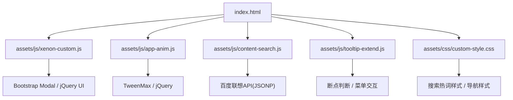
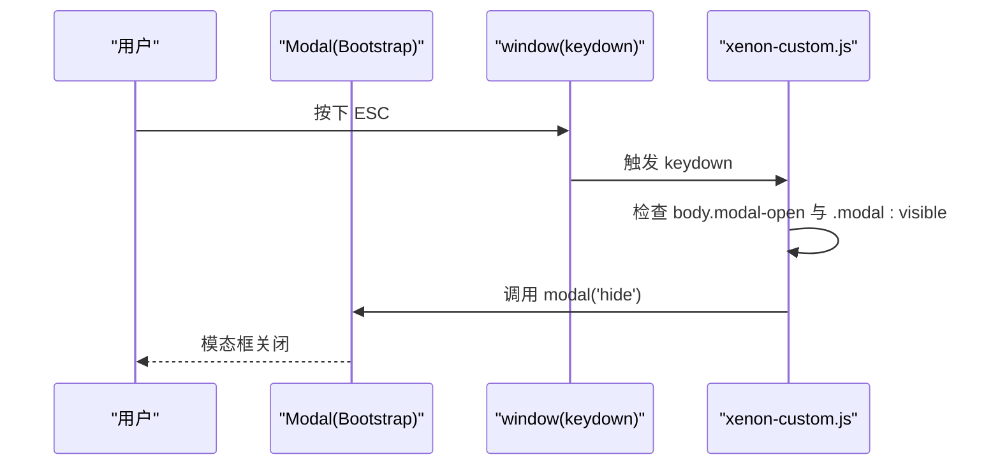
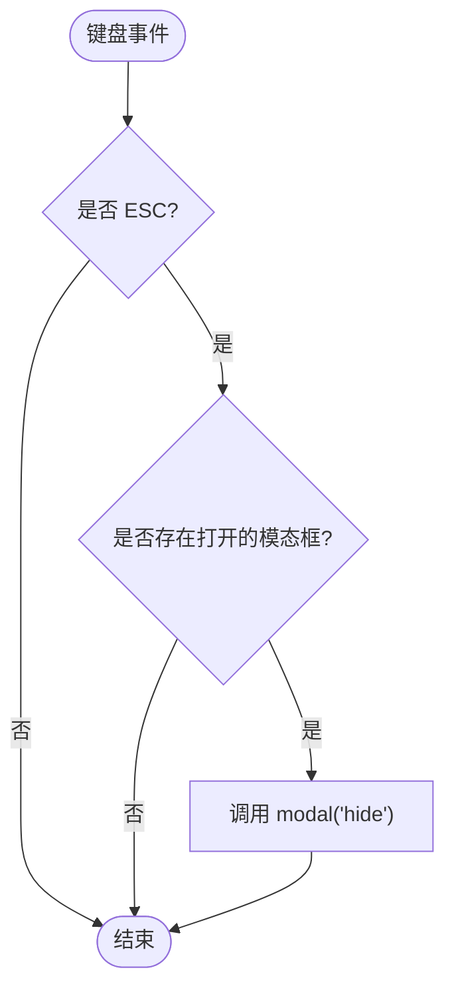
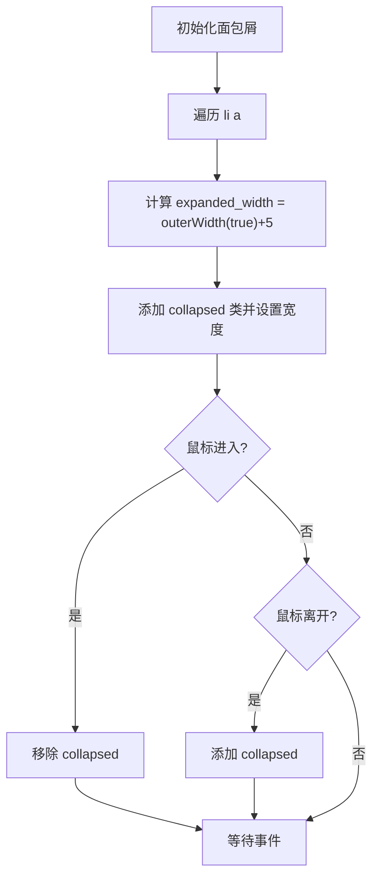
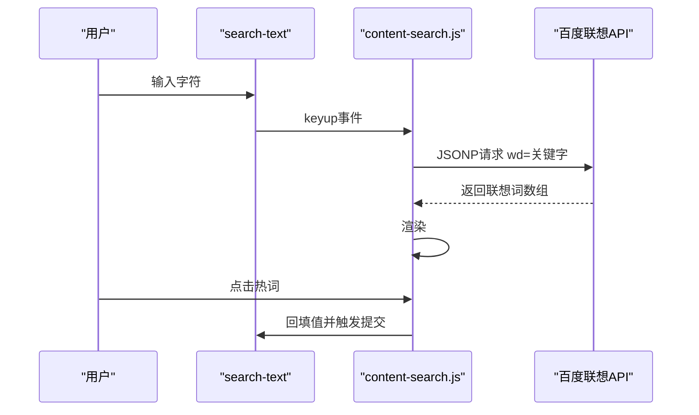
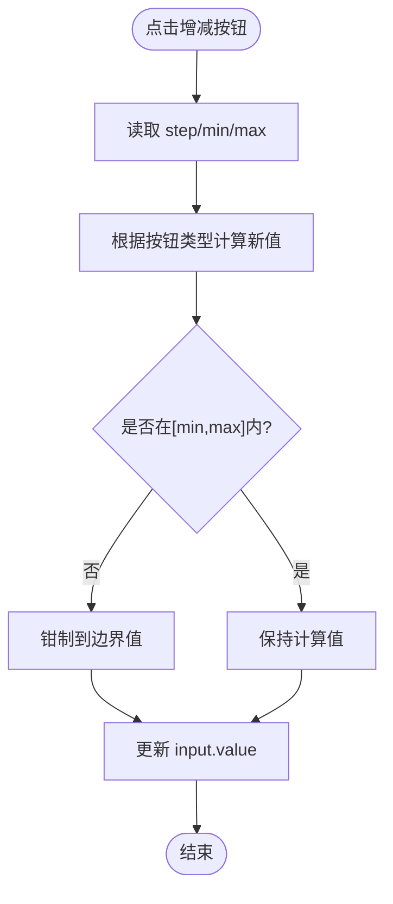
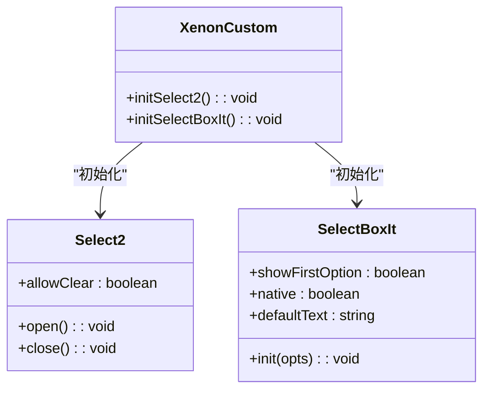
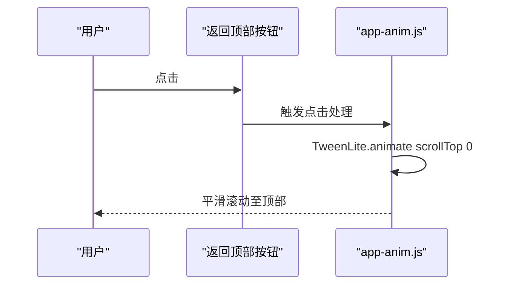
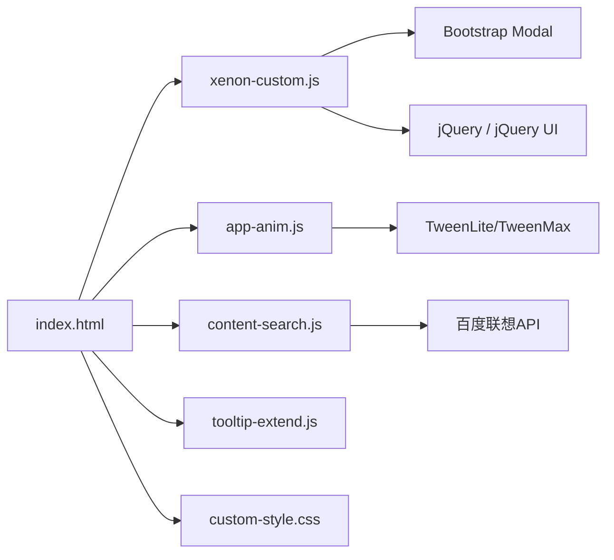

# 界面交互增强

<cite>
**本文引用的文件**
- [index.html](file://index.html)
- [assets/js/xenon-custom.js](file://assets/js/xenon-custom.js)
- [assets/js/app-anim.js](file://assets/js/app-anim.js)
- [assets/js/content-search.js](file://assets/js/content-search.js)
- [assets/js/tooltip-extend.js](file://assets/js/tooltip-extend.js)
- [assets/css/custom-style.css](file://assets/css/custom-style.css)
</cite>

## 目录
1. [简介](#简介)
2. [项目结构](#项目结构)
3. [核心组件](#核心组件)
4. [架构总览](#架构总览)
5. [详细组件分析](#详细组件分析)
6. [依赖关系分析](#依赖关系分析)
7. [性能考虑](#性能考虑)
8. [故障排查指南](#故障排查指南)
9. [结论](#结论)
10. [附录](#附录)

## 简介
本文件聚焦于该导航站点的“界面交互增强”能力，系统性梳理并说明以下功能的实现与扩展方式：
- 模态框的键盘控制、ESC键关闭机制与焦点管理策略
- 面包屑导航的自动隐藏逻辑、宽度计算算法与悬停显示效果
- 搜索框的智能聚焦、输入验证与状态管理（含热词联想）
- 数字输入框的增减按钮、数值范围限制与步长控制
- 下拉选择的替换方案（Select2 与 SelectBoxIt）集成配置
- 自动调整文本域的高度、内容检测与性能优化
- 页面顶部返回按钮的平滑滚动、动画效果与用户体验优化
- 各交互组件的定制方法与扩展指南

## 项目结构
- 入口页面 index.html 组织页面骨架、引入样式与脚本，包含侧边栏、头部导航、搜索区与内容区。
- 交互逻辑主要分布在：
  - assets/js/xenon-custom.js：全局交互初始化（模态框ESC、面包屑、数字输入框、下拉选择、表单校验等）
  - assets/js/app-anim.js：主题切换、滚动行为、侧边栏折叠、返回顶部等动效与交互
  - assets/js/content-search.js：搜索框关键词联想与点击回填
  - assets/js/tooltip-extend.js：响应式断点与菜单展开收起等辅助逻辑
  - assets/css/custom-style.css：搜索热词下拉、导航样式等视觉增强

**图表来源**
- [index.html:1-35](file://index.html#L1-L35)
- [assets/js/xenon-custom.js:208-357](file://assets/js/xenon-custom.js#L208-L357)
- [assets/js/app-anim.js:238-253](file://assets/js/app-anim.js#L238-L253)
- [assets/js/content-search.js:1-91](file://assets/js/content-search.js#L1-L91)
- [assets/js/tooltip-extend.js:416-437](file://assets/js/tooltip-extend.js#L416-L437)
- [assets/css/custom-style.css:45-89](file://assets/css/custom-style.css#L45-L89)

**章节来源**
- [index.html:1-35](file://index.html#L1-L35)

## 核心组件
- 模态框与ESC关闭：通过全局keydown监听Esc键，若body存在modal-open类且存在可见modal则调用hide。
- 面包屑自动隐藏：遍历.breadcrumb.auto-hidden下的li a，计算每个链接的外边距宽度并设置collapsed类；hover时移除collapsed以完整显示。
- 搜索框智能聚焦与联想：在search-text上绑定keyup事件，调用百度联想接口，渲染热词列表；点击热词回填并触发提交。
- 数字输入框步进器：为.input-group.spinner内的加减按钮绑定click，按step增减，并在[min,max]范围内钳制。
- 下拉选择替换：对.select2和.selectboxit分别初始化Select2与SelectBoxIt，支持allowClear、first-option、native等选项。
- 自动高度文本域：使用autosize插件对.autosize/.autogrow元素进行自适应高度。
- 返回顶部平滑滚动：通过TweenLite或jQuery animate将scrollTop从当前位置平滑过渡到0。

**章节来源**
- [assets/js/xenon-custom.js:208-357](file://assets/js/xenon-custom.js#L208-L357)
- [assets/js/app-anim.js:238-253](file://assets/js/app-anim.js#L238-L253)
- [assets/js/content-search.js:1-91](file://assets/js/content-search.js#L1-L91)
- [assets/js/tooltip-extend.js:416-437](file://assets/js/tooltip-extend.js#L416-L437)

## 架构总览
整体采用“HTML结构 + jQuery插件 + 自定义JS/CSS”的分层模式：
- HTML负责结构与数据属性（如data-toggle、data-target、data-mask等）
- JS负责事件绑定、状态管理与第三方库初始化
- CSS负责视觉呈现与交互动画（如搜索热词下拉、导航高亮等）

**图表来源**
- [assets/js/xenon-custom.js:236-246](file://assets/js/xenon-custom.js#L236-L246)

## 详细组件分析

### 模态框键盘控制与ESC关闭机制
- 行为描述：当按下Esc键时，若页面处于模态框打开状态（body包含modal-open类），则关闭当前可见的模态框。
- 关键点：
  - 使用$(window).on('keydown', ...)统一捕获按键事件
  - 通过public_vars.$body.hasClass('modal-open')判断是否处于模态上下文
  - 选择器".modal-open .modal:visible"精准定位当前激活的模态框
- 焦点管理建议：
  - 建议在模态框打开时将焦点移至首个可交互元素，关闭后恢复至触发元素
  - 可使用focus()与blur()配合tabindex管理焦点流，避免焦点丢失或循环

**图表来源**
- [assets/js/xenon-custom.js:236-246](file://assets/js/xenon-custom.js#L236-L246)

**章节来源**
- [assets/js/xenon-custom.js:236-246](file://assets/js/xenon-custom.js#L236-L246)

### 面包屑导航的自动隐藏、宽度计算与悬停显示
- 行为描述：对带有.auto-hidden类的.breadcrumb中的每个链接，计算其外边距宽度并添加collapsed类；鼠标悬停时移除collapsed以展示完整文本。
- 算法要点：
  - 遍历所有li a，获取outerWidth(true)+5作为初始collapsed宽度
  - hover事件切换collapsed类，实现“缩略-展开”效果
- 适用场景：空间受限的面包屑区域，提升信息密度与可读性

**图表来源**
- [assets/js/xenon-custom.js:208-232](file://assets/js/xenon-custom.js#L208-L232)
- [assets/js/tooltip-extend.js:416-437](file://assets/js/tooltip-extend.js#L416-L437)

**章节来源**
- [assets/js/xenon-custom.js:208-232](file://assets/js/xenon-custom.js#L208-L232)
- [assets/js/tooltip-extend.js:416-437](file://assets/js/tooltip-extend.js#L416-L437)

### 搜索框的智能聚焦、输入验证与状态管理
- 智能聚焦：
  - 在用户点击搜索按钮时，若输入为空，则给容器添加focused类并延迟聚焦输入框，提升可用性
- 输入验证：
  - 通过表单validate插件与[data-validate]属性动态生成规则与消息
  - 支持required、url、email、number、date、creditcard及min/max/minlength等参数化规则
- 状态管理：
  - 搜索热词下拉由content-search.js维护，keyup时请求百度联想，成功则渲染列表，失败则清空隐藏
  - 点击热词回填输入框并触发提交
- 性能优化：
  - 使用防抖或节流可减少频繁请求（当前实现为每次keyup直接请求，可在高频输入场景下优化）

**图表来源**
- [assets/js/content-search.js:1-91](file://assets/js/content-search.js#L1-L91)
- [assets/js/xenon-custom.js:135-156](file://assets/js/xenon-custom.js#L135-L156)
- [assets/js/xenon-custom.js:578-667](file://assets/js/xenon-custom.js#L578-L667)

**章节来源**
- [assets/js/content-search.js:1-91](file://assets/js/content-search.js#L1-L91)
- [assets/js/xenon-custom.js:135-156](file://assets/js/xenon-custom.js#L135-L156)
- [assets/js/xenon-custom.js:578-667](file://assets/js/xenon-custom.js#L578-L667)

### 数字输入框的增减按钮、数值范围限制与步长控制
- 行为描述：为.input-group.spinner内的加减按钮绑定click，读取step、min、max属性，按步长增减并钳制到[min,max]区间。
- 关键点：
  - 通过attrDefault读取配置项，默认step=1, min=0, max=0
  - 若min < max则启用范围限制，超出边界时回退到边界值
- 扩展建议：
  - 可增加键盘上下箭头支持
  - 可加入实时校验提示与禁用状态（当达到边界时禁用对应按钮）

**图表来源**
- [assets/js/xenon-custom.js:266-307](file://assets/js/xenon-custom.js#L266-L307)

**章节来源**
- [assets/js/xenon-custom.js:266-307](file://assets/js/xenon-custom.js#L266-L307)

### 下拉选择的替换方案：Select2 与 SelectBoxIt
- Select2：
  - 对.select2元素初始化，支持allowClear等选项
  - 可选niceScroll美化下拉滚动条
- SelectBoxIt：
  - 对select.selectboxit初始化，支持showFirstOption、native、defaultText等选项
- 使用建议：
  - 大量选项时优先Select2，具备搜索与虚拟化能力
  - 轻量场景可用SelectBoxIt减少依赖

**图表来源**
- [assets/js/xenon-custom.js:312-357](file://assets/js/xenon-custom.js#L312-L357)

**章节来源**
- [assets/js/xenon-custom.js:312-357](file://assets/js/xenon-custom.js#L312-L357)

### 自动调整文本域的高度、内容检测与性能优化
- 行为描述：对.autosize/.autogrow元素调用autosize插件，根据内容自动调整高度。
- 关键点：
  - 仅在插件可用时初始化，避免无依赖报错
  - 适合评论框、备注等需要自适应高度的场景
- 性能建议：
  - 对大量textarea可考虑懒加载或按需初始化
  - 结合ResizeObserver替代定时检测以提升性能（当前未使用）

**章节来源**
- [assets/js/xenon-custom.js:196-200](file://assets/js/xenon-custom.js#L196-L200)

### 页面顶部返回按钮的平滑滚动与动画效果
- 行为描述：点击rel="go-top"的链接或使用.go-up按钮，将页面平滑滚动到顶部。
- 实现方式：
  - 使用TweenLite驱动scrollTop变化，提供缓动曲线
  - 或使用jQuery animate实现简单平滑滚动
- 体验优化：
  - 滚动过程中可叠加遮罩或进度指示
  - 移动端可增大点击热区，提升易用性

**图表来源**
- [assets/js/app-anim.js:238-253](file://assets/js/app-anim.js#L238-L253)
- [assets/js/xenon-custom.js:170-181](file://assets/js/xenon-custom.js#L170-L181)

**章节来源**
- [assets/js/app-anim.js:238-253](file://assets/js/app-anim.js#L238-L253)
- [assets/js/xenon-custom.js:170-181](file://assets/js/xenon-custom.js#L170-L181)

## 依赖关系分析
- 外部依赖：
  - Bootstrap Modal用于模态框
  - jQuery UI / jQuery用于DOM操作与动画
  - TweenMax/TweenLite用于高级动画
  - 百度联想API用于搜索热词
- 内部耦合：
  - xenon-custom.js集中初始化多数交互，与其他JS文件职责清晰
  - app-anim.js侧重动效与主题相关交互
  - content-search.js专注搜索联想
  - tooltip-extend.js提供断点与菜单辅助逻辑
  - custom-style.css提供搜索热词与导航样式

**图表来源**
- [index.html:17-31](file://index.html#L17-L31)
- [assets/js/xenon-custom.js:208-357](file://assets/js/xenon-custom.js#L208-L357)
- [assets/js/app-anim.js:238-253](file://assets/js/app-anim.js#L238-L253)
- [assets/js/content-search.js:1-91](file://assets/js/content-search.js#L1-L91)

**章节来源**
- [index.html:17-31](file://index.html#L17-L31)

## 性能考虑
- 搜索联想：
  - 当前每次keyup直接请求，建议在高频输入场景增加防抖/节流以减少网络开销
- 滚动与动画：
  - 使用requestAnimationFrame或硬件加速CSS提升滚动与动画性能
- 插件初始化：
  - autosize、perfectScrollbar等仅在必要时初始化，避免重复创建
- 资源加载：
  - 关键CSS/JS尽早加载，非关键资源延迟加载

[本节为通用指导，不直接分析具体文件]

## 故障排查指南
- 模态框无法用ESC关闭：
  - 检查body是否包含modal-open类，确认是否有.visible的模态框
  - 确保未在其他地方阻止keydown冒泡
- 面包屑悬停无效：
  - 检查元素是否包含auto-hidden类，确认hover事件是否被其他处理器拦截
- 搜索热词不显示：
  - 检查JSONP回调是否成功，确认网络连通性与跨域策略
  - 查看控制台错误，确认API返回格式正确
- 数字输入框越界：
  - 检查min/max/step配置是否正确，确认钳制逻辑生效
- 下拉选择未生效：
  - 确认Select2/SelectBoxIt已正确引入并初始化
  - 检查元素类名是否为select2/selectboxit

**章节来源**
- [assets/js/xenon-custom.js:236-246](file://assets/js/xenon-custom.js#L236-L246)
- [assets/js/xenon-custom.js:208-232](file://assets/js/xenon-custom.js#L208-L232)
- [assets/js/content-search.js:1-91](file://assets/js/content-search.js#L1-L91)
- [assets/js/xenon-custom.js:266-307](file://assets/js/xenon-custom.js#L266-L307)
- [assets/js/xenon-custom.js:312-357](file://assets/js/xenon-custom.js#L312-L357)

## 结论
本项目通过模块化JS与CSS实现了丰富的界面交互增强能力，涵盖模态框键盘控制、面包屑自适应、搜索联想、数字步进器、下拉选择替换、自动高度文本域与平滑滚动等。代码结构清晰、职责分离明确，便于后续扩展与维护。建议在高频输入场景增加防抖、在复杂表单中完善焦点管理与无障碍支持，进一步提升用户体验。

[本节为总结性内容，不直接分析具体文件]

## 附录
- 定制方法建议：
  - 模态框：封装统一的open/close函数，集中管理焦点与ESC行为
  - 面包屑：提供配置项控制collapsed阈值与动画时长
  - 搜索框：增加本地缓存与最近搜索记录
  - 数字输入框：支持键盘方向键与长按递增
  - 下拉选择：统一封装初始化函数，支持主题切换
  - 文本域：结合ResizeObserver实现更精确的高度调整
  - 返回顶部：提供多种缓动曲线与滚动位置记忆

[本节为通用指导，不直接分析具体文件]