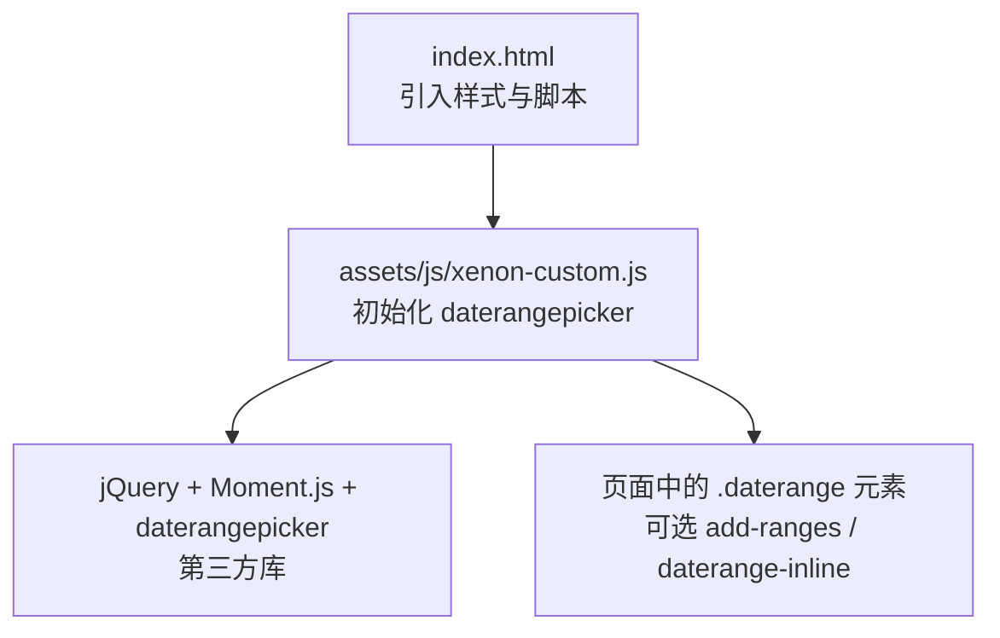
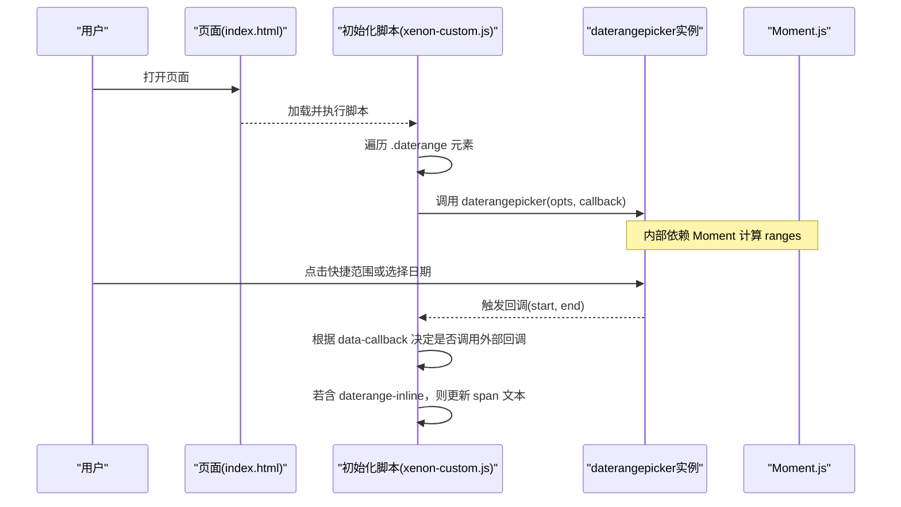
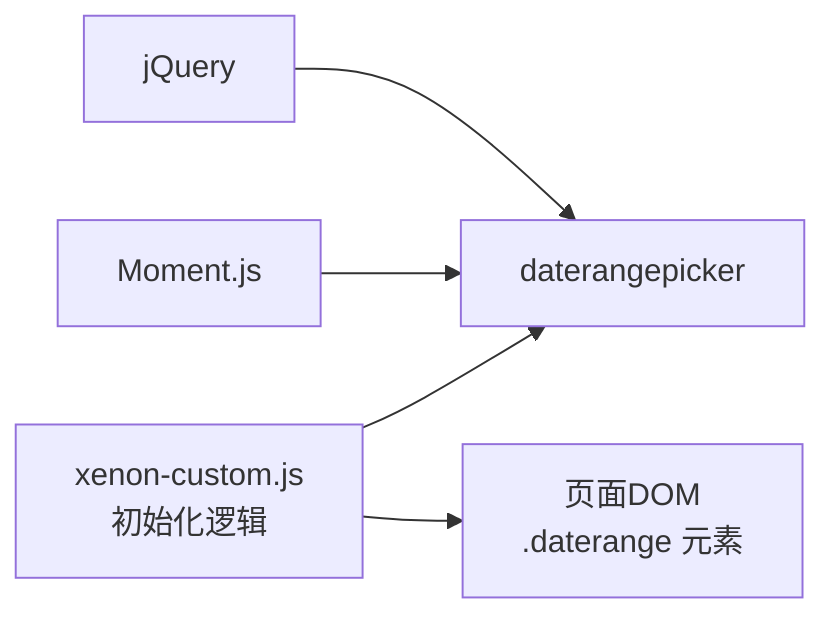

# 日期范围选择器

<cite>
**本文引用的文件**
- [assets/js/xenon-custom.js](file://assets/js/xenon-custom.js)
- [index.html](file://index.html)
</cite>

## 目录
1. [简介](#简介)
2. [项目结构](#项目结构)
3. [核心组件](#核心组件)
4. [架构总览](#架构总览)
5. [详细组件分析](#详细组件分析)
6. [依赖关系分析](#依赖关系分析)
7. [性能考虑](#性能考虑)
8. [故障排查指南](#故障排查指南)
9. [结论](#结论)
10. [附录：使用示例与最佳实践](#附录使用示例与最佳实践)

## 简介
本文件围绕项目中基于 daterangepicker 的“日期范围选择器”实现进行系统化文档说明，覆盖预设范围配置（ranges）、时间选择器集成（timePicker、timePickerIncrement）、分隔符设置（separator）、最小/最大日期限制（minDate、maxDate）、初始日期（startDate、endDate）、回调函数机制、内联显示模式（inline）以及快速范围选择等高级特性。同时提供常见应用场景的配置思路与步骤指引，帮助读者在现有代码基础上快速扩展与定制。

## 项目结构
本项目为纯静态前端站点，日期范围选择器的初始化逻辑集中在统一的前端脚本中，通过类名选择器批量绑定到页面元素。关键位置如下：
- 日期范围选择器初始化与配置：assets/js/xenon-custom.js
- 页面入口与资源引入：index.html

图表来源
- [index.html:1-35](file://index.html#L1-L35)
- [assets/js/xenon-custom.js:404-478](file://assets/js/xenon-custom.js#L404-L478)

章节来源
- [index.html:1-35](file://index.html#L1-L35)
- [assets/js/xenon-custom.js:404-478](file://assets/js/xenon-custom.js#L404-L478)

## 核心组件
- 选择器目标：所有包含类名 daterangepicker 的 DOM 元素将被自动初始化。
- 预设范围（ranges）：当元素带有类名 add-ranges 时，将启用内置的快捷范围集合（如今天、昨天、最近7天、最近30天、本月、上月）。
- 时间选择器集成：通过 timePicker 开启时间选择；timePickerIncrement 控制步进粒度。
- 分隔符（separator）：用于起止日期之间的显示分隔。
- 日期限制：minDate、maxDate 可限制可选范围。
- 初始值：startDate、endDate 可设置默认起始与结束日期。
- 回调函数：选择完成后触发回调，支持读取实例并更新 UI。
- 内联显示：元素带有 daterange-inline 类时，会在容器内直接显示日历并实时更新文本区域。

章节来源
- [assets/js/xenon-custom.js:404-478](file://assets/js/xenon-custom.js#L404-L478)

## 架构总览
下图展示了从页面加载到日期范围选择器初始化、用户交互与回调更新的完整流程。

图表来源
- [assets/js/xenon-custom.js:404-478](file://assets/js/xenon-custom.js#L404-L478)

## 详细组件分析

### 预设范围配置（ranges）
- 行为：当元素具有类名 add-ranges 时，会注入一组常用快捷范围，包括“今天”“昨天”“最近7天”“最近30天”“本月”“上月”。这些范围由 Moment 计算得出。
- 适用场景：报表筛选、数据看板、订单查询等需要快速选择时间段的界面。
- 扩展方式：可在初始化前自定义 ranges 对象，替换默认集合。

章节来源
- [assets/js/xenon-custom.js:410-417](file://assets/js/xenon-custom.js#L410-L417)
- [assets/js/xenon-custom.js:431-434](file://assets/js/xenon-custom.js#L431-L434)

### 时间选择器集成（timePicker、timePickerIncrement）
- timePicker：布尔开关，启用后可在日期选择器中同时选择时分秒。
- timePickerIncrement：数值型步进，控制分钟/秒的递增步长。
- 注意：该项目的初始化逻辑会从元素的属性中读取 timePicker 与 timePickerIncrement，并以默认值 fallback。

章节来源
- [assets/js/xenon-custom.js:420-424](file://assets/js/xenon-custom.js#L420-L424)

### 分隔符设置（separator）
- 作用：定义起止日期之间的显示分隔字符串。
- 默认值：初始化时使用固定默认分隔符。
- 动态更新：回调中可通过实例获取当前 separator 并参与格式化输出。

章节来源
- [assets/js/xenon-custom.js:420-425](file://assets/js/xenon-custom.js#L420-L425)
- [assets/js/xenon-custom.js:467-470](file://assets/js/xenon-custom.js#L467-L470)

### 最小/最大日期限制（minDate、maxDate）
- 作用：限制可选日期范围，防止用户选择不合法的时间段。
- 配置来源：从元素属性读取 minDate、maxDate，若存在则注入到 opts。
- 建议：结合业务规则（如仅允许未来日期、财务月度等）设置合理边界。

章节来源
- [assets/js/xenon-custom.js:426-444](file://assets/js/xenon-custom.js#L426-L444)

### 初始日期设置（startDate、endDate）
- 作用：为选择器设置默认起始与结束日期。
- 配置来源：从元素属性读取 startDate、endDate，若存在则注入到 opts。
- 建议：常用于“最近7天”“本月”等默认视图。

章节来源
- [assets/js/xenon-custom.js:426-454](file://assets/js/xenon-custom.js#L426-L454)

### 回调函数机制
- 触发时机：每次选择完成都会触发回调，参数为 start、end。
- 功能点：
  - 若元素带有 data-callback，则调用外部回调测试函数（便于接入业务逻辑）。
  - 若元素带有 daterange-inline，则在容器内更新 span 文本，格式化为所选日期与分隔符组合。
- 扩展建议：在回调中执行数据刷新、URL 参数更新、埋点上报等操作。

章节来源
- [assets/js/xenon-custom.js:457-476](file://assets/js/xenon-custom.js#L457-L476)

### 内联显示模式（daterange-inline）
- 行为：当元素包含 daterange-inline 类时，选择器以内联形式渲染，并在选择变化时实时更新所在容器的 span 文本。
- 适用场景：仪表盘、卡片式筛选区、无需弹出框的场景。

章节来源
- [assets/js/xenon-custom.js:467-470](file://assets/js/xenon-custom.js#L467-L470)

### 快速范围选择（add-ranges）
- 行为：当元素包含 add-ranges 类时，启用快捷范围面板，隐藏默认日历按钮展示（移除 show-calendar 类），提升操作效率。
- 适用场景：高频时间段切换，如“今天/昨天/近7天/近30天/本月/上月”。

章节来源
- [assets/js/xenon-custom.js:431-434](file://assets/js/xenon-custom.js#L431-L434)
- [assets/js/xenon-custom.js:473-476](file://assets/js/xenon-custom.js#L473-L476)

## 依赖关系分析
- jQuery：作为选择器与事件绑定的基础。
- Moment.js：用于日期计算与格式化（构建 ranges、format）。
- daterangepicker：核心插件，提供日期范围选择能力。
- 初始化脚本：集中处理配置注入、回调与 UI 更新。

图表来源
- [assets/js/xenon-custom.js:404-478](file://assets/js/xenon-custom.js#L404-L478)

章节来源
- [assets/js/xenon-custom.js:404-478](file://assets/js/xenon-custom.js#L404-L478)

## 性能考虑
- 批量初始化：通过类名选择器一次性初始化多个元素，减少重复开销。
- 轻量配置：仅在必要时启用 timePicker，避免不必要的 UI 与计算。
- 范围缓存：如需频繁切换 ranges，可在上层缓存结果以减少重复计算。
- 回调节流：在回调中进行网络请求或复杂计算时，建议加入防抖/节流策略。

[本节为通用指导，不直接引用具体文件]

## 故障排查指南
- 未显示快捷范围：确认元素是否包含 add-ranges 类；检查是否成功注入 ranges。
- 无法选择时间：确认 timePicker 已启用，且 timePickerIncrement 设置合理。
- 日期不可选：检查 minDate、maxDate 是否限制了可选区间。
- 内联更新不生效：确认元素包含 daterange-inline 类，并确保回调中正确更新 span。
- 回调未触发：检查是否存在 data-callback 及外部回调函数是否正确注册。

章节来源
- [assets/js/xenon-custom.js:431-434](file://assets/js/xenon-custom.js#L431-L434)
- [assets/js/xenon-custom.js:420-424](file://assets/js/xenon-custom.js#L420-L424)
- [assets/js/xenon-custom.js:426-454](file://assets/js/xenon-custom.js#L426-L454)
- [assets/js/xenon-custom.js:467-476](file://assets/js/xenon-custom.js#L467-L476)

## 结论
本项目通过统一的初始化脚本对 daterangepicker 进行了封装与增强，提供了开箱即用的快捷范围、时间选择、分隔符、日期限制、初始值、回调与内联显示等能力。开发者只需在 HTML 元素上添加相应类名与属性，即可快速获得丰富的日期范围选择体验，并通过回调机制灵活对接业务逻辑。

[本节为总结性内容，不直接引用具体文件]

## 附录：使用示例与最佳实践

### 常用时间范围预设
- 启用快捷范围：为目标输入框添加类名 add-ranges。
- 效果：出现“今天/昨天/最近7天/最近30天/本月/上月”等选项，便于快速筛选。

章节来源
- [assets/js/xenon-custom.js:410-417](file://assets/js/xenon-custom.js#L410-L417)
- [assets/js/xenon-custom.js:431-434](file://assets/js/xenon-custom.js#L431-L434)

### 自定义范围配置
- 方法：在初始化前自定义 ranges 对象，覆盖默认集合。
- 建议：按业务需求定义“本周/上周/本季度/本财年”等范围。

章节来源
- [assets/js/xenon-custom.js:410-417](file://assets/js/xenon-custom.js#L410-L417)

### 启用时间选择与步进控制
- 启用时间选择：为元素设置 timePicker 属性为 true。
- 设置步进：通过 timePickerIncrement 指定分钟或秒的步长。

章节来源
- [assets/js/xenon-custom.js:420-424](file://assets/js/xenon-custom.js#L420-L424)

### 设置分隔符
- 方法：通过 separator 属性自定义起止日期之间的显示分隔。
- 建议：根据本地化习惯选择合适分隔符。

章节来源
- [assets/js/xenon-custom.js:420-425](file://assets/js/xenon-custom.js#L420-L425)

### 限制可选日期范围
- 最小/最大日期：通过 minDate、maxDate 限制可选区间。
- 建议：结合业务规则（如仅允许未来日期、财务周期）设置边界。

章节来源
- [assets/js/xenon-custom.js:426-444](file://assets/js/xenon-custom.js#L426-L444)

### 设置初始日期
- 方法：通过 startDate、endDate 设置默认起始与结束日期。
- 建议：常用于“最近7天”“本月”等默认视图。

章节来源
- [assets/js/xenon-custom.js:426-454](file://assets/js/xenon-custom.js#L426-L454)

### 回调与实时数据更新
- 触发时机：选择完成后触发回调，参数为 start、end。
- 用法：在回调中执行数据刷新、URL 参数更新、埋点上报等。
- 内联更新：若元素包含 daterange-inline，将在容器内更新 span 文本。

章节来源
- [assets/js/xenon-custom.js:457-476](file://assets/js/xenon-custom.js#L457-L476)

### 内联显示模式
- 方法：为目标元素添加 daterange-inline 类。
- 效果：以嵌入方式显示日历，并在选择变化时实时更新文本。

章节来源
- [assets/js/xenon-custom.js:467-470](file://assets/js/xenon-custom.js#L467-L470)

### 快速范围选择
- 方法：为目标元素添加 add-ranges 类。
- 效果：启用快捷范围面板，隐藏默认日历按钮展示，提升操作效率。

章节来源
- [assets/js/xenon-custom.js:431-434](file://assets/js/xenon-custom.js#L431-L434)
- [assets/js/xenon-custom.js:473-476](file://assets/js/xenon-custom.js#L473-L476)