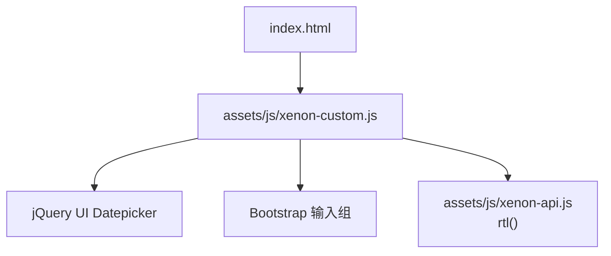
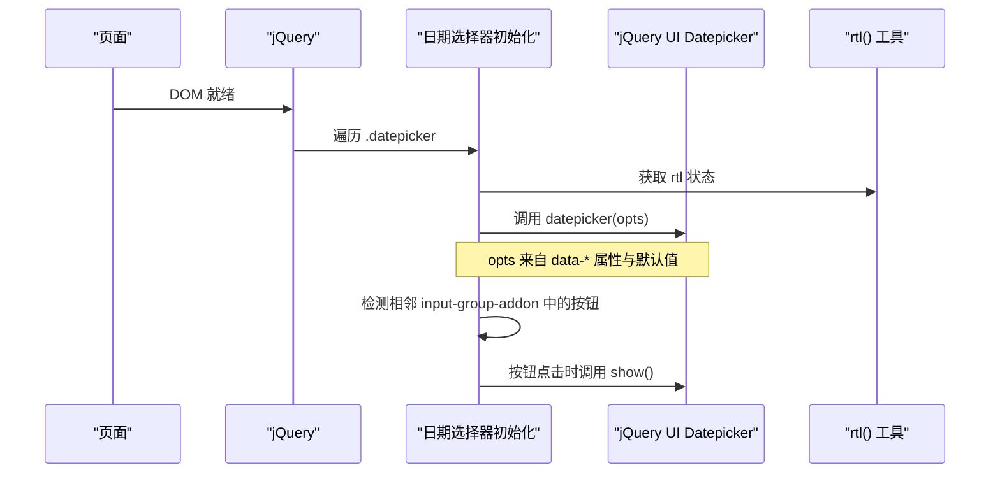
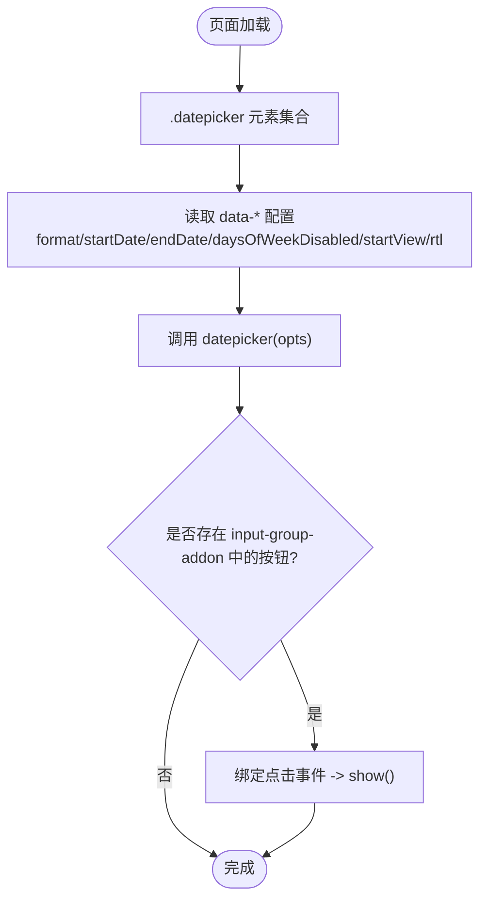
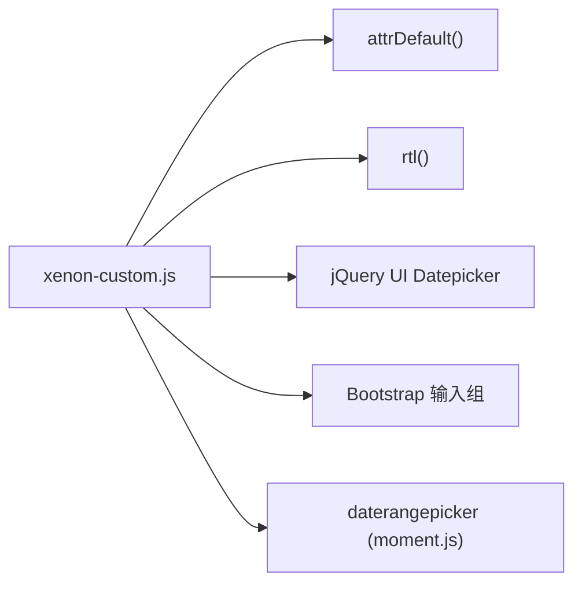

# 日期选择器组件

<cite>
**本文引用的文件**
- [assets/js/xenon-custom.js](file://assets/js/xenon-custom.js)
- [assets/js/xenon-api.js](file://assets/js/xenon-api.js)
- [index.html](file://index.html)
</cite>

## 目录
1. [简介](#简介)
2. [项目结构](#项目结构)
3. [核心组件](#核心组件)
4. [架构总览](#架构总览)
5. [详细组件分析](#详细组件分析)
6. [依赖关系分析](#依赖关系分析)
7. [性能考虑](#性能考虑)
8. [故障排查指南](#故障排查指南)
9. [结论](#结论)
10. [附录：配置与使用示例](#附录配置与使用示例)

## 简介
本组件基于 jQuery UI Datepicker，提供统一的初始化、配置读取、RTL 语言支持、Bootstrap 输入组集成以及按钮触发机制。通过 data-* 属性进行声明式配置，支持日期格式、起始/结束日期限制、禁用星期、初始视图模式等常用能力，并兼容日期范围选择器（daterangepicker）以扩展场景。

## 项目结构
- 前端资源位于 assets 目录，其中 JS 逻辑集中在 xenon-custom.js，RTL 检测工具在 xenon-api.js。
- 页面入口 index.html 引入 Bootstrap、jQuery 及自定义脚本，为组件运行提供基础环境。

图表来源
- [assets/js/xenon-custom.js:361-400](file://assets/js/xenon-custom.js#L361-L400)
- [assets/js/xenon-api.js:8-16](file://assets/js/xenon-api.js#L8-L16)
- [index.html:21-31](file://index.html#L21-L31)

章节来源
- [index.html:21-31](file://index.html#L21-L31)
- [assets/js/xenon-custom.js:361-400](file://assets/js/xenon-custom.js#L361-L400)
- [assets/js/xenon-api.js:8-16](file://assets/js/xenon-api.js#L8-L16)

## 核心组件
- 日期选择器初始化：自动查找所有 .datepicker 元素并调用 datepicker 插件。
- 配置读取：通过 attrDefault 从元素的 data-* 属性读取配置，并提供默认值。
- RTL 支持：根据 html 的 dir 属性判断是否启用 RTL。
- 输入组集成：若相邻存在 input-group-addon 且包含 a 标签，则点击该按钮可触发显示日历。
- 事件处理：通过 show 方法打开日历；如需监听选择结果，可在外部绑定相应事件或使用回调。

章节来源
- [assets/js/xenon-custom.js:361-400](file://assets/js/xenon-custom.js#L361-L400)
- [assets/js/xenon-custom.js:1609-1617](file://assets/js/xenon-custom.js#L1609-L1617)
- [assets/js/xenon-api.js:8-16](file://assets/js/xenon-api.js#L8-L16)

## 架构总览
日期选择器的初始化流程如下：

图表来源
- [assets/js/xenon-custom.js:361-400](file://assets/js/xenon-custom.js#L361-L400)
- [assets/js/xenon-api.js:8-16](file://assets/js/xenon-api.js#L8-L16)

## 详细组件分析

### 配置项说明（data-* 属性）
- format：日期显示格式，默认 mm/dd/yyyy。用于控制输入框和日历显示的日期格式。
- startDate：可选的最小日期，限制用户不可选择早于该日期的选项。
- endDate：可选的最大日期，限制用户不可选择晚于该日期的选项。
- daysOfWeekDisabled：禁用的星期数组，传入数字表示星期几（例如 0 表示周日）。
- startView：初始视图模式，默认 0（天视图），可设置为月或年视图以提升大范围选择效率。
- rtl：是否启用从右到左布局，由 rtl() 自动检测 html[dir="rtl"] 决定。

以上配置均通过 attrDefault 从对应元素的 data-* 属性中读取，未设置时使用默认值。

章节来源
- [assets/js/xenon-custom.js:361-400](file://assets/js/xenon-custom.js#L361-L400)
- [assets/js/xenon-custom.js:1609-1617](file://assets/js/xenon-custom.js#L1609-L1617)
- [assets/js/xenon-api.js:8-16](file://assets/js/xenon-api.js#L8-L16)

### RTL 语言支持
- rtl() 函数检查 window.isRTL 缓存或直接读取 html.dir，返回布尔值。
- 初始化时将 rtl 注入到 datepicker 配置，使日历方向与页面方向一致。

章节来源
- [assets/js/xenon-api.js:8-16](file://assets/js/xenon-api.js#L8-L16)
- [assets/js/xenon-custom.js:361-400](file://assets/js/xenon-custom.js#L361-L400)

### 输入组集成与按钮触发机制
- 当 .datepicker 前后紧邻的元素是 .input-group-addon 且包含 <a> 时，点击该链接会阻止默认行为并调用 datepicker('show') 打开日历。
- 该机制使得日期选择器可与 Bootstrap 输入组无缝集成，提供直观的图标按钮触发体验。

章节来源
- [assets/js/xenon-custom.js:361-400](file://assets/js/xenon-custom.js#L361-L400)

### 事件处理机制
- 展示日历：通过 datepicker('show') 在按钮点击时触发。
- 选择完成：可通过 jQuery 事件系统监听 datepicker 的选择事件（如 changeDate），或在外部业务逻辑中读取输入框的值进行处理。
- 范围选择：对于 daterangepicker，支持 ranges 预设、minDate/maxDate、startDate/endDate 等配置，并在选择完成后执行回调更新显示。

章节来源
- [assets/js/xenon-custom.js:361-400](file://assets/js/xenon-custom.js#L361-L400)
- [assets/js/xenon-custom.js:404-478](file://assets/js/xenon-custom.js#L404-L478)

### 流程图：日期选择器初始化与交互

图表来源
- [assets/js/xenon-custom.js:361-400](file://assets/js/xenon-custom.js#L361-L400)

## 依赖关系分析
- 运行时依赖：
  - jQuery：用于 DOM 操作与事件绑定。
  - jQuery UI Datepicker：提供日期选择功能。
  - Bootstrap 输入组：样式与布局容器。
  - moment.js（可选）：用于日期范围选择器的时间计算与格式化。
- 内部依赖：
  - attrDefault：统一读取 data-* 属性并提供默认值。
  - rtl()：检测页面方向并返回布尔值。

图表来源
- [assets/js/xenon-custom.js:361-400](file://assets/js/xenon-custom.js#L361-L400)
- [assets/js/xenon-custom.js:404-478](file://assets/js/xenon-custom.js#L404-L478)
- [assets/js/xenon-custom.js:1609-1617](file://assets/js/xenon-custom.js#L1609-L1617)
- [assets/js/xenon-api.js:8-16](file://assets/js/xenon-api.js#L8-L16)

章节来源
- [assets/js/xenon-custom.js:361-400](file://assets/js/xenon-custom.js#L361-L400)
- [assets/js/xenon-custom.js:404-478](file://assets/js/xenon-custom.js#L404-L478)
- [assets/js/xenon-custom.js:1609-1617](file://assets/js/xenon-custom.js#L1609-L1617)
- [assets/js/xenon-api.js:8-16](file://assets/js/xenon-api.js#L8-L16)

## 性能考虑
- 批量初始化：对 .datepicker 使用 each 遍历并一次性初始化，减少重复开销。
- 配置读取优化：attrDefault 仅读取一次 data-* 属性，避免多次查询。
- 事件绑定最小化：仅在检测到相邻按钮时绑定 click 事件，降低不必要的监听。
- 范围选择器：ranges 预置对象按需添加，避免无谓的计算与渲染。

[本节为通用性能建议，不直接分析具体代码]

## 故障排查指南
- 日期选择器未生效：
  - 确认已引入 jQuery 与 jQuery UI Datepicker。
  - 检查元素是否带有 .datepicker 类名。
  - 查看浏览器控制台是否有脚本加载错误。
- 按钮无法触发日历：
  - 确保相邻元素具有 .input-group-addon 类且包含 <a> 标签。
  - 检查是否被其他脚本阻止了默认行为。
- RTL 方向异常：
  - 确认 html 标签设置了 dir="rtl"。
  - 检查 rtl() 返回值是否符合预期。
- 日期范围限制无效：
  - 核对 startDate/endDate 的格式是否与 format 一致。
  - 确认 daysOfWeekDisabled 的数值是否正确映射到星期。

章节来源
- [assets/js/xenon-custom.js:361-400](file://assets/js/xenon-custom.js#L361-L400)
- [assets/js/xenon-api.js:8-16](file://assets/js/xenon-api.js#L8-L16)

## 结论
该日期选择器组件通过声明式配置与自动化初始化，提供了简洁易用的日期选择能力。结合 Bootstrap 输入组与 RTL 支持，能够适配多种界面风格与国际化需求。配合日期范围选择器，可满足更复杂的筛选场景。建议在项目中复用此初始化逻辑，并通过 data-* 属性灵活定制行为。

[本节为总结性内容，不直接分析具体代码]

## 附录：配置与使用示例

### 基础日期选择
- 在输入框上添加 class="datepicker"。
- 可选：在输入框上添加 data-format 指定日期格式。
- 效果：点击输入框或相邻按钮即可打开日历选择日期。

章节来源
- [assets/js/xenon-custom.js:361-400](file://assets/js/xenon-custom.js#L361-L400)

### 日期范围限制
- 使用 data-start-date 与 data-end-date 设置可选范围。
- 使用 data-days-of-week-disabled 设置禁用的星期（数组形式）。
- 效果：超出范围的日期不可选，指定星期不可选。

章节来源
- [assets/js/xenon-custom.js:361-400](file://assets/js/xenon-custom.js#L361-L400)

### 自定义格式化
- 使用 data-format 指定显示格式（如 yyyy-mm-dd）。
- 效果：输入框与日历显示遵循指定格式。

章节来源
- [assets/js/xenon-custom.js:361-400](file://assets/js/xenon-custom.js#L361-L400)

### 初始视图模式
- 使用 data-start-view 设置初始视图（0=天，1=月，2=年）。
- 效果：打开日历时直接进入指定视图，便于大范围选择。

章节来源
- [assets/js/xenon-custom.js:361-400](file://assets/js/xenon-custom.js#L361-L400)

### 与 Bootstrap 输入组集成
- 将 .datepicker 放入 .input-group 中，并在 .input-group-addon 内放置一个 <a> 作为触发按钮。
- 效果：点击按钮即可打开日历，无需聚焦输入框。

章节来源
- [assets/js/xenon-custom.js:361-400](file://assets/js/xenon-custom.js#L361-L400)

### 事件处理机制
- 展示日历：通过按钮点击触发 datepicker('show')。
- 选择完成：可在外部监听 changeDate 事件或读取输入框值进行处理。
- 范围选择：daterangepicker 支持 ranges、minDate/maxDate、startDate/endDate，并在回调中更新显示。

章节来源
- [assets/js/xenon-custom.js:361-400](file://assets/js/xenon-custom.js#L361-L400)
- [assets/js/xenon-custom.js:404-478](file://assets/js/xenon-custom.js#L404-L478)