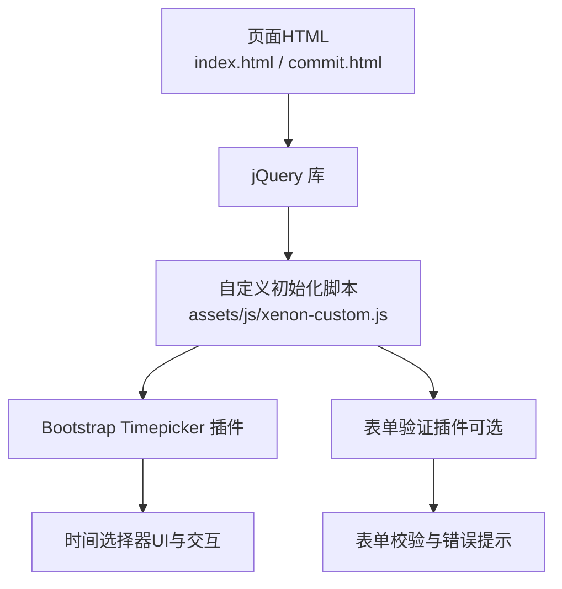
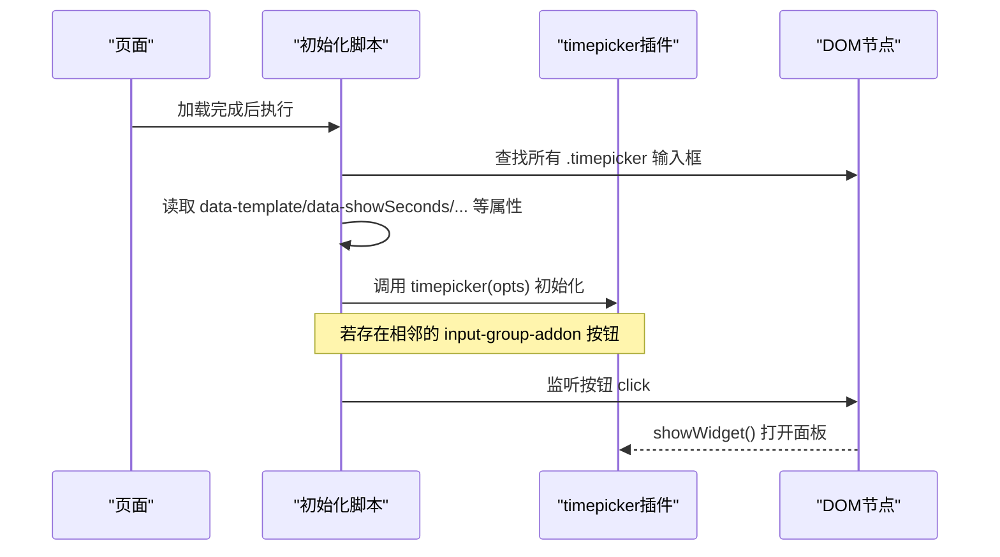
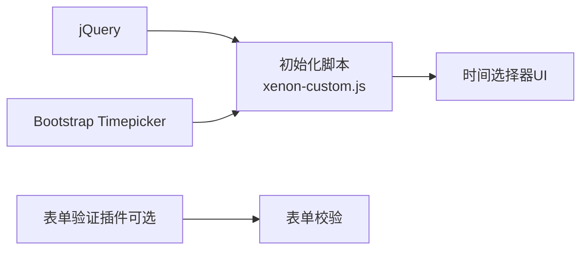

# 时间选择器组件

<cite>
**本文引用的文件**
- [assets/js/xenon-custom.js](file://assets/js/xenon-custom.js)
- [index.html](file://index.html)
- [commit.html](file://commit.html)
</cite>

## 目录
1. [简介](#简介)
2. [项目结构](#项目结构)
3. [核心组件](#核心组件)
4. [架构总览](#架构总览)
5. [详细组件分析](#详细组件分析)
6. [依赖关系分析](#依赖关系分析)
7. [性能考量](#性能考量)
8. [故障排查指南](#故障排查指南)
9. [结论](#结论)
10. [附录：使用示例与最佳实践](#附录使用示例与最佳实践)

## 简介
本组件文档聚焦于基于 Bootstrap Timepicker 的时间选择器实现，围绕模板配置、秒数显示控制、默认时间设置、12/24小时制切换、分钟/秒步进精度、输入组集成、按钮触发机制以及键盘导航支持等关键能力进行系统化说明，并提供常见用法与表单验证集成建议。

## 项目结构
本项目为纯静态站点，时间选择器由通用初始化脚本统一装配，页面通过引入 jQuery 与第三方插件（如 Bootstrap Timepicker）后，在初始化阶段自动对带有特定类名的输入框进行增强。

图表来源
- [assets/js/xenon-custom.js:482-521](file://assets/js/xenon-custom.js#L482-L521)
- [index.html:1-120](file://index.html#L1-L120)
- [commit.html:1-120](file://commit.html#L1-L120)

章节来源
- [index.html:1-120](file://index.html#L1-L120)
- [commit.html:1-120](file://commit.html#L1-L120)
- [assets/js/xenon-custom.js:482-521](file://assets/js/xenon-custom.js#L482-L521)

## 核心组件
时间选择器的核心由以下部分构成：
- 初始化逻辑：遍历所有 class 为 timepicker 的输入框，读取 data-* 属性并构建配置对象，调用 timepicker 插件完成增强。
- 配置项：template、showSeconds、defaultTime、showMeridian、minuteStep、secondStep。
- 输入组集成：若输入框前后存在 input-group-addon 且包含可点击元素，则绑定点击事件以打开时间选择器面板。
- 键盘导航：由底层 timepicker 插件提供（例如上下键调整数值、Enter确认等），具体行为取决于所引入的插件版本。

章节来源
- [assets/js/xenon-custom.js:482-521](file://assets/js/xenon-custom.js#L482-L521)

## 架构总览
时间选择器的装配流程如下：

图表来源
- [assets/js/xenon-custom.js:482-521](file://assets/js/xenon-custom.js#L482-L521)

## 详细组件分析

### 模板配置（template）
- 作用：允许通过 data-template 指定时间选择器的模板字符串或布局方式，用于定制显示样式或布局。
- 读取方式：初始化时从对应元素的 data-template 属性读取；未设置时回退到插件默认模板。
- 典型场景：需要自定义时间格式或局部样式时，可通过该选项注入模板片段。

章节来源
- [assets/js/xenon-custom.js:488-494](file://assets/js/xenon-custom.js#L488-L494)

### 秒数显示控制（showSeconds）
- 作用：控制是否在时间选择器中显示秒字段。
- 读取方式：从 data-showSeconds 读取布尔值；未设置时采用默认值（false）。
- 影响范围：影响 UI 是否渲染秒列及用户是否能直接编辑秒。

章节来源
- [assets/js/xenon-custom.js:488-494](file://assets/js/xenon-custom.js#L488-L494)

### 默认时间设置（defaultTime）
- 作用：设置初始时间。支持传入具体时间字符串或特殊关键字（如“current”表示当前时间）。
- 读取方式：从 data-defaultTime 读取；未设置时采用默认值（'current'）。
- 行为说明：当设置为 'current' 时，组件会取当前系统时间作为初始值；也可传入符合插件要求的时间字符串。

章节来源
- [assets/js/xenon-custom.js:488-494](file://assets/js/xenon-custom.js#L488-L494)

### 12/24小时制切换（showMeridian）
- 作用：控制是否显示上午/下午标识（即12小时制开关）。
- 读取方式：从 data-showMeridian 读取布尔值；未设置时默认为 true（显示AM/PM）。
- 使用建议：设置为 false 将进入24小时制显示模式。

章节来源
- [assets/js/xenon-custom.js:488-494](file://assets/js/xenon-custom.js#L488-L494)

### 分钟步进（minuteStep）与秒数步进（secondStep）
- 作用：分别控制分钟和秒的步进粒度，决定用户增减时的步长。
- 读取方式：从 data-minuteStep 与 data-secondStep 读取；默认值为 15（分钟与秒均按15递增/递减）。
- 适用场景：根据业务需求提高或降低时间选择的精度，例如医疗排班可能需要1分钟步进，而会议预约可能使用15分钟步进。

章节来源
- [assets/js/xenon-custom.js:488-494](file://assets/js/xenon-custom.js#L488-L494)

### 输入组集成与按钮触发机制
- 集成方式：若 timepicker 输入框的前后紧邻元素是 input-group-addon 且内部包含可点击元素（如 a 标签），则自动为其绑定点击事件，点击时调用 showWidget() 打开时间选择器面板。
- 触发流程：
  - 检测下一个兄弟节点是否为 input-group-addon 且包含 a 标签；若是，则绑定 click 事件并阻止默认行为，随后调用 showWidget()。
  - 检测上一个兄弟节点是否满足同样条件；若是，则同理绑定事件。
- 优势：无需额外编写事件处理代码，即可在 Bootstrap 输入组中通过按钮快速唤起时间选择器。

章节来源
- [assets/js/xenon-custom.js:496-520](file://assets/js/xenon-custom.js#L496-L520)

### 键盘导航支持
- 说明：键盘导航能力由底层 timepicker 插件提供，通常包括方向键调整数值、Enter确认、Esc取消等。
- 注意：具体按键行为与可用功能取决于实际引入的 timepicker 插件版本与配置。

章节来源
- [assets/js/xenon-custom.js:482-521](file://assets/js/xenon-custom.js#L482-L521)

## 依赖关系分析
时间选择器的运行依赖如下：
- jQuery：用于DOM操作与事件绑定。
- Bootstrap Timepicker：提供时间选择器UI与交互逻辑。
- 可选：表单验证插件（如 jQuery Validate），用于与表单系统集成。

图表来源
- [assets/js/xenon-custom.js:482-521](file://assets/js/xenon-custom.js#L482-L521)
- [assets/js/xenon-custom.js:578-667](file://assets/js/xenon-custom.js#L578-L667)

章节来源
- [assets/js/xenon-custom.js:482-521](file://assets/js/xenon-custom.js#L482-L521)
- [assets/js/xenon-custom.js:578-667](file://assets/js/xenon-custom.js#L578-L667)

## 性能考量
- 初始化开销：对所有 .timepicker 元素逐一初始化，建议在大型表单中按需启用或延迟初始化以减少首屏负担。
- 步进粒度：过小的 minuteStep/secondStep 会增加渲染与交互复杂度，需权衡用户体验与性能。
- 模板复杂度：自定义 template 若过于复杂，可能影响渲染性能，应保持简洁。

[本节为通用指导，不直接分析具体文件]

## 故障排查指南
- 时间选择器未生效
  - 检查页面是否正确引入 jQuery 与 timepicker 插件。
  - 确认输入框是否添加了 class="timepicker"。
  - 查看控制台是否有插件方法缺失报错。
- 按钮无法打开面板
  - 确认 input-group-addon 内是否存在可点击元素（如 a 标签）。
  - 检查事件是否被其他脚本拦截或阻止冒泡。
- 默认时间未按预期设置
  - 确认 data-defaultTime 的值是否符合插件要求（如 'current' 或合法时间字符串）。
- 分钟/秒步进不符合预期
  - 检查 data-minuteStep 与 data-secondStep 的设置值。
- 12/24小时制显示异常
  - 确认 data-showMeridian 的布尔值设置是否正确。

章节来源
- [assets/js/xenon-custom.js:482-521](file://assets/js/xenon-custom.js#L482-L521)

## 结论
本项目的 timepicker 初始化逻辑通过统一的脚本对具备特定类名的输入框进行增强，支持模板定制、秒数显示、默认时间、12/24小时制切换以及分钟/秒步进精度控制。结合 Bootstrap 输入组，提供了便捷的按钮触发机制。配合表单验证插件可实现完整的表单体验。

[本节为总结性内容，不直接分析具体文件]

## 附录：使用示例与最佳实践

### 基础时间选择
- 在页面中添加一个 class 为 timepicker 的输入框。
- 确保已引入 jQuery 与 timepicker 插件。
- 初始化脚本会自动识别并增强该输入框。

章节来源
- [assets/js/xenon-custom.js:482-521](file://assets/js/xenon-custom.js#L482-L521)

### 自定义步进间隔
- 在输入框上设置 data-minuteStep 与 data-secondStep 来定义分钟与秒的步进值。
- 示例：设置 data-minuteStep="5" 可使分钟按5分钟步进；data-secondStep="10" 使秒按10秒步进。

章节来源
- [assets/js/xenon-custom.js:488-494](file://assets/js/xenon-custom.js#L488-L494)

### 12/24小时制切换
- 设置 data-showMeridian="true" 显示AM/PM（12小时制）。
- 设置 data-showMeridian="false" 隐藏AM/PM（24小时制）。

章节来源
- [assets/js/xenon-custom.js:488-494](file://assets/js/xenon-custom.js#L488-L494)

### 显示秒数
- 设置 data-showSeconds="true" 以显示秒字段。
- 未设置时默认不显示秒。

章节来源
- [assets/js/xenon-custom.js:488-494](file://assets/js/xenon-custom.js#L488-L494)

### 默认时间设置
- 设置 data-defaultTime="current" 使用当前时间作为默认值。
- 也可传入符合插件要求的时间字符串作为默认时间。

章节来源
- [assets/js/xenon-custom.js:488-494](file://assets/js/xenon-custom.js#L488-L494)

### 输入组集成与按钮触发
- 在 timepicker 输入框前后添加 input-group-addon，并在其中放置可点击元素（如 a 标签）。
- 点击该元素即可打开时间选择器面板，无需额外编写事件代码。

章节来源
- [assets/js/xenon-custom.js:496-520](file://assets/js/xenon-custom.js#L496-L520)

### 与表单验证系统集成
- 使用表单验证插件（如 jQuery Validate）时，可将 timepicker 输入框纳入验证规则。
- 验证错误提示位置可由验证插件的配置控制，确保与时间选择器UI协调。
- 提交前可读取 timepicker 输入框的值进行业务校验。

章节来源
- [assets/js/xenon-custom.js:578-667](file://assets/js/xenon-custom.js#L578-L667)