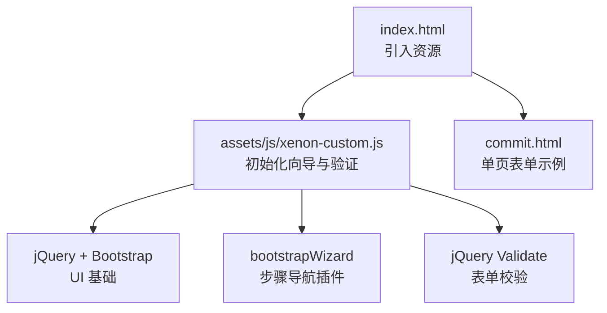
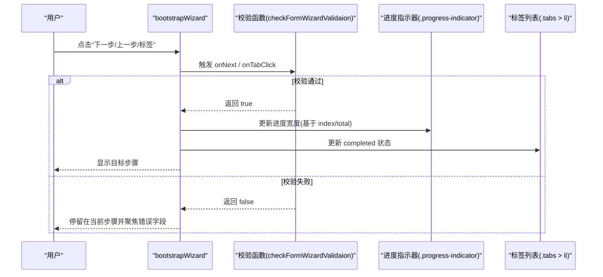
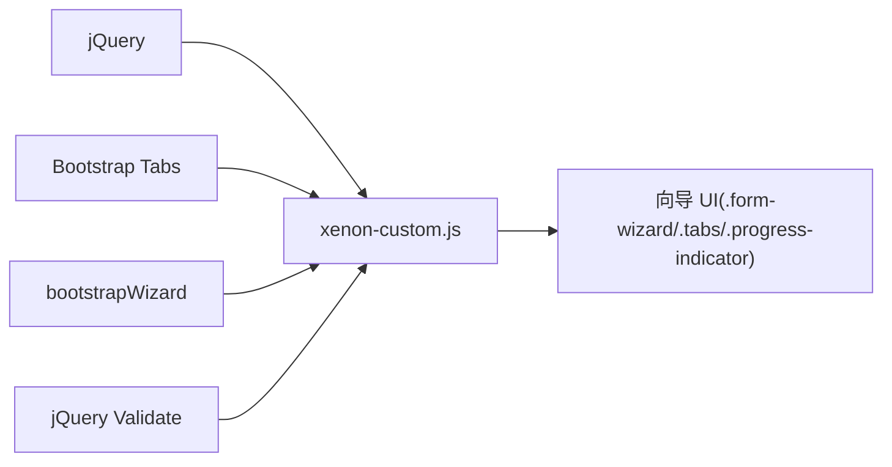

# 表单向导组件

<cite>
**本文引用的文件**
- [assets/js/xenon-custom.js](file://assets/js/xenon-custom.js)
- [commit.html](file://commit.html)
- [index.html](file://index.html)
</cite>

## 目录
1. [简介](#简介)
2. [项目结构](#项目结构)
3. [核心组件](#核心组件)
4. [架构总览](#架构总览)
5. [详细组件分析](#详细组件分析)
6. [依赖关系分析](#依赖关系分析)
7. [性能考虑](#性能考虑)
8. [故障排查指南](#故障排查指南)
9. [结论](#结论)
10. [附录：使用示例与最佳实践](#附录使用示例与最佳实践)

## 简介
本文件围绕“表单向导组件”的实现进行系统化文档化，重点解析项目中对 bootstrapWizard 的集成与扩展。内容涵盖向导步骤管理、进度指示器配置、导航控制、表单验证集成（含步骤间验证、完成状态检查、错误阻止跳转）、进度条计算、标签页状态管理、键盘导航支持、回调函数（onTabShow、onNext、onTabClick）与事件处理机制、动态内容加载等。同时提供多步骤表单、条件验证、进度跟踪等应用场景的使用建议与最佳实践。

## 项目结构
本项目为纯静态站点，包含首页、提交页面及通用样式/脚本资源。表单向导的核心逻辑集中在主脚本中，通过检测并初始化 bootstrapWizard，结合 jQuery Validate 实现步骤校验与导航控制；提交页面展示了单页表单的验证与交互模式，可作为向导图示化的参考。

图表来源
- [index.html:1-35](file://index.html#L1-L35)
- [assets/js/xenon-custom.js:747-801](file://assets/js/xenon-custom.js#L747-L801)

章节来源
- [index.html:1-35](file://index.html#L1-L35)
- [assets/js/xenon-custom.js:747-801](file://assets/js/xenon-custom.js#L747-L801)

## 核心组件
- 向导初始化与生命周期
  - 在 DOM 就绪后检测 bootstrapWizard 是否可用，若存在则对所有 .form-wizard 容器进行初始化。
  - 读取当前激活步骤索引，用于初始进度与标签状态设置。
- 进度指示器
  - 根据当前步骤位置计算进度百分比，更新 .progress-indicator 宽度。
  - 将已完成的步骤标记为 completed，以视觉反馈用户进度。
- 导航控制与校验
  - onNext 与 onTabClick 钩子统一调用校验函数，未通过时阻止跳转。
  - 校验失败时聚焦到第一个无效字段，提升可访问性。
- 标签页状态管理
  - onTabShow 中根据目标步骤重新计算进度并更新标签页的 completed 状态。
- 自定义分页按钮拦截
  - 对 pager 中的链接点击进行默认行为阻止，避免与向导内部导航冲突。

章节来源
- [assets/js/xenon-custom.js:747-801](file://assets/js/xenon-custom.js#L747-L801)

## 架构总览
下图展示表单向导从初始化到导航切换的完整流程，包括进度更新、校验拦截与状态同步。

图表来源
- [assets/js/xenon-custom.js:757-791](file://assets/js/xenon-custom.js#L757-L791)

## 详细组件分析

### 向导初始化与步骤管理
- 选择器与作用域
  - 针对所有 .form-wizard 容器逐一初始化，便于在同一页面复用多个向导实例。
- 初始状态恢复
  - 读取 active 步骤索引，若大于 0，则提前设置进度条宽度与已完成标签集合，保证刷新或回退后的状态一致性。
- 显示控制
  - 初始化完成后显式调用 show(index)，确保 UI 与数据一致。

章节来源
- [assets/js/xenon-custom.js:749-778](file://assets/js/xenon-custom.js#L749-L778)
- [assets/js/xenon-custom.js:794-800](file://assets/js/xenon-custom.js#L794-L800)

### 进度指示器与标签状态
- 进度计算
  - 在 onTabShow 中，根据目标标签相对于父容器的 left 位置与父容器宽度计算百分比，驱动进度条动画。
- 标签状态
  - 每次切换时，移除所有 completed，再对小于当前索引的标签添加 completed，形成“已完成”视觉效果。
- 初始进度
  - 若初始索引大于 0，则在初始化阶段直接设置进度与 completed 状态，避免闪烁。

章节来源
- [assets/js/xenon-custom.js:773-788](file://assets/js/xenon-custom.js#L773-L788)

### 表单验证集成与导航拦截
- 校验入口
  - checkFormWizardValidaion 作为 onNext 与 onTabClick 的统一校验入口。
- 校验策略
  - 当向导容器带有 validate 类时，调用 jQuery Validate 的 valid() 方法执行校验。
  - 校验失败时，通过 validator.focusInvalid() 聚焦首个错误字段，并返回 false 阻止导航。
- 成功路径
  - 校验通过则返回 true，允许向导继续切换步骤。

章节来源
- [assets/js/xenon-custom.js:757-771](file://assets/js/xenon-custom.js#L757-L771)

### 回调函数与事件处理机制
- onTabShow
  - 负责进度与标签状态的同步更新，确保 UI 与当前步骤一致。
- onNext / onTabClick
  - 统一校验逻辑，防止非法数据进入下一步。
- 分页按钮拦截
  - 对 .pager a 的 click 事件阻止默认行为，避免与向导内部导航冲突。

章节来源
- [assets/js/xenon-custom.js:782-800](file://assets/js/xenon-custom.js#L782-L800)

### 用户体验优化
- 进度可视化
  - 通过进度条与标签 completed 状态，直观反映完成度。
- 错误聚焦
  - 校验失败自动聚焦错误字段，减少用户查找成本。
- 键盘导航支持
  - 向导由 Bootstrap 标签页驱动，天然支持 Tab/Shift+Tab 在标签间移动；结合焦点管理，可进一步提升可访问性。
- 动态内容加载
  - 可在 onTabShow 中按需加载异步内容（如 AJAX），并在加载完成后再次触发向导更新布局，避免尺寸变化导致的进度计算偏差。

[本节为概念性说明，不直接分析具体代码]

## 依赖关系分析
- 运行时依赖
  - jQuery：DOM 操作与事件绑定。
  - Bootstrap 4：标签页结构与样式。
  - bootstrapWizard：步骤导航插件。
  - jQuery Validate：表单校验引擎。
- 耦合与内聚
  - 向导逻辑集中在 xenon-custom.js 中，职责单一，内聚度高。
  - 通过类名约定（validate、form-wizard）与选择器解耦，便于扩展与维护。
- 外部依赖
  - 依赖 HTML 结构中的 .form-wizard、.tabs、.progress-indicator、.pager 等元素。

图表来源
- [assets/js/xenon-custom.js:747-801](file://assets/js/xenon-custom.js#L747-L801)

章节来源
- [assets/js/xenon-custom.js:747-801](file://assets/js/xenon-custom.js#L747-L801)

## 性能考虑
- 初始化开销
  - 仅对 .form-wizard 节点进行遍历与初始化，避免全局扫描带来的性能损耗。
- 进度计算
  - 使用 position().left 与 parent().width 计算百分比，建议在内容稳定后再执行，必要时在 onTabShow 中延迟计算或使用 requestAnimationFrame。
- 事件委托
  - 对 pager 的点击事件采用直接绑定，若未来大量动态生成，可改为事件委托以提升性能。
- 校验频率
  - 仅在导航触发时执行校验，避免频繁重绘与重排。

[本节为通用性能建议，不直接分析具体代码]

## 故障排查指南
- 向导未生效
  - 确认页面已引入 bootstrapWizard 插件与 jQuery。
  - 检查是否存在 .form-wizard 容器且包含 .tabs 与 .progress-indicator。
- 无法跳转到下一步
  - 检查向导容器是否添加了 validate 类，并确保 jQuery Validate 规则正确配置。
  - 查看控制台是否有校验错误信息，必要时在 onNext/onTabClick 中添加日志。
- 进度条异常
  - 确认标签项宽度与容器宽度计算正常，避免图片/字体未加载导致尺寸变化。
  - 在 onTabShow 中增加延时或监听资源加载完成后再计算进度。
- 键盘导航不可用
  - 确保标签项具有正确的 tabindex 与 role="tab"，并由 Bootstrap 标签页渲染。
- 分页按钮冲突
  - 若自定义分页按钮需要跳转，请避免与向导内部导航冲突，或在事件中调用向导 API 而非默认链接跳转。

章节来源
- [assets/js/xenon-custom.js:757-800](file://assets/js/xenon-custom.js#L757-L800)

## 结论
本项目通过 xenon-custom.js 对 bootstrapWizard 进行了轻量而实用的集成与扩展：实现了步骤管理、进度指示、标签状态同步、表单校验拦截与回调控制。整体设计简洁清晰，易于扩展与复用。配合合理的 HTML 结构与 CSS 样式，即可快速构建多步骤表单体验。对于更复杂的场景，可在现有回调基础上扩展异步加载、条件验证与高级交互。

[本节为总结性内容，不直接分析具体代码]

## 附录：使用示例与最佳实践

### 多步骤表单
- 结构要求
  - 外层容器：.form-wizard
  - 标签区：.tabs > li（每个 li 对应一个步骤）
  - 内容区：ul > li（每个 li 对应一个步骤的内容）
  - 进度条：.progress-indicator
  - 可选分页：.pager（如需自定义导航按钮）
- 初始化要点
  - 在 DOM 就绪后，确保 bootstrapWizard 可用，再调用初始化逻辑。
  - 若有默认激活步骤，需在初始化前设置好 active 状态，以便进度与标签状态正确渲染。

章节来源
- [assets/js/xenon-custom.js:749-778](file://assets/js/xenon-custom.js#L749-L778)

### 条件验证
- 在 jQuery Validate 中按步骤定义规则，结合向导的 onNext/onTabClick 钩子，实现步骤级校验。
- 对于复杂条件，可在校验函数中读取相关字段值，动态调整规则或提示文案。

章节来源
- [assets/js/xenon-custom.js:757-771](file://assets/js/xenon-custom.js#L757-L771)

### 进度跟踪
- 利用 onTabShow 更新进度条与标签状态，确保 UI 与步骤一致。
- 若步骤内容包含异步加载，建议在加载完成后再次触发向导布局更新，避免进度计算误差。

章节来源
- [assets/js/xenon-custom.js:782-788](file://assets/js/xenon-custom.js#L782-L788)

### 单页表单参考（提交页）
- commit.html 展示了单页表单的验证与交互模式，可作为向导图示化的参考，帮助理解错误提示、输入反馈与提交流程。

章节来源
- [commit.html:287-378](file://commit.html#L287-L378)