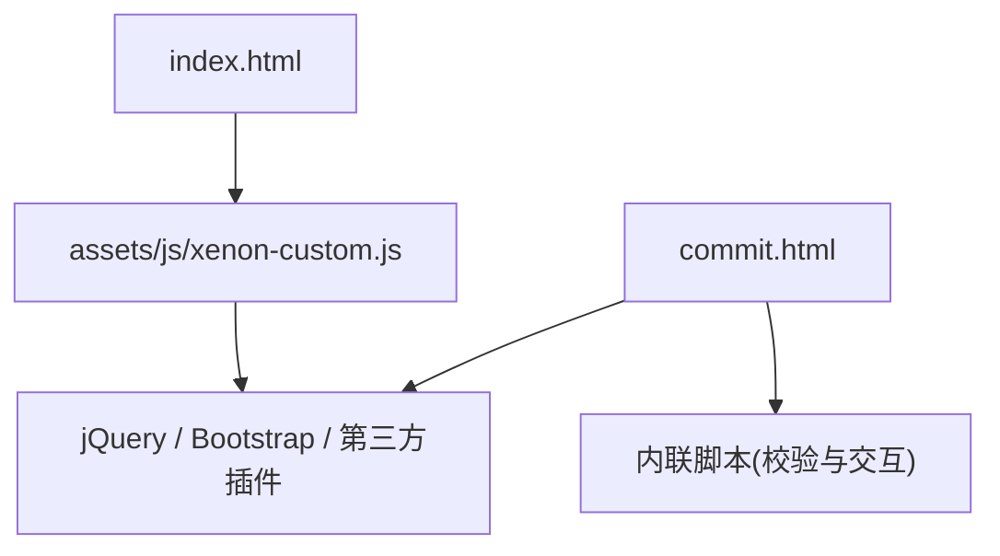
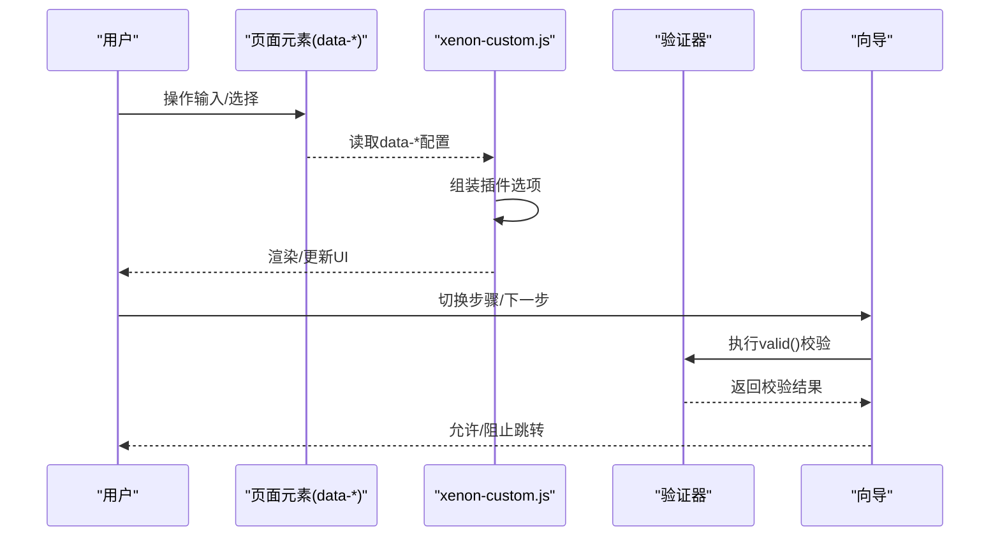
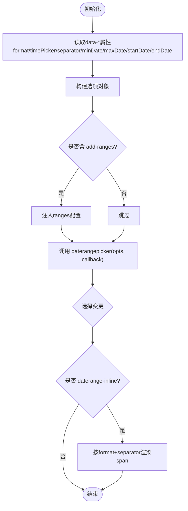
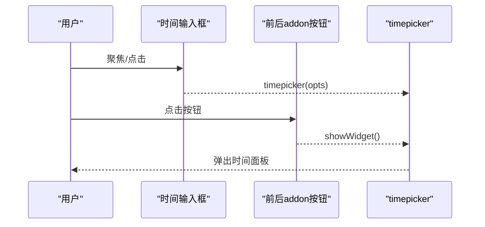
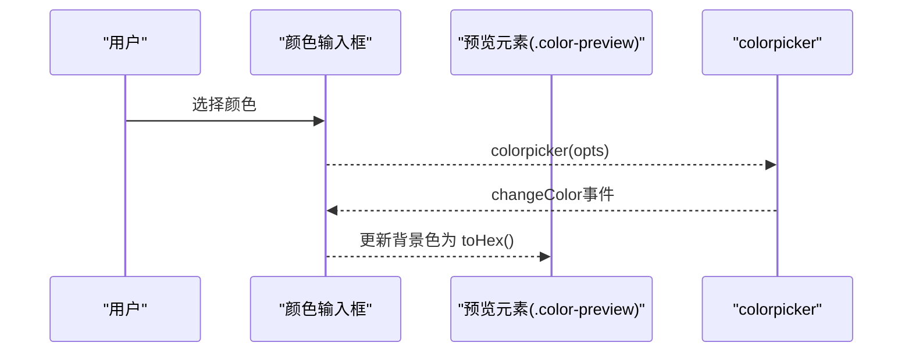
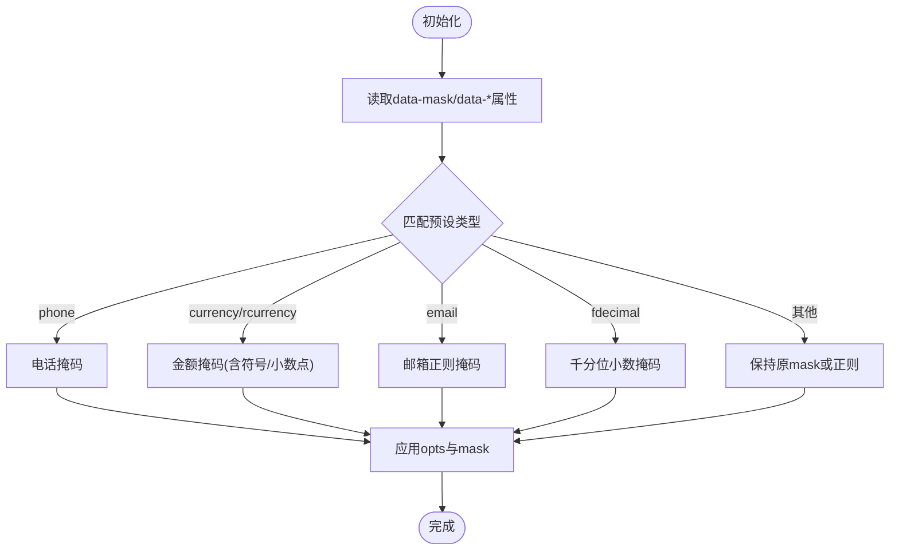
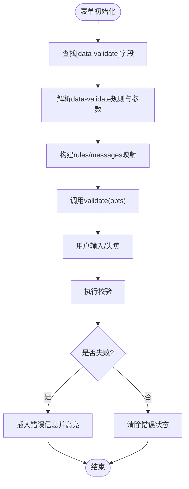
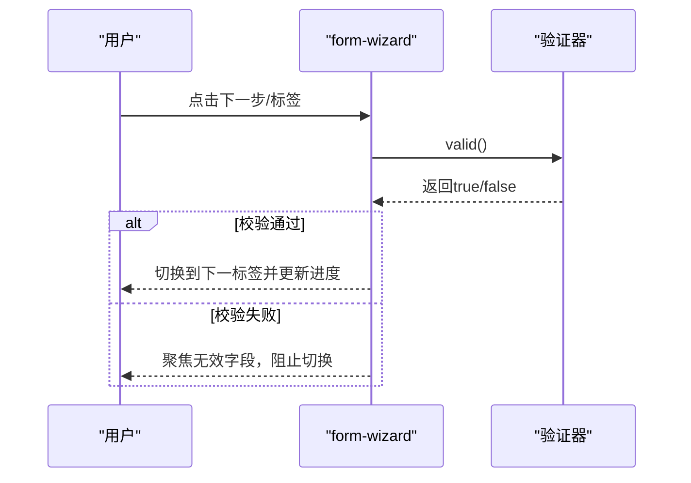
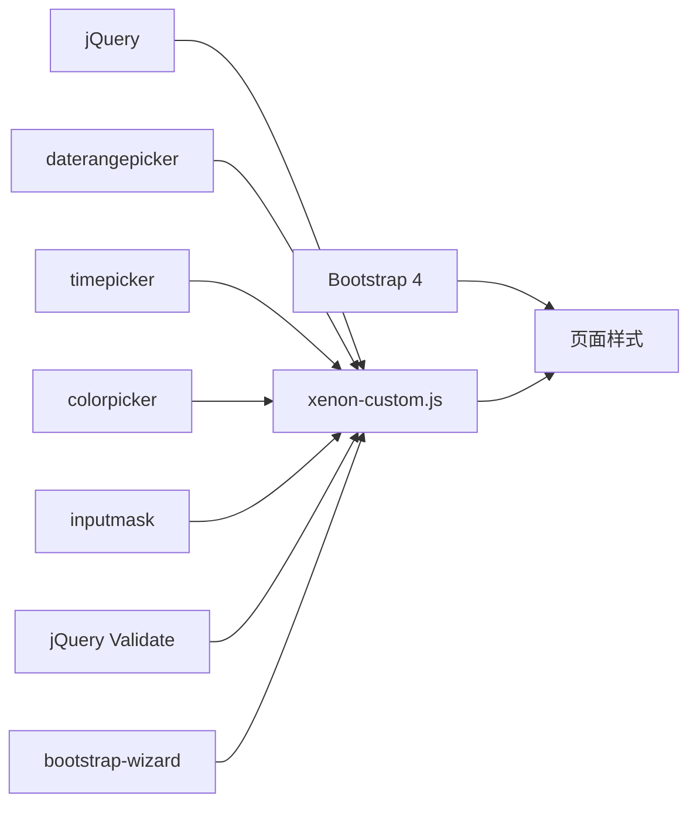

# 表单组件系统

<cite>
**本文引用的文件**
- [index.html](file://index.html)
- [commit.html](file://commit.html)
- [README.md](file://README.md)
- [assets/js/xenon-custom.js](file://assets/js/xenon-custom.js)
</cite>

## 目录
1. [简介](#简介)
2. [项目结构](#项目结构)
3. [核心组件](#核心组件)
4. [架构总览](#架构总览)
5. [详细组件分析](#详细组件分析)
6. [依赖关系分析](#依赖关系分析)
7. [性能考虑](#性能考虑)
8. [故障排查指南](#故障排查指南)
9. [结论](#结论)
10. [附录：使用示例与最佳实践](#附录使用示例与最佳实践)

## 简介
本仓库是一个基于 HTML + CSS + JavaScript（jQuery、Bootstrap 4）的静态站点，提供网址导航与提交功能。在表单交互方面，项目通过统一的初始化脚本集中管理多种表单组件：日期范围选择器、时间选择器、颜色选择器、输入掩码、表单验证以及表单向导。这些组件通过 data-* 属性进行配置，便于在不改动核心逻辑的前提下快速扩展和定制。

## 项目结构
- 入口页面 index.html：站点首页，包含导航、搜索与内容区块。
- 提交页面 commit.html：独立的表单提交页，内置前端校验与交互。
- 统一脚本 assets/js/xenon-custom.js：集中初始化并配置各类表单组件（日期/时间/颜色/掩码/验证/向导）。
- 样式与资源：assets/css、assets/js、assets/images、assets/fontawesome-5.15.4。

图表来源
- [index.html:1-35](file://index.html#L1-L35)
- [assets/js/xenon-custom.js:404-801](file://assets/js/xenon-custom.js#L404-L801)

章节来源
- [index.html:1-35](file://index.html#L1-L35)
- [README.md:298-314](file://README.md#L298-L314)

## 核心组件
- 日期范围选择器（daterangepicker）：支持格式、分隔符、时间选择器开关、步进、起止日期限制、快捷范围等。
- 时间选择器（timepicker）：支持模板、秒显示、默认时间、是否显示上下午、分钟/秒步进等。
- 颜色选择器（colorpicker）：支持按钮触发、预览色块、颜色变化事件。
- 输入掩码（inputmask）：内置电话、货币、邮箱、千分位小数等预设，支持正则表达式与自定义规则。
- 表单验证（jQuery Validate）：基于 data-validate 声明式规则，支持参数化规则与自定义错误消息。
- 表单向导（bootstrap-wizard）：步骤切换、进度条、每步验证控制。

章节来源
- [assets/js/xenon-custom.js:404-801](file://assets/js/xenon-custom.js#L404-L801)

## 架构总览
所有表单组件由 xenon-custom.js 统一初始化，遵循“数据驱动”的配置方式：HTML 元素通过 data-* 属性声明行为，JS 读取并转换为对应插件的配置对象，完成实例化与事件绑定。表单验证与向导将验证逻辑与步骤流程解耦，保证可维护性。

图表来源
- [assets/js/xenon-custom.js:404-801](file://assets/js/xenon-custom.js#L404-L801)

## 详细组件分析

### 日期范围选择器（Date Range Picker）
- 配置项来源
  - 格式：format
  - 时间选择器：timePicker、timePickerIncrement
  - 分隔符：separator
  - 可选范围：add-ranges 类启用内置 Today/Yesterday/Last 7 Days/Last 30 Days/This Month/Last Month
  - 边界限制：minDate、maxDate
  - 初始值：startDate、endDate
  - 回调：data-callback 触发回调函数
  - 行内展示：daterange-inline 类时，更新 span 文本
- 行为说明
  - 选择完成后回调中可使用 format 与 separator 拼接显示
  - 当存在 ranges 对象时，隐藏日历面板以突出快捷范围

图表来源
- [assets/js/xenon-custom.js:404-477](file://assets/js/xenon-custom.js#L404-L477)

章节来源
- [assets/js/xenon-custom.js:404-477](file://assets/js/xenon-custom.js#L404-L477)

### 时间选择器（Timepicker）
- 配置项来源
  - template：自定义模板
  - showSeconds：是否显示秒
  - defaultTime：默认时间（'current' 表示当前时间）
  - showMeridian：是否显示上午/下午
  - minuteStep：分钟步进
  - secondStep：秒步进
- 行为说明
  - 支持在 input-group 的前后 addon 按钮点击打开时间面板
  - 通过 showWidget 方法显式展开

图表来源
- [assets/js/xenon-custom.js:482-521](file://assets/js/xenon-custom.js#L482-L521)

章节来源
- [assets/js/xenon-custom.js:482-521](file://assets/js/xenon-custom.js#L482-L521)

### 颜色选择器（Colorpicker）
- 配置项来源
  - 无强制配置，支持通过 options 扩展
- 行为说明
  - 支持在 input-group 的前后 addon 按钮点击打开颜色面板
  - 若存在 .color-preview 预览元素，监听 changeColor 事件实时更新背景色
  - 初始化时根据输入框已有值设置预览色

图表来源
- [assets/js/xenon-custom.js:525-573](file://assets/js/xenon-custom.js#L525-L573)

章节来源
- [assets/js/xenon-custom.js:525-573](file://assets/js/xenon-custom.js#L525-L573)

### 输入掩码（Input Mask）
- 预设格式
  - phone：电话号码掩码
  - currency/rcurrency：金额掩码，支持前缀/后缀符号与小数点
  - email：邮箱正则掩码
  - fdecimal：带千分位的小数掩码，支持自定义小数点与分隔符
- 高级特性
  - isRegex：将 data-mask 的值作为正则表达式使用
  - numeric/radixPoint/numericAlign：数值输入相关对齐与小数点设置
  - placeholder：占位提示
- 行为说明
  - 根据 data-mask 的值进入 switch 分支，生成对应 mask 与 opts
  - 若开启 isRegex，则覆盖 mask 为 'Regex' 并使用自定义正则

图表来源
- [assets/js/xenon-custom.js:672-742](file://assets/js/xenon-custom.js#L672-L742)

章节来源
- [assets/js/xenon-custom.js:672-742](file://assets/js/xenon-custom.js#L672-L742)

### 表单验证（Validation）
- 规则定义
  - 在字段上通过 data-validate 声明规则，多个规则用逗号分隔
  - 支持基础规则：required、url、email、number、date、creditcard
  - 支持参数化规则：min[x]、max[x]、minlength[x]、maxlength[x]、equalTo[x]
  - 自定义消息：data-message-<rule> 为对应规则提供错误提示
- 错误处理
  - errorElement：span
  - errorClass：validate-has-error
  - highlight/unhighlight：为 form-group 添加/移除错误样式
  - errorPlacement：针对特殊控件（switch、checkbox/radio、input-group）调整错误信息位置
- 实时验证
  - 通过 jQuery Validate 的默认机制实现失焦/提交时的校验；可在业务层结合 input/change 事件增强实时反馈

图表来源
- [assets/js/xenon-custom.js:578-667](file://assets/js/xenon-custom.js#L578-L667)

章节来源
- [assets/js/xenon-custom.js:578-667](file://assets/js/xenon-custom.js#L578-L667)

### 表单向导（Form Wizard）
- 步骤管理
  - 通过 > ul > li.active 确定初始步骤索引
  - onTabShow：更新已完成步骤样式与进度条宽度
- 进度指示
  - 计算当前步骤相对宽度，动态设置 .progress-indicator 的 width
- 验证流程控制
  - 若表单含 validate 类，则在 onNext/onTabClick 时执行 valid()
  - 校验失败时聚焦到第一个无效字段并阻止跳转

图表来源
- [assets/js/xenon-custom.js:746-801](file://assets/js/xenon-custom.js#L746-L801)

章节来源
- [assets/js/xenon-custom.js:746-801](file://assets/js/xenon-custom.js#L746-L801)

## 依赖关系分析
- 外部库
  - jQuery：事件与DOM操作基础
  - Bootstrap 4：布局与组件样式
  - daterangepicker/moment：日期范围选择与时间计算
  - timepicker：时间选择
  - colorpicker：颜色选择
  - inputmask：输入掩码
  - jQuery Validate：表单验证
  - bootstrap-wizard：表单向导
- 内部组织
  - xenon-custom.js 作为统一装配层，依据 data-* 属性装配各插件
  - index.html 引入必要样式与脚本
  - commit.html 使用内联脚本实现轻量级校验与交互

图表来源
- [index.html:17-31](file://index.html#L17-L31)
- [assets/js/xenon-custom.js:404-801](file://assets/js/xenon-custom.js#L404-L801)

章节来源
- [index.html:17-31](file://index.html#L17-L31)
- [assets/js/xenon-custom.js:404-801](file://assets/js/xenon-custom.js#L404-L801)

## 性能考虑
- 按需加载：仅在检测到对应插件可用时再初始化，避免不必要的开销
- 最小化重绘：颜色预览直接修改 background-color，减少 DOM 操作
- 合理默认值：时间/日期组件提供合理的默认步进与格式，降低配置复杂度
- 事件委托：对 addon 按钮的事件绑定简洁高效，避免重复绑定

[本节为通用指导，不直接分析具体文件]

## 故障排查指南
- 日期范围未生效
  - 检查是否添加了 add-ranges 类以启用快捷范围
  - 确认 minDate/maxDate/startDate/endDate 格式正确
  - 参考初始化与回调逻辑
- 时间选择器无法打开
  - 确认前后 addon 按钮结构与 class 正确
  - 检查 showWidget 调用是否被拦截
- 颜色预览不更新
  - 确保存在 .color-preview 元素
  - 检查 changeColor 事件是否触发
- 输入掩码不符合预期
  - 核对 data-mask 值与 isRegex 配置
  - 对于金额/小数，检查 radixPoint、groupSeparator 等选项
- 表单验证不工作
  - 确认表单有 validate 类且字段有 data-validate
  - 检查错误放置位置是否符合复杂控件结构
- 向导无法前进
  - 检查表单是否包含 validate 类导致前置校验
  - 查看 onTabClick/onNext 钩子返回值

章节来源
- [assets/js/xenon-custom.js:404-801](file://assets/js/xenon-custom.js#L404-L801)

## 结论
本项目通过集中化的初始化脚本，将多种表单组件以声明式的方式组合在一起，既保证了开发效率，又提升了可维护性。借助 data-* 属性驱动的选项配置，开发者可以快速定制日期、时间、颜色、掩码、验证与向导等行为，满足多样化的表单需求。

[本节为总结性内容，不直接分析具体文件]

## 附录：使用示例与最佳实践
- 日期范围选择器
  - 在输入框上添加 class="daterange"，并通过 data-format、data-separator、data-minDate、data-maxDate、data-startDate、data-endDate 配置
  - 如需快捷范围，增加 class="add-ranges"
  - 行内展示时增加 class="daterange-inline"，并在容器内放置 span 用于显示
  - 参考路径：[assets/js/xenon-custom.js:404-477](file://assets/js/xenon-custom.js#L404-L477)
- 时间选择器
  - 在输入框上添加 class="timepicker"，通过 data-showSeconds、data-defaultTime、data-showMeridian、data-minuteStep、data-secondStep 配置
  - 可在前后 addon 按钮中触发 showWidget
  - 参考路径：[assets/js/xenon-custom.js:482-521](file://assets/js/xenon-custom.js#L482-L521)
- 颜色选择器
  - 在输入框上添加 class="colorpicker"，配合 .color-preview 预览元素
  - 可通过前后 addon 按钮触发 show
  - 参考路径：[assets/js/xenon-custom.js:525-573](file://assets/js/xenon-custom.js#L525-L573)
- 输入掩码
  - 使用 data-mask 指定预设（phone/currency/rcurrency/email/fdecimal），或通过 isRegex 传入自定义正则
  - 金额/小数可通过 data-sign、data-radixPoint、data-dec 等微调
  - 参考路径：[assets/js/xenon-custom.js:672-742](file://assets/js/xenon-custom.js#L672-L742)
- 表单验证
  - 在字段上使用 data-validate 声明规则，如 required,email,number,min[1],maxlength[50]
  - 通过 data-message-<rule> 自定义错误提示
  - 参考路径：[assets/js/xenon-custom.js:578-667](file://assets/js/xenon-custom.js#L578-L667)
- 表单向导
  - 使用 class="form-wizard"，内部包含 > ul > li 步骤与 .progress-indicator 进度条
  - 若需每步校验，给表单添加 validate 类
  - 参考路径：[assets/js/xenon-custom.js:746-801](file://assets/js/xenon-custom.js#L746-L801)
- 提交页示例
  - commit.html 展示了独立的前端校验与交互逻辑，可作为轻量表单的参考
  - 参考路径：[commit.html:178-382](file://commit.html#L178-L382)

章节来源
- [assets/js/xenon-custom.js:404-801](file://assets/js/xenon-custom.js#L404-L801)
- [commit.html:178-382](file://commit.html#L178-L382)