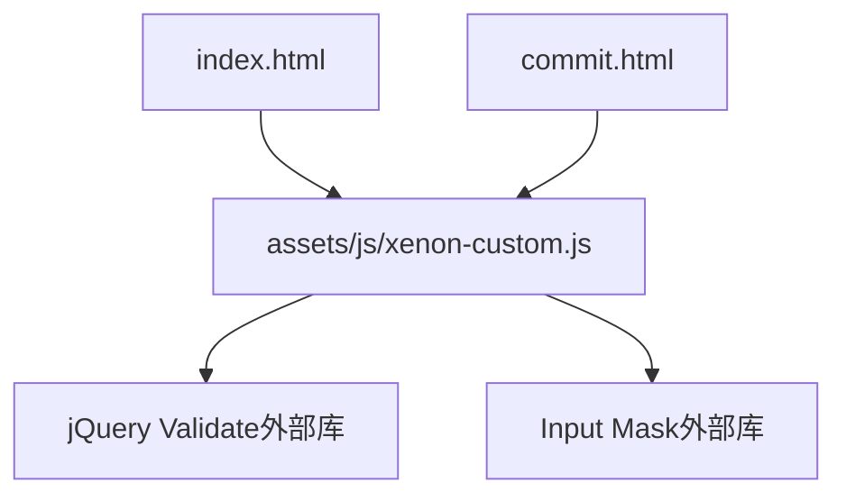
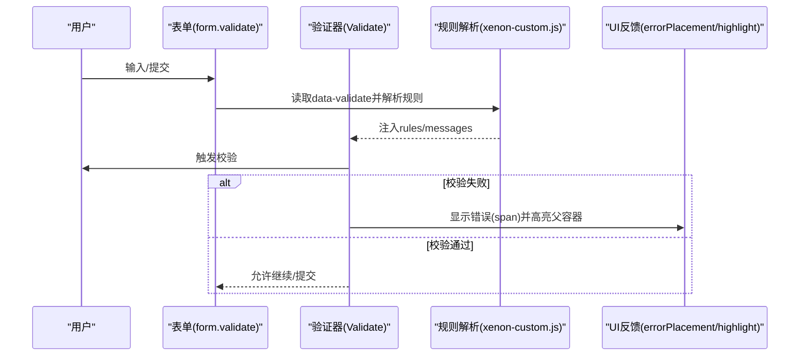
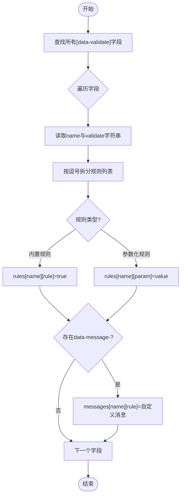
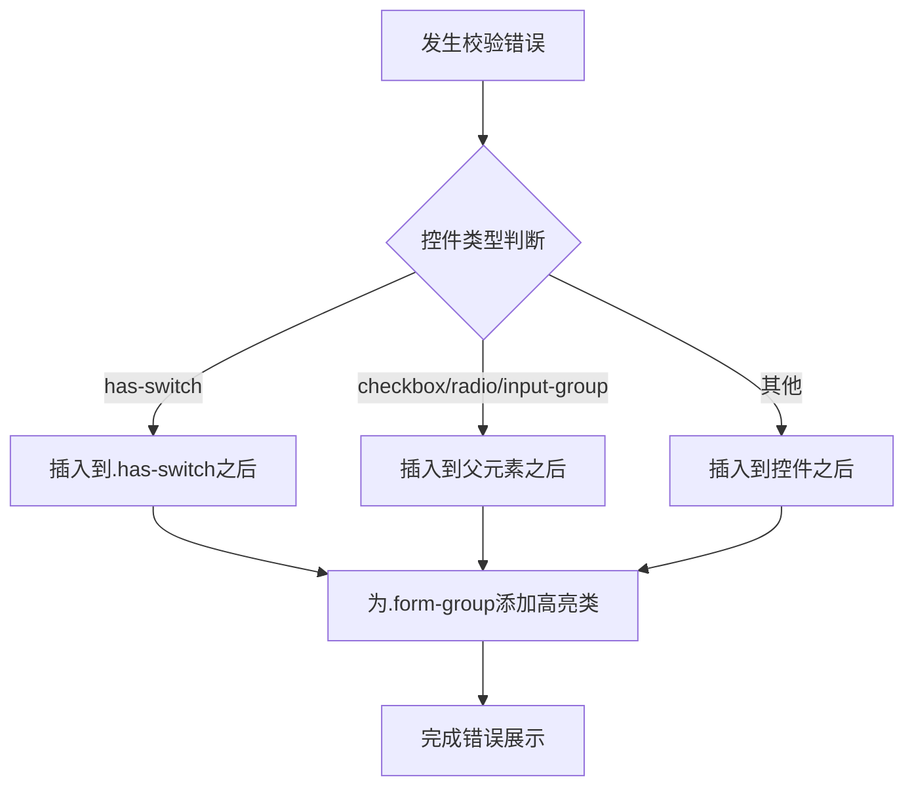
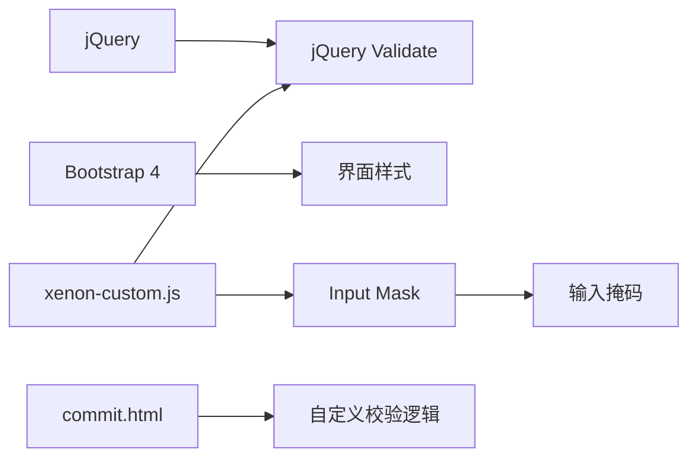

# 表单验证系统

<cite>
**本文引用的文件**
- [assets/js/xenon-custom.js](file://assets/js/xenon-custom.js)
- [commit.html](file://commit.html)
- [index.html](file://index.html)
- [README.md](file://README.md)
</cite>

## 目录
1. [简介](#简介)
2. [项目结构](#项目结构)
3. [核心组件](#核心组件)
4. [架构总览](#架构总览)
5. [详细组件分析](#详细组件分析)
6. [依赖关系分析](#依赖关系分析)
7. [性能考虑](#性能考虑)
8. [故障排查指南](#故障排查指南)
9. [结论](#结论)
10. [附录：使用示例与最佳实践](#附录使用示例与最佳实践)

## 简介
本仓库是一个纯静态的在线网址导航站点，包含一个“网址提交”页面。该站点通过 jQuery Validate 插件实现表单验证，并在自定义脚本中提供了基于 data-validate 数据属性的声明式规则配置、错误提示定位、高亮状态管理以及输入掩码等能力。本文档聚焦于表单验证系统的集成与扩展实现，覆盖内置规则、参数化规则、错误提示机制、状态管理、自定义规则与异步验证、消息本地化，以及基础/复杂/实时反馈等应用场景。

## 项目结构
- 前端资源位于 assets 目录，其中 JavaScript 逻辑集中在 assets/js/xenon-custom.js，负责表单验证初始化与增强。
- 业务页面包括首页 index.html 与提交页 commit.html；提交页展示了完整的表单结构与前端校验流程。
- README.md 提供项目说明与二次开发指引。

图表来源
- [assets/js/xenon-custom.js:578-667](file://assets/js/xenon-custom.js#L578-L667)
- [commit.html:199-381](file://commit.html#L199-L381)

章节来源
- [README.md:298-314](file://README.md#L298-L314)
- [index.html:1-35](file://index.html#L1-L35)

## 核心组件
- 表单验证初始化器：在 assets/js/xenon-custom.js 中，针对 class 为 validate 的 form 元素进行批量初始化，读取每个字段的 data-validate 属性，解析并生成 rules/messages，最后调用 $.fn.validate 完成绑定。
- 错误提示与状态管理：统一设置 errorElement、errorClass、highlight/unhighlight、errorPlacement，确保错误信息以 span 形式插入到合适位置，并对父级 .form-group 添加/移除高亮样式。
- 输入掩码：对带有 data-mask 的元素启用 Input Mask，支持电话、货币、邮箱正则等预设模式。
- 向导校验：在 Form Wizard 场景下，结合 valid() 方法在步骤切换时进行校验拦截。

章节来源
- [assets/js/xenon-custom.js:578-667](file://assets/js/xenon-custom.js#L578-L667)
- [assets/js/xenon-custom.js:672-742](file://assets/js/xenon-custom.js#L672-L742)
- [assets/js/xenon-custom.js:746-778](file://assets/js/xenon-custom.js#L746-L778)

## 架构总览
下图展示了从 HTML 表单到验证引擎再到 UI 反馈的整体流程。

图表来源
- [assets/js/xenon-custom.js:578-667](file://assets/js/xenon-custom.js#L578-L667)
- [assets/js/xenon-custom.js:587-610](file://assets/js/xenon-custom.js#L587-L610)

## 详细组件分析

### 1) 验证规则与参数化规则
- 内置规则支持：required、url、email、number、date、creditcard。这些规则在 data-validate 中以逗号分隔声明，例如 data-validate="required,email,url"。
- 参数化规则支持：min、max、minlength、maxlength、equalTo。语法为 rule[值]，如 minlength[5]、equalTo="#passwordConfirm"。
- 规则解析过程：
  - 遍历字段集合，读取 name 和 data-validate。
  - 将 data-validate 按逗号拆分，逐个判断是否为内置规则或带参数的规则。
  - 若匹配到内置规则，则写入 opts.rules[name][rule] = true；若匹配到参数化规则，则写入对应参数值。
  - 同时支持通过 data-message-* 为每条规则提供自定义消息。

图表来源
- [assets/js/xenon-custom.js:615-663](file://assets/js/xenon-custom.js#L615-L663)

章节来源
- [assets/js/xenon-custom.js:615-663](file://assets/js/xenon-custom.js#L615-L663)

### 2) 错误提示机制与错误元素定位
- 错误元素：errorElement 设置为 span，便于轻量插入。
- 错误类名：errorClass 为 validate-has-error，用于高亮样式。
- 高亮/去高亮：highlight/unhighlight 会在最接近的 .form-group 上添加/移除 validate-has-error 类，从而改变边框或背景等视觉状态。
- 错误放置策略：errorPlacement 根据控件类型智能选择插入位置：
  - 开关控件（has-switch）：插入到其父容器之后。
  - 复选框/单选框或 input-group：插入到父元素之后。
  - 其他情况：直接插入到控件之后。

图表来源
- [assets/js/xenon-custom.js:587-610](file://assets/js/xenon-custom.js#L587-L610)

章节来源
- [assets/js/xenon-custom.js:587-610](file://assets/js/xenon-custom.js#L587-L610)

### 3) 验证状态管理
- 通过 highlight/unhighlight 控制 .form-group 的高亮状态，使错误/正确状态可视化。
- 在向导场景中，使用 this.valid() 进行整体校验，并通过 focusInvalid() 聚焦到第一个无效字段，提升交互体验。

章节来源
- [assets/js/xenon-custom.js:589-594](file://assets/js/xenon-custom.js#L589-L594)
- [assets/js/xenon-custom.js:756-768](file://assets/js/xenon-custom.js#L756-L768)

### 4) 自定义验证规则的添加方式
- 由于系统基于 jQuery Validate，可在 xenon-custom.js 中通过 $.validator.addMethod 注册自定义规则，并在 data-validate 中使用该规则名称。
- 建议在初始化之前定义自定义规则，确保被解析阶段识别。
- 对于需要跨字段比较的规则（如 equalTo），可直接使用 data-validate 中的 equalTo[目标选择器] 语法。

章节来源
- [assets/js/xenon-custom.js:578-667](file://assets/js/xenon-custom.js#L578-L667)

### 5) 异步验证的实现方式
- 可在自定义规则中返回 Promise 或调用回调函数实现异步校验（例如检查用户名是否已存在）。
- 在异步校验期间，可结合 highlight/unhighlight 与错误提示，提供加载态与结果反馈。
- 注意：异步规则需保证最终返回布尔值或 Promise，以便验证器正确处理状态。

章节来源
- [assets/js/xenon-custom.js:578-667](file://assets/js/xenon-custom.js#L578-L667)

### 6) 验证消息的本地化配置
- 支持通过 data-message-* 为每条规则提供自定义消息，优先级高于默认消息。
- 也可在全局 messages 对象中集中配置多语言文案，或在运行时动态替换。
- 建议将消息文案抽离为独立配置，便于维护与国际化。

章节来源
- [assets/js/xenon-custom.js:638-643](file://assets/js/xenon-custom.js#L638-L643)
- [assets/js/xenon-custom.js:654-659](file://assets/js/xenon-custom.js#L654-L659)

### 7) 输入掩码与辅助输入
- 对 data-mask 元素启用 Input Mask，支持 phone、currency/rcurrency、email、fdecimal 等预设模式。
- 可通过 data-mask、data-numeric、data-radixPoint、data-sign、data-isRegex 等属性精细控制行为。
- 掩码与验证互补：掩码约束输入格式，验证确保语义正确。

章节来源
- [assets/js/xenon-custom.js:672-742](file://assets/js/xenon-custom.js#L672-L742)

## 依赖关系分析
- 页面依赖 jQuery 与 Bootstrap 4（样式与交互）。
- 验证依赖 jQuery Validate（通过 $.fn.validate 检测是否存在）。
- 输入掩码依赖 Input Mask（通过 $.fn.inputmask 检测是否存在）。
- 提交页 commit.html 实现了独立的表单校验逻辑（原生 JS + 正则），与全局验证器解耦，便于渐进迁移。

图表来源
- [assets/js/xenon-custom.js:578-667](file://assets/js/xenon-custom.js#L578-L667)
- [assets/js/xenon-custom.js:672-742](file://assets/js/xenon-custom.js#L672-L742)
- [commit.html:286-381](file://commit.html#L286-L381)

章节来源
- [assets/js/xenon-custom.js:578-667](file://assets/js/xenon-custom.js#L578-L667)
- [commit.html:286-381](file://commit.html#L286-L381)

## 性能考虑
- 批量初始化：仅对 form.validate 下的 [data-validate] 字段解析规则，避免全表扫描带来的开销。
- 延迟与防抖：对于实时反馈场景，可对 input/change 事件做防抖处理，减少频繁校验。
- 规则复用：将常用规则封装为自定义方法，减少重复代码与解析成本。
- 资源加载：按需引入 jQuery Validate 与 Input Mask，避免不必要的体积。

## 故障排查指南
- 未生效
  - 确认表单具有 class="validate"，且字段包含 data-validate。
  - 确认 jQuery Validate 已加载（$.fn.validate 存在）。
- 错误提示位置异常
  - 检查控件是否属于 has-switch、checkbox/radio 或 input-group，必要时调整 errorPlacement。
- 高亮状态不更新
  - 检查 highlight/unhighlight 是否正确为 .form-group 添加/移除 validate-has-error。
- 自定义规则无效
  - 确认自定义规则在初始化前已注册，且 data-validate 中使用了正确的规则名。
- 异步校验卡住
  - 确保异步规则返回 Promise 或调用回调，避免阻塞验证器。

章节来源
- [assets/js/xenon-custom.js:578-667](file://assets/js/xenon-custom.js#L578-L667)
- [assets/js/xenon-custom.js:587-610](file://assets/js/xenon-custom.js#L587-L610)

## 结论
本项目通过声明式的 data-validate 属性与统一的验证初始化器，实现了简洁易用的表单验证体系。内置规则与参数化规则覆盖了常见场景，错误提示与状态管理提升了用户体验。结合输入掩码与向导校验，进一步增强了交互质量。通过自定义规则与异步验证，系统具备良好的扩展性，适合在复杂业务中持续演进。

## 附录：使用示例与最佳实践

### 1) 基础验证
- 必填、邮箱、网址、数字、日期、信用卡号：
  - 在字段上添加 data-validate="required,email,url,number,date,creditcard"。
  - 可选：通过 data-message-required、data-message-email 等提供中文提示。

章节来源
- [assets/js/xenon-custom.js:634-643](file://assets/js/xenon-custom.js#L634-L643)

### 2) 参数化规则组合
- 长度限制：data-validate="minlength[5],maxlength[50]"
- 数值范围：data-validate="min[1],max[100]"
- 字段相等：data-validate="equalTo[#passwordConfirm]"
- 组合示例：data-validate="required,email,minlength[6],maxlength[20]"

章节来源
- [assets/js/xenon-custom.js:646-661](file://assets/js/xenon-custom.js#L646-L661)

### 3) 实时验证反馈
- 在 input/change 事件中触发校验，或使用验证器的 onfocusout/onkeyup 等事件钩子。
- 结合 highlight/unhighlight 即时更新高亮状态，提升交互感。

章节来源
- [assets/js/xenon-custom.js:589-594](file://assets/js/xenon-custom.js#L589-L594)

### 4) 复杂规则组合与条件校验
- 多字段联动：使用 equalTo 或其他自定义规则实现密码确认、验证码比对等。
- 条件必填：通过自定义规则判断上下文后决定必填与否。

章节来源
- [assets/js/xenon-custom.js:646-661](file://assets/js/xenon-custom.js#L646-L661)

### 5) 异步验证
- 自定义规则中发起请求（如用户名查重），返回 Promise 或调用回调。
- 在异步过程中显示加载态，完成后更新错误提示与高亮状态。

章节来源
- [assets/js/xenon-custom.js:578-667](file://assets/js/xenon-custom.js#L578-L667)

### 6) 消息本地化
- 使用 data-message-* 为单字段定制消息。
- 全局 messages 配置集中管理多语言文案，便于维护。

章节来源
- [assets/js/xenon-custom.js:638-643](file://assets/js/xenon-custom.js#L638-L643)
- [assets/js/xenon-custom.js:654-659](file://assets/js/xenon-custom.js#L654-L659)

### 7) 提交页示例参考
- commit.html 展示了完整表单结构与前端校验流程，可作为迁移到 jQuery Validate 的参考。
- 当前采用原生校验与正则，后续可逐步替换为声明式 data-validate 以提升一致性。

章节来源
- [commit.html:199-381](file://commit.html#L199-L381)