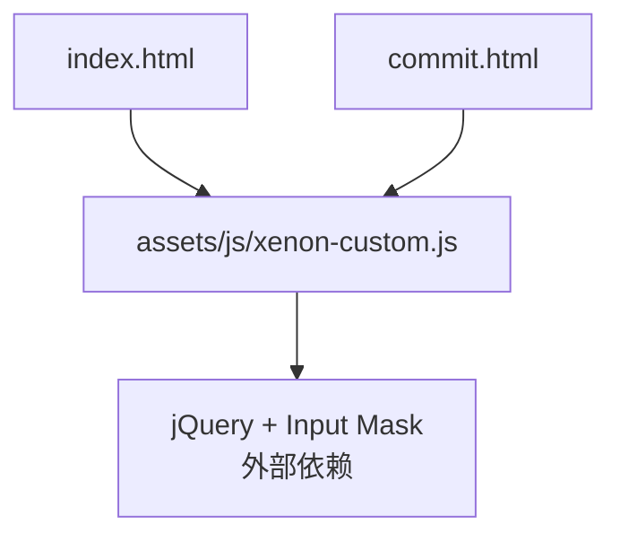
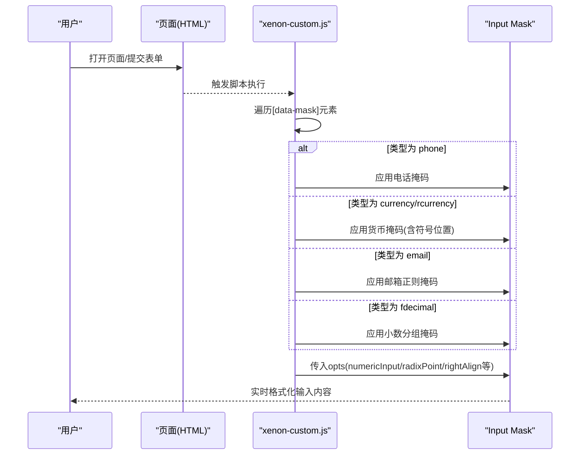
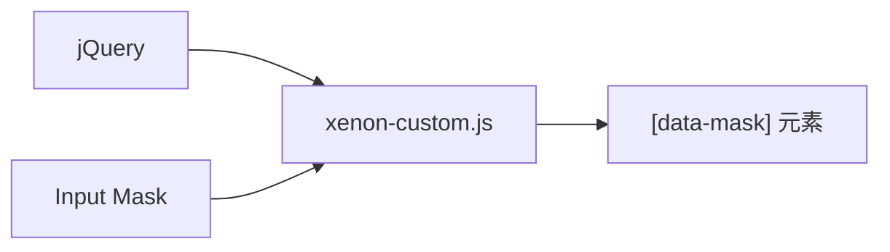

# 输入掩码组件

<cite>
**本文引用的文件**
- [assets/js/xenon-custom.js](file://assets/js/xenon-custom.js)
- [index.html](file://index.html)
- [commit.html](file://commit.html)
</cite>

## 目录
1. [简介](#简介)
2. [项目结构](#项目结构)
3. [核心组件](#核心组件)
4. [架构总览](#架构总览)
5. [详细组件分析](#详细组件分析)
6. [依赖关系分析](#依赖关系分析)
7. [性能考虑](#性能考虑)
8. [故障排查指南](#故障排查指南)
9. [结论](#结论)
10. [附录：使用示例与最佳实践](#附录使用示例与最佳实践)

## 简介
本组件基于 jQuery Input Mask 实现，提供统一的“数据驱动”的输入掩码能力。通过为表单元素添加 data-mask 属性，即可快速启用预设的掩码类型（如 phone、currency、rcurrency、email、fdecimal），并支持正则表达式掩码、数字输入配置（numericInput）、小数点设置（radixPoint）、对齐方式（rightAlign）等高级功能。同时提供货币符号配置、分组显示、占位符设置等格式化选项，满足常见业务场景下的输入体验需求。

## 项目结构
本项目为纯静态站点，输入掩码逻辑集中在前端脚本中，通过遍历带有 data-mask 属性的元素进行初始化。主要相关文件如下：
- assets/js/xenon-custom.js：封装了 Input Mask 的统一初始化与预设类型处理逻辑
- index.html：页面入口，引入资源与脚本
- commit.html：提交页示例，展示表单字段的使用方式（可结合掩码扩展）

图表来源
- [index.html:1-800](file://index.html#L1-L800)
- [assets/js/xenon-custom.js:672-742](file://assets/js/xenon-custom.js#L672-L742)

章节来源
- [index.html:1-800](file://index.html#L1-L800)
- [assets/js/xenon-custom.js:672-742](file://assets/js/xenon-custom.js#L672-L742)

## 核心组件
- 统一初始化器：在文档就绪后，查找所有带 data-mask 的元素，读取其掩码类型与自定义属性，构造配置对象并调用 inputmask 方法完成绑定。
- 预设掩码类型：
  - phone：电话号码格式
  - currency：金额前缀货币格式
  - rcurrency：金额后缀货币格式
  - email：邮箱正则校验
  - fdecimal：带分组的小数格式
- 高级配置项：
  - numericInput：是否开启数字输入模式
  - radixPoint：小数点字符
  - rightAlign：数值右对齐
  - autoGroup/groupSize/groupSeparator：分组显示与分隔符
  - placeholder：占位符提示
  - isRegex：将 data-mask 的值作为正则表达式使用

章节来源
- [assets/js/xenon-custom.js:672-742](file://assets/js/xenon-custom.js#L672-L742)

## 架构总览
下图展示了从 HTML 元素到输入掩码初始化的完整流程，包括预设类型的分支处理与最终绑定。

图表来源
- [assets/js/xenon-custom.js:672-742](file://assets/js/xenon-custom.js#L672-L742)

## 详细组件分析

### 统一初始化与配置构建
- 选择器：$("[data-mask]")，确保仅对显式声明掩码的元素生效
- 基础配置：
  - numericInput：由 data-numeric 控制
  - radixPoint：由 data-radixPoint 控制
  - rightAlign：由 data-numericAlign 控制（left/right）
  - placeholder：由 data-placeholder 控制（注意：此处将 data-placeholder 的值作为 opts 的键名，用于设置占位符提示）
- 正则覆盖：若存在 data-isRegex，则将 data-mask 的值视为正则表达式，并强制 mask='Regex'

章节来源
- [assets/js/xenon-custom.js:672-742](file://assets/js/xenon-custom.js#L672-L742)

### 预设掩码类型详解

#### 电话掩码（phone）
- 行为：自动应用固定格式的电话号码掩码
- 适用场景：手机号、座机号等需要固定格式的场景
- 配置要点：无需额外配置，直接设置 data-mask="phone"

章节来源
- [assets/js/xenon-custom.js:692-696](file://assets/js/xenon-custom.js#L692-L696)

#### 货币掩码（currency / rcurrency）
- 行为：
  - currency：货币符号在前，数值在后
  - rcurrency：数值在前，货币符号在后
- 默认数值格式：三位分组，两位小数，小数点为 '.'
- 可配置项：
  - sign：自定义货币符号（默认 '$'）
  - numericInput：开启数字输入模式
  - rightAlignNumerics：关闭数值右对齐（保持符号与数值相对位置）
  - radixPoint：小数点字符（默认 '.'）
- 适用场景：价格、金额、账单等需要货币格式的场景

章节来源
- [assets/js/xenon-custom.js:698-717](file://assets/js/xenon-custom.js#L698-L717)

#### 邮箱掩码（email）
- 行为：使用正则表达式限制输入符合邮箱格式
- 正则规则：限定字母、数字、部分符号及域名长度
- 适用场景：注册、联系信息收集等需要邮箱格式校验的场景

章节来源
- [assets/js/xenon-custom.js:719-722](file://assets/js/xenon-custom.js#L719-L722)

#### 小数掩码（fdecimal）
- 行为：启用 decimal 掩码，并自动分组显示
- 可配置项：
  - autoGroup：启用自动分组
  - groupSize：分组大小（默认 3）
  - radixPoint：小数点字符（可通过 data-rad 自定义）
  - groupSeparator：分组分隔符（可通过 data-dec 自定义）
- 适用场景：科学计数、财务小数、度量值等需要可读性强的数值输入

章节来源
- [assets/js/xenon-custom.js:724-731](file://assets/js/xenon-custom.js#L724-L731)

### 高级功能说明

#### 正则表达式掩码
- 通过 data-isRegex 开启，并将 data-mask 的值作为正则表达式
- 适用于自定义格式校验，如身份证、订单号、特定编码等

章节来源
- [assets/js/xenon-custom.js:734-738](file://assets/js/xenon-custom.js#L734-L738)

#### 数字输入配置（numericInput）
- 通过 data-numeric 控制，开启后可优化数字键盘输入体验
- 常用于金额、数量等纯数字场景

章节来源
- [assets/js/xenon-custom.js:679-682](file://assets/js/xenon-custom.js#L679-L682)

#### 小数点设置（radixPoint）
- 通过 data-radixPoint 或类型内置默认值设置小数点字符
- 不同地区可使用不同分隔符（如 ',' 或 '.'）

章节来源
- [assets/js/xenon-custom.js:679-682](file://assets/js/xenon-custom.js#L679-L682)
- [assets/js/xenon-custom.js:714-717](file://assets/js/xenon-custom.js#L714-L717)
- [assets/js/xenon-custom.js:726-731](file://assets/js/xenon-custom.js#L726-L731)

#### 对齐方式（rightAlign）
- 通过 data-numericAlign 控制，值为 'right' 时启用数值右对齐
- 提升金额等数值输入的可读性与对齐一致性

章节来源
- [assets/js/xenon-custom.js:679-682](file://assets/js/xenon-custom.js#L679-L682)

#### 货币符号配置
- 通过 data-sign 自定义货币符号
- 支持 currency（符号在前）与 rcurrency（符号在后）两种布局

章节来源
- [assets/js/xenon-custom.js:701-712](file://assets/js/xenon-custom.js#L701-L712)

#### 分组显示与占位符
- 分组显示：fdecimal 类型默认启用 autoGroup，并可自定义 groupSize 与 groupSeparator
- 占位符：通过 data-placeholder 设置提示文本（注意：当前实现将 data-placeholder 的值作为 opts 的键名，需确保该键被 Input Mask 识别为占位符）

章节来源
- [assets/js/xenon-custom.js:687-690](file://assets/js/xenon-custom.js#L687-L690)
- [assets/js/xenon-custom.js:726-731](file://assets/js/xenon-custom.js#L726-L731)

## 依赖关系分析
- 运行时依赖：
  - jQuery：用于 DOM 操作与事件处理
  - Input Mask：用于输入掩码与格式化
- 集成方式：
  - 在页面加载后，统一扫描带有 data-mask 的元素并初始化
  - 通过 switch 分支匹配预设类型，动态生成掩码与配置

图表来源
- [assets/js/xenon-custom.js:672-742](file://assets/js/xenon-custom.js#L672-L742)

章节来源
- [assets/js/xenon-custom.js:672-742](file://assets/js/xenon-custom.js#L672-L742)

## 性能考虑
- 选择器开销：使用 $("[data-mask]") 一次性选择所有掩码元素，避免重复查询
- 条件判断：switch 分支减少不必要的配置合并
- 按需启用：仅在检测到 $.fn.inputmask 可用时才执行初始化，避免无依赖时的错误
- 建议：
  - 尽量复用预设类型，减少自定义正则带来的解析成本
  - 合理设置分组与小数位数，避免过长字符串导致的渲染压力

## 故障排查指南
- 现象：掩码未生效
  - 检查是否引入了 Input Mask 库
  - 确认元素包含 data-mask 属性且值正确
- 现象：占位符不显示
  - 检查 data-placeholder 的值是否被 Input Mask 识别为占位符键
  - 必要时直接使用标准占位符属性（如 placeholder 属性）配合样式提示
- 现象：货币符号位置不符合预期
  - 确认使用的是 currency 还是 rcurrency
  - 检查 data-sign 是否正确设置
- 现象：小数点或分组不正确
  - 核对 radixPoint、groupSeparator、groupSize 等配置
  - 对于 fdecimal，确认 autoGroup 已启用

章节来源
- [assets/js/xenon-custom.js:672-742](file://assets/js/xenon-custom.js#L672-L742)

## 结论
本输入掩码组件通过简洁的 data-* 属性约定，实现了多类型、可配置的输入格式化能力。预设类型覆盖了常见的电话、金额、邮箱与小数的输入场景，并通过高级配置项满足国际化与定制化需求。建议在项目中统一使用该组件，以提升输入一致性与用户体验。

## 附录：使用示例与最佳实践

### 常见应用场景
- 电话号码格式化
  - 使用 data-mask="phone"
  - 可选：设置占位符以提示输入格式
- 金额输入
  - 使用 data-mask="currency" 或 data-mask="rcurrency"
  - 通过 data-sign 自定义货币符号
  - 通过 data-numeric 开启数字输入模式，提升移动端体验
- 邮箱验证
  - 使用 data-mask="email"
  - 如需更严格的校验，可使用 data-isRegex 自定义正则
- 小数输入
  - 使用 data-mask="fdecimal"
  - 通过 data-rad 与 data-dec 自定义小数点与分组分隔符
  - 通过 data-numericAlign 控制数值对齐

### 自定义掩码开发方法
- 步骤：
  - 在元素上添加 data-mask 并设置为自定义名称
  - 在 xenon-custom.js 中添加对应分支，定义掩码字符串与配置
  - 如需正则，启用 data-isRegex 并在 data-mask 中提供正则表达式
- 最佳实践：
  - 保持配置集中管理，便于维护与扩展
  - 为复杂场景提供默认配置，降低使用门槛
  - 在测试中覆盖边界情况（如空值、超长输入、非法字符）

章节来源
- [assets/js/xenon-custom.js:672-742](file://assets/js/xenon-custom.js#L672-L742)
- [index.html:1-800](file://index.html#L1-L800)
- [commit.html:1-382](file://commit.html#L1-L382)