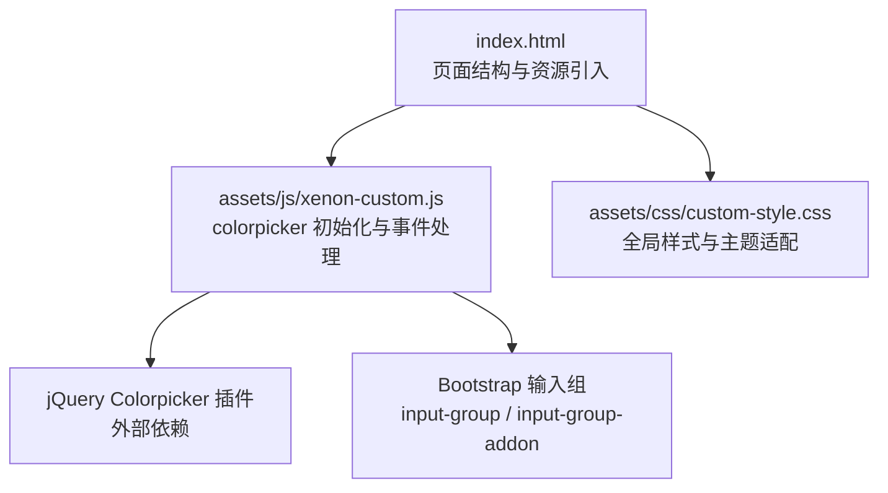
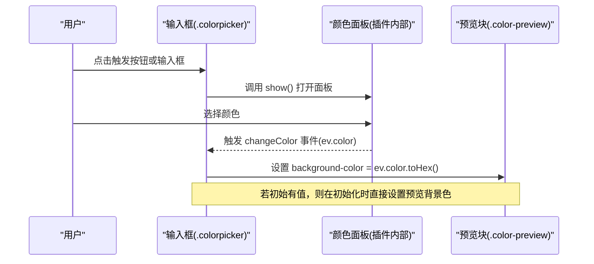
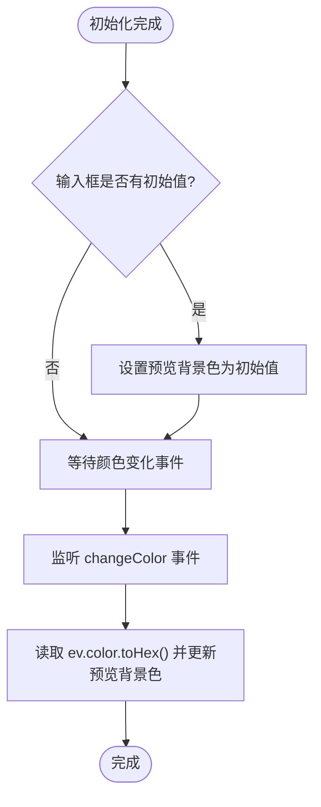
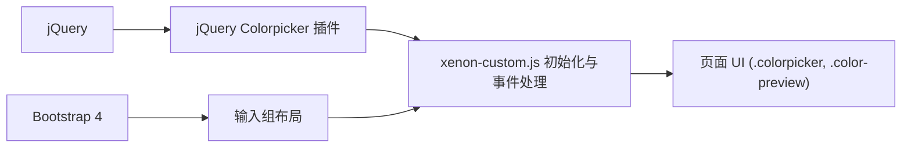

# 颜色选择器组件

<cite>
**本文引用的文件**
- [index.html](file://index.html)
- [xenon-custom.js](file://assets/js/xenon-custom.js)
- [custom-style.css](file://assets/css/custom-style.css)
</cite>

## 目录
1. [简介](#简介)
2. [项目结构](#项目结构)
3. [核心组件](#核心组件)
4. [架构总览](#架构总览)
5. [详细组件分析](#详细组件分析)
6. [依赖关系分析](#依赖关系分析)
7. [性能考虑](#性能考虑)
8. [故障排查指南](#故障排查指南)
9. [结论](#结论)
10. [附录：使用示例与最佳实践](#附录使用示例与最佳实践)

## 简介
本组件文档聚焦于基于 jQuery Colorpicker 的颜色选择器实现，围绕以下目标展开：
- 深入解析颜色预览功能的实现机制（颜色值监听、实时预览更新、背景色设置）
- 说明颜色格式支持、事件处理机制（changeColor 事件）、输入组集成方式
- 介绍初始化配置、按钮触发机制、样式定制选项
- 提供完整的使用示例（基础颜色选择、实时预览效果、颜色值获取等）
- 说明与表单系统的集成和验证处理方式

## 项目结构
本项目为纯静态站点，颜色选择器功能由页面结构与自定义脚本共同实现：
- 页面入口 index.html：引入样式与脚本资源，承载表单与 UI 元素
- 交互逻辑 assets/js/xenon-custom.js：封装 colorpicker 的初始化、事件绑定、预览更新与输入组联动
- 样式 assets/css/custom-style.css：全局样式与主题适配

图表来源
- [index.html:1-35](file://index.html#L1-L35)
- [xenon-custom.js:525-573](file://assets/js/xenon-custom.js#L525-L573)
- [custom-style.css:1-126](file://assets/css/custom-style.css#L1-L126)

章节来源
- [index.html:1-35](file://index.html#L1-L35)
- [xenon-custom.js:525-573](file://assets/js/xenon-custom.js#L525-L573)
- [custom-style.css:1-126](file://assets/css/custom-style.css#L1-L126)

## 核心组件
- 颜色选择器实例：通过类名 .colorpicker 在页面上定位并初始化
- 预览区域：位于相邻的 .input-group-addon 内的 .color-preview 元素，用于显示当前选中的颜色
- 触发按钮：输入组前后可能存在的 <a> 标签，点击后调用 show 方法弹出面板
- 事件监听：监听 changeColor 事件，将所选颜色转换为十六进制并应用到预览区域的背景色

章节来源
- [xenon-custom.js:525-573](file://assets/js/xenon-custom.js#L525-L573)

## 架构总览
颜色选择器的数据流与交互流程如下：
- 初始化阶段：遍历所有 .colorpicker 元素，调用 colorpicker(opts) 创建实例
- 触发阶段：若存在相邻的 .input-group-addon 且包含 <a>，则绑定 click 事件以 show() 面板
- 预览阶段：监听 changeColor 事件，读取 ev.color.toHex() 并设置 .color-preview 的背景色；若已有初始值，立即应用背景色
- 表单集成：颜色值保存在对应 <input> 的 value 中，可与表单验证配合使用

图表来源
- [xenon-custom.js:525-573](file://assets/js/xenon-custom.js#L525-L573)

## 详细组件分析

### 颜色预览功能的实现原理
- 颜色值监听：通过监听 changeColor 事件获取新颜色对象
- 实时预览更新：在事件回调中将颜色转换为十六进制字符串，并写入预览元素的背景样式
- 背景色设置：若输入框已有初始值，则在初始化时直接将其作为预览背景色

图表来源
- [xenon-custom.js:560-571](file://assets/js/xenon-custom.js#L560-L571)

章节来源
- [xenon-custom.js:560-571](file://assets/js/xenon-custom.js#L560-L571)

### 颜色格式支持
- 颜色对象提供 toHex() 方法，输出标准十六进制颜色字符串（如 #RRGGBB）
- 该格式可直接用于 CSS 的 background-color 属性

章节来源
- [xenon-custom.js:562-565](file://assets/js/xenon-custom.js#L562-L565)

### 事件处理机制（changeColor 事件）
- 事件名称：changeColor
- 事件参数：ev.color 为颜色对象，可调用 toHex() 获取十六进制值
- 用途：驱动预览更新、同步到隐藏字段、触发表单校验等

章节来源
- [xenon-custom.js:562-565](file://assets/js/xenon-custom.js#L562-L565)

### 输入组集成方式
- 位置约定：预览块需位于 .input-group-addon 内，并使用类名 .color-preview
- 触发按钮：若 .input-group 的前/后 addon 中包含 <a>，点击会调用 colorpicker('show') 打开面板
- 布局建议：使用 Bootstrap 的 input-group 结构，将输入框与按钮/预览组合在一起

章节来源
- [xenon-custom.js:530-571](file://assets/js/xenon-custom.js#L530-L571)

### 初始化配置与按钮触发机制
- 初始化：对每个 .colorpicker 调用 colorpicker(opts)，opts 为空对象表示使用默认配置
- 按钮触发：检测相邻 addon 是否包含 <a>，绑定 click 事件以 show() 面板
- 扩展点：可在 opts 中传入更多配置项（取决于插件版本），例如颜色格式、尺寸等

章节来源
- [xenon-custom.js:525-558](file://assets/js/xenon-custom.js#L525-L558)

### 样式定制选项
- 预览块样式：通过 .color-preview 的 background-color 动态控制
- 主题适配：项目包含暗黑模式相关样式，颜色预览在不同主题下保持可读性
- 自定义样式：可在 custom-style.css 中覆盖默认样式，调整尺寸、圆角、边框等

章节来源
- [custom-style.css:1-126](file://assets/css/custom-style.css#L1-L126)

## 依赖关系分析
- jQuery：DOM 操作与事件绑定
- jQuery Colorpicker 插件：提供 colorpicker 方法与 changeColor 事件
- Bootstrap 4：提供 input-group 布局与样式
- 页面资源：index.html 引入上述库与样式

图表来源
- [index.html:1-35](file://index.html#L1-L35)
- [xenon-custom.js:525-573](file://assets/js/xenon-custom.js#L525-L573)

章节来源
- [index.html:1-35](file://index.html#L1-L35)
- [xenon-custom.js:525-573](file://assets/js/xenon-custom.js#L525-L573)

## 性能考虑
- 事件节流：频繁的颜色变化可能引发多次 DOM 更新，建议在复杂场景中对 changeColor 进行节流或防抖
- 最小化重绘：仅更新预览块的 background-color，避免不必要的布局计算
- 按需初始化：仅在需要时初始化 colorpicker，减少不必要的实例开销
- 样式优化：预览块尺寸适中，避免过大导致渲染压力

[本节为通用性能建议，不直接分析具体文件]

## 故障排查指南
- 预览不更新
  - 检查是否存在 .color-preview 元素，且位于 .input-group-addon 内
  - 确认已正确绑定 changeColor 事件
  - 参考路径：[xenon-custom.js:560-571](file://assets/js/xenon-custom.js#L560-L571)
- 按钮无法打开面板
  - 检查相邻 addon 是否包含 <a> 标签
  - 确认 click 事件已绑定并调用 show()
  - 参考路径：[xenon-custom.js:540-558](file://assets/js/xenon-custom.js#L540-L558)
- 初始值未生效
  - 确保初始化时判断输入框是否有值，并设置预览背景色
  - 参考路径：[xenon-custom.js:567-570](file://assets/js/xenon-custom.js#L567-L570)
- 表单验证冲突
  - 若使用 jQuery Validate，注意错误提示的插入位置与高亮样式
  - 参考路径：[xenon-custom.js:578-667](file://assets/js/xenon-custom.js#L578-L667)

章节来源
- [xenon-custom.js:540-571](file://assets/js/xenon-custom.js#L540-L571)
- [xenon-custom.js:578-667](file://assets/js/xenon-custom.js#L578-L667)

## 结论
本项目通过简洁的 HTML 结构与少量 JavaScript 逻辑，实现了稳定可靠的颜色选择器与实时预览功能。其核心在于：
- 利用 jQuery Colorpicker 的事件模型（changeColor）驱动预览更新
- 借助 Bootstrap 输入组实现友好的交互与布局
- 通过样式定制适配不同主题与视觉需求
在实际使用中，可按需扩展配置项、接入表单验证与数据持久化，以满足更复杂的业务场景。

[本节为总结性内容，不直接分析具体文件]

## 附录：使用示例与最佳实践

### 基础颜色选择
- 在页面中添加一个 class 为 .colorpicker 的输入框
- 初始化脚本会自动为其绑定 colorpicker 实例
- 参考路径：[xenon-custom.js:525-538](file://assets/js/xenon-custom.js#L525-L538)

### 实时预览效果
- 在相邻的 .input-group-addon 内添加一个 class 为 .color-preview 的元素
- 当颜色变化时，预览块背景色将自动更新
- 参考路径：[xenon-custom.js:560-571](file://assets/js/xenon-custom.js#L560-L571)

### 颜色值获取
- 颜色值保存在对应输入框的 value 中
- 可通过常规方式读取或提交表单
- 参考路径：[xenon-custom.js:567-570](file://assets/js/xenon-custom.js#L567-L570)

### 按钮触发机制
- 在输入组的前/后 addon 中添加 <a> 标签作为触发按钮
- 点击按钮将打开颜色面板
- 参考路径：[xenon-custom.js:540-558](file://assets/js/xenon-custom.js#L540-L558)

### 与表单系统集成与验证
- 使用 jQuery Validate 时，确保错误提示插入位置合理，并对相关字段进行规则配置
- 颜色字段可作为必填项参与验证
- 参考路径：[xenon-custom.js:578-667](file://assets/js/xenon-custom.js#L578-L667)

### 样式定制建议
- 通过 .color-preview 的 background-color 控制预览块外观
- 结合项目的暗黑模式样式，确保颜色在不同主题下的可读性
- 参考路径：[custom-style.css:1-126](file://assets/css/custom-style.css#L1-L126)

章节来源
- [xenon-custom.js:525-571](file://assets/js/xenon-custom.js#L525-L571)
- [xenon-custom.js:578-667](file://assets/js/xenon-custom.js#L578-L667)
- [custom-style.css:1-126](file://assets/css/custom-style.css#L1-L126)