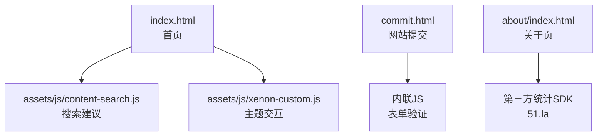
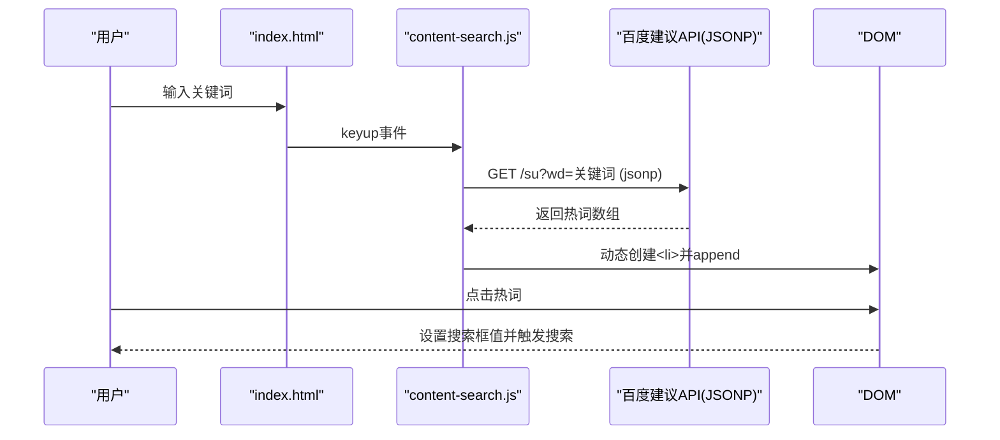
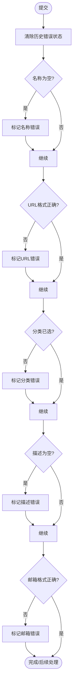
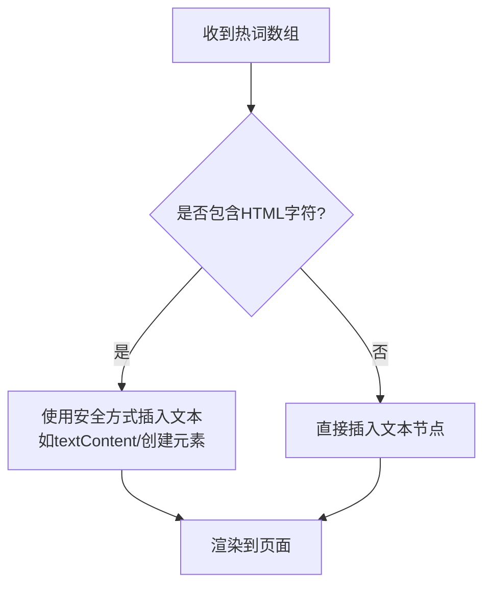
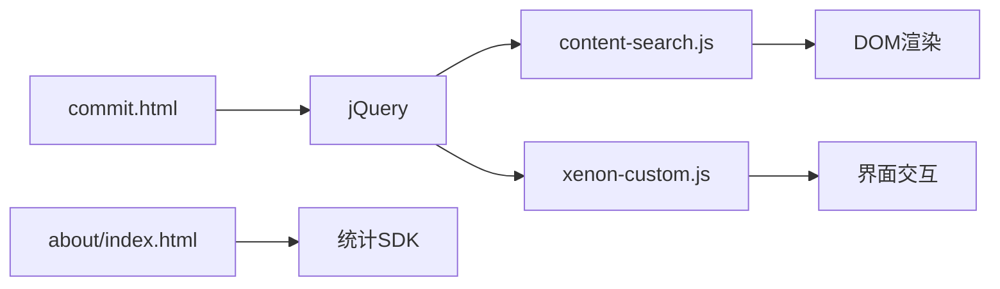

# XSS攻击防护

<cite>
**本文引用的文件**
- [index.html](file://index.html)
- [commit.html](file://commit.html)
- [about/index.html](file://about/index.html)
- [assets/js/content-search.js](file://assets/js/content-search.js)
- [assets/js/xenon-custom.js](file://assets/js/xenon-custom.js)
</cite>

## 目录
1. [简介](#简介)
2. [项目结构](#项目结构)
3. [核心组件](#核心组件)
4. [架构总览](#架构总览)
5. [详细组件分析](#详细组件分析)
6. [依赖关系分析](#依赖关系分析)
7. [性能与安全权衡](#性能与安全权衡)
8. [故障排查指南](#故障排查指南)
9. [结论](#结论)
10. [附录：安全测试与工具](#附录：安全测试与工具)

## 简介
本文件面向XSS（跨站脚本）攻击防护，结合仓库中的前端页面与脚本，系统梳理输入验证、输出编码、CSP策略以及DOM操作安全等关键实践。文档同时给出常见XSS类型与对应防护策略，并提供可操作的测试方法与漏洞检测建议，帮助读者在现有代码基础上完善安全防线。

## 项目结构
本项目为静态站点型导航网站，包含首页、提交页、关于页及若干前端资源。关键安全相关点集中在：
- 表单输入与校验逻辑（提交页）
- 搜索建议与动态内容插入（首页搜索）
- 第三方脚本加载与外部资源引用
- 安全响应头与CSP配置现状

图表来源
- [index.html:1-35](file://index.html#L1-L35)
- [assets/js/content-search.js:1-91](file://assets/js/content-search.js#L1-L91)
- [assets/js/xenon-custom.js:1-200](file://assets/js/xenon-custom.js#L1-L200)
- [commit.html:178-382](file://commit.html#L178-L382)
- [about/index.html:239-241](file://about/index.html#L239-L241)

章节来源
- [index.html:1-35](file://index.html#L1-L35)
- [commit.html:178-382](file://commit.html#L178-L382)
- [assets/js/content-search.js:1-91](file://assets/js/content-search.js#L1-L91)
- [assets/js/xenon-custom.js:1-200](file://assets/js/xenon-custom.js#L1-L200)
- [about/index.html:239-241](file://about/index.html#L239-L241)

## 核心组件
- 首页搜索建议：通过JSONP请求第三方接口获取热词并渲染到页面，存在动态插入风险点。
- 网站提交表单：包含名称、URL、分类、描述、邮箱等字段的前端校验，涉及URL与邮箱格式检查。
- 第三方脚本：天气插件、统计SDK等外部资源加载，需关注可信来源与执行环境限制。
- 主题交互脚本：提供通用UI行为，未发现直接的安全处理函数。

章节来源
- [assets/js/content-search.js:1-91](file://assets/js/content-search.js#L1-L91)
- [commit.html:286-382](file://commit.html#L286-L382)
- [index.html:270-296](file://index.html#L270-L296)
- [about/index.html:239-241](file://about/index.html#L239-L241)

## 架构总览
从用户输入到页面渲染的关键路径如下：
- 用户在搜索框输入关键词 → content-search.js发起JSONP请求 → 成功回调中拼接HTML并插入DOM → 点击热词触发跳转或提交。
- 用户在提交页填写表单 → 内联JS进行基础校验（URL/邮箱/必填）→ 阻止默认提交（当前未实现后端发送）。

图表来源
- [assets/js/content-search.js:3-83](file://assets/js/content-search.js#L3-L83)
- [index.html:318-355](file://index.html#L318-L355)

章节来源
- [assets/js/content-search.js:3-83](file://assets/js/content-search.js#L3-L83)
- [index.html:318-355](file://index.html#L318-L355)

## 详细组件分析

### 输入验证机制（提交页）
- 表单字段：网站名称、网站地址、分类、描述、关键词、联系邮箱、联系方式。
- 校验规则：
  - 必填项校验（名称、地址、分类、描述、邮箱）。
  - URL格式校验使用正则表达式匹配以http/https开头的域名形式。
  - 邮箱格式校验使用正则表达式匹配基本邮箱结构。
- 错误提示：通过添加样式类与显示错误消息元素反馈。
- 提交拦截：阻止默认提交行为，收集数据但当前未实现网络发送。

图表来源
- [commit.html:294-345](file://commit.html#L294-L345)

章节来源
- [commit.html:286-382](file://commit.html#L286-L382)

### 输出编码与DOM操作安全（搜索建议）
- 风险点：搜索结果列表通过字符串拼接后插入DOM，若未对内容进行转义，可能引入XSS。
- 现状：当前代码将热词文本作为纯文本节点插入，未直接使用innerHTML写入HTML片段；但仍需注意：
  - 避免将用户可控数据直接拼接到HTML标签中。
  - 优先使用textContent或createElement+appendChild方式插入文本。
  - 如需渲染富文本，应使用安全的白名单过滤库进行清理。

图表来源
- [assets/js/content-search.js:16-32](file://assets/js/content-search.js#L16-L32)

章节来源
- [assets/js/content-search.js:16-32](file://assets/js/content-search.js#L16-L32)

### Content Security Policy（CSP）配置与使用
- 现状：页面中未发现Content-Security-Policy元标签或HTTP头配置。
- 建议：
  - 在服务器或CDN层统一设置CSP响应头，限制脚本、样式、图片等资源的加载来源。
  - 针对第三方脚本（天气、统计）仅允许其可信域名加载。
  - 禁止内联脚本执行（'unsafe-inline'），改用外部脚本文件或nonce/hashed方式。
  - 启用升级不安全请求（upgrade-insecure-requests）以减少混合内容风险。

章节来源
- [index.html:1-35](file://index.html#L1-L35)
- [commit.html:1-26](file://commit.html#L1-L26)
- [about/index.html:1-26](file://about/index.html#L1-L26)

### 事件处理器绑定与动态内容安全
- 事件委托：搜索热词列表通过document级监听点击事件，便于动态元素生效。
- 风险点：若未来改为将用户输入直接注入为HTML片段并绑定事件，需确保内容经过严格清洗与转义。
- 建议：
  - 对动态生成的元素仅绑定最小必要的事件。
  - 避免使用eval、setTimeout/setInterval传入字符串参数。
  - 对外部数据渲染前进行白名单过滤与上下文相关转义。

章节来源
- [assets/js/content-search.js:75-83](file://assets/js/content-search.js#L75-L83)

### 第三方脚本与外部资源
- 天气插件：通过script标签加载第三方服务，需确保来源可信且必要时配置CSP白名单。
- 统计SDK：在关于页加载第三方统计脚本，同样需要CSP约束与可信域名管理。
- 建议：
  - 使用子资源完整性（SRI）校验第三方脚本。
  - 通过CSP限制可执行脚本的来源域。
  - 定期审计第三方脚本变更，防止供应链风险。

章节来源
- [index.html:270-296](file://index.html#L270-L296)
- [about/index.html:239-241](file://about/index.html#L239-L241)

## 依赖关系分析
- 首页依赖jQuery与content-search.js实现搜索建议功能。
- 提交页依赖jQuery与内联JS实现表单校验与交互。
- 关于页依赖jQuery与第三方统计SDK。
- 主题交互由xenon-custom.js提供，主要承担UI行为，不直接处理用户输入。

图表来源
- [index.html:30-31](file://index.html#L30-L31)
- [commit.html:285-382](file://commit.html#L285-L382)
- [about/index.html:335-336](file://about/index.html#L335-L336)

章节来源
- [index.html:30-31](file://index.html#L30-L31)
- [commit.html:285-382](file://commit.html#L285-L382)
- [about/index.html:335-336](file://about/index.html#L335-L336)

## 性能与安全权衡
- JSONP搜索建议：
  - 优点：简单、无需跨域复杂配置。
  - 缺点：安全性较低（依赖全局回调），建议逐步迁移至CORS+JSON模式，并结合CSP限制来源。
- 内联脚本：
  - 优点：开发便捷。
  - 缺点：不利于CSP禁用内联脚本，建议拆分为外部脚本并使用nonce或哈希。
- 第三方脚本：
  - 优点：快速集成能力。
  - 缺点：引入供应链风险，需配合SRI与CSP白名单管理。

[本节为通用指导，不直接分析具体文件]

## 故障排查指南
- 搜索热词不显示：
  - 检查网络请求是否成功（控制台Network面板）。
  - 确认JSONP回调是否正常返回数据。
  - 查看DOM中是否插入了列表元素。
- 表单校验无效：
  - 检查正则表达式是否正确匹配目标格式。
  - 确认错误提示元素是否被正确显示/隐藏。
  - 验证事件绑定是否生效（控制台无报错）。
- 第三方脚本加载失败：
  - 检查CSP是否限制了相应域名。
  - 核对脚本URL是否可用，是否存在跨域问题。
  - 使用浏览器开发者工具的Security面板查看CSP违规信息。

章节来源
- [assets/js/content-search.js:16-72](file://assets/js/content-search.js#L16-L72)
- [commit.html:294-345](file://commit.html#L294-L345)
- [index.html:270-296](file://index.html#L270-L296)

## 结论
当前项目在输入验证方面具备基础的前端校验逻辑，但在输出编码、CSP策略与第三方脚本管理方面仍有提升空间。建议优先落地以下措施：
- 为所有页面配置严格的CSP响应头，限制脚本与资源来源，禁用内联脚本。
- 对动态插入的DOM内容采用安全的文本插入方式，避免拼接HTML字符串。
- 将内联脚本迁移为外部文件，并通过nonce或哈希方式允许执行。
- 对第三方脚本启用SRI，并纳入CSP白名单管理。
- 持续进行安全测试与漏洞扫描，确保新增功能符合安全基线。

[本节为总结性内容，不直接分析具体文件]

## 附录：安全测试与工具
- 手动测试方法：
  - 在搜索框与提交表单中输入典型XSS载荷（如），观察是否被执行或被正确转义。
  - 检查网络请求与DOM变化，确认未出现意外的脚本执行。
- 自动化扫描：
  - 使用浏览器扩展（如Wappalyzer、NoScript）辅助识别外部脚本与权限。
  - 使用OWASP ZAP或Burp Suite进行主动扫描，重点关注反射型XSS与存储型XSS场景。
- CSP验证：
  - 在开发者工具的Console中查看CSP违规报告，定位被阻止的资源与脚本。
  - 逐步收紧CSP策略，确保业务不受影响。

[本节为通用指导，不直接分析具体文件]