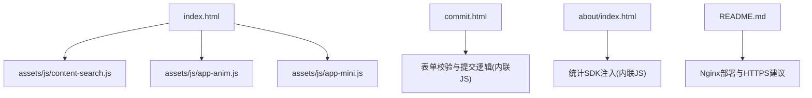
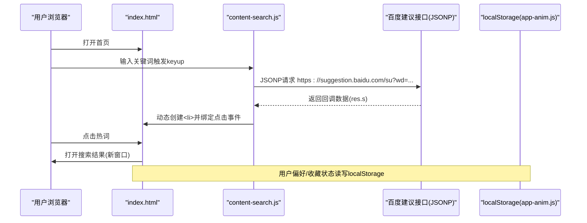
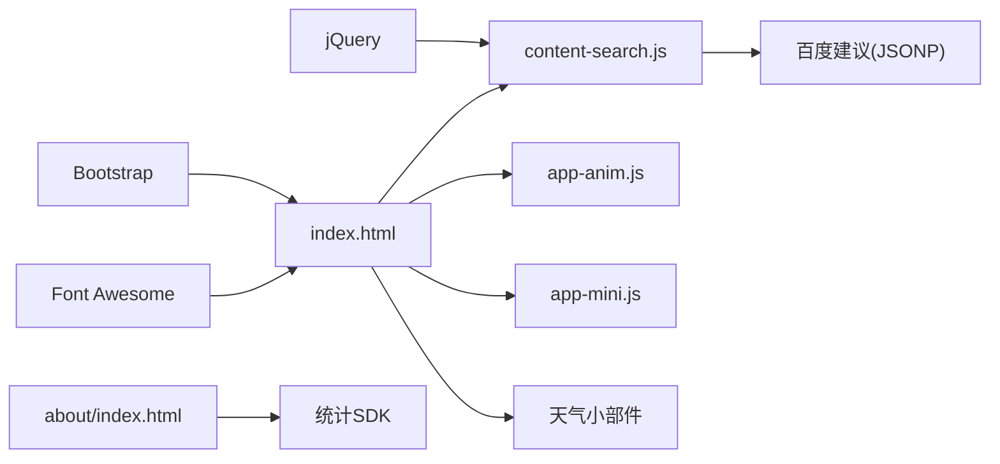

# 安全考虑

<cite>
**本文引用的文件**
- [index.html](file://index.html)
- [commit.html](file://commit.html)
- [about/index.html](file://about/index.html)
- [assets/js/content-search.js](file://assets/js/content-search.js)
- [assets/js/app-anim.js](file://assets/js/app-anim.js)
- [assets/js/app-mini.js](file://assets/js/app-mini.js)
- [README.md](file://README.md)
</cite>

## 目录
1. [简介](#简介)
2. [项目结构](#项目结构)
3. [核心组件](#核心组件)
4. [架构总览](#架构总览)
5. [详细组件分析](#详细组件分析)
6. [依赖关系分析](#依赖关系分析)
7. [性能与安全权衡](#性能与安全权衡)
8. [故障排查指南](#故障排查指南)
9. [结论](#结论)
10. [附录：安全配置与最佳实践清单](#附录：安全配置与最佳实践清单)

## 简介
本文件面向该纯静态网址导航项目的安全性设计与实现，围绕以下方面展开：XSS防护（输入验证、输出编码、CSP）、数据安全（敏感信息处理、传输加密、存储安全）、第三方API调用安全（跨域、密钥保护、错误处理）、用户隐私（本地存储、Cookie管理、数据最小化），以及可落地的安全最佳实践与常见问题解决方案。文档中的分析与建议均基于仓库内现有代码与部署说明进行梳理，并给出可直接参考的配置位置与改进路径。

## 项目结构
该项目为纯前端静态站点，主要入口为首页 index.html，另有提交页 commit.html 和关于页 about/index.html。资源集中在 assets 目录，包含样式、图标库与少量业务脚本。搜索建议通过 content-search.js 发起跨域请求；主题/交互逻辑在 app-anim.js 与 app-mini.js 中；README 提供部署与Nginx配置示例。

图表来源
- [index.html:1-35](file://index.html#L1-L35)
- [assets/js/content-search.js:1-91](file://assets/js/content-search.js#L1-L91)
- [assets/js/app-anim.js:600-847](file://assets/js/app-anim.js#L600-L847)
- [assets/js/app-mini.js:595-842](file://assets/js/app-mini.js#L595-L842)
- [commit.html:199-382](file://commit.html#L199-L382)
- [about/index.html:239-241](file://about/index.html#L239-L241)
- [README.md:47-147](file://README.md#L47-L147)

章节来源
- [index.html:1-35](file://index.html#L1-L35)
- [README.md:47-147](file://README.md#L47-L147)

## 核心组件
- 首页与导航：负责页面骨架、外链跳转、天气与一言等第三方小部件加载。
- 搜索建议：content-search.js 使用 JSONP 向百度建议接口拉取热词，存在典型的跨域与注入风险点。
- 用户偏好与收藏：app-anim.js / app-mini.js 使用 localStorage 保存用户选择与收藏列表。
- 网站提交：commit.html 提供表单与前端校验，当前未接入后端持久化。
- 关于页：嵌入第三方统计SDK脚本。

章节来源
- [index.html:270-315](file://index.html#L270-L315)
- [assets/js/content-search.js:1-91](file://assets/js/content-search.js#L1-L91)
- [assets/js/app-anim.js:600-847](file://assets/js/app-anim.js#L600-L847)
- [assets/js/app-mini.js:595-842](file://assets/js/app-mini.js#L595-L842)
- [commit.html:199-382](file://commit.html#L199-L382)
- [about/index.html:239-241](file://about/index.html#L239-L241)

## 架构总览
从安全视角看，系统由“页面渲染层”、“交互脚本层”、“外部服务集成层”组成。安全风险主要集中在：
- 外部脚本与第三方资源的引入与执行
- 跨域数据获取（JSONP）与动态DOM插入
- 本地存储的数据读写
- 外链跳转的打开方式与目标控制
- 部署层的传输加密与响应头策略

图表来源
- [assets/js/content-search.js:5-83](file://assets/js/content-search.js#L5-L83)
- [assets/js/app-anim.js:600-847](file://assets/js/app-anim.js#L600-L847)

## 详细组件分析

### XSS攻击防护
- 输入验证
  - 提交页 commit.html 对网站名称、URL、分类、描述、邮箱等字段做了基础的前端校验（正则匹配、必填检查）。这有助于减少无效或恶意输入进入后续流程的概率。
  - 搜索建议 content-search.js 将用户输入的关键词拼接至查询参数后发起JSONP请求，属于典型输入到网络请求的边界点，需确保服务端返回可信数据并在客户端严格解析。
- 输出编码
  - 在 content-search.js 中，搜索结果列表项通过字符串拼接插入DOM。若直接拼接不可信内容，可能引发XSS。建议改为仅允许白名单字符或使用安全的DOM API（createElement + textContent），避免 innerHTML 拼接。
- Content Security Policy（CSP）
  - 当前页面未设置 CSP meta 标签或HTTP响应头。建议在服务器（如Nginx）或平台侧添加严格的CSP，限制脚本、样式、图片、iframe等来源，禁止 unsafe-inline 与 eval，降低XSS影响面。
- 外链与弹窗安全
  - 多处外链使用 target="_blank"，应配合 rel="noopener noreferrer" 防止反向标签劫持与性能问题。部分链接已具备 rel="nofollow"，但建议统一加上 noopener/noreferrer。

章节来源
- [commit.html:294-345](file://commit.html#L294-L345)
- [assets/js/content-search.js:5-83](file://assets/js/content-search.js#L5-L83)
- [index.html:208-211](file://index.html#L208-L211)

### 数据安全保护
- 敏感信息处理
  - 天气小部件在 index.html 中以明文形式嵌入 key。建议将此类密钥移至后端代理或环境变量，并通过受控接口下发，避免前端硬编码泄露。
  - 关于页 about/index.html 嵌入了第三方统计SDK的ID与ck值，同样建议评估是否必要及最小化暴露范围。
- 传输加密
  - README 提供了Nginx部署与Let's Encrypt证书配置指引，建议生产环境强制HTTPS，并在服务器启用HSTS、安全相关响应头（如 X-Content-Type-Options、X-Frame-Options 等）。
- 存储安全
  - app-anim.js 与 app-mini.js 使用 localStorage 保存用户偏好与收藏列表。由于localStorage无过期机制且可被同域脚本读取，应避免存储敏感信息；如需会话级数据，可使用 sessionStorage 或更安全的后端方案。

章节来源
- [index.html:270-295](file://index.html#L270-L295)
- [about/index.html:239-241](file://about/index.html#L239-L241)
- [README.md:134-147](file://README.md#L134-L147)
- [assets/js/app-anim.js:600-847](file://assets/js/app-anim.js#L600-L847)
- [assets/js/app-mini.js:595-842](file://assets/js/app-mini.js#L595-L842)

### 第三方API调用安全
- 跨域请求处理
  - 搜索建议使用 JSONP 跨域，需在服务端信任回调函数名，并在客户端限制回调函数的执行上下文。建议逐步迁移至CORS方案，以便更好地控制请求与响应。
- API密钥保护
  - 天气小部件key在前端可见。建议通过后端转发请求或在CDN层鉴权，避免密钥泄露。
- 错误处理
  - content-search.js 在成功与失败分支中对DOM进行了操作，建议在错误分支增加兜底逻辑，避免空指针或异常渲染导致页面崩溃。

章节来源
- [assets/js/content-search.js:8-72](file://assets/js/content-search.js#L8-L72)
- [index.html:270-295](file://index.html#L270-L295)

### 用户隐私保护措施
- 本地存储使用
  - 使用 localStorage 保存搜索类型与菜单选择等用户偏好，不涉及个人身份信息，符合最小化原则。建议为键名加前缀隔离命名空间，便于清理与审计。
- Cookie管理
  - 未发现主动设置Cookie的逻辑。若未来需要，请遵循 SameSite、Secure、HttpOnly 等属性要求，并明确用途与生命周期。
- 用户数据保护
  - 提交页收集邮箱等个人信息，当前未持久化到后端。若后续接入后端，需确保传输加密、存储加密、访问控制与数据保留策略合规。

章节来源
- [assets/js/app-anim.js:816-847](file://assets/js/app-anim.js#L816-L847)
- [assets/js/app-mini.js:811-842](file://assets/js/app-mini.js#L811-L842)
- [commit.html:258-273](file://commit.html#L258-L273)

## 依赖关系分析
- 外部资源
  - jQuery、Bootstrap、Fancybox、Font Awesome 等第三方库通过本地文件或CDN引入。建议固定版本并校验完整性（SRI），避免供应链污染。
- 第三方服务
  - 百度建议接口（JSONP）、天气小部件、统计SDK。需评估其隐私政策与数据流向，必要时提供关闭选项或替代方案。
- 内部脚本耦合
  - content-search.js 与首页DOM强耦合；app-anim.js/app-mini.js 与用户偏好存储耦合。建议抽象出独立模块，便于测试与安全加固。

图表来源
- [index.html:17-31](file://index.html#L17-L31)
- [assets/js/content-search.js:1-91](file://assets/js/content-search.js#L1-L91)
- [assets/js/app-anim.js:600-847](file://assets/js/app-anim.js#L600-L847)
- [assets/js/app-mini.js:595-842](file://assets/js/app-mini.js#L595-L842)
- [about/index.html:239-241](file://about/index.html#L239-L241)

章节来源
- [index.html:17-31](file://index.html#L17-L31)
- [assets/js/content-search.js:1-91](file://assets/js/content-search.js#L1-L91)

## 性能与安全权衡
- 静态资源缓存与完整性
  - README 提供静态资源缓存策略。建议结合SRI与子资源完整性校验，兼顾性能与防篡改。
- 按需加载与最小化
  - 第三方SDK与字体按需加载，减少首屏负担与攻击面。
- 传输优化
  - 启用Gzip/Brotli压缩与HTTPS，提升性能同时保障机密性与完整性。

[本节为通用指导，不直接分析具体文件]

## 故障排查指南
- 搜索建议不显示
  - 检查网络请求是否成功、JSONP回调是否被拦截、控制台是否有跨域或语法错误。
  - 参考位置：[assets/js/content-search.js:8-72](file://assets/js/content-search.js#L8-L72)
- 用户偏好未生效
  - 检查浏览器是否禁用localStorage、是否存在同名键覆盖、是否清除了站点数据。
  - 参考位置：[assets/js/app-anim.js:600-847](file://assets/js/app-anim.js#L600-L847)、[assets/js/app-mini.js:595-842](file://assets/js/app-mini.js#L595-L842)
- 外链安全问题
  - 确认所有 target="_blank" 链接均添加 rel="noopener noreferrer"，避免反向劫持。
  - 参考位置：[index.html:208-211](file://index.html#L208-L211)

章节来源
- [assets/js/content-search.js:8-72](file://assets/js/content-search.js#L8-L72)
- [assets/js/app-anim.js:600-847](file://assets/js/app-anim.js#L600-L847)
- [assets/js/app-mini.js:595-842](file://assets/js/app-mini.js#L595-L842)
- [index.html:208-211](file://index.html#L208-L211)

## 结论
本项目为纯静态站点，整体风险可控，但仍存在若干可改进的安全点：建议引入CSP、修复外链安全属性、强化搜索建议的输出安全、最小化第三方密钥暴露、完善错误处理与传输加密。通过上述措施，可在不改变现有架构的前提下显著提升安全性与健壮性。

[本节为总结性内容，不直接分析具体文件]

## 附录：安全配置与最佳实践清单

- 输入验证与输出编码
  - 对所有用户输入进行白名单校验与长度限制。
  - 动态插入DOM时优先使用 createElement + textContent，避免 innerHTML 拼接。
  - 参考：[commit.html:294-345](file://commit.html#L294-L345)、[assets/js/content-search.js:17-32](file://assets/js/content-search.js#L17-L32)

- Content Security Policy（CSP）
  - 在Nginx或平台侧添加响应头，限制脚本、样式、图片、iframe来源，禁止 unsafe-inline 与 eval。
  - 参考部署说明：[README.md:88-116](file://README.md#L88-L116)

- 外链与弹窗安全
  - 所有 target="_blank" 链接添加 rel="noopener noreferrer"。
  - 参考：[index.html:208-211](file://index.html#L208-L211)

- 第三方API与密钥保护
  - 将天气小部件key等敏感配置移至后端或CDN鉴权层，避免前端硬编码。
  - 参考：[index.html:270-295](file://index.html#L270-L295)

- 传输加密与响应头
  - 启用HTTPS与HSTS，设置 X-Content-Type-Options、X-Frame-Options、Referrer-Policy 等安全头。
  - 参考：[README.md:134-147](file://README.md#L134-L147)

- 本地存储与隐私
  - 仅存储非敏感的用户偏好；如需会话数据，使用 sessionStorage 或后端方案。
  - 参考：[assets/js/app-anim.js:600-847](file://assets/js/app-anim.js#L600-L847)、[assets/js/app-mini.js:595-842](file://assets/js/app-mini.js#L595-L842)

- 安全测试与漏洞修复流程
  - 定期扫描第三方库漏洞，固定版本并使用SRI校验。
  - 建立代码审查清单：输入校验、输出编码、CSP、外链安全、密钥管理、错误处理。
  - 发现漏洞后快速定位受影响页面与脚本，制定修复方案并回归测试。

[本节为通用指导，不直接分析具体文件]