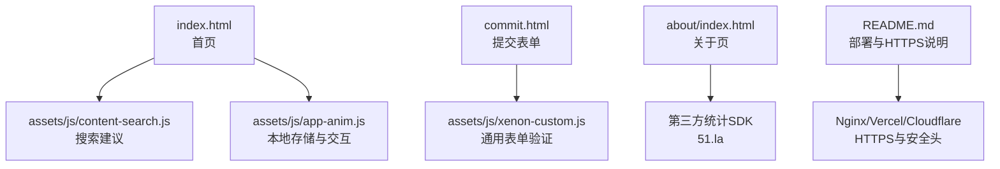
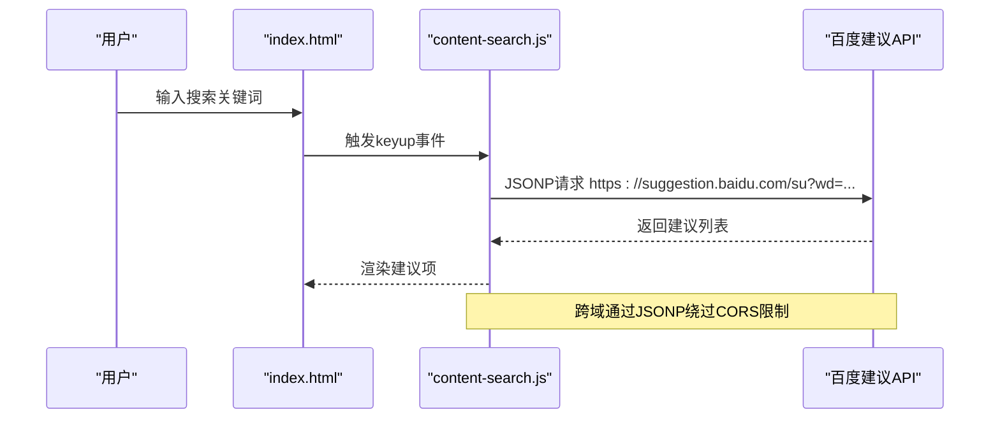
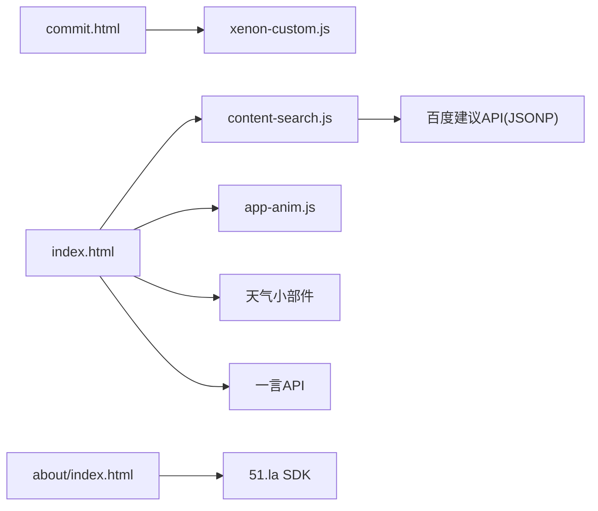

# 数据安全保护

<cite>
**本文引用的文件**
- [index.html](file://index.html)
- [commit.html](file://commit.html)
- [about/index.html](file://about/index.html)
- [assets/js/app-anim.js](file://assets/js/app-anim.js)
- [assets/js/content-search.js](file://assets/js/content-search.js)
- [assets/js/xenon-custom.js](file://assets/js/xenon-custom.js)
- [README.md](file://README.md)
</cite>

## 目录
1. [简介](#简介)
2. [项目结构](#项目结构)
3. [核心组件](#核心组件)
4. [架构总览](#架构总览)
5. [详细组件分析](#详细组件分析)
6. [依赖关系分析](#依赖关系分析)
7. [性能与安全权衡](#性能与安全权衡)
8. [故障排查指南](#故障排查指南)
9. [结论](#结论)
10. [附录：安全配置清单与最佳实践](#附录安全配置清单与最佳实践)

## 简介
本文件面向本项目“在线网址导航”的数据安全保护，覆盖敏感信息处理、数据传输加密、本地存储安全、表单数据提交与校验、跨域请求、日志与错误处理中的敏感信息隐藏等主题。项目为纯静态站点（HTML/CSS/JS），无后端服务；因此安全重点在于前端输入校验、外部资源加载安全、浏览器本地存储使用规范以及部署层面的HTTPS与HTTP安全头配置。

## 项目结构
- 入口页面 index.html：主导航与搜索模块，包含第三方脚本注入（天气、一言）和搜索建议接口调用。
- 提交页面 commit.html：用户提交网站信息的表单页，含前端校验逻辑。
- 关于页面 about/index.html：作者介绍与联系方式，集成统计SDK。
- 静态资源 assets/css、assets/js、assets/images、assets/fontawesome-5.15.4。
- 文档 README.md：提供Nginx部署与HTTPS配置示例。

图表来源
- [index.html:1-800](file://index.html#L1-L800)
- [commit.html:199-381](file://commit.html#L199-L381)
- [assets/js/content-search.js:1-91](file://assets/js/content-search.js#L1-L91)
- [assets/js/app-anim.js:590-850](file://assets/js/app-anim.js#L590-L850)
- [assets/js/xenon-custom.js:578-778](file://assets/js/xenon-custom.js#L578-L778)
- [about/index.html:239-241](file://about/index.html#L239-L241)
- [README.md:134-147](file://README.md#L134-L147)

章节来源
- [index.html:1-800](file://index.html#L1-L800)
- [commit.html:199-381](file://commit.html#L199-L381)
- [assets/js/content-search.js:1-91](file://assets/js/content-search.js#L1-L91)
- [assets/js/app-anim.js:590-850](file://assets/js/app-anim.js#L590-L850)
- [assets/js/xenon-custom.js:578-778](file://assets/js/xenon-custom.js#L578-L778)
- [about/index.html:239-241](file://about/index.html#L239-L241)
- [README.md:134-147](file://README.md#L134-L147)

## 核心组件
- 搜索建议与外部API调用：content-search.js通过JSONP调用百度搜索建议接口，存在跨域与外部依赖风险。
- 本地存储：app-anim.js使用localStorage保存用户偏好与自定义列表，需关注数据格式与长度限制。
- 表单提交与校验：commit.html实现前端校验；xenon-custom.js提供通用验证框架与输入掩码。
- 第三方脚本：index.html引入天气小部件与一言API；about/index.html集成51.la统计SDK。
- 部署与传输安全：README.md提供Nginx HTTPS配置与证书续期指引。

章节来源
- [assets/js/content-search.js:1-91](file://assets/js/content-search.js#L1-L91)
- [assets/js/app-anim.js:590-850](file://assets/js/app-anim.js#L590-L850)
- [commit.html:199-381](file://commit.html#L199-L381)
- [assets/js/xenon-custom.js:578-778](file://assets/js/xenon-custom.js#L578-L778)
- [index.html:270-315](file://index.html#L270-L315)
- [about/index.html:239-241](file://about/index.html#L239-L241)
- [README.md:134-147](file://README.md#L134-L147)

## 架构总览
本项目为纯前端静态站点，数据流主要发生在浏览器端：
- 用户输入（搜索词、表单字段）在前端进行基础校验与格式化。
- 搜索建议通过JSONP从外部服务获取并渲染到页面。
- 用户偏好与自定义列表保存在localStorage中。
- 部署层通过HTTPS保障传输安全，并可配置HTTP安全头增强防护。

图表来源
- [index.html:318-355](file://index.html#L318-L355)
- [assets/js/content-search.js:1-91](file://assets/js/content-search.js#L1-L91)

## 详细组件分析

### 敏感信息处理机制
- 收集范围
  - 搜索关键词：在content-search.js中作为查询参数发送到外部服务。
  - 表单数据：在commit.html中收集网站名称、地址、分类、描述、关键词、邮箱、联系方式等。
- 存储策略
  - 本地存储：app-anim.js将用户偏好与自定义列表写入localStorage，键名包括searchlist、searchlistmenu、myLinks、livelists等。
  - 未实现服务端持久化，提交功能仅在前端构建数据对象，未实际发送请求。
- 传输安全
  - 搜索建议使用JSONP调用外部HTTPS接口。
  - 其他外链跳转多为target="_blank"，部分链接为http协议，需统一升级为https。
- 隐私建议
  - 避免在localStorage中存储敏感个人信息（如邮箱、联系方式）。
  - 对表单中的敏感字段（邮箱、联系方式）增加最小化采集与用途声明。
  - 对外部API调用尽量使用HTTPS，并在必要时添加Referer白名单或Token鉴权（由服务端控制）。

章节来源
- [assets/js/content-search.js:1-91](file://assets/js/content-search.js#L1-L91)
- [commit.html:199-381](file://commit.html#L199-L381)
- [assets/js/app-anim.js:590-850](file://assets/js/app-anim.js#L590-L850)
- [index.html:318-355](file://index.html#L318-L355)

### 数据传输加密策略
- HTTPS使用
  - README.md提供Nginx启用HTTPS与Let's Encrypt证书自动续期的步骤。
  - 建议在CDN/托管平台（Vercel/Cloudflare Pages）开启强制HTTPS。
- API请求安全
  - 搜索建议采用JSONP，无法设置自定义请求头；如需更高安全性，可考虑在后端代理该接口或使用支持CORS的替代服务。
  - 所有外链应优先使用https；若必须http，应在目标站点确保其自身的安全策略。
- 跨域请求处理
  - JSONP通过script标签绕过CORS限制，但需注意回调函数命名与来源可信度。
  - 若未来引入Fetch/AJAX，请配置服务端CORS白名单，并启用SameSite Cookie策略。

章节来源
- [README.md:134-147](file://README.md#L134-L147)
- [assets/js/content-search.js:1-91](file://assets/js/content-search.js#L1-L91)

### 本地存储安全
- 使用现状
  - app-anim.js使用localStorage存储搜索偏好与自定义列表，键名包括searchlist、searchlistmenu、myLinks、livelists。
- 风险点
  - localStorage无过期机制，数据可能长期留存；若存储敏感信息，易被XSS读取。
  - 字符串序列化/反序列化（JSON.stringify/parse）需确保数据完整性与类型安全。
- 防控建议
  - 避免在localStorage中存储敏感信息（邮箱、联系方式、令牌等）。
  - 对写入前数据进行清洗与长度限制；读取后进行类型校验与异常捕获。
  - 定期清理无用数据，避免存储膨胀影响性能。

章节来源
- [assets/js/app-anim.js:590-850](file://assets/js/app-anim.js#L590-L850)

### 表单数据安全
- 前端校验
  - commit.html实现必填项检查、URL与邮箱正则校验、字符长度限制。
  - xenon-custom.js提供通用验证框架与输入掩码（如电话、货币、邮箱等）。
- 过滤与序列化
  - 提交前对输入进行trim与正则匹配，减少无效或恶意输入。
  - 当前未实现服务端接收与二次校验，建议后续接入后端进行严格校验与脱敏。
- 防XSS与注入
  - 渲染用户输入到DOM时，应避免直接使用innerHTML；建议使用textContent或安全的模板引擎。
  - 对富文本输入进行白名单过滤，禁止危险标签与事件属性。

章节来源
- [commit.html:199-381](file://commit.html#L199-L381)
- [assets/js/xenon-custom.js:578-778](file://assets/js/xenon-custom.js#L578-L778)

### 第三方脚本与外部依赖安全
- 天气小部件与一言API
  - index.html内嵌天气小部件与一言API，均通过script标签加载；需确保来源可信且使用HTTPS。
- 统计SDK
  - about/index.html集成51.la统计SDK，用于访问统计；需评估数据收集范围与隐私合规。
- 建议
  - 对第三方脚本进行子资源完整性（SRI）校验，防止篡改。
  - 限制第三方脚本的权限与作用域，必要时使用iframe隔离。

章节来源
- [index.html:270-315](file://index.html#L270-L315)
- [about/index.html:239-241](file://about/index.html#L239-L241)

### HTTP安全头与Cookie策略
- 安全头建议
  - Content-Security-Policy（CSP）：限制脚本、样式、图片等资源来源，降低XSS风险。
  - X-Frame-Options/X-Content-Type-Options/Referrer-Policy：防止点击劫持、MIME嗅探与过度Referer泄露。
  - Strict-Transport-Security（HSTS）：强制HTTPS访问。
- Cookie安全
  - 若使用Cookie，应设置HttpOnly、Secure、SameSite=Strict/Lax，避免客户端脚本访问与跨站携带。
- 部署配置
  - Nginx可通过add_header配置上述安全头；CDN/托管平台通常提供一键启用选项。

章节来源
- [README.md:134-147](file://README.md#L134-L147)

### 数据泄露防护与日志安全
- 日志记录
  - 避免在控制台或日志中输出敏感信息（邮箱、联系方式、令牌等）。
  - 生产环境关闭详细调试日志，仅记录必要错误上下文。
- 错误处理
  - 错误提示应面向用户友好且不暴露内部细节；对异常进行统一捕获与上报（不含敏感字段）。
- 最小化采集
  - 仅收集业务必需的数据；对用户输入进行脱敏后再上报或存储。

章节来源
- [commit.html:199-381](file://commit.html#L199-L381)
- [assets/js/content-search.js:1-91](file://assets/js/content-search.js#L1-L91)

## 依赖关系分析
- 页面与脚本耦合
  - index.html依赖content-search.js与app-anim.js实现搜索与本地存储功能。
  - commit.html依赖xenon-custom.js提供通用表单验证能力。
  - about/index.html依赖51.la SDK进行统计分析。
- 外部依赖
  - 百度搜索建议API（JSONP）、天气小部件、一言API、Font Awesome图标库。
- 潜在风险
  - 外部API可用性影响用户体验；JSONP无法设置请求头，安全性受限。
  - 第三方脚本可能被篡改或引入恶意代码，需加强来源校验与完整性检查。

图表来源
- [index.html:270-315](file://index.html#L270-L315)
- [assets/js/content-search.js:1-91](file://assets/js/content-search.js#L1-L91)
- [assets/js/app-anim.js:590-850](file://assets/js/app-anim.js#L590-L850)
- [commit.html:199-381](file://commit.html#L199-L381)
- [assets/js/xenon-custom.js:578-778](file://assets/js/xenon-custom.js#L578-L778)
- [about/index.html:239-241](file://about/index.html#L239-L241)

章节来源
- [index.html:270-315](file://index.html#L270-L315)
- [assets/js/content-search.js:1-91](file://assets/js/content-search.js#L1-L91)
- [assets/js/app-anim.js:590-850](file://assets/js/app-anim.js#L590-L850)
- [commit.html:199-381](file://commit.html#L199-L381)
- [assets/js/xenon-custom.js:578-778](file://assets/js/xenon-custom.js#L578-L778)
- [about/index.html:239-241](file://about/index.html#L239-L241)

## 性能与安全权衡
- JSONP vs Fetch/CORS
  - JSONP兼容性好但安全性弱；Fetch/CORS更安全但需服务端配合。建议在后端代理外部API，统一加签与限流。
- 本地存储容量与性能
  - localStorage容量有限（通常5-10MB），频繁读写会影响性能；建议合并写入与增量更新。
- 第三方脚本加载
  - 大量外部脚本会增加首屏时间；建议按需加载、异步加载与缓存优化。

[本节为通用指导，不直接分析具体文件]

## 故障排查指南
- 搜索建议不显示
  - 检查网络请求是否成功，确认JSONP回调是否正常；查看控制台是否有跨域或语法错误。
- 表单提交无响应
  - 当前提交逻辑仅构建数据对象，未实际发送请求；如需持久化，需接入后端API或第三方表单服务。
- 本地存储异常
  - 检查localStorage是否被禁用或空间不足；确认JSON序列化/反序列化是否正确。
- 第三方脚本失效
  - 检查CDN/第三方域名可达性；必要时替换为备用源或本地化资源。

章节来源
- [assets/js/content-search.js:1-91](file://assets/js/content-search.js#L1-L91)
- [commit.html:199-381](file://commit.html#L199-L381)
- [assets/js/app-anim.js:590-850](file://assets/js/app-anim.js#L590-L850)

## 结论
本项目为纯静态站点，数据安全重点在于前端输入校验、外部依赖安全、本地存储规范与部署层HTTPS配置。建议逐步完善以下方面：
- 全面启用HTTPS与HTTP安全头（CSP、HSTS、X-Frame-Options等）。
- 将敏感字段最小化采集，避免在localStorage中存储敏感信息。
- 对外部API调用进行代理与鉴权，提升可控性与安全性。
- 强化表单与服务端双重校验，防止注入与XSS攻击。
- 建立统一的错误处理与日志规范，避免敏感信息泄露。

[本节为总结性内容，不直接分析具体文件]

## 附录：安全配置清单与最佳实践
- HTTPS与证书
  - 使用Let's Encrypt申请证书并配置自动续期（参考README.md中的Nginx配置）。
  - 在CDN/托管平台启用强制HTTPS与HSTS。
- HTTP安全头
  - 设置CSP限制资源来源；设置X-Frame-Options防点击劫持；设置X-Content-Type-Options防MIME嗅探；设置Referrer-Policy控制Referer泄露。
- Cookie安全
  - 设置HttpOnly、Secure、SameSite=Strict/Lax；避免在Cookie中存储敏感信息。
- 表单与输入
  - 前端正则校验与长度限制；服务端二次校验与脱敏；避免innerHTML直接渲染用户输入。
- 本地存储
  - 避免存储敏感信息；定期清理；读写时进行类型校验与异常捕获。
- 第三方脚本
  - 使用SRI校验完整性；限制作用域；必要时使用iframe隔离。
- 日志与错误
  - 生产环境关闭调试日志；错误上报不包含敏感字段；统一错误提示。

章节来源
- [README.md:134-147](file://README.md#L134-L147)
- [commit.html:199-381](file://commit.html#L199-L381)
- [assets/js/content-search.js:1-91](file://assets/js/content-search.js#L1-L91)
- [assets/js/app-anim.js:590-850](file://assets/js/app-anim.js#L590-L850)