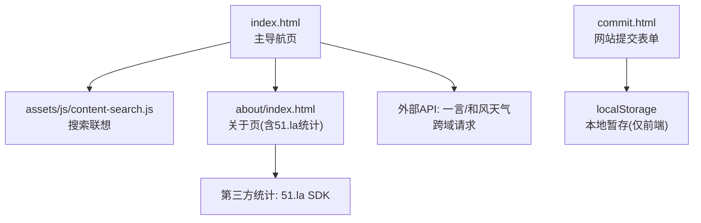
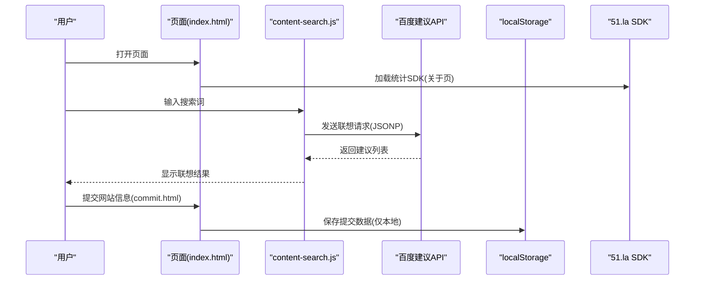
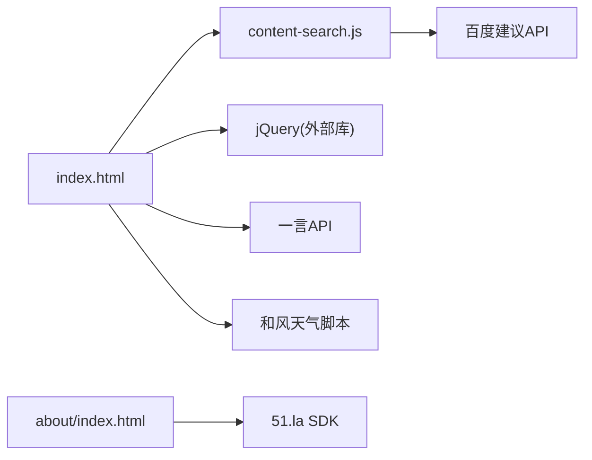

# 用户隐私保护

<cite>
**本文引用的文件**
- [index.html](file://index.html)
- [commit.html](file://commit.html)
- [about/index.html](file://about/index.html)
- [assets/js/content-search.js](file://assets/js/content-search.js)
- [README.md](file://README.md)
</cite>

## 目录
1. [简介](#简介)
2. [项目结构](#项目结构)
3. [核心组件](#核心组件)
4. [架构总览](#架构总览)
5. [详细组件分析](#详细组件分析)
6. [依赖关系分析](#依赖关系分析)
7. [性能与隐私权衡](#性能与隐私权衡)
8. [故障排查指南](#故障排查指南)
9. [结论](#结论)
10. [附录：合规清单与最佳实践](#附录：合规清单与最佳实践)

## 简介
本文件面向“在线网址导航”项目的用户隐私保护，基于仓库中的前端代码与文档，梳理数据采集最小化原则、Cookie/本地存储策略、第三方服务集成点、用户同意与授权机制、数据匿名化与访问控制、数据保留期限管理，以及GDPR等法规的合规要点。目标是帮助开发者在现有纯静态站点基础上，以最小侵入的方式增强隐私保护能力，并提供可操作的改进建议。

## 项目结构
本项目为纯静态网站，主要页面包括首页（导航）、提交页、关于页；资源集中在 assets 目录；统计与分析通过第三方脚本加载。当前未包含后端逻辑，数据存储主要依赖浏览器本地存储（如 localStorage）和第三方服务。

图表来源
- [index.html:1-800](file://index.html#L1-L800)
- [assets/js/content-search.js:1-91](file://assets/js/content-search.js#L1-L91)
- [about/index.html:239-242](file://about/index.html#L239-L242)
- [commit.html:347-371](file://commit.html#L347-L371)
- [README.md:324-334](file://README.md#L324-L334)

章节来源
- [index.html:1-800](file://index.html#L1-L800)
- [README.md:298-314](file://README.md#L298-L314)

## 核心组件
- 首页导航与搜索：提供分类导航与多搜索引擎跳转；搜索联想调用百度建议接口。
- 网站提交页：收集网站名称、地址、分类、描述、关键词、邮箱、联系方式等，并在前端进行校验；当前实现将数据保存在浏览器 localStorage（仅本地）。
- 关于页：集成 51.la 统计分析 SDK。
- 第三方服务：一言 API 获取随机句子；和风天气小部件加载天气信息。

章节来源
- [index.html:304-314](file://index.html#L304-L314)
- [index.html:351-429](file://index.html#L351-L429)
- [assets/js/content-search.js:1-91](file://assets/js/content-search.js#L1-L91)
- [commit.html:199-371](file://commit.html#L199-L371)
- [about/index.html:239-242](file://about/index.html#L239-L242)
- [README.md:324-334](file://README.md#L324-L334)

## 架构总览
从隐私视角看，系统由“前端页面 + 本地存储 + 第三方脚本/API”构成。关键数据流如下：
- 用户输入（搜索词、提交表单）在前端处理，部分数据写入 localStorage。
- 搜索联想通过 JSONP 向百度建议接口发起请求。
- 关于页动态加载 51.la SDK，用于访问统计。
- 首页通过 fetch 调用一言 API 展示随机句子；天气小部件加载第三方脚本。

图表来源
- [assets/js/content-search.js:1-91](file://assets/js/content-search.js#L1-L91)
- [about/index.html:239-242](file://about/index.html#L239-L242)
- [commit.html:347-371](file://commit.html#L347-L371)

## 详细组件分析

### 数据采集最小化原则
- 必需数据
  - 搜索功能：仅采集用户输入的关键词，用于生成联想建议；不持久化到服务器。
  - 网站提交：网站名称、地址、分类、描述、关键词、邮箱、联系方式。其中邮箱为必需字段，其他可选字段可按需收集。
- 可选数据
  - 关键词、联系方式等非必需字段应默认隐藏或可选，避免过度收集。
- 建议
  - 明确标注必填/选填，减少不必要的个人信息收集。
  - 对敏感字段（如邮箱）增加用途说明与最小可见性。

章节来源
- [commit.html:199-371](file://commit.html#L199-L371)
- [assets/js/content-search.js:1-91](file://assets/js/content-search.js#L1-L91)

### Cookie管理机制
- 现状
  - 项目中未发现显式设置 Cookie 的代码；样式文件中存在评论区的 Cookie 同意标签样式，但未被使用。
  - 第三方脚本可能设置 Cookie（如 51.la、百度建议、和风天气），具体取决于其自身策略。
- 策略建议
  - 区分必要 Cookie（如会话维持、安全相关）与非必要 Cookie（如分析、广告）。
  - 在未获得用户同意前，禁止加载非必要 Cookie 的第三方脚本。
  - 提供 Cookie 偏好设置入口，允许用户拒绝非必要的 Cookie。

章节来源
- [assets/css/style-3.03029.1.css:724](file://assets/css/style-3.03029.1.css#L724)

### 本地存储的数据使用规范
- 现状
  - 提交功能将数据保存在浏览器 localStorage（仅本地），便于临时缓存与预览，但不持久化到服务器。
- 规范
  - 明确 localStorage 用途：仅用于临时数据缓存（如草稿、最近提交记录）。
  - 设定清理策略：定期清理过期数据（例如超过7天的提交草稿），提供用户手动清除入口。
  - 敏感数据脱敏：不在 localStorage 中存储明文敏感信息（如密码、完整身份证号）。
  - 权限提示：首次使用时提示用户本地存储的作用与风险。

章节来源
- [README.md:324-334](file://README.md#L324-L334)
- [commit.html:347-371](file://commit.html#L347-L371)

### 用户同意与授权机制
- 现状
  - 未实现统一的 Cookie/统计同意弹窗；关于页直接加载 51.la SDK。
- 建议
  - 引入 Cookie 同意横幅，仅在用户同意后加载 51.la 等分析脚本。
  - 提供“隐私设置”面板，允许用户选择是否启用分析、是否接受第三方 Cookie。
  - 在提交表单前，要求用户勾选同意隐私政策与数据处理条款。

章节来源
- [about/index.html:239-242](file://about/index.html#L239-L242)

### 隐私保护措施实现
- 数据匿名化
  - 对提交数据进行哈希或脱敏后再存储（如需持久化）。
  - 对外部 API 请求时，避免传递可识别个人身份的信息。
- 访问权限控制
  - 前端限制：表单验证、输入长度限制、类型校验。
  - 后端（若扩展）：鉴权、速率限制、审计日志。
- 数据保留期限管理
  - 本地存储：设置过期时间戳，定期清理。
  - 第三方服务：遵循其数据保留策略，必要时联系服务商删除。

章节来源
- [commit.html:294-345](file://commit.html#L294-L345)

### GDPR 等隐私法规合规考虑
- 合法性基础
  - 明确数据处理目的与依据（如合同履行、用户同意）。
- 透明度
  - 提供清晰的隐私政策，说明收集的数据、用途、共享方、保留期限。
- 用户权利
  - 支持访问、更正、删除、撤回同意、数据可携带等权利。
- 跨境传输
  - 若涉及数据传输至境外，确保符合当地法规要求。
- 数据主体请求
  - 建立流程处理删除请求，及时清理本地与第三方数据。

章节来源
- [README.md:324-334](file://README.md#L324-L334)
- [about/index.html:239-242](file://about/index.html#L239-L242)

### 用户数据删除请求处理
- 本地数据
  - 提供“清除本地数据”按钮，一键删除 localStorage 中的提交草稿与偏好设置。
- 第三方数据
  - 对于已发送至第三方的数据，需在隐私政策中说明无法直接删除，并提供联系渠道。
- 审计与确认
  - 记录删除操作时间与范围，向用户提供确认回执。

章节来源
- [commit.html:347-371](file://commit.html#L347-L371)

### 隐私设置界面设计
- 建议包含
  - Cookie 偏好：必要/分析/营销。
  - 第三方脚本开关：统计、天气、一言等。
  - 数据导出与删除：导出本地数据、删除所有本地数据。
- 交互流程
  - 首次访问弹出隐私设置；后续可在设置面板修改。
  - 变更后立即生效，无需刷新页面。

[本节为概念性设计，不直接分析具体文件]

## 依赖关系分析
- 内部依赖
  - index.html 引入 content-search.js 实现搜索联想。
  - commit.html 使用 jQuery 进行表单校验与交互。
- 外部依赖
  - 百度建议 API：JSONP 请求，可能设置 Cookie。
  - 51.la 统计 SDK：动态加载，可能收集访问数据。
  - 一言 API：跨域请求，返回随机句子。
  - 和风天气：加载第三方脚本，可能设置 Cookie。

图表来源
- [index.html:30-31](file://index.html#L30-L31)
- [assets/js/content-search.js:1-91](file://assets/js/content-search.js#L1-L91)
- [about/index.html:239-242](file://about/index.html#L239-L242)

章节来源
- [index.html:30-31](file://index.html#L30-L31)
- [assets/js/content-search.js:1-91](file://assets/js/content-search.js#L1-L91)
- [about/index.html:239-242](file://about/index.html#L239-L242)

## 性能与隐私权衡
- 性能优化
  - 延迟加载第三方脚本（仅在用户同意后加载）。
  - 使用缓存策略减少重复请求。
- 隐私影响
  - 延迟加载可降低默认隐私风险。
  - 避免预取或预连接非必要域名。
- 建议
  - 提供“隐私优先模式”，禁用所有非必要脚本。
  - 监控第三方脚本对性能的影响，及时调整。

[本节为通用指导，不直接分析具体文件]

## 故障排查指南
- 常见问题
  - 搜索联想无响应：检查网络连通性与百度建议 API 可用性。
  - 统计无效：确认 51.la SDK 是否被正确加载且用户已同意。
  - 本地数据丢失：检查浏览器是否清除了 localStorage。
- 排查步骤
  - 打开开发者工具，查看 Network 与 Console 错误。
  - 检查 Cookie 与 LocalStorage 状态。
  - 逐步禁用第三方脚本定位问题。

章节来源
- [assets/js/content-search.js:1-91](file://assets/js/content-search.js#L1-L91)
- [about/index.html:239-242](file://about/index.html#L239-L242)

## 结论
本项目为纯静态站点，当前隐私保护较为简单：未主动设置 Cookie，提交数据仅保存在本地，统计与分析通过第三方脚本实现。建议在现有基础上引入 Cookie 同意机制、隐私设置面板、数据清理策略，并严格遵循最小化采集原则，以提升用户信任与合规水平。

[本节为总结性内容，不直接分析具体文件]

## 附录：合规清单与最佳实践
- 合规清单
  - 明确数据处理目的与依据。
  - 提供隐私政策与 Cookie 政策。
  - 实现用户同意与撤回机制。
  - 支持数据访问、更正、删除、导出。
  - 定期评估第三方服务的隐私合规性。
- 最佳实践
  - 默认关闭非必要追踪。
  - 对敏感数据进行脱敏与加密。
  - 建立数据保留与清理策略。
  - 提供透明的用户控制面板。

[本节为通用指导，不直接分析具体文件]