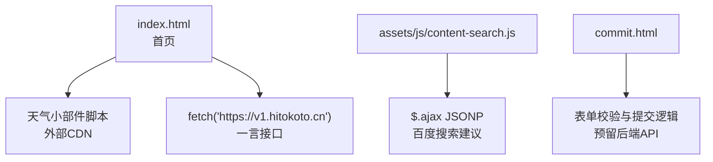
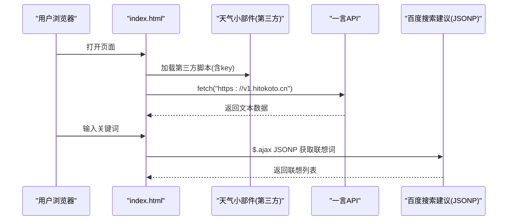
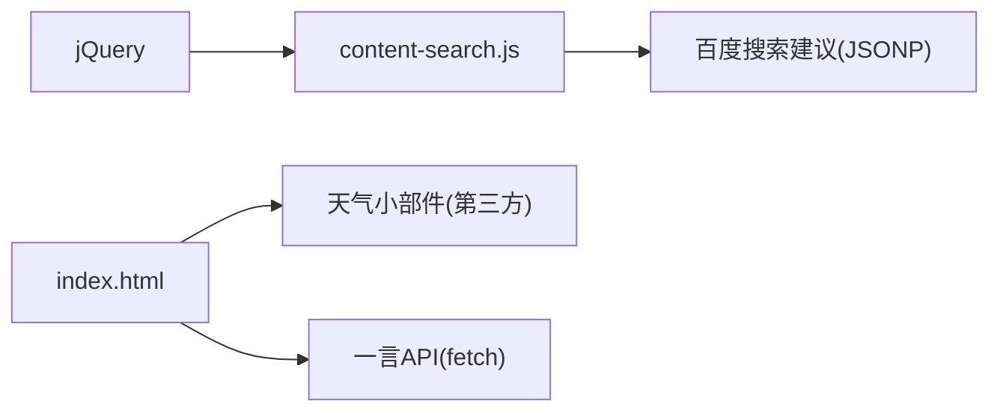

# 第三方API安全

<cite>
**本文引用的文件**
- [index.html](file://index.html)
- [commit.html](file://commit.html)
- [content-search.js](file://assets/js/content-search.js)
- [README.md](file://README.md)
</cite>

## 目录
1. [简介](#简介)
2. [项目结构](#项目结构)
3. [核心组件](#核心组件)
4. [架构总览](#架构总览)
5. [详细组件分析](#详细组件分析)
6. [依赖关系分析](#依赖关系分析)
7. [性能与安全考量](#性能与安全考量)
8. [故障排查指南](#故障排查指南)
9. [结论](#结论)
10. [附录：安全配置清单与示例路径](#附录：安全配置清单与示例路径)

## 简介
本文件围绕“第三方API安全”主题，结合仓库中的前端页面与脚本实现，系统梳理在集成第三方服务时的安全措施与最佳实践。重点覆盖跨域请求处理（CORS、JSONP、代理）、密钥与敏感信息管理、错误处理与异常恢复、请求签名与防重放等，并给出可落地的配置建议与示例位置指引。

## 项目结构
本项目为纯静态站点，主要包含首页、提交页、资源目录与少量前端脚本。第三方API调用主要集中在以下位置：
- 首页嵌入天气小部件与一言接口调用
- 搜索联想通过JSONP调用百度建议接口
- 提交页表单具备本地校验逻辑，预留后端对接点

图表来源
- [index.html:270-296](file://index.html#L270-L296)
- [index.html:304-313](file://index.html#L304-L313)
- [content-search.js:8-72](file://assets/js/content-search.js#L8-L72)
- [commit.html:285-379](file://commit.html#L285-L379)

章节来源
- [README.md:298-314](file://README.md#L298-L314)

## 核心组件
- 天气小部件：通过外部CDN加载的第三方脚本，使用key参数进行鉴权。
- 一言接口：使用原生fetch直接调用HTTPS接口，无鉴权参数。
- 搜索联想：使用jQuery的JSONP方式调用第三方建议接口，绕过同源限制。
- 提交页：前端表单校验完善，未内置网络请求，便于后续接入后端API。

章节来源
- [index.html:270-296](file://index.html#L270-L296)
- [index.html:304-313](file://index.html#L304-L313)
- [content-search.js:8-72](file://assets/js/content-search.js#L8-L72)
- [commit.html:285-379](file://commit.html#L285-L379)

## 架构总览
从安全视角看，当前项目的第三方API交互分为三类：
- 第三方脚本注入（天气小部件）：需关注来源可信、权限最小化、内容安全策略。
- 浏览器直调（fetch/JSONP）：需关注跨域、鉴权、限流、超时与降级。
- 未来后端代理（推荐）：将敏感操作（如提交、鉴权）迁移至服务端，避免在前端暴露密钥。

图表来源
- [index.html:270-296](file://index.html#L270-L296)
- [index.html:304-313](file://index.html#L304-L313)
- [content-search.js:8-72](file://assets/js/content-search.js#L8-L72)

## 详细组件分析

### 天气小部件（第三方脚本注入）
- 风险点
  - 第三方脚本可能执行任意JS，存在XSS风险。
  - key明文暴露在客户端，可能被滥用或泄露。
  - 若CDN被劫持，可能导致恶意代码注入。
- 防护措施
  - 使用严格的Content-Security-Policy（CSP），仅允许受信任的域名加载脚本。
  - 对第三方脚本启用SRI（Subresource Integrity）校验完整性。
  - 将key纳入环境变量管理，并通过服务端渲染或后端代理下发，避免硬编码。
  - 设置referrer-policy限制信息泄露。
  - 监控第三方脚本加载失败与异常上报。

章节来源
- [index.html:270-296](file://index.html#L270-L296)

### 一言接口（fetch HTTPS调用）
- 风险点
  - 直连第三方接口，缺少重试、超时、降级策略。
  - 无鉴权但可能被滥用（取决于对方限流策略）。
- 防护措施
  - 增加超时控制与重试机制（指数退避）。
  - 失败时提供降级文案或缓存最近一次成功结果。
  - 记录关键指标（耗时、状态码）用于监控告警。
  - 如需鉴权，统一由后端代理转发并集中管理密钥。

章节来源
- [index.html:304-313](file://index.html#L304-L313)

### 搜索联想（JSONP调用）
- 风险点
  - JSONP本质是全局函数回调，易受XSS影响。
  - 跨域请求不受CSP保护，需严格校验返回数据。
  - 频繁触发可能触发对方限流。
- 防护措施
  - 节流/防抖输入事件，降低请求频率。
  - 对返回数据进行白名单校验后再渲染。
  - 考虑替换为支持CORS的后端代理接口，逐步弃用JSONP。
  - 设置合理的超时与错误提示。

章节来源
- [content-search.js:8-72](file://assets/js/content-search.js#L8-L72)

### 提交页（表单与未来后端对接）
- 现状
  - 前端完成基础校验（必填、格式、长度等）。
  - 未实现网络请求，适合后续接入后端API。
- 建议的安全设计
  - 所有敏感操作（提交、鉴权、存储）走后端API。
  - 后端实施CSRF防护、速率限制、输入校验与输出编码。
  - 前端仅做体验型校验，不承载安全边界。
  - 成功后展示友好反馈，失败时给出明确错误信息。

章节来源
- [commit.html:285-379](file://commit.html#L285-L379)

## 依赖关系分析
- 第三方依赖
  - 天气小部件：外部CDN脚本，依赖其可用性与安全性。
  - 百度搜索建议：通过JSONP跨域获取联想词。
  - 一言接口：HTTPS REST接口。
- 内部依赖
  - jQuery用于AJAX与DOM操作。
  - 页面内联脚本负责UI交互与数据绑定。

图表来源
- [content-search.js:8-72](file://assets/js/content-search.js#L8-L72)
- [index.html:270-296](file://index.html#L270-L296)
- [index.html:304-313](file://index.html#L304-L313)

章节来源
- [content-search.js:8-72](file://assets/js/content-search.js#L8-L72)
- [index.html:270-296](file://index.html#L270-L296)
- [index.html:304-313](file://index.html#L304-L313)

## 性能与安全考量
- 跨域与CORS
  - 优先使用支持CORS的后端代理，减少JSONP使用。
  - 对必须跨域的接口，限定允许的源与方法，最小化权限。
- 密钥与敏感信息
  - 不在前端硬编码密钥；使用环境变量与服务端中转。
  - 定期轮换密钥，按环境隔离（开发/测试/生产）。
  - 对访问进行细粒度授权与审计。
- 错误处理与恢复
  - 统一封装HTTP客户端，内置超时、重试、熔断与降级。
  - 对第三方不可用时提供降级体验（缓存、默认值、友好提示）。
  - 建立错误监控与告警通道。
- 请求签名与防重放
  - 在后端生成一次性令牌（nonce）与时间戳（ts），对请求体进行签名。
  - 服务端校验时间窗口与nonce唯一性，防止重放。
  - 对敏感接口强制HTTPS与HSTS。
- 常见风险与对策
  - 注入攻击：前后端均做输入校验与输出编码，使用CSP与SRI。
  - 数据泄露：最小化传输数据，脱敏展示，加密存储。
  - 服务滥用：速率限制、配额管理、黑名单与验证码。

[本节为通用指导，不直接分析具体文件]

## 故障排查指南
- 天气小部件无法加载
  - 检查CSP是否放行该第三方域名。
  - 核对key是否有效且未被禁用。
  - 查看控制台是否有跨域或脚本加载错误。
- 一言接口无响应
  - 检查网络连通性与HTTPS证书。
  - 增加超时与重试，观察是否偶发失败。
  - 记录状态码与耗时，定位瓶颈。
- 搜索联想不显示
  - 确认JSONP回调是否正常执行。
  - 检查返回数据结构是否符合预期。
  - 增加节流与错误提示，避免频繁请求。
- 提交功能对接后端
  - 先验证后端接口可用性（curl或Postman）。
  - 前端仅做体验校验，错误信息以用户可读方式呈现。
  - 记录请求与响应摘要用于问题定位。

章节来源
- [index.html:270-296](file://index.html#L270-L296)
- [index.html:304-313](file://index.html#L304-L313)
- [content-search.js:8-72](file://assets/js/content-search.js#L8-L72)
- [commit.html:285-379](file://commit.html#L285-L379)

## 结论
本项目在当前阶段已集成多个第三方API，具备基本的前端交互能力。为保障安全与稳定性，建议尽快引入后端代理以集中管理鉴权、限流与日志；对第三方脚本采用CSP与SRI加固；对直调接口补充超时、重试与降级策略；并对敏感操作实施请求签名与防重放机制。通过上述措施，可有效降低注入、数据泄露与服务滥用等安全风险。

[本节为总结性内容，不直接分析具体文件]

## 附录：安全配置清单与示例路径
- CORS与跨域
  - 优先使用后端代理统一转发第三方请求，集中配置CORS白名单。
  - 对必须跨域的接口，限制方法与头字段，避免宽泛放行。
  - 参考：[content-search.js:8-72](file://assets/js/content-search.js#L8-L72)
- JSONP调用
  - 对返回数据做白名单校验后再渲染。
  - 增加节流与错误提示，避免频繁请求。
  - 参考：[content-search.js:8-72](file://assets/js/content-search.js#L8-L72)
- 代理服务器设置
  - 在后端提供统一网关，隐藏第三方密钥与敏感逻辑。
  - 网关层实现限流、熔断、重试与日志审计。
  - 参考：[README.md:298-314](file://README.md#L298-L314)
- API密钥与敏感信息管理
  - 使用环境变量管理密钥，禁止硬编码。
  - 按环境隔离密钥，定期轮换，最小权限原则。
  - 参考：[index.html:270-296](file://index.html#L270-L296)
- 错误处理与异常恢复
  - 统一封装HTTP客户端，内置超时、重试、熔断与降级。
  - 失败时提供降级体验与用户友好提示。
  - 参考：[index.html:304-313](file://index.html#L304-L313)
- 请求签名与防重放
  - 后端生成nonce与ts，对请求体计算签名。
  - 服务端校验时间窗口与nonce唯一性。
  - 参考：[commit.html:285-379](file://commit.html#L285-L379)
- 安全配置示例（路径指引）
  - 天气小部件配置位置：[index.html:270-296](file://index.html#L270-L296)
  - 一言接口调用位置：[index.html:304-313](file://index.html#L304-L313)
  - 搜索联想JSONP位置：[content-search.js:8-72](file://assets/js/content-search.js#L8-L72)
  - 提交页表单与校验：[commit.html:285-379](file://commit.html#L285-L379)