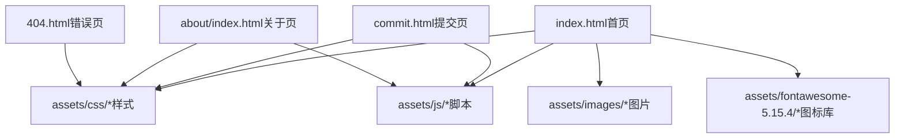
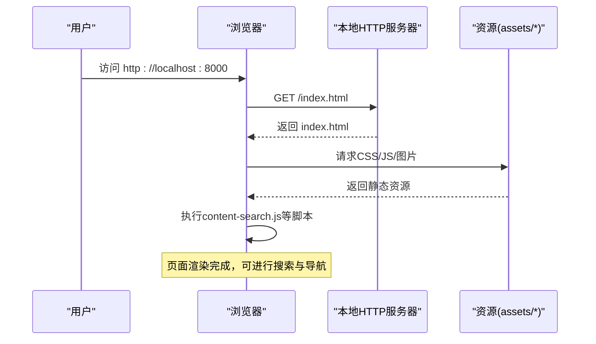
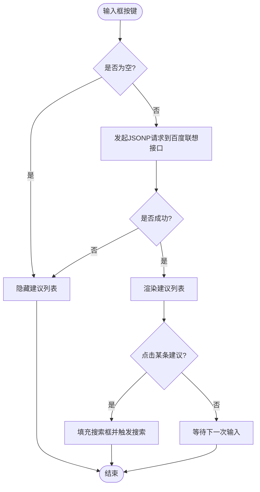
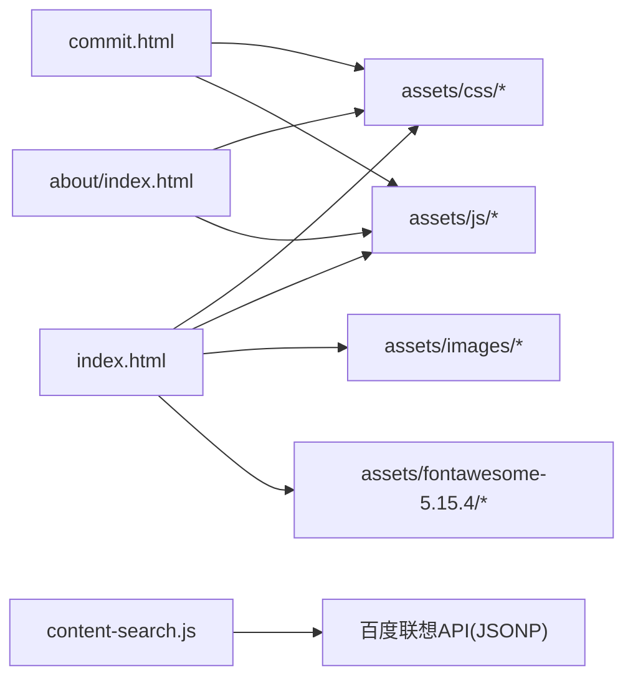

# 快速开始

<cite>
**本文引用的文件**
- [README.md](file://README.md)
- [index.html](file://index.html)
- [about/index.html](file://about/index.html)
- [commit.html](file://commit.html)
- [404.html](file://404.html)
- [assets/js/content-search.js](file://assets/js/content-search.js)
</cite>

## 目录
1. [简介](#简介)
2. [项目结构](#项目结构)
3. [核心组件](#核心组件)
4. [架构总览](#架构总览)
5. [详细组件分析](#详细组件分析)
6. [依赖关系分析](#依赖关系分析)
7. [性能注意事项](#性能注意事项)
8. [故障排查指南](#故障排查指南)
9. [结论](#结论)
10. [附录](#附录)

## 简介
本项目是一个纯静态的在线网址导航工具，界面简洁美观，支持响应式布局、日间/夜间模式切换、分类与搜索、以及网站提交入口。无需后端即可本地预览与部署，适合个人或团队使用。

## 项目结构
项目采用“页面 + 资源”的扁平化组织方式：
- 根目录包含首页、提交页、关于页和错误页等 HTML 文件
- assets 目录下集中存放样式、脚本、图标与图片资源
- 通过相对路径引用各资源，便于直接以 HTTP 服务器或浏览器打开运行

图表来源
- [index.html:1-35](file://index.html#L1-L35)
- [commit.html:1-26](file://commit.html#L1-L26)
- [about/index.html:1-26](file://about/index.html#L1-L26)
- [404.html:1-3](file://404.html#L1-L3)

章节来源
- [README.md:298-314](file://README.md#L298-L314)

## 核心组件
- 首页（index.html）：导航主入口，包含侧边栏分类、顶部搜索框、天气插件、精选链接卡片等
- 提交页（commit.html）：提供网站提交流程的前端表单与校验逻辑
- 关于页（about/index.html）：展示作者信息、技术栈与联系方式
- 错误页（404.html）：自定义 404 提示
- 搜索建议（content-search.js）：基于百度联想接口实现输入联想与快捷选择

章节来源
- [index.html:42-219](file://index.html#L42-L219)
- [commit.html:178-283](file://commit.html#L178-L283)
- [about/index.html:244-333](file://about/index.html#L244-L333)
- [404.html:1-3](file://404.html#L1-L3)
- [assets/js/content-search.js:1-91](file://assets/js/content-search.js#L1-L91)

## 架构总览
本项目的运行架构非常简单：浏览器加载 index.html，并通过相对路径引入 CSS/JS/图片等资源；交互逻辑由前端 JavaScript 完成，如搜索联想、表单校验等。无需后端服务即可完整体验。

图表来源
- [index.html:17-31](file://index.html#L17-L31)
- [assets/js/content-search.js:1-91](file://assets/js/content-search.js#L1-L91)

## 详细组件分析

### 本地环境搭建与运行（三种方式）
- 方式一：Python HTTP 服务器
  - 在仓库根目录执行 Python 内置 HTTP 服务器命令，启动后访问本地端口
  - 预期输出：控制台打印监听地址与端口，浏览器访问对应地址即可看到首页
  - 参考步骤与命令位置：[README.md:22-43](file://README.md#L22-L43)

- 方式二：Node.js http-server
  - 安装并运行 http-server，指定端口后访问本地地址
  - 预期输出：命令行显示服务已启动及访问地址，浏览器访问该地址查看首页
  - 参考步骤与命令位置：[README.md:32-43](file://README.md#L32-L43)

- 方式三：直接用浏览器打开
  - 双击 index.html 或在浏览器中打开该文件
  - 注意：部分功能可能受跨域限制（如搜索联想），建议使用 HTTP 服务器方式运行
  - 参考说明位置：[README.md:32-43](file://README.md#L32-L43)

章节来源
- [README.md:22-43](file://README.md#L22-L43)

### 首页（index.html）
- 功能要点
  - 侧边栏分类导航：常用工具、科研办公、悠闲娱乐、素材资源、开发设计、资讯学习等
  - 顶部搜索框：支持多搜索引擎切换与关键词联想
  - 天气插件：集成第三方天气小部件
  - 链接卡片：展示常用工具与站点入口
- 资源引用
  - 样式：Bootstrap、主题样式、自定义样式、Font Awesome
  - 脚本：jQuery、内容搜索脚本等
- 参考片段位置
  - 头部资源引入：[index.html:17-31](file://index.html#L17-L31)
  - 侧边栏与菜单：[index.html:44-219](file://index.html#L44-L219)
  - 搜索区域：[index.html:334-572](file://index.html#L334-L572)

章节来源
- [index.html:17-31](file://index.html#L17-L31)
- [index.html:44-219](file://index.html#L44-L219)
- [index.html:334-572](file://index.html#L334-L572)

### 搜索建议（content-search.js）
- 功能流程
  - 监听输入框按键事件，获取关键词
  - 通过 JSONP 调用百度联想接口，获取建议列表
  - 动态渲染建议项，点击后将关键词填入搜索框并触发搜索
- 关键点
  - 使用 JSONP 解决跨域问题
  - 空输入时隐藏建议列表
  - 点击空白处关闭建议列表
- 参考片段位置：[assets/js/content-search.js:1-91](file://assets/js/content-search.js#L1-L91)

图表来源
- [assets/js/content-search.js:1-91](file://assets/js/content-search.js#L1-L91)

章节来源
- [assets/js/content-search.js:1-91](file://assets/js/content-search.js#L1-L91)

### 提交页（commit.html）
- 功能要点
  - 表单字段：网站名称、网站地址、分类、描述、关键词、邮箱、联系方式
  - 前端校验：必填项检查、URL 格式校验、邮箱格式校验
  - 交互反馈：字数统计、禁用提交按钮、成功提示
- 参考片段位置
  - 表单结构与样式：[commit.html:178-283](file://commit.html#L178-L283)
  - 校验与提交逻辑：[commit.html:286-379](file://commit.html#L286-L379)

章节来源
- [commit.html:178-283](file://commit.html#L178-L283)
- [commit.html:286-379](file://commit.html#L286-L379)

### 关于页（about/index.html）
- 功能要点
  - 展示作者信息、技术栈、工作理念与联系方式
  - 响应式布局与现代化卡片样式
- 参考片段位置：[about/index.html:244-333](file://about/index.html#L244-L333)

章节来源
- [about/index.html:244-333](file://about/index.html#L244-L333)

### 错误页（404.html）
- 功能要点
  - 简单的 404 提示页面
- 参考片段位置：[404.html:1-3](file://404.html#L1-L3)

章节来源
- [404.html:1-3](file://404.html#L1-L3)

## 依赖关系分析
- 外部依赖
  - Bootstrap 4：栅格与基础组件
  - Font Awesome 5：图标库
  - jQuery：DOM 操作与 AJAX
  - 第三方小部件：天气插件、百度联想接口
- 内部依赖
  - index.html 引用 assets 下的 CSS/JS/图片
  - commit.html 与 about/index.html 复用相同资源
- 耦合性
  - 页面与资源通过相对路径耦合，便于本地运行
  - 搜索建议通过 JSONP 与外部接口通信，存在网络依赖

图表来源
- [index.html:17-31](file://index.html#L17-L31)
- [commit.html:15-26](file://commit.html#L15-L26)
- [about/index.html:15-26](file://about/index.html#L15-L26)
- [assets/js/content-search.js:8-12](file://assets/js/content-search.js#L8-L12)

章节来源
- [index.html:17-31](file://index.html#L17-L31)
- [assets/js/content-search.js:8-12](file://assets/js/content-search.js#L8-L12)

## 性能注意事项
- 静态资源缓存：部署时可启用静态资源缓存策略（如 Nginx 配置中的 expires 与 Cache-Control）
- 压缩传输：启用 gzip 压缩以减少传输体积
- 懒加载：图片可使用懒加载提升首屏性能（项目中已有 lazy 相关类名）
- 减少外部依赖：按需引入第三方脚本，避免不必要的网络请求

## 故障排查指南
- 图片或样式加载失败
  - 检查资源路径是否正确，确保相对路径引用准确
  - 若通过浏览器直接打开 HTML，某些跨域功能可能受限，建议使用 HTTP 服务器方式运行
  - 参考说明位置：[README.md:316-320](file://README.md#L316-L320)

- 搜索联想不生效
  - 确认网络连接正常，且允许访问百度联想接口
  - 检查 content-search.js 是否被正确加载
  - 参考脚本位置：[assets/js/content-search.js:1-91](file://assets/js/content-search.js#L1-L91)

- 提交表单无法保存
  - 当前提交逻辑仅在前端进行校验与收集数据，未连接后端 API
  - 如需持久化存储，可接入 Vercel Serverless Functions 或第三方表单服务
  - 参考说明位置：[README.md:322-327](file://README.md#L322-L327)

- 404 页面未生效
  - 确保服务器正确配置 404 处理，指向 404.html
  - 参考说明位置：[README.md:110-114](file://README.md#L110-L114)

章节来源
- [README.md:316-327](file://README.md#L316-L327)
- [assets/js/content-search.js:1-91](file://assets/js/content-search.js#L1-L91)
- [README.md:110-114](file://README.md#L110-L114)

## 结论
本项目为纯静态站点，具备清晰的页面结构与丰富的前端交互能力。通过 Python 或 Node.js 的 HTTP 服务器即可快速本地运行，也可部署至 GitHub Pages、Vercel、Cloudflare Pages 等平台。对于新手而言，按照“克隆仓库 → 启动服务 → 浏览器访问”的步骤即可顺利上手。

## 附录
- 快速验证安装成功的示例
  - 使用 Python：
    - 命令：python -m http.server 8000
    - 预期输出：控制台显示监听地址与端口
    - 访问：http://localhost:8000
    - 参考位置：[README.md:32-43](file://README.md#L32-L43)
  - 使用 Node.js：
    - 命令：npx http-server -p 8000
    - 预期输出：控制台显示服务已启动及访问地址
    - 访问：http://localhost:8000
    - 参考位置：[README.md:32-43](file://README.md#L32-L43)
  - 直接打开：
    - 在浏览器中打开 index.html
    - 预期效果：页面加载完成，但部分功能可能受限
    - 参考位置：[README.md:32-43](file://README.md#L32-L43)