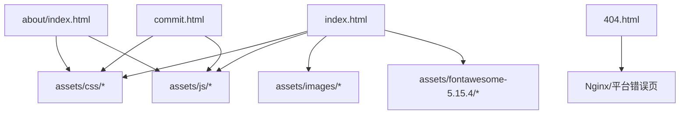
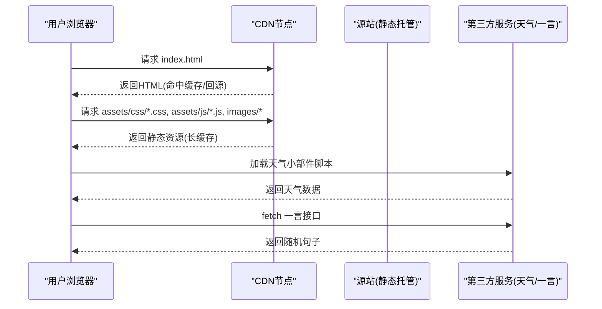
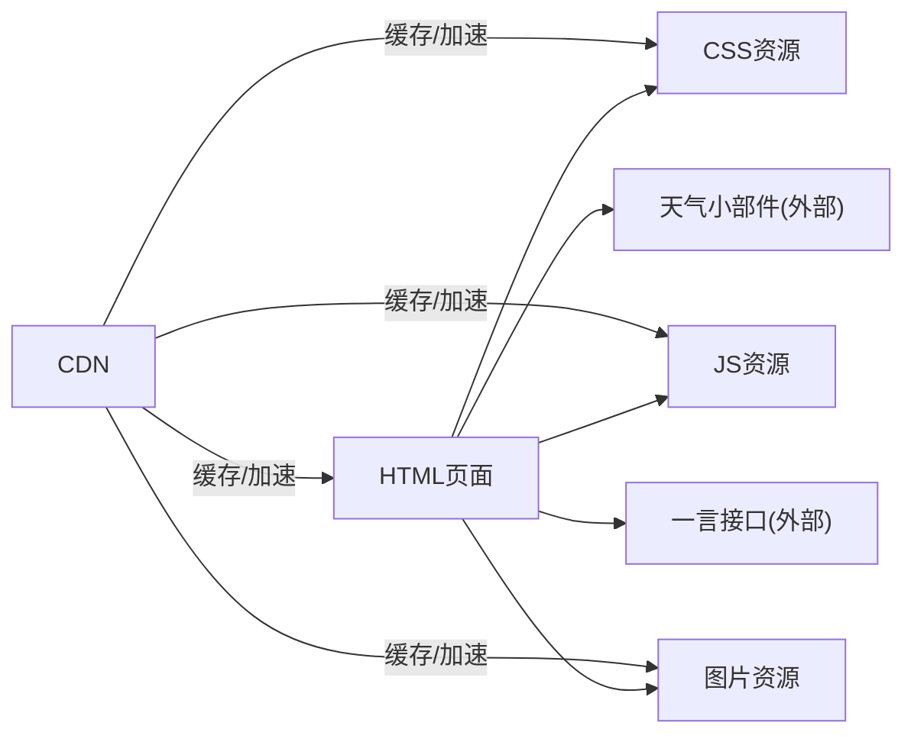

# CDN加速配置

<cite>
**本文引用的文件**
- [index.html](file://index.html)
- [about/index.html](file://about/index.html)
- [commit.html](file://commit.html)
- [README.md](file://README.md)
- [assets/css/custom-style.css](file://assets/css/custom-style.css)
- [404.html](file://404.html)
</cite>

## 目录
1. [简介](#简介)
2. [项目结构](#项目结构)
3. [核心组件](#核心组件)
4. [架构总览](#架构总览)
5. [详细组件分析](#详细组件分析)
6. [依赖关系分析](#依赖关系分析)
7. [性能考量](#性能考量)
8. [故障排查指南](#故障排查指南)
9. [结论](#结论)
10. [附录](#附录)

## 简介
本文件面向本项目（纯静态网站）的CDN加速与优化，目标是帮助开发者将静态资源与第三方脚本通过CDN分发，提升全球用户的访问速度与稳定性。文档涵盖：
- 静态资源CDN部署策略（本地资源与第三方库）
- 动态内容加速思路（API请求转发、WebSocket支持、边缘计算）
- 边缘计算优化（地理位置路由、负载均衡、故障转移）
- CDN缓存策略（规则、预热、失效管理）
- 具体配置示例与性能监控方法

## 项目结构
本项目为纯静态站点，主要入口与资源分布如下：
- 页面入口：index.html、about/index.html、commit.html、404.html
- 静态资源：assets/css、assets/js、assets/images、assets/fontawesome-5.15.4
- 部署说明与Nginx缓存配置参考：README.md

图表来源
- [index.html:17-31](file://index.html#L17-L31)
- [about/index.html:15-25](file://about/index.html#L15-L25)
- [commit.html:15-25](file://commit.html#L15-L25)
- [README.md:88-116](file://README.md#L88-L116)

章节来源
- [index.html:17-31](file://index.html#L17-L31)
- [about/index.html:15-25](file://about/index.html#L15-L25)
- [commit.html:15-25](file://commit.html#L15-L25)
- [README.md:88-116](file://README.md#L88-L116)

## 核心组件
- 页面资源引用：所有HTML页面通过相对路径引入CSS/JS/图片等静态资源，便于统一迁移到CDN域名或子域。
- 第三方服务集成：天气小部件与一言接口以外部脚本和HTTP请求形式加载，适合通过CDN或边缘函数进行加速与缓存。
- 部署与缓存参考：README中提供Nginx静态资源缓存与压缩配置，可作为CDN缓存策略的基线。

章节来源
- [index.html:17-31](file://index.html#L17-L31)
- [index.html:271-295](file://index.html#L271-L295)
- [index.html:304-313](file://index.html#L304-L313)
- [README.md:88-116](file://README.md#L88-L116)

## 架构总览
下图展示从浏览器到CDN再到源站的典型请求路径，以及本项目静态资源与第三方脚本的CDN化接入点。

图表来源
- [index.html:17-31](file://index.html#L17-L31)
- [index.html:271-295](file://index.html#L271-L295)
- [index.html:304-313](file://index.html#L304-L313)
- [README.md:88-116](file://README.md#L88-L116)

## 详细组件分析

### 静态资源CDN部署
- 目标：将本地静态资源（CSS/JS/图片/字体）迁移至CDN，利用多节点就近分发与长缓存降低首屏时间。
- 实施要点：
  - 资源路径统一改为CDN域名或CNAME别名，保持相对路径不变以便构建期替换。
  - 对版本化文件名启用不可变缓存头，减少重复下载。
  - 开启Gzip/Brotli压缩与HTTP/2或多路复用。
  - 图片使用现代格式与懒加载，减小体积并延迟非关键资源。
- 本项目现状：
  - HTML中通过相对路径引用本地静态资源，便于直接替换为CDN地址。
  - README提供了Nginx静态资源缓存与压缩配置，可映射到CDN缓存规则。

章节来源
- [index.html:17-31](file://index.html#L17-L31)
- [about/index.html:15-25](file://about/index.html#L15-L25)
- [commit.html:15-25](file://commit.html#L15-L25)
- [README.md:88-116](file://README.md#L88-L116)

### 第三方库的CDN引入
- 目标：将jQuery、Bootstrap、Font Awesome等第三方库切换至公共CDN，提升并发加载能力与缓存命中率。
- 建议策略：
  - 优先使用稳定版本的公共CDN地址，避免跨域问题。
  - 对关键样式与脚本设置优先级（preload/priority），保障首屏渲染。
  - 若公共CDN不可用，提供本地回退路径（fallback）。
- 本项目现状：
  - 当前使用本地assets下的第三方库文件，可通过构建或模板替换为CDN地址。

章节来源
- [index.html:17-31](file://index.html#L17-L31)
- [about/index.html:15-25](file://about/index.html#L15-L25)
- [commit.html:15-25](file://commit.html#L15-L25)

### 自定义资源的CDN托管
- 目标：将项目自有资源（logo、背景图、图标等）上传至对象存储并绑定CDN，实现高可用与弹性扩容。
- 建议策略：
  - 使用对象存储+CDN组合，开启防盗链与Referer白名单。
  - 图片按需裁剪与转码，减少带宽消耗。
  - 对热点资源进行预热，提升冷启动体验。
- 本项目现状：
  - 图片位于assets/images，可直接迁移至对象存储并配置CDN域名。

章节来源
- [index.html:49-60](file://index.html#L49-L60)
- [index.html:225-229](file://index.html#L225-L229)

### 多CDN提供商选择
- 目标：根据业务区域与可用性要求，选择合适的CDN厂商或组合方案。
- 建议策略：
  - 国内用户优先选择具备广泛边缘节点的CDN；海外用户可选择国际CDN。
  - 通过DNS智能解析按地域分流，或基于健康检查做主备切换。
  - 对关键资源采用多CDN冗余，提升容灾能力。
- 本项目现状：
  - 当前未内置多CDN逻辑，可在DNS层或网关层实现。

[本节为概念性内容，不直接分析具体文件]

### 动态内容加速（API请求CDN转发）
- 目标：将频繁调用的只读API通过CDN边缘缓存，降低源站压力并缩短响应时延。
- 建议策略：
  - 对GET请求启用边缘缓存，合理设置Cache-Control与ETag。
  - 对写操作（POST/PUT/DELETE）走源站或边缘函数校验后转发。
  - 使用CDN提供的API缓存规则与查询参数规范化。
- 本项目现状：
  - 首页通过fetch调用一言接口获取随机句子，适合在CDN层缓存短时效内容。

章节来源
- [index.html:304-313](file://index.html#L304-L313)

### WebSocket连接的CDN支持
- 目标：在需要实时通信的场景下，利用CDN的WebSocket代理能力降低握手时延。
- 建议策略：
  - 选择支持WebSocket的CDN，并在边缘节点建立连接池。
  - 结合地理位置路由将客户端连接到最近边缘节点。
  - 对鉴权与会话状态进行边缘侧处理，减少回源。
- 本项目现状：
  - 当前无WebSocket需求，可按需扩展。

[本节为概念性内容，不直接分析具体文件]

### 实时数据的边缘计算
- 目标：在边缘执行轻量计算（如A/B测试、个性化推荐、简单聚合），减少往返时延。
- 建议策略：
  - 使用CDN提供的Serverless/Edge Functions能力。
  - 对热点数据进行边缘缓存与增量更新。
  - 结合身份与权限控制，确保数据安全。
- 本项目现状：
  - 当前为纯静态页面，可在未来引入边缘函数增强交互。

[本节为概念性内容，不直接分析具体文件]

### 边缘计算优化（地理位置路由、负载均衡、故障转移）
- 地理位置路由：通过DNS或CDN控制台按用户IP段分配最近节点，降低RTT。
- 负载均衡：在多CDN或多源站间按权重或健康状态分发流量。
- 故障转移：当主CDN或源站异常时自动切换到备用链路，保证可用性。
- 本项目现状：
  - 可在DNS与CDN控制台层面实现，无需修改前端代码。

[本节为概念性内容，不直接分析具体文件]

### CDN缓存策略（规则、预热、失效管理）
- 缓存规则：
  - 静态资源（css/js/img/fonts）设置长期缓存与不可变标志，配合版本号变更。
  - HTML与JSON类资源设置较短缓存，配合ETag协商更新。
  - 第三方脚本与API按提供方策略设置缓存。
- 预热：
  - 发布前对热点资源进行预热，避免冷启动抖动。
- 失效管理：
  - 通过URL版本化或批量失效接口清理旧资源。
  - 对敏感资源设置私有缓存与鉴权。
- 本项目现状：
  - README提供Nginx静态资源缓存与压缩配置，可作为CDN规则参考。

章节来源
- [README.md:88-116](file://README.md#L88-L116)

## 依赖关系分析
- 页面与静态资源：index.html、about/index.html、commit.html均依赖assets下的CSS/JS/图片。
- 第三方脚本：天气小部件与一言接口为外部依赖，适合CDN缓存与边缘加速。
- 部署与缓存：README中的Nginx配置可作为CDN缓存策略的基线。

图表来源
- [index.html:17-31](file://index.html#L17-L31)
- [index.html:271-295](file://index.html#L271-L295)
- [index.html:304-313](file://index.html#L304-L313)
- [README.md:88-116](file://README.md#L88-L116)

章节来源
- [index.html:17-31](file://index.html#L17-L31)
- [index.html:271-295](file://index.html#L271-L295)
- [index.html:304-313](file://index.html#L304-L313)
- [README.md:88-116](file://README.md#L88-L116)

## 性能考量
- 首屏优化：
  - 关键CSS/JS内联或预加载，减少阻塞。
  - 图片懒加载与WebP/AVIF格式。
- 缓存优化：
  - 静态资源长缓存+版本化，HTML短缓存+协商更新。
  - 第三方脚本按提供方策略缓存。
- 网络优化：
  - 启用HTTP/2、TLS优化、Gzip/Brotli压缩。
  - DNS预解析与预连接。
- 监控与度量：
  - 使用浏览器性能指标（FCP/LCP/CLS）评估效果。
  - 结合CDN日志分析命中率与回源率。

[本节为通用指导，不直接分析具体文件]

## 故障排查指南
- 资源加载失败：
  - 检查静态资源路径是否已正确替换为CDN域名。
  - 确认CDN缓存规则与过期时间是否符合预期。
- 第三方脚本异常：
  - 检查跨域与CORS配置，必要时在CDN层添加允许列表。
  - 对关键第三方脚本增加本地回退路径。
- 404错误：
  - 确认404页面已配置并生效，避免用户感知中断。
- 缓存不一致：
  - 使用版本化文件名或批量失效接口清理旧资源。
  - 核对ETag与Last-Modified策略。

章节来源
- [404.html:1-3](file://404.html#L1-L3)
- [README.md:88-116](file://README.md#L88-L116)

## 结论
本项目为纯静态站点，具备良好的CDN适配基础。通过将本地静态资源与第三方脚本迁移至CDN，并结合合理的缓存策略与边缘计算能力，可显著提升全球用户的访问速度与稳定性。建议在发布流程中自动化完成资源上传、版本化与预热，持续通过性能指标与CDN日志优化命中率与回源率。

[本节为总结性内容，不直接分析具体文件]

## 附录

### 静态资源CDN化步骤清单
- 将assets目录整体迁移至对象存储并绑定CDN域名。
- 在HTML中将相对路径替换为CDN绝对路径（或通过构建工具注入）。
- 配置CDN缓存规则：静态资源长缓存+不可变，HTML短缓存+协商更新。
- 启用压缩与HTTP/2，开启HTTPS与HSTS。
- 对热点资源进行预热，发布后进行灰度验证。

[本节为操作指引，不直接分析具体文件]

### API请求CDN缓存建议
- 对只读GET请求启用边缘缓存，设置合适的TTL与Cache-Control。
- 对写操作走源站或边缘函数校验后转发。
- 使用查询参数规范化与ETag减少重复传输。

[本节为概念性内容，不直接分析具体文件]

### 性能监控方法
- 前端指标：FCP、LCP、CLS、TTI等。
- CDN指标：命中率、回源率、带宽、时延分布。
- 日志分析：结合CDN访问日志定位慢请求与热点资源。

[本节为通用指导，不直接分析具体文件]