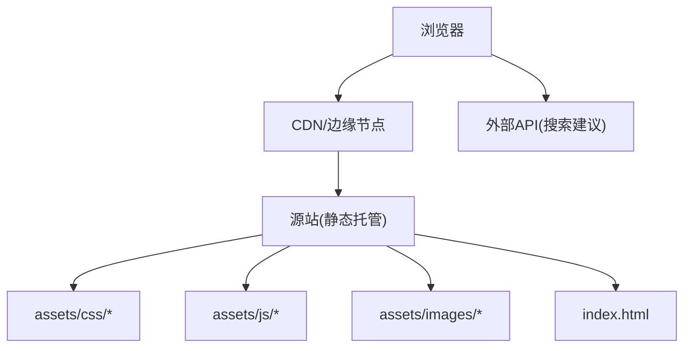
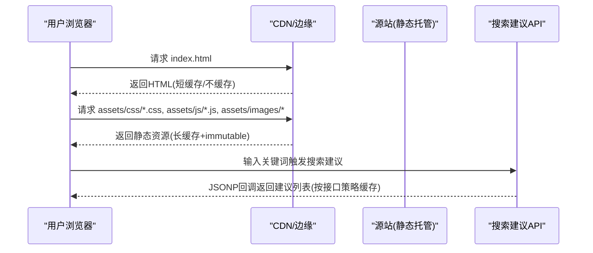
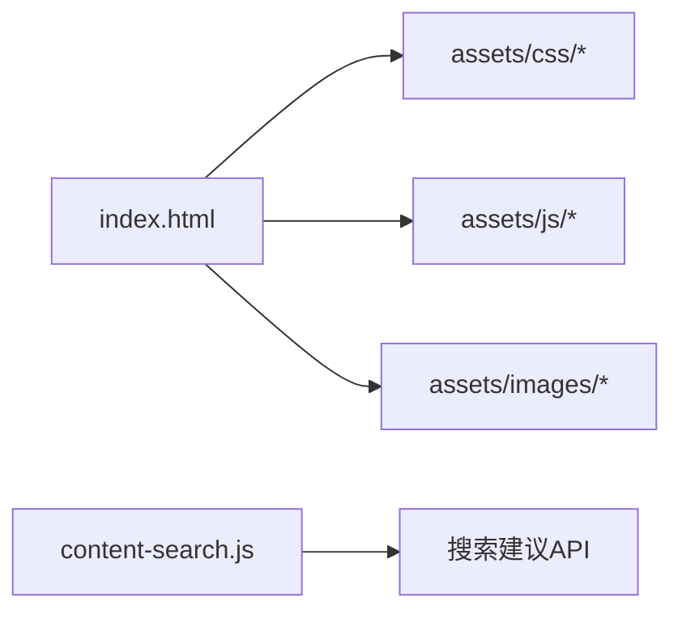

# CDN缓存策略

<cite>
**本文引用的文件**
- [README.md](file://README.md)
- [index.html](file://index.html)
- [content-search.js](file://assets/js/content-search.js)
- [custom-style.css](file://assets/css/custom-style.css)
</cite>

## 目录
1. [简介](#简介)
2. [项目结构](#项目结构)
3. [核心组件](#核心组件)
4. [架构总览](#架构总览)
5. [详细组件分析](#详细组件分析)
6. [依赖关系分析](#依赖关系分析)
7. [性能考量](#性能考量)
8. [故障排查指南](#故障排查指南)
9. [结论](#结论)
10. [附录](#附录)

## 简介
本文件面向静态站点（HTML + CSS + JS）的CDN缓存优化，结合本项目资源组织与部署方式，给出针对HTML、CSS、JavaScript、图片等静态资源的缓存规则建议；同时说明动态内容（如搜索建议API响应）的缓存策略、缓存预热方法、失效管理方案，以及可落地的配置示例与监控指标，帮助在保障数据新鲜度的前提下最大化缓存命中率与加载性能。

## 项目结构
项目为纯静态站点，主要资源位于 assets 目录：
- assets/css：样式文件
- assets/js：脚本文件
- assets/images：图片资源
- assets/fontawesome-5.15.4：图标库资源
- index.html：入口页面，引用上述静态资源
- README.md：包含Nginx静态资源缓存配置示例

图表来源
- [README.md:86-116](file://README.md#L86-L116)
- [index.html:17-31](file://index.html#L17-L31)

章节来源
- [README.md:298-314](file://README.md#L298-L314)
- [index.html:17-31](file://index.html#L17-L31)

## 核心组件
- 静态资源：CSS、JS、图片、字体等，适合长期缓存并配合版本化文件名实现强缓存与精准失效。
- HTML入口：index.html 应短缓存或无缓存，确保更新及时生效。
- 动态请求：搜索建议通过第三方API获取，需按接口语义设置合适的缓存策略。

章节来源
- [index.html:17-31](file://index.html#L17-L31)
- [content-search.js:1-91](file://assets/js/content-search.js#L1-L91)

## 架构总览
下图展示从浏览器到CDN再到源站的请求路径，以及不同资源类型的缓存策略要点。

图表来源
- [README.md:86-116](file://README.md#L86-L116)
- [index.html:17-31](file://index.html#L17-L31)
- [content-search.js:1-91](file://assets/js/content-search.js#L1-L91)

## 详细组件分析

### 静态资源缓存策略
- 目标：对稳定不变的静态资源启用长期缓存，减少回源与带宽消耗，提升首屏速度。
- 实践要点：
  - 使用不可变缓存：Cache-Control: public, immutable，配合版本号文件名（如 style-v1.2.3.css）。
  - 压缩传输：开启gzip/br，降低体积。
  - 资源分类：
    - HTML：index.html 建议 short-cache 或 no-store，保证发布后快速生效。
    - CSS/JS：长期缓存 + 版本化文件名；若未改内容则命中强缓存。
    - 图片/字体：长期缓存 + 版本化文件名；大图片考虑WebP/AVIF与懒加载。
  - 参考Nginx示例中的静态资源匹配与过期头设置。

章节来源
- [README.md:86-116](file://README.md#L86-L116)

### HTML缓存规则
- 原则：HTML作为入口，频繁更新时应避免被长期缓存，否则用户可能看到旧版页面。
- 建议：
  - Cache-Control: no-cache 或 max-age=0，配合ETag/Last-Modified协商缓存。
  - 若采用“文件名哈希”的构建产物，可将HTML也加入CDN缓存，但需确保每次构建生成新文件名。

章节来源
- [index.html:17-31](file://index.html#L17-L31)

### CSS/JavaScript缓存规则
- 原则：内容不变则强缓存，变更时通过文件名版本化强制刷新。
- 建议：
  - 文件名带版本或哈希：style-3.03029.1.css、app-anim.js 等。
  - 响应头：Cache-Control: public, immutable; Expires: 未来时间。
  - 压缩：gzip/br。
  - 注意第三方库（如jQuery、Bootstrap）同样适用版本化与强缓存。

章节来源
- [index.html:17-31](file://index.html#L17-L31)
- [README.md:86-116](file://README.md#L86-L116)

### 图片与字体缓存规则
- 原则：图片与字体属于高占用资源，适合长期缓存。
- 建议：
  - 格式优化：优先WebP/AVIF，按需提供多分辨率。
  - 懒加载：对首屏外图片延迟加载，减少初始请求。
  - 缓存头：Cache-Control: public, immutable; 配合版本化文件名。
  - 字体：woff2优先，CDN缓存。

章节来源
- [index.html:17-31](file://index.html#L17-L31)

### 动态内容缓存机制
- 搜索建议：通过JSONP调用第三方API，返回结果可按“关键词”进行短期缓存，减少重复请求。
- 建议：
  - 客户端缓存：基于关键词做短时缓存（如5-10分钟），避免相同输入重复请求。
  - 服务端/CDN缓存：若接入自有后端，可对相同查询参数设置合理的max-age或Vary。
  - 错误降级：网络异常时隐藏提示，不影响主流程。

章节来源
- [content-search.js:1-91](file://assets/js/content-search.js#L1-L91)

### 用户会话与本地存储
- 现状：提交功能数据保存在浏览器localStorage中，不涉及服务器端会话。
- 建议：
  - 如需跨设备同步，可引入轻量后端或第三方服务。
  - 对敏感信息避免写入localStorage；必要时加密或缩短有效期。

章节来源
- [README.md:322-327](file://README.md#L322-L327)

### 缓存预热技术
- 目的：上线前将热门资源预取至CDN边缘，降低冷启动延迟。
- 方法：
  - 批量预热：部署后主动预热 index.html 及高频静态资源URL。
  - 智能预测：根据历史访问热点，提前预热首页与常用分类页。
  - 增量预热：仅预热变更的资源与关联页面。

[本节为通用指导，无需代码来源]

### 缓存失效管理
- 版本号控制：对CSS/JS/图片使用版本化文件名，变更即新URL，天然失效旧缓存。
- 标签化缓存：利用CDN的Tag/Purge能力，按模块或页面批量清理缓存。
- 条件失效：HTML使用协商缓存（ETag/Last-Modified），静态资源使用强缓存+版本化。
- 最佳实践：
  - 构建产物命名包含哈希或版本号。
  - 发布流水线自动执行缓存预热与必要清理。

[本节为通用指导，无需代码来源]

### CDN缓存配置示例
- Nginx（静态资源）：对常见静态扩展名设置过期时间与不可变缓存头。
- Vercel/Cloudflare Pages/GitHub Pages：平台默认对静态资源启用缓存，可通过自定义头部或文件名版本化强化控制。
- 关键要点：
  - HTML：no-cache 或短max-age。
  - 静态资源：public, immutable + 长过期时间。
  - 压缩：开启gzip/br。

章节来源
- [README.md:86-116](file://README.md#L86-L116)

## 依赖关系分析
- index.html 依赖多个CSS/JS资源，这些资源一旦变更会影响页面渲染与交互。
- content-search.js 依赖外部搜索建议API，其可用性影响搜索体验。
- 样式文件 custom-style.css 用于覆盖默认主题样式，属于静态资源范畴。

图表来源
- [index.html:17-31](file://index.html#L17-L31)
- [content-search.js:1-91](file://assets/js/content-search.js#L1-L91)

章节来源
- [index.html:17-31](file://index.html#L17-L31)
- [content-search.js:1-91](file://assets/js/content-search.js#L1-L91)
- [custom-style.css:1-126](file://assets/css/custom-style.css#L1-L126)

## 性能考量
- 首屏优化：
  - HTML短缓存，确保更新即时；静态资源长缓存，减少重复下载。
  - 关键CSS内联或尽早加载，非关键资源延迟加载。
- 传输优化：
  - 启用gzip/br压缩，减小响应体积。
  - 图片使用现代格式与合理尺寸，按需懒加载。
- 缓存命中率：
  - 版本化文件名 + immutable，提高CDN命中率。
  - 对高频资源预热，降低冷启动延迟。
- 监控指标：
  - 缓存命中率、回源率、TTFB、FCP/LCP、资源大小与压缩比。
  - 错误率与超时率，关注第三方API可用性。

[本节为通用指导，无需代码来源]

## 故障排查指南
- 资源未命中缓存：
  - 检查文件名是否版本化，确认CDN是否设置了正确的Cache-Control与Expires。
  - 核对Nginx/平台配置是否覆盖了默认行为。
- 更新未生效：
  - HTML是否被强缓存？改为no-cache或短max-age。
  - 静态资源是否仍使用旧文件名？确保构建产物名称变化。
- 搜索建议失败：
  - 检查网络与跨域限制；确认JSONP回调正常。
  - 增加错误处理与降级显示，避免阻塞主流程。

章节来源
- [content-search.js:1-91](file://assets/js/content-search.js#L1-L91)
- [README.md:86-116](file://README.md#L86-L116)

## 结论
本项目为纯静态站点，适合通过CDN实施分层缓存策略：HTML短缓存或协商缓存，静态资源长缓存且不可变，并结合版本化文件名实现精准失效。对动态请求（如搜索建议）采用短期缓存与错误降级，保障用户体验。配合预热与监控指标，可在性能与新鲜度之间取得良好平衡。

[本节为总结性内容，无需代码来源]

## 附录
- 推荐实践清单：
  - 所有静态资源文件名包含版本或哈希。
  - HTML使用no-cache或短max-age。
  - 静态资源设置Cache-Control: public, immutable 与长过期时间。
  - 开启gzip/br压缩。
  - 对热门资源进行预热。
  - 监控缓存命中率、回源率与核心性能指标。

[本节为通用指导，无需代码来源]