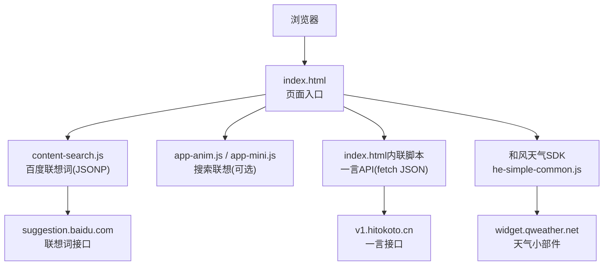
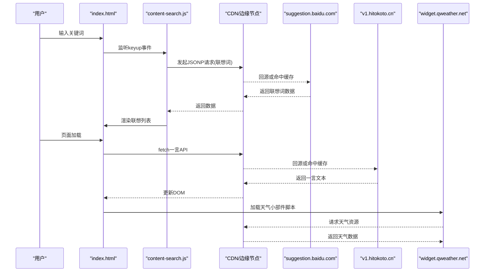
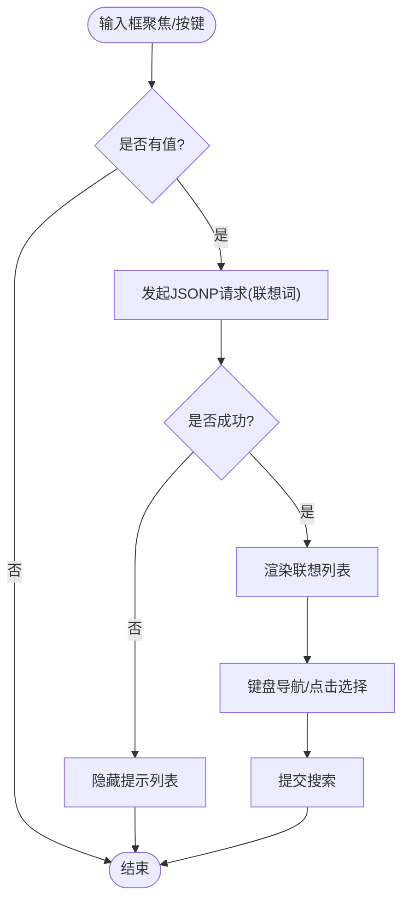
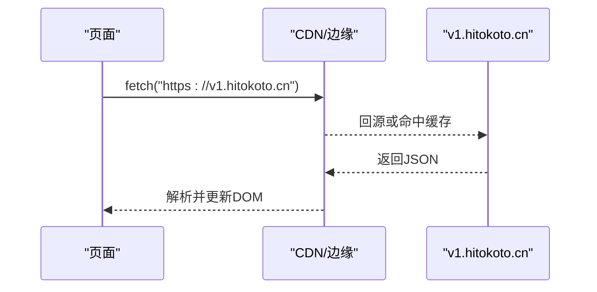
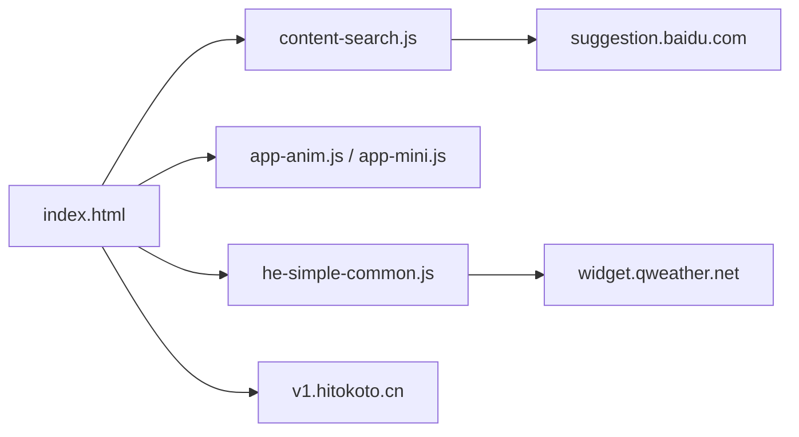

# 动态内容加速

<cite>
**本文引用的文件**
- [index.html](file://index.html)
- [content-search.js](file://assets/js/content-search.js)
- [app-anim.js](file://assets/js/app-anim.js)
- [README.md](file://README.md)
</cite>

## 目录
1. [简介](#简介)
2. [项目结构](#项目结构)
3. [核心组件](#核心组件)
4. [架构总览](#架构总览)
5. [详细组件分析](#详细组件分析)
6. [依赖关系分析](#依赖关系分析)
7. [性能考量](#性能考量)
8. [故障排查指南](#故障排查指南)
9. [结论](#结论)
10. [附录：CDN与边缘配置建议](#附录cd n与边缘配置建议)

## 简介
本文件围绕“动态内容加速”的目标，结合仓库中的前端实现，梳理并给出针对百度搜索API、天气插件API、一言API等外部接口的CDN转发与优化方案；同时补充WebSocket连接在CDN/边缘侧的接入思路（连接池、负载均衡、故障转移），以及边缘计算在地理位置路由、智能缓存和实时数据同步中的应用。文档提供可落地的配置示例与监控方法，帮助开发者实现低延迟的动态内容传输，提升用户体验。

## 项目结构
该站点为纯静态前端项目，主要包含首页HTML、若干JS交互脚本与第三方资源引用。动态能力主要通过浏览器端发起HTTP请求获取外部服务数据（如百度联想词、一言、和风天气）。部署与服务器优化参考README中的Nginx/Vercel/Cloudflare Pages等说明。

图表来源
- [index.html:270-315](file://index.html#L270-L315)
- [content-search.js:1-91](file://assets/js/content-search.js#L1-L91)
- [app-anim.js:895-931](file://assets/js/app-anim.js#L895-L931)

章节来源
- [README.md:298-314](file://README.md#L298-L314)

## 核心组件
- 百度搜索联想词：通过JSONP调用百度联想接口，支持输入时触发、键盘导航选择、点击回填并提交搜索。
- 一言API：页面加载时fetch一言文本并渲染到指定节点。
- 天气插件：引入和风天气小部件脚本，按配置展示天气信息。
- 搜索表单：直接跳转到目标搜索引擎（如百度）进行搜索。

章节来源
- [index.html:351-355](file://index.html#L351-L355)
- [index.html:304-314](file://index.html#L304-L314)
- [index.html:270-296](file://index.html#L270-L296)
- [content-search.js:1-91](file://assets/js/content-search.js#L1-L91)
- [app-anim.js:895-931](file://assets/js/app-anim.js#L895-L931)

## 架构总览
下图展示了从用户输入到外部API返回数据的端到端流程，并标注了可在CDN/边缘侧进行优化的关键路径。

图表来源
- [content-search.js:1-91](file://assets/js/content-search.js#L1-L91)
- [index.html:304-314](file://index.html#L304-L314)
- [index.html:270-296](file://index.html#L270-L296)

## 详细组件分析

### 百度搜索API（联想词）
- 触发时机：输入框获得焦点/按键时触发联想查询。
- 通信方式：JSONP跨域请求至百度联想接口。
- 数据处理：将返回的联想词列表渲染为下拉项，支持键盘上下选择与回车提交。
- 错误处理：失败时隐藏提示列表，避免阻塞主流程。

图表来源
- [content-search.js:1-91](file://assets/js/content-search.js#L1-L91)
- [app-anim.js:895-931](file://assets/js/app-anim.js#L895-L931)

章节来源
- [content-search.js:1-91](file://assets/js/content-search.js#L1-L91)
- [app-anim.js:895-931](file://assets/js/app-anim.js#L895-L931)

### 一言API
- 触发时机：页面加载后执行。
- 通信方式：使用fetch请求一言API，成功后将文本与链接写入DOM。
- 错误处理：捕获异常并输出到控制台，不影响页面其他功能。

图表来源
- [index.html:304-314](file://index.html#L304-L314)

章节来源
- [index.html:304-314](file://index.html#L304-L314)

### 天气插件API（和风天气）
- 集成方式：引入和风天气小部件脚本，并通过配置对象设置显示模块、样式与Key。
- 数据来源：由小部件脚本向qweather域名发起请求获取天气数据。
- 优化点：可通过CDN缓存静态脚本与响应体，减少首屏加载时间。

章节来源
- [index.html:270-296](file://index.html#L270-L296)

### WebSocket连接的CDN支持方案（概念性指导）
当前仓库未包含WebSocket客户端代码。若后续需要实时通信，建议在CDN/边缘侧采用以下策略：
- 连接池管理：复用长连接，降低握手开销；对空闲连接定期保活。
- 负载均衡：基于地理位置或负载指标分发到就近边缘节点；支持多后端实例轮询/加权。
- 故障转移：当某节点不可用时自动切换到备用节点；保持会话状态迁移或无状态化设计。
- 协议与端口：确保CDN支持ws/wss协议及相应端口开放；必要时通过反向代理透传。
- 安全与限流：鉴权令牌校验、频率限制、IP白名单、TLS加密。

[本节为概念性指导，不直接对应具体源码]

### 边缘计算在动态内容中的应用（概念性指导）
- 地理位置路由：根据用户IP就近调度到最优边缘节点，降低RTT。
- 智能缓存：对高频且变化不频繁的接口响应进行缓存；对个性化数据采用短TTL或按用户维度缓存。
- 实时数据同步：在边缘层聚合/过滤数据后再下发，减轻源站压力；结合WebPush或Server-Sent Events推送增量更新。

[本节为概念性指导，不直接对应具体源码]

## 依赖关系分析
- index.html作为入口，内联脚本与外部脚本共同驱动动态行为。
- content-search.js依赖jQuery与百度联想接口，负责联想词获取与渲染。
- 天气小部件脚本独立加载，负责天气数据获取与UI渲染。
- README提供了Nginx/Vercel/Cloudflare Pages等部署与缓存优化指引，可作为CDN/边缘配置的参考。

图表来源
- [index.html:270-315](file://index.html#L270-L315)
- [content-search.js:1-91](file://assets/js/content-search.js#L1-L91)
- [app-anim.js:895-931](file://assets/js/app-anim.js#L895-L931)

章节来源
- [README.md:298-314](file://README.md#L298-L314)

## 性能考量
- 静态资源缓存：对CSS/JS/图片等启用强缓存与版本化，减少重复下载。
- 压缩传输：启用gzip/brotli压缩，减小响应体积。
- 跨域优化：优先使用同源或已开启CORS的接口；对JSONP场景确保回调函数名稳定。
- 请求合并与去抖：对频繁触发的联想查询做防抖，避免过多请求。
- 首屏优化：关键脚本异步加载，非关键资源懒加载。
- 边缘缓存：对稳定接口响应设置合理TTL，利用CDN就近缓存。

章节来源
- [README.md:86-116](file://README.md#L86-L116)

## 故障排查指南
- 联想词不显示：检查网络请求是否被拦截；确认JSONP回调名称与接口要求一致；查看控制台错误。
- 一言API无响应：检查fetch是否被广告插件拦截；确认域名可达；查看错误日志。
- 天气小部件不加载：确认Key有效；检查脚本是否成功加载；查看控制台报错。
- 跨域问题：对于非JSONP接口，需在服务端正确设置Access-Control-Allow-*头；或使用CDN反向代理统一转交。

章节来源
- [content-search.js:67-71](file://assets/js/content-search.js#L67-L71)
- [index.html:304-314](file://index.html#L304-L314)
- [index.html:270-296](file://index.html#L270-L296)

## 结论
本项目通过前端直连外部API实现动态内容展示。借助CDN/边缘节点的缓存、就近路由与压缩能力，可显著降低延迟并提升稳定性。对于未来可能引入的WebSocket实时通信，建议在边缘侧实施连接池、负载均衡与故障转移策略，并结合地理位置路由与智能缓存进一步优化体验。

## 附录：CDN与边缘配置建议
- 百度搜索API（联想词）
  - 使用CDN缓存JSONP响应（注意区分不同wd参数）；设置较短TTL以兼顾时效性。
  - 若需统一鉴权或限流，可在边缘层添加规则，再转发至源站。
  - 跨域：JSONP天然跨域，无需额外CORS配置。
- 一言API
  - 对稳定接口响应设置中等TTL；对个性化数据按需缩短TTL。
  - 在边缘层启用压缩与HTTP/2，提升传输效率。
- 天气插件API
  - 缓存小部件脚本与响应体；确保CDN支持wasm/脚本加载。
  - 对敏感Key进行边缘层访问控制（如Referer白名单）。
- WebSocket（概念性）
  - 启用wss并在边缘层配置TCP/HTTP升级。
  - 连接池：复用连接、心跳保活；失败重试与退避。
  - 负载均衡：按地域/负载分配；健康检查与自动摘除。
  - 故障转移：多可用区部署，快速切换；会话无状态化或状态同步。
- 监控方法
  - 前端埋点：记录接口耗时、成功率、错误码分布。
  - CDN面板：观察命中率、带宽、请求量、错误率。
  - 日志分析：集中收集边缘节点日志，定位热点与瓶颈。

[本节为通用实践建议，不直接对应具体源码]