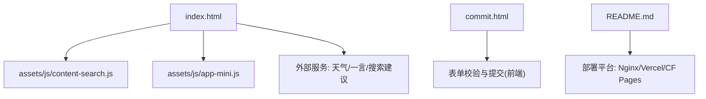
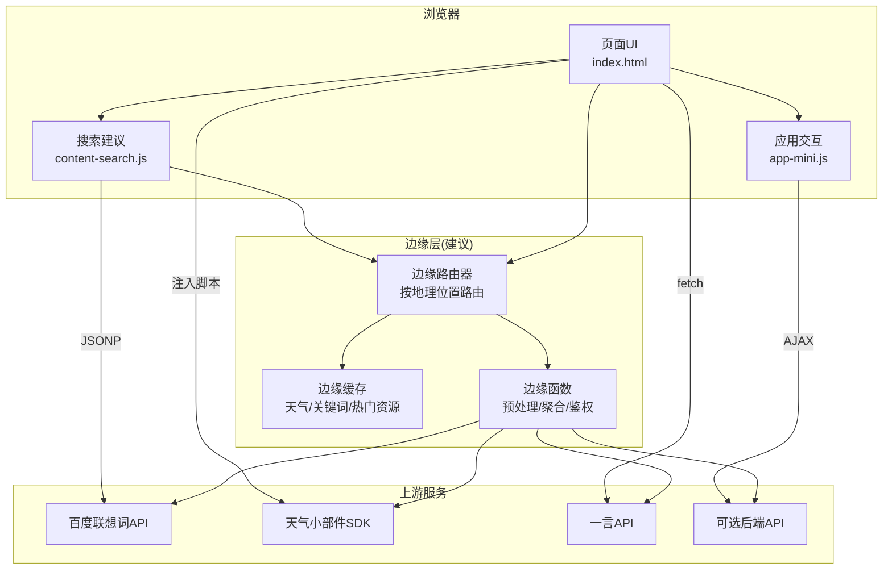
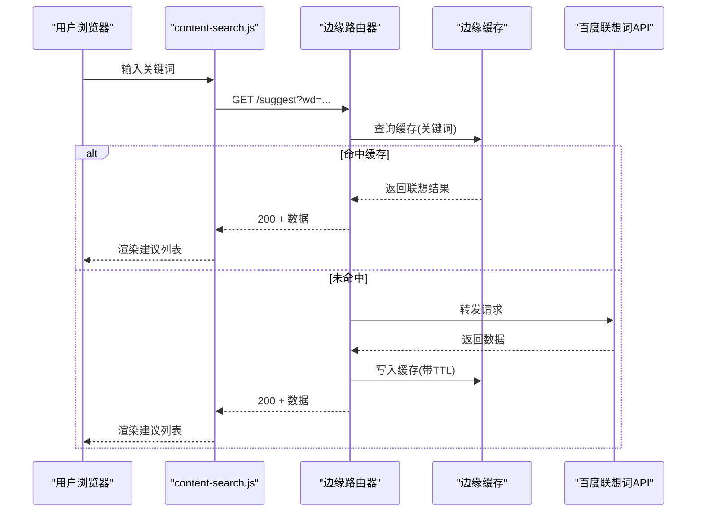
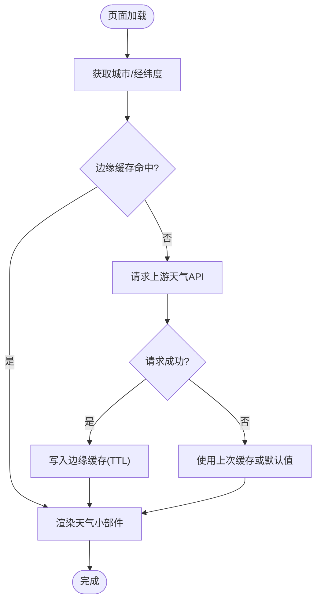
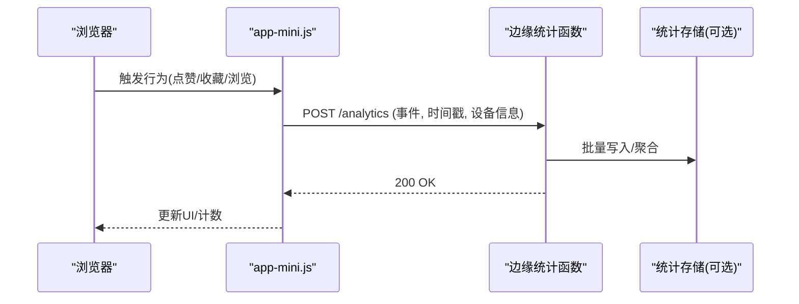
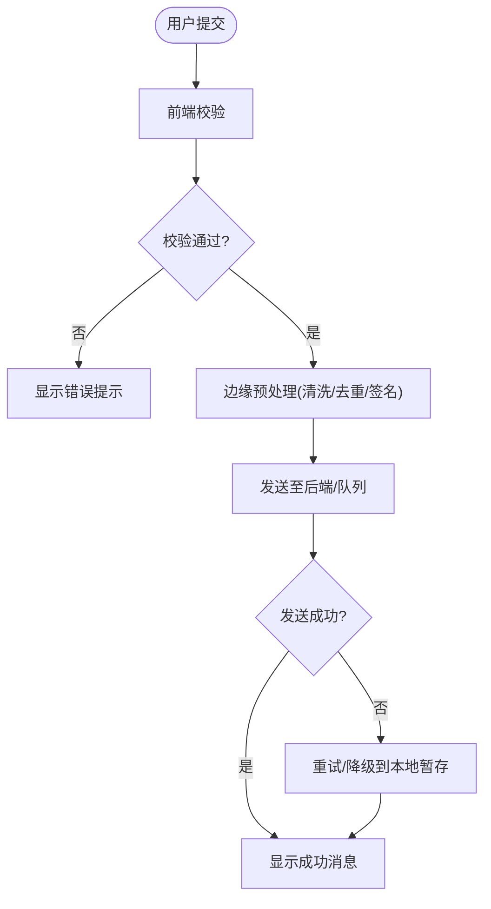
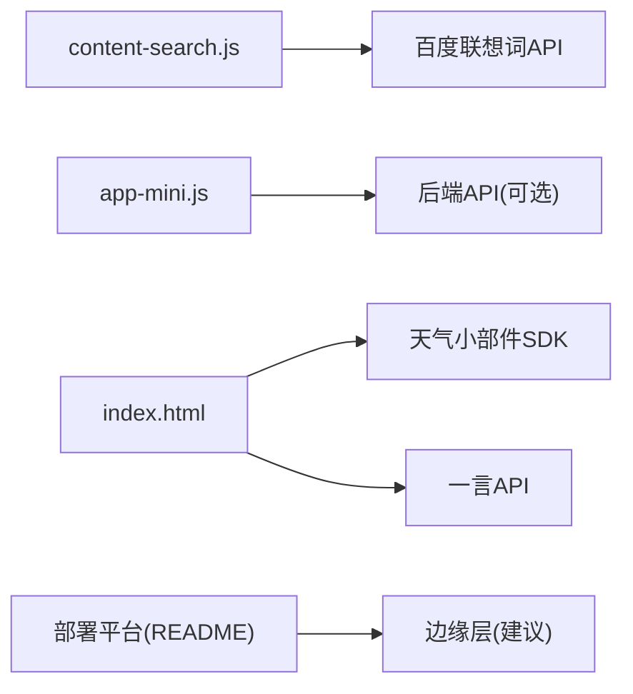

# 边缘计算优化

<cite>
**本文引用的文件**
- [README.md](file://README.md)
- [index.html](file://index.html)
- [commit.html](file://commit.html)
- [assets/js/content-search.js](file://assets/js/content-search.js)
- [assets/js/app-mini.js](file://assets/js/app-mini.js)
</cite>

## 目录
1. [简介](#简介)
2. [项目结构](#项目结构)
3. [核心组件](#核心组件)
4. [架构总览](#架构总览)
5. [详细组件分析](#详细组件分析)
6. [依赖关系分析](#依赖关系分析)
7. [性能考量](#性能考量)
8. [故障排查指南](#故障排查指南)
9. [结论](#结论)
10. [附录：边缘函数编写与部署建议](#附录边缘函数编写与部署建议)

## 简介
本项目是一个纯静态的在线网址导航工具，具备响应式界面、分类导航、搜索建议、天气小部件、夜间模式切换等能力。虽然当前代码库未直接实现“边缘计算”逻辑，但基于其前端架构与外部服务调用方式，可以系统性地设计并落地一套以边缘计算为核心的优化方案，涵盖地理位置路由、就近节点选择、智能调度、负载均衡、故障转移、边缘函数（如搜索建议预处理、天气数据缓存、用户行为分析）以及监控调试等。

本文件将结合现有前端代码中的网络请求点与服务集成点，给出可落地的边缘化改造路径与最佳实践，帮助开发者在全球范围内显著提升访问速度与稳定性。

## 项目结构
- 入口页面 index.html：组织页面骨架、引入样式与脚本、嵌入天气小部件与第三方 API 调用。
- 提交页 commit.html：提供网站提交流程的前端校验与交互。
- 搜索建议 content-search.js：监听输入事件，通过 JSONP 获取百度联想词，渲染下拉建议。
- 应用交互 app-mini.js：封装大量 AJAX 交互、主题切换、懒加载、侧边栏控制、统计上报等。
- README.md：包含部署说明（Nginx、Vercel、Cloudflare Pages 等）、常见问题与技术栈。

图表来源
- [index.html:1-120](file://index.html#L1-L120)
- [assets/js/content-search.js:1-91](file://assets/js/content-search.js#L1-L91)
- [assets/js/app-mini.js:1-120](file://assets/js/app-mini.js#L1-L120)
- [README.md:45-240](file://README.md#L45-L240)

章节来源
- [README.md:1-120](file://README.md#L1-L120)
- [index.html:1-120](file://index.html#L1-L120)
- [commit.html:1-120](file://commit.html#L1-L120)
- [assets/js/content-search.js:1-91](file://assets/js/content-search.js#L1-L91)
- [assets/js/app-mini.js:1-120](file://assets/js/app-mini.js#L1-L120)

## 核心组件
- 搜索建议模块：在输入时触发异步请求，获取联想词并渲染列表，支持点击回填与提交。
- 天气小部件：通过第三方脚本注入天气信息到页面指定容器。
- 站点交互与统计：通过 AJAX 与后端或第三方接口交互，完成点赞、收藏、访问量统计等。
- 提交表单：前端校验与交互，预留后端对接位置。

章节来源
- [assets/js/content-search.js:1-91](file://assets/js/content-search.js#L1-L91)
- [index.html:270-296](file://index.html#L270-L296)
- [assets/js/app-mini.js:66-180](file://assets/js/app-mini.js#L66-L180)
- [commit.html:286-382](file://commit.html#L286-L382)

## 架构总览
下图展示当前前端与外部服务的交互关系，以及未来引入边缘层后的演进方向。

图表来源
- [assets/js/content-search.js:1-91](file://assets/js/content-search.js#L1-L91)
- [index.html:270-296](file://index.html#L270-L296)
- [index.html:304-315](file://index.html#L304-L315)
- [assets/js/app-mini.js:66-180](file://assets/js/app-mini.js#L66-L180)

## 详细组件分析

### 搜索建议的边缘化改造
- 现状：用户在输入框键入时，通过 JSONP 请求百度联想词，返回结果后动态渲染为下拉列表，点击项回填并触发搜索。
- 边缘化目标：
  - 在边缘节点缓存高频关键词与联想结果，降低回源延迟。
  - 对请求进行去重与限流，避免滥用。
  - 根据用户地理位置选择最近边缘节点，减少跨域与网络抖动。
- 关键流程（序列图）：

图表来源
- [assets/js/content-search.js:1-91](file://assets/js/content-search.js#L1-L91)

章节来源
- [assets/js/content-search.js:1-91](file://assets/js/content-search.js#L1-L91)

### 天气小部件的边缘化策略
- 现状：页面通过第三方脚本注入天气小部件，使用固定 key 配置显示。
- 边缘化目标：
  - 在边缘层缓存天气数据，按城市或经纬度维度设置合理 TTL。
  - 对频繁刷新场景做节流与合并请求。
  - 当上游不可用时，降级为本地默认值或最近一次缓存。
- 流程图（算法与降级）：

图表来源
- [index.html:270-296](file://index.html#L270-L296)

章节来源
- [index.html:270-296](file://index.html#L270-L296)

### 用户行为分析与统计的边缘化
- 现状：app-mini.js 中多处 AJAX 调用用于点赞、收藏、访问量统计等。
- 边缘化目标：
  - 在边缘层聚合埋点数据，批量上报，降低主站压力。
  - 对敏感字段进行脱敏与签名校验，保障数据安全。
  - 利用边缘缓存热点指标，提升统计读取性能。
- 序列图（统计上报）：

图表来源
- [assets/js/app-mini.js:66-180](file://assets/js/app-mini.js#L66-L180)

章节来源
- [assets/js/app-mini.js:66-180](file://assets/js/app-mini.js#L66-L180)

### 提交表单的边缘化增强
- 现状：commit.html 提供完整的前端校验与交互，预留后端对接位置。
- 边缘化目标：
  - 在边缘层进行预校验与防刷，减少无效请求到达后端。
  - 对提交内容进行清洗与格式标准化。
  - 失败重试与幂等处理，保证提交可靠性。
- 流程图（提交流程）：

图表来源
- [commit.html:286-382](file://commit.html#L286-L382)

章节来源
- [commit.html:286-382](file://commit.html#L286-L382)

## 依赖关系分析
- 前端脚本依赖 jQuery 与第三方库，负责 DOM 操作与 AJAX 通信。
- 外部服务包括百度联想词、天气小部件 SDK、一言 API 等。
- 部署平台支持 Nginx、Vercel、Cloudflare Pages 等，便于引入边缘计算能力。

图表来源
- [assets/js/content-search.js:1-91](file://assets/js/content-search.js#L1-L91)
- [assets/js/app-mini.js:66-180](file://assets/js/app-mini.js#L66-L180)
- [index.html:270-315](file://index.html#L270-L315)
- [README.md:45-240](file://README.md#L45-L240)

章节来源
- [assets/js/content-search.js:1-91](file://assets/js/content-search.js#L1-L91)
- [assets/js/app-mini.js:66-180](file://assets/js/app-mini.js#L66-L180)
- [index.html:270-315](file://index.html#L270-L315)
- [README.md:45-240](file://README.md#L45-L240)

## 性能考量
- 缓存策略：对高频请求（如天气、联想词）在边缘层实施缓存，设置合理 TTL；对静态资源启用强缓存与压缩。
- 就近路由：基于用户地理位置选择最近边缘节点，降低 RTT；对跨域请求进行代理与复用连接。
- 请求合并与去抖：对输入事件进行去抖，合并多次请求；对统计上报进行批量化。
- 降级与熔断：上游不可用时快速降级至缓存或默认值；对异常流量进行限流与熔断。
- 资源优化：按需加载脚本与样式，图片懒加载，减少首屏体积。

[本节为通用性能指导，不直接分析具体文件]

## 故障排查指南
- 搜索建议无响应：
  - 检查 JSONP 回调是否被拦截或跨域限制；确认 CDN/边缘节点可达性。
  - 查看控制台错误与网络面板，确认请求 URL 与参数正确。
  - 参考实现位置：[assets/js/content-search.js:1-91](file://assets/js/content-search.js#L1-L91)
- 天气小部件不显示：
  - 检查第三方脚本加载状态与 key 配置；确认边缘缓存未过期或被污染。
  - 参考实现位置：[index.html:270-296](file://index.html#L270-L296)
- 点赞/收藏/统计异常：
  - 检查 AJAX 请求是否成功，后端或边缘函数是否返回预期状态码。
  - 参考实现位置：[assets/js/app-mini.js:66-180](file://assets/js/app-mini.js#L66-L180)
- 提交表单失败：
  - 校验规则是否正确；边缘预处理是否通过；重试与幂等机制是否生效。
  - 参考实现位置：[commit.html:286-382](file://commit.html#L286-L382)

章节来源
- [assets/js/content-search.js:1-91](file://assets/js/content-search.js#L1-L91)
- [index.html:270-296](file://index.html#L270-L296)
- [assets/js/app-mini.js:66-180](file://assets/js/app-mini.js#L66-L180)
- [commit.html:286-382](file://commit.html#L286-L382)

## 结论
本项目具备良好的前端基础与外部服务集成点，适合通过边缘计算进行系统性优化。通过在边缘层实现地理位置路由、缓存与智能调度，可显著降低延迟、提升稳定性与用户体验。同时，借助边缘函数对搜索建议、天气数据与用户行为进行预处理与聚合，可有效减轻主站压力并提高整体吞吐。建议在部署平台（如 Cloudflare Pages/Vercel）上逐步引入边缘能力，配合监控与调试手段，持续优化全球用户的访问速度与稳定性。

[本节为总结性内容，不直接分析具体文件]

## 附录：边缘函数编写与部署建议
- 地理位置路由与就近节点选择
  - 依据客户端 IP 或地理定位信息，选择最近边缘节点；对跨区域请求进行统一入口与分发。
  - 结合 CDN 的智能路由能力，实现自动就近接入与故障切换。
- 负载均衡配置
  - 权重分配：按区域负载与健康状况动态调整权重；对高并发场景采用加权轮询或最少连接策略。
  - 健康检查：定期探测上游服务可用性，剔除异常节点；失败阈值与恢复阈值需合理设置。
  - 自动扩缩容：基于 QPS、延迟与错误率触发扩缩容；冷启动预热与灰度发布降低风险。
- 故障转移机制
  - 主备切换：主节点不可用时自动切换到备用节点；切换过程对用户透明。
  - 降级策略：上游不可用或超时，返回缓存或默认值；对非关键功能进行降级。
  - 数据一致性：对写操作采用幂等与事务补偿；读多写少场景优先使用边缘缓存。
- 边缘函数编写指南
  - 搜索建议预处理：对关键词进行规范化、去重、同义词扩展；缓存高频结果并设置 TTL。
  - 天气数据缓存：按城市或经纬度维度缓存；支持热更新与失效策略；异常时降级为本地默认值。
  - 用户行为分析：采集事件、时间戳、设备信息；在边缘层聚合与脱敏，批量上报至存储。
- 监控与调试
  - 指标采集：QPS、延迟、错误率、缓存命中率、带宽占用等。
  - 日志记录：结构化日志，包含请求 ID、用户区域、上游状态码与耗时。
  - 告警与排障：设置阈值告警；提供链路追踪与快照回放能力。

[本节为概念性指导，不直接分析具体文件]