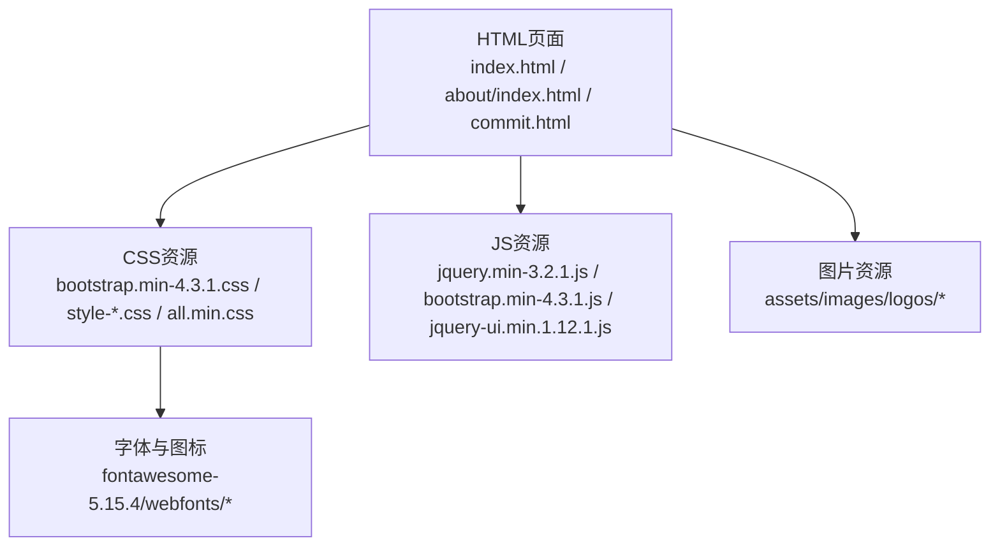
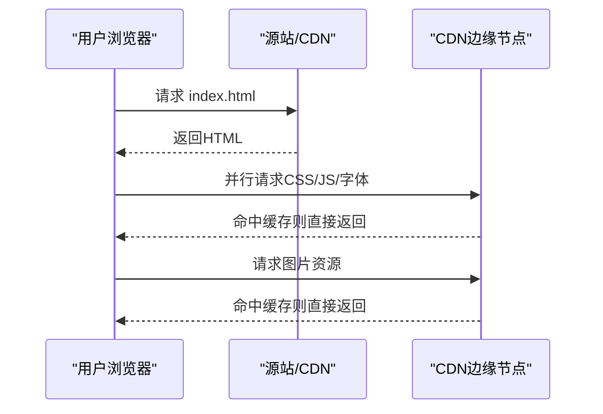
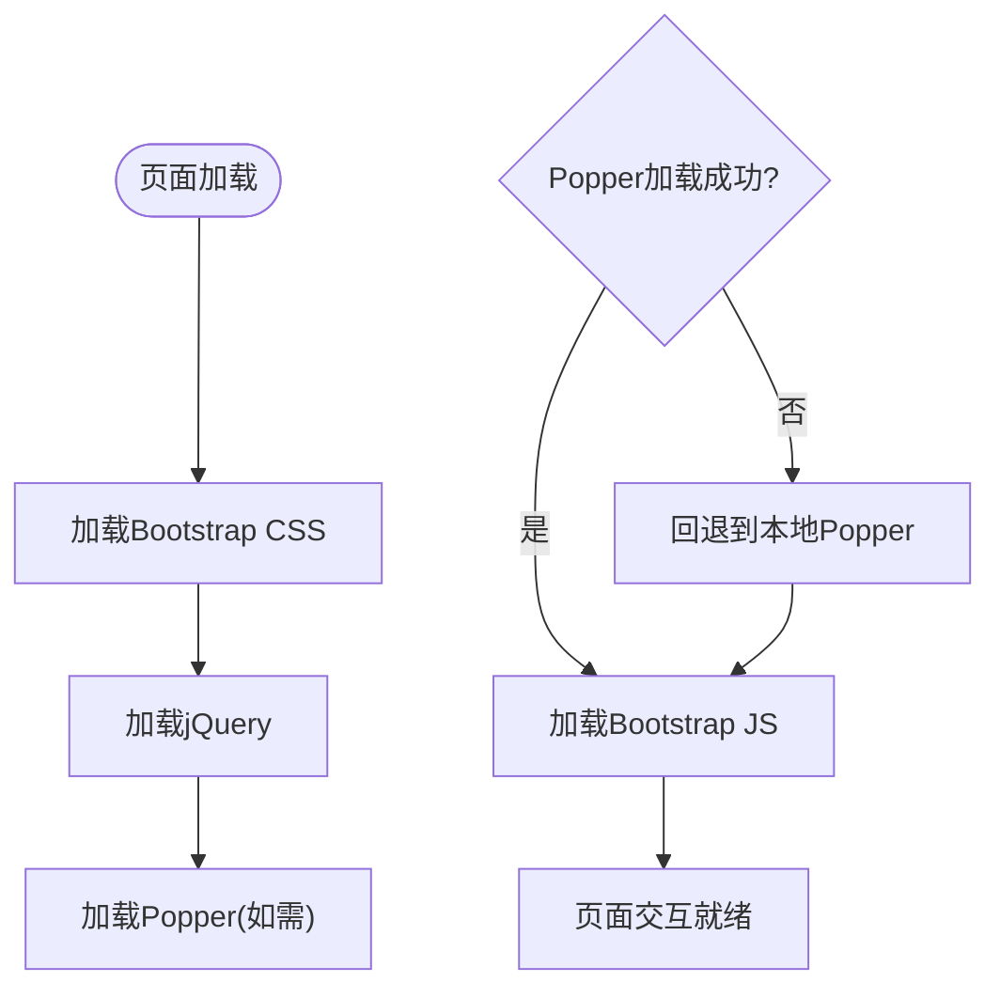
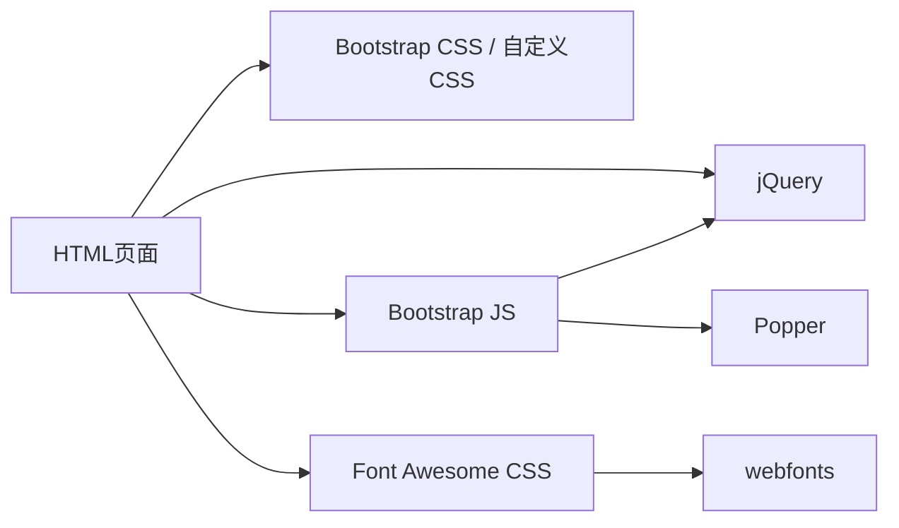

# 静态资源CDN部署

<cite>
**本文引用的文件**
- [index.html](file://index.html)
- [about/index.html](file://about/index.html)
- [commit.html](file://commit.html)
- [404.html](file://404.html)
- [assets/css/bootstrap.min-4.3.1.css](file://assets/css/bootstrap.min-4.3.1.css)
- [assets/js/bootstrap.min-4.3.1.js](file://assets/js/bootstrap.min-4.3.1.js)
- [assets/fontawesome-5.15.4/css/all.min.css](file://assets/fontawesome-5.15.4/css/all.min.css)
- [assets/js/jquery-ui.min.1.12.1.js](file://assets/js/jquery-ui.min.1.12.1.js)
- [Readme-en.md](file://Readme-en.md)
</cite>

## 目录
1. [简介](#简介)
2. [项目结构](#项目结构)
3. [核心组件](#核心组件)
4. [架构总览](#架构总览)
5. [详细组件分析](#详细组件分析)
6. [依赖关系分析](#依赖关系分析)
7. [性能与优化建议](#性能与优化建议)
8. [故障排查指南](#故障排查指南)
9. [结论](#结论)
10. [附录：CDN配置示例](#附录cdn配置示例)

## 简介
本文件面向本项目“静态资源CDN部署”目标，系统梳理当前项目中第三方库与本地资源的引入方式，并给出基于CDN的优化策略、版本管理、回退机制与安全实践。重点覆盖Bootstrap、jQuery、Font Awesome等第三方库的CDN引入方案，以及CSS/JS/图片等本地资源的CDN托管与缓存策略，同时提供主流CDN提供商的选择建议与配置要点（如阿里云CDN、腾讯云CDN、Cloudflare）。

## 项目结构
项目采用静态站点结构，页面通过相对路径引用本地静态资源，包括：
- CSS：Bootstrap、自定义样式、图标字体、Fancybox等
- JS：jQuery、Bootstrap、jQuery UI、业务脚本等
- 字体与图标：Font Awesome 5.15.4（含webfonts）
- 图片：站点Logo与工具卡片缩略图

图表来源
- [index.html:17-31](file://index.html#L17-L31)
- [about/index.html:15-26](file://about/index.html#L15-L26)
- [commit.html:15-26](file://commit.html#L15-L26)

章节来源
- [index.html:17-31](file://index.html#L17-L31)
- [about/index.html:15-26](file://about/index.html#L15-L26)
- [commit.html:15-26](file://commit.html#L15-L26)

## 核心组件
- Bootstrap 4.3.1：UI框架，包含CSS与JS（依赖jQuery与Popper）
- jQuery 3.2.1：DOM操作与事件处理基础库
- Font Awesome 5.15.4：矢量图标库（CSS + webfonts）
- jQuery UI 1.12.1：交互组件扩展
- 其他：Fancybox、业务脚本（content-search、app-*等）

这些资源在当前项目中以本地文件形式存在并通过相对路径引入。后续将逐一说明如何迁移到CDN并保证可用性与安全性。

章节来源
- [assets/js/bootstrap.min-4.3.1.js:1-6](file://assets/js/bootstrap.min-4.3.1.js#L1-L6)
- [assets/fontawesome-5.15.4/css/all.min.css:1-5](file://assets/fontawesome-5.15.4/css/all.min.css#L1-L5)

## 架构总览
从浏览器加载视角看，页面在解析head时并行请求CSS，DOMContentLoaded后执行关键JS。为提升首屏性能，建议：
- 将常用第三方库（Bootstrap、jQuery、Font Awesome）迁移至CDN，利用边缘节点就近分发
- 对本地业务资源（custom-style、业务JS）可保留本地或上CDN，视访问地域与带宽而定
- 启用HTTP/2、Gzip/Brotli压缩、长缓存与ETag，减少重复传输

图表来源
- [index.html:17-31](file://index.html#L17-L31)
- [assets/fontawesome-5.15.4/css/all.min.css:1-5](file://assets/fontawesome-5.15.4/css/all.min.css#L1-L5)

## 详细组件分析

### Bootstrap 4.3.1
- 当前引入：本地CSS与JS文件，位于 assets/css 与 assets/js
- 依赖关系：Bootstrap JS依赖jQuery与Popper；CSS无运行时依赖
- CDN迁移建议：
  - 使用稳定版本的CDN链接（例如cdnjs或jsdelivr），锁定具体版本号
  - 若需回退，可在CDN失败时加载本地副本
  - 注意仅引入必要模块以减少体积（如按需引入popper）

图表来源
- [assets/js/bootstrap.min-4.3.1.js:1-6](file://assets/js/bootstrap.min-4.3.1.js#L1-L6)
- [index.html:17-31](file://index.html#L17-L31)

章节来源
- [assets/js/bootstrap.min-4.3.1.js:1-6](file://assets/js/bootstrap.min-4.3.1.js#L1-L6)
- [index.html:17-31](file://index.html#L17-L31)

### jQuery 3.2.1
- 当前引入：本地文件 assets/js/jquery.min-3.2.1.js
- CDN迁移建议：
  - 使用公共CDN（如cdnjs）引入稳定版本
  - 实现双源加载：优先CDN，失败回退本地
  - 避免跨域问题：确保CDN支持HTTPS且CORS正确

章节来源
- [index.html:30-31](file://index.html#L30-L31)
- [about/index.html:335](file://about/index.html#L335)
- [commit.html:285](file://commit.html#L285)

### Font Awesome 5.15.4
- 当前引入：本地CSS all.min.css，字体文件位于 fontawesome-5.15.4/webfonts
- CDN迁移建议：
  - 使用官方或可信CDN提供all.min.css与webfonts
  - 注意字体跨域：确保CDN允许跨域访问（Access-Control-Allow-Origin）
  - 可选：仅引入所需图标集以减少体积

章节来源
- [index.html:29](file://index.html#L29)
- [assets/fontawesome-5.15.4/css/all.min.css:1-5](file://assets/fontawesome-5.15.4/css/all.min.css#L1-L5)

### jQuery UI 1.12.1
- 当前引入：本地文件 assets/js/jquery-ui.min.1.12.1.js
- CDN迁移建议：
  - 使用公共CDN引入稳定版本
  - 与jQuery版本兼容校验，避免冲突

章节来源
- [assets/js/jquery-ui.min.1.12.1.js:1-50](file://assets/js/jquery-ui.min.1.12.1.js#L1-L50)

### 图片资源
- 当前引入：相对路径指向 assets/images/logos/*
- CDN迁移建议：
  - 将图片上传至对象存储+CDN（如阿里云OSS+CDN、腾讯云COS+CDN）
  - 开启图片压缩与WebP转换，设置合理缓存头
  - 懒加载：结合现有lozad.js实现按需加载

章节来源
- [index.html:50-60](file://index.html#L50-L60)
- [index.html:604-606](file://index.html#L604-L606)

## 依赖关系分析
- HTML页面依赖CSS与JS资源，其中Bootstrap JS依赖jQuery与Popper
- Font Awesome依赖webfonts字体文件
- 业务脚本依赖jQuery与Bootstrap提供的API

图表来源
- [index.html:17-31](file://index.html#L17-L31)
- [assets/js/bootstrap.min-4.3.1.js:1-6](file://assets/js/bootstrap.min-4.3.1.js#L1-L6)
- [assets/fontawesome-5.15.4/css/all.min.css:1-5](file://assets/fontawesome-5.15.4/css/all.min.css#L1-L5)

章节来源
- [index.html:17-31](file://index.html#L17-L31)
- [assets/js/bootstrap.min-4.3.1.js:1-6](file://assets/js/bootstrap.min-4.3.1.js#L1-L6)

## 性能与优化建议
- 资源压缩
  - 启用Gzip/Brotli压缩（参考README中的Nginx配置片段）
  - 对CSS/JS进行Tree Shaking与代码分割（构建阶段）
- 缓存策略
  - 静态资源设置长期缓存（如30天）与immutable
  - 文件名带哈希（构建产物）以便强缓存更新
- HTTPS与安全
  - 全站HTTPS，强制重定向
  - 使用SRI（Subresource Integrity）校验第三方资源完整性
  - CSP（内容安全策略）限制外部脚本来源
- 第三方库CDN选择
  - 国内：阿里云CDN、腾讯云CDN、又拍云
  - 国际：Cloudflare、jsDelivr、cdnjs
  - 选择标准：节点覆盖、稳定性、价格、合规性、是否支持HTTPS与HSTS
- 回退机制
  - 优先CDN，失败自动切换本地副本
  - 使用script标签onerror或Promise.all检测加载状态

章节来源
- [Readme-en.md:86-116](file://Readme-en.md#L86-L116)

## 故障排查指南
- 常见问题
  - CDN不可用导致第三方库加载失败：检查网络连通性、DNS解析、CDN健康状态
  - 跨域错误：确认CDN响应头允许跨域（CORS）
  - 缓存未刷新：清理浏览器缓存或强制刷新；检查Cache-Control与Etag
  - 版本不兼容：核对jQuery与Bootstrap/Popper版本匹配
- 诊断步骤
  - 打开开发者工具Network面板，查看资源加载状态码与耗时
  - 检查控制台报错信息（如缺少依赖、类型错误）
  - 验证SRI校验是否通过（如启用）
  - 对比本地与CDN资源一致性（MD5/SHA）

章节来源
- [404.html:1-3](file://404.html#L1-L3)

## 结论
通过将Bootstrap、jQuery、Font Awesome等第三方库迁移至CDN，并结合压缩、缓存、HTTPS与回退机制，可显著提升首屏加载速度与整体用户体验。建议在构建流程中固化版本号与SRI，配合CI/CD自动化发布，确保资源一致性与安全性。对于图片资源，建议统一上对象存储+CDN，并启用自适应格式与懒加载。

## 附录：CDN配置示例
- Nginx静态资源缓存与压缩（参考项目README）
  - 启用gzip压缩
  - 静态资源设置过期时间与immutable
  - 404页面内部跳转
- HTTPS证书与自动续期（Let's Encrypt）
- 域名与服务器配置
  - 绑定域名、设置根目录与入口文件
  - 开启HTTP/2与HSTS

章节来源
- [Readme-en.md:86-147](file://Readme-en.md#L86-L147)