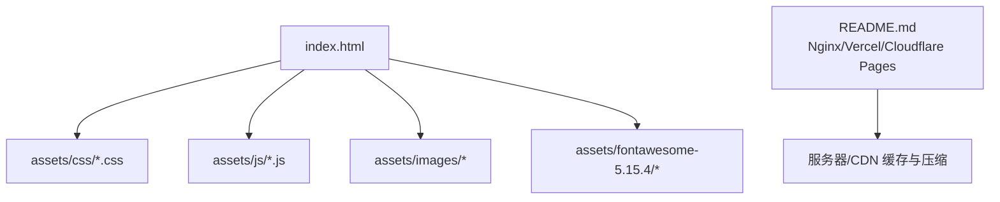
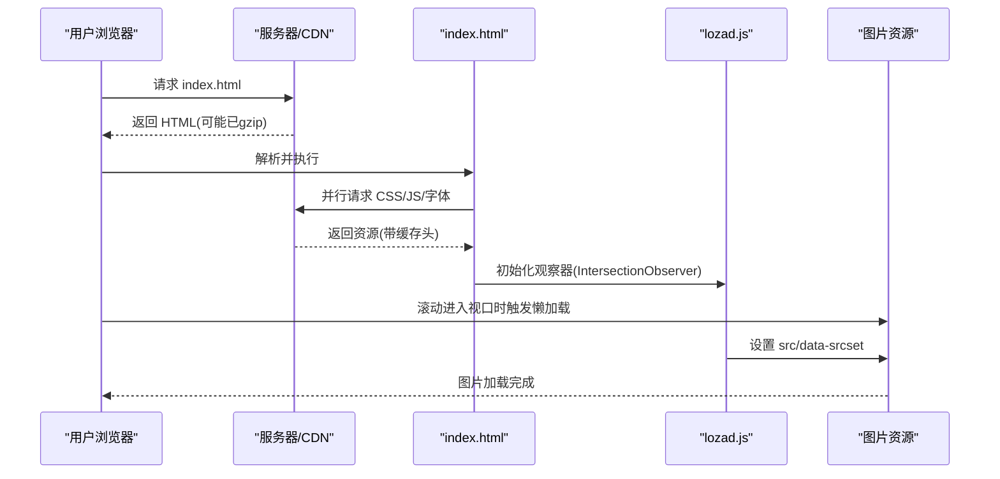
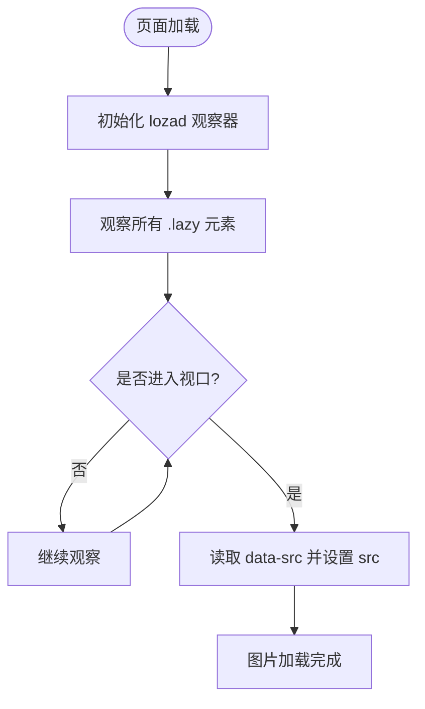
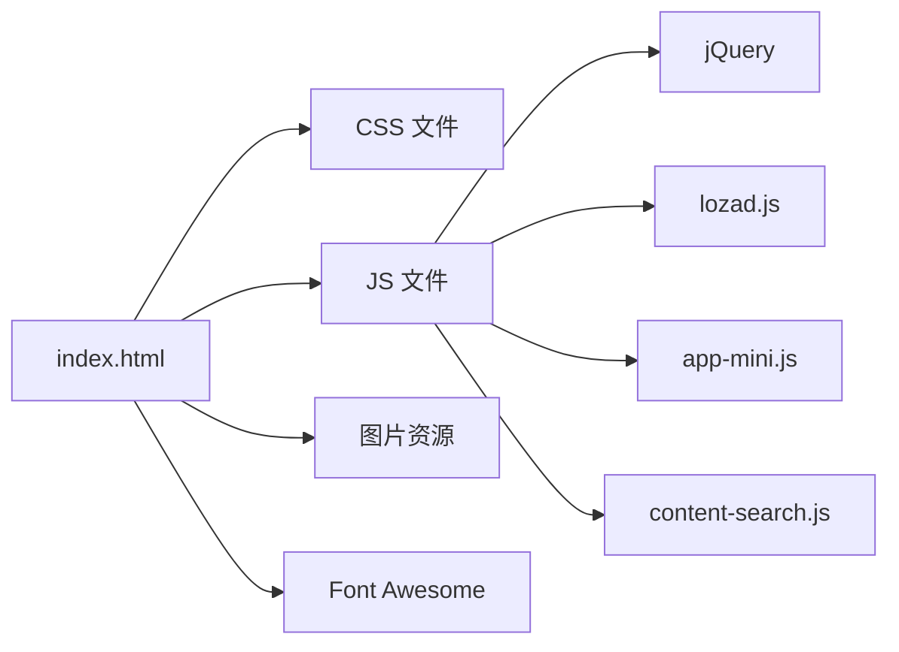

# 加载性能优化

<cite>
**本文引用的文件**
- [index.html](file://index.html)
- [README.md](file://README.md)
- [custom-style.css](file://assets/css/custom-style.css)
- [app-mini.js](file://assets/js/app-mini.js)
- [content-search.js](file://assets/js/content-search.js)
- [lozad.js](file://assets/js/lozad.js)
</cite>

## 目录
1. [简介](#简介)
2. [项目结构](#项目结构)
3. [核心组件](#核心组件)
4. [架构总览](#架构总览)
5. [详细组件分析](#详细组件分析)
6. [依赖关系分析](#依赖关系分析)
7. [性能考量与优化建议](#性能考量与优化建议)
8. [故障排查指南](#故障排查指南)
9. [结论](#结论)
10. [附录：测试与验证方法](#附录测试与验证方法)

## 简介
本文件围绕“页面加载性能优化”目标，结合仓库中的静态资源、脚本与部署说明，系统梳理并给出可落地的优化策略。重点覆盖：
- 资源压缩与合并（CSS/JS）
- 图片格式优化（WebP/SVG等）
- 字体文件优化
- 懒加载实现（图片懒加载、内容延迟渲染）
- 缓存策略（浏览器缓存、CDN缓存、Service Worker）
- CDN加速配置（静态资源、动态内容、边缘计算）
- 具体优化案例与性能测试方法

## 项目结构
本项目为纯静态站点，核心入口为 index.html，样式集中在 assets/css，脚本在 assets/js，图标库使用 Font Awesome 5，图片资源位于 assets/images/logos。README 提供了 Nginx 与多平台部署方案，包含 gzip 与静态资源缓存的配置示例。

图表来源
- [index.html:1-35](file://index.html#L1-L35)
- [README.md:88-116](file://README.md#L88-L116)

章节来源
- [index.html:1-35](file://index.html#L1-L35)
- [README.md:88-116](file://README.md#L88-L116)

## 核心组件
- 首屏资源加载：HTML 中引入多个 CSS 与 JS，影响首屏阻塞与解析时间。
- 图片懒加载：大量图片使用 class="lazy" 与 data-src 占位，配合 lozad.js 实现 IntersectionObserver 懒加载。
- 搜索与交互：content-search.js 提供搜索联想；app-mini.js 负责主题切换、侧边栏、滚动、AJAX 列表等交互。
- 部署与缓存：README 提供 Nginx gzip 与静态资源缓存配置，便于上线后启用压缩与长期缓存。

章节来源
- [index.html:17-31](file://index.html#L17-L31)
- [index.html:604-1447](file://index.html#L604-L1447)
- [lozad.js:19-77](file://assets/js/lozad.js#L19-L77)
- [content-search.js:1-91](file://assets/js/content-search.js#L1-L91)
- [app-mini.js:1-25](file://assets/js/app-mini.js#L1-L25)
- [README.md:88-116](file://README.md#L88-L116)

## 架构总览
下图展示从浏览器请求到资源加载与懒加载的完整链路，以及服务端缓存与压缩的作用点。

图表来源
- [index.html:17-31](file://index.html#L17-L31)
- [index.html:604-1447](file://index.html#L604-L1447)
- [lozad.js:117-168](file://assets/js/lozad.js#L117-L168)
- [README.md:88-116](file://README.md#L88-L116)

## 详细组件分析

### 资源压缩与合并
- 现状
  - 多处 CSS/JS 独立引入，存在多次 HTTP 请求与解析开销。
  - README 提供 Nginx gzip 配置，可在服务端开启压缩。
- 建议
  - 构建阶段合并与压缩：将多个 CSS/JS 合并为少量关键资源，并使用压缩工具生成 .min 版本。
  - 启用服务端 gzip/brotli：对文本类资源（CSS/JS/JSON/HTML）进行压缩，减少传输体积。
  - 利用缓存头：为静态资源设置 Cache-Control 与 Expires，配合版本号或哈希避免强缓存污染。

章节来源
- [index.html:17-31](file://index.html#L17-L31)
- [README.md:88-116](file://README.md#L88-L116)

### 图片格式优化（WebP、SVG、响应式）
- 现状
  - 大量图片使用 class="lazy" 与 data-src，未直接下载，降低首屏压力。
  - 当前图片多为 jpg/png，未统一采用更高效的 WebP/AVIF。
- 建议
  - 优先使用 WebP/AVIF：对照片类图片转换为 WebP/AVIF，并提供回退至 jpg/png。
  - 矢量图使用 SVG：图标与简单图形优先 SVG，支持缩放与可访问性。
  - 响应式图片：使用 srcset/picture 按设备像素比与屏幕宽度选择合适尺寸。
  - 预加载关键首屏图片：对首屏可见 logo/banner 使用 preload 提升感知速度。

章节来源
- [index.html:604-1447](file://index.html#L604-L1447)

### 字体文件优化
- 现状
  - 通过 Font Awesome 的 CSS/JS 引入图标，部分字体文件可能随库加载。
- 建议
  - 按需裁剪字体：仅引入所需字重与字形，减少字体体积。
  - 使用 font-display 策略：如 swap/fallback，避免 FOIT/FOUT。
  - 自托管字体并启用缓存：将字体放置于自有域名/CDN，设置长期缓存。

章节来源
- [index.html:29](file://index.html#L29)

### 懒加载实现原理（图片懒加载、内容延迟渲染）
- 实现要点
  - 图片懒加载：img 标签使用 class="lazy" 与 data-src，实际 src 为空或占位图，等待进入视口再赋值。
  - 懒加载库：lozad.js 基于 IntersectionObserver 监听元素进入视口，触发加载逻辑。
  - 内容延迟渲染：非首屏或异步模块可通过 AJAX 按需加载，减少初始 DOM 与脚本负担。
- 流程图

图表来源
- [lozad.js:117-168](file://assets/js/lozad.js#L117-L168)
- [index.html:604-1447](file://index.html#L604-L1447)

章节来源
- [lozad.js:19-77](file://assets/js/lozad.js#L19-L77)
- [index.html:604-1447](file://index.html#L604-L1447)

### 缓存策略配置（浏览器、CDN、Service Worker）
- 浏览器缓存
  - 为静态资源设置 Cache-Control: public, max-age=... 与 immutable（当文件名含哈希时）。
  - 对 HTML 设置较短缓存或 no-cache，确保更新及时。
- CDN 缓存
  - 将静态资源部署到 CDN，利用 CDN 边缘节点就近分发。
  - 针对图片/字体/媒体设置更长缓存时间，HTML 短缓存或无缓存。
- Service Worker
  - 可选：为离线能力与二次访问加速引入 SW，缓存关键资源与 API 响应。
  - 注意版本管理与缓存失效策略，避免旧资源残留。

章节来源
- [README.md:88-116](file://README.md#L88-L116)

### CDN 加速配置（静态资源、动态内容、边缘计算）
- 静态资源
  - 将 assets 目录下的 CSS/JS/图片/字体全部上 CDN，开启压缩与缓存。
  - 使用子域名或路径前缀区分资源类型，便于精细化缓存策略。
- 动态内容
  - 若后续增加后端接口，可通过 CDN 边缘函数或 Serverless 加速 API 响应。
- 边缘计算
  - 在 CDN 边缘做 A/B 测试、路由重写、请求改写、轻量鉴权等，减少回源。

章节来源
- [README.md:88-116](file://README.md#L88-L116)

## 依赖关系分析
- 页面依赖
  - index.html 依赖多个 CSS/JS 与第三方库（Bootstrap、Fancybox、Font Awesome）。
  - 图片懒加载依赖 lozad.js。
  - 搜索联想依赖 content-search.js 调用外部 API。
- 运行时依赖
  - jQuery 用于 DOM 操作与 AJAX。
  - 第三方天气小部件与一言 API 为可选增强功能。

图表来源
- [index.html:17-31](file://index.html#L17-L31)
- [index.html:604-1447](file://index.html#L604-L1447)
- [content-search.js:1-91](file://assets/js/content-search.js#L1-L91)
- [app-mini.js:1-25](file://assets/js/app-mini.js#L1-L25)
- [lozad.js:117-168](file://assets/js/lozad.js#L117-L168)

章节来源
- [index.html:17-31](file://index.html#L17-L31)
- [index.html:604-1447](file://index.html#L604-L1447)
- [content-search.js:1-91](file://assets/js/content-search.js#L1-L91)
- [app-mini.js:1-25](file://assets/js/app-mini.js#L1-L25)
- [lozad.js:117-168](file://assets/js/lozad.js#L117-L168)

## 性能考量与优化建议
- 首屏优化
  - 关键 CSS 内联或尽早加载，非关键 CSS 延迟加载。
  - 关键 JS 异步加载，非关键 JS 延后或按需加载。
  - 预加载首屏关键图片与字体，避免阻塞。
- 网络优化
  - 启用 gzip/brotli 压缩，减少传输体积。
  - 合并与压缩 CSS/JS，减少请求数与解析时间。
  - 使用 CDN 就近分发，降低延迟。
- 资源优化
  - 图片转 WebP/AVIF，按需尺寸与分辨率。
  - 字体按需裁剪，设置 font-display。
  - 清理无用 CSS/JS，移除冗余第三方库。
- 缓存优化
  - 静态资源长缓存 + 版本化文件名。
  - HTML 短缓存或 no-cache，保证更新。
  - 可选 Service Worker 缓存关键资源与接口。
- 交互优化
  - 懒加载非首屏图片与模块。
  - 搜索联想节流/防抖，避免频繁请求。
  - 动画与滚动事件优化，减少主线程阻塞。

[本节为通用指导，不直接分析具体文件]

## 故障排查指南
- 图片未加载
  - 检查 img 是否具备 class="lazy" 与 data-src，确认 lozad 已初始化且 IntersectionObserver 可用。
  - 检查网络面板是否有 404/跨域错误。
- 搜索联想失败
  - 检查 content-search.js 的 JSONP 回调与跨域限制。
  - 查看控制台错误与网络请求状态码。
- 主题切换异常
  - 检查 app-mini.js 中模式切换逻辑与本地存储读写。
- 缓存导致资源不更新
  - 检查服务端/CDN 的 Cache-Control 与文件名版本化策略。
  - 强制刷新或清除缓存后验证。

章节来源
- [index.html:604-1447](file://index.html#L604-L1447)
- [content-search.js:1-91](file://assets/js/content-search.js#L1-L91)
- [app-mini.js:201-237](file://assets/js/app-mini.js#L201-L237)
- [README.md:88-116](file://README.md#L88-L116)

## 结论
本项目已具备基础的性能优化条件：图片懒加载、服务端 gzip 与静态资源缓存配置。进一步优化的关键在于：
- 构建期合并与压缩 CSS/JS，减少请求与体积
- 全面采用 WebP/AVIF 与响应式图片，提升图片加载效率
- 完善缓存策略与 CDN 部署，最大化复用与就近分发
- 按需加载与延迟渲染，降低首屏负载
通过上述措施，可显著缩短首屏加载时间与整体交互响应时间。

[本节为总结，不直接分析具体文件]

## 附录：测试与验证方法
- 指标采集
  - 使用 Lighthouse/Chrome DevTools 测量 FCP/LCP/TTI/CLS 等指标。
  - 对比优化前后网络瀑布图，关注阻塞资源与重复请求。
- 压测与回归
  - 在不同网络条件下（3G/4G/弱网）复测，确保降级策略有效。
  - 对关键页面进行多次采样，排除波动干扰。
- 缓存验证
  - 检查响应头 Cache-Control/Expires，确认静态资源命中缓存。
  - 验证文件名版本化后缓存正确失效。
- 懒加载验证
  - 滚动页面观察图片是否在进入视口时加载。
  - 检查 IntersectionObserver 是否被正确触发。

[本节为通用指导，不直接分析具体文件]