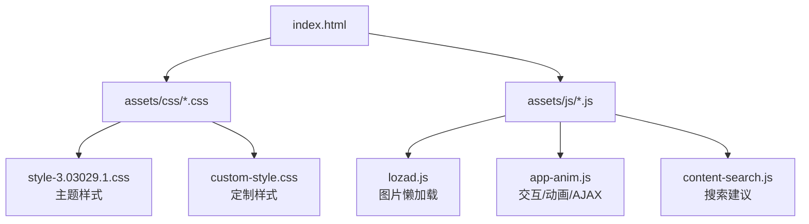
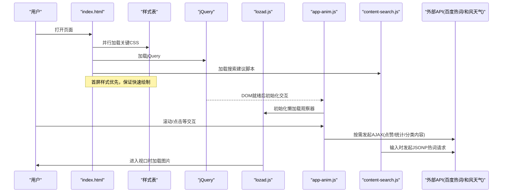
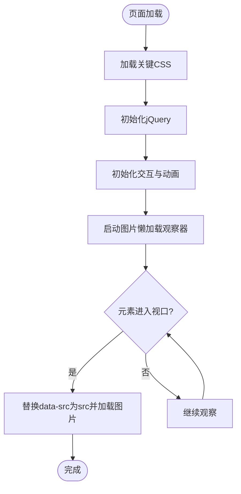
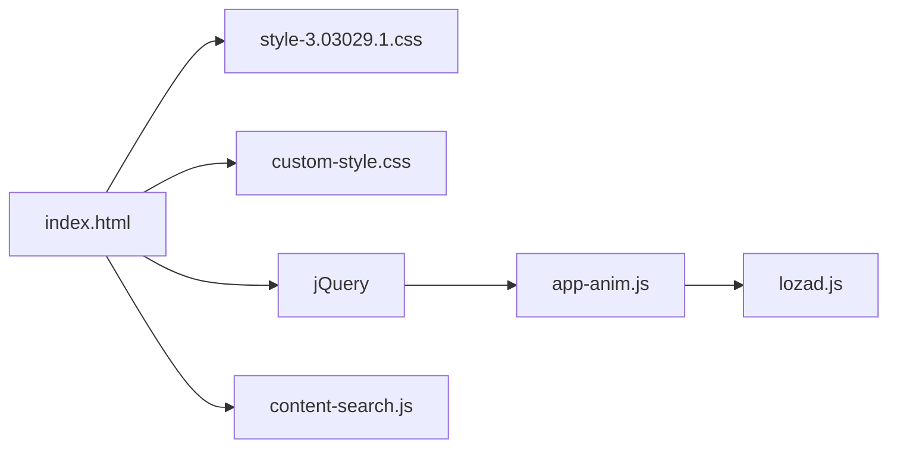

# 内容渲染优化

<cite>
**本文引用的文件**
- [index.html](file://index.html)
- [assets/js/app-anim.js](file://assets/js/app-anim.js)
- [assets/js/lozad.js](file://assets/js/lozad.js)
- [assets/js/content-search.js](file://assets/js/content-search.js)
- [assets/css/custom-style.css](file://assets/css/custom-style.css)
- [assets/css/style-3.03029.1.css](file://assets/css/style-3.03029.1.css)
</cite>

## 目录
1. [简介](#简介)
2. [项目结构](#项目结构)
3. [核心组件](#核心组件)
4. [架构总览](#架构总览)
5. [详细组件分析](#详细组件分析)
6. [依赖关系分析](#依赖关系分析)
7. [性能考量](#性能考量)
8. [故障排查指南](#故障排查指南)
9. [结论](#结论)
10. [附录](#附录)

## 简介
本文件围绕“内容延迟渲染”与“首屏关键内容优先加载”展开，结合仓库中的实际实现，系统讲解：
- 首屏关键资源的优先级策略（HTML 结构、CSS 内联建议、关键资源加载顺序）
- 非关键资源的异步加载机制（第三方脚本延迟执行、样式表异步加载、图片懒加载）
- 内容渲染的性能优化技巧（重排重绘优化、DOM 操作批处理、动画性能调优）
- 智能内容加载策略示例（用户交互感知加载、网络状态检测、错误重试机制）

说明：以下分析与建议均基于仓库现有代码与通用前端最佳实践。对于尚未在仓库中直接实现的优化点，提供可落地的实施路径与参考位置。

## 项目结构
本项目为静态站点型导航网站，主要包含：
- 入口 HTML：index.html，组织页面骨架、关键 CSS/JS 引用、搜索与天气等模块
- 样式：assets/css 下包含主题样式、自定义样式、图标字体样式等
- 脚本：assets/js 下包含动画与交互逻辑、懒加载库、搜索建议、第三方 UI 库等
- 资源：assets/images、assets/fontawesome-5.15.4 等静态资源

图表来源
- [index.html:17-31](file://index.html#L17-L31)
- [assets/js/app-anim.js:1-25](file://assets/js/app-anim.js#L1-L25)
- [assets/js/lozad.js:117-168](file://assets/js/lozad.js#L117-L168)
- [assets/js/content-search.js:1-91](file://assets/js/content-search.js#L1-L91)

章节来源
- [index.html:17-31](file://index.html#L17-L31)
- [assets/css/style-3.03029.1.css:8-25](file://assets/css/style-3.03029.1.css#L8-L25)

## 核心组件
- 首屏关键资源加载
  - 样式表按顺序引入，确保布局与主题先渲染；第三方图标与框架样式紧随其后
  - jQuery 与搜索建议脚本在 head 中引入，便于尽早绑定事件
- 图片懒加载
  - 使用 lozad.js 对图片进行懒加载，减少首屏带宽占用与渲染阻塞
- 交互与动画
  - app-anim.js 负责侧边栏、粘性页脚、提示、AJAX 动态加载、夜间模式切换等
  - 通过节流/防抖与过渡动画降低重排重绘频率
- 搜索建议
  - content-search.js 监听输入，发起跨域 JSONP 请求获取热词，提升搜索体验

章节来源
- [index.html:17-31](file://index.html#L17-L31)
- [assets/js/app-anim.js:1-25](file://assets/js/app-anim.js#L1-L25)
- [assets/js/lozad.js:117-168](file://assets/js/lozad.js#L117-L168)
- [assets/js/content-search.js:1-91](file://assets/js/content-search.js#L1-L91)

## 架构总览
下图展示从页面加载到内容渲染的关键流程，包括关键资源加载、懒加载触发、交互初始化与 AJAX 数据加载。

图表来源
- [index.html:17-31](file://index.html#L17-L31)
- [assets/js/app-anim.js:1-25](file://assets/js/app-anim.js#L1-L25)
- [assets/js/lozad.js:117-168](file://assets/js/lozad.js#L117-L168)
- [assets/js/content-search.js:1-91](file://assets/js/content-search.js#L1-L91)

## 详细组件分析

### 首屏关键内容优先加载策略
- HTML 结构优化
  - 将关键样式表置于 head，确保首屏布局与主题尽快渲染
  - 将 jQuery 与搜索建议脚本置于 head，以便尽早绑定事件与发起请求
  - 使用语义化标签与合理的层级，减少不必要的嵌套，利于浏览器快速构建 DOM
- 关键 CSS 内联建议
  - 可将极小且影响首屏的样式（如基础布局、关键颜色）内联至 <head>，进一步缩短首屏时间
  - 注意避免内联过多样式导致 HTML 体积过大
- 重要资源优先级设置
  - 样式表按“基础→主题→扩展”的顺序加载，避免样式闪烁
  - 第三方脚本（如天气组件）采用延迟加载或按需注入，避免阻塞首屏

章节来源
- [index.html:17-31](file://index.html#L17-L31)
- [assets/css/style-3.03029.1.css:8-25](file://assets/css/style-3.03029.1.css#L8-L25)

### 非关键资源的异步加载机制
- 第三方脚本延迟执行
  - 天气组件脚本在页面结构中动态插入，避免阻塞首屏
  - 建议在必要时使用 defer/async 或 IntersectionObserver 触发加载
- 样式表的异步加载
  - 当前样式表以常规方式引入，可在不影响布局的前提下，将非关键样式改为异步加载
- 图片懒加载集成
  - 使用 lozad.js 对图片进行懒加载，仅当元素进入视口时才加载真实 src
  - 支持 picture、video、背景图等场景，兼容 IntersectionObserver 降级

图表来源
- [assets/js/app-anim.js:1-25](file://assets/js/app-anim.js#L1-L25)
- [assets/js/lozad.js:117-168](file://assets/js/lozad.js#L117-L168)

章节来源
- [assets/js/lozad.js:117-168](file://assets/js/lozad.js#L117-L168)
- [index.html:270-296](file://index.html#L270-L296)

### 内容渲染的性能优化技巧
- 重排重绘优化
  - 批量更新 DOM：在动画或列表更新时，尽量合并多次 DOM 写入，减少回流次数
  - 使用 transform 与 opacity 做动画，避免触发布局计算
  - 对频繁滚动的监听进行节流/防抖，避免每帧都触发重排
- DOM 操作批处理
  - 使用 DocumentFragment 或一次性 innerHTML 替换，减少多次 append
  - 对大型列表采用虚拟滚动或分页加载
- 动画性能调优
  - 使用 requestAnimationFrame 驱动动画，确保与屏幕刷新同步
  - 避免在动画回调中进行昂贵的计算或 DOM 查询

章节来源
- [assets/js/app-anim.js:36-45](file://assets/js/app-anim.js#L36-L45)
- [assets/js/app-anim.js:239-253](file://assets/js/app-anim.js#L239-L253)
- [assets/css/style-3.03029.1.css:195-198](file://assets/css/style-3.03029.1.css#L195-L198)

### 智能内容加载策略（示例与落地路径）
- 用户交互感知加载
  - 在用户点击或滚动到特定区域时再加载相关脚本或数据，减少首屏负担
  - 参考：app-anim.js 中对点击事件的 AJAX 调用与动态内容注入
- 网络状态检测
  - 使用 navigator.onLine 与 online/offline 事件判断网络状态，离线时降级显示缓存或提示
  - 对关键请求增加超时与重试逻辑，提升鲁棒性
- 错误重试机制
  - 对 AJAX 失败进行重试（指数退避），并在连续失败后给出友好提示
  - 对图片加载失败提供默认占位图，避免空白影响体验

章节来源
- [assets/js/app-anim.js:432-509](file://assets/js/app-anim.js#L432-L509)
- [assets/js/content-search.js:1-91](file://assets/js/content-search.js#L1-L91)

## 依赖关系分析
- index.html 作为入口，依次引入样式与脚本
- app-anim.js 依赖 jQuery，负责全局交互与 AJAX
- lozad.js 提供图片懒加载能力，被 app-anim.js 或页面逻辑调用
- content-search.js 依赖 jQuery，负责搜索热词的异步获取
- 样式层由 style-3.03029.1.css 与 custom-style.css 共同构成，前者为主样式，后者为定制覆盖

图表来源
- [index.html:17-31](file://index.html#L17-L31)
- [assets/js/app-anim.js:1-25](file://assets/js/app-anim.js#L1-L25)
- [assets/js/lozad.js:117-168](file://assets/js/lozad.js#L117-L168)
- [assets/js/content-search.js:1-91](file://assets/js/content-search.js#L1-L91)

章节来源
- [index.html:17-31](file://index.html#L17-L31)
- [assets/js/app-anim.js:1-25](file://assets/js/app-anim.js#L1-L25)

## 性能考量
- 首屏时间优化
  - 关键 CSS 内联、关键 JS 前置、非关键资源延迟加载
  - 图片懒加载减少首屏带宽与解析开销
- 渲染性能
  - 使用 transform/opacity 动画，避免布局抖动
  - 滚动与窗口 resize 事件节流/防抖
- 网络优化
  - 合理使用缓存头、CDN 加速静态资源
  - 对第三方脚本进行延迟或按需加载
- 可访问性与容错
  - 图片加载失败提供默认占位
  - 网络异常时给出降级提示与重试机制

[本节为通用指导，不直接分析具体文件]

## 故障排查指南
- 图片未加载
  - 检查是否已正确引入 lozad.js 并调用 observe
  - 确认图片元素具备 data-src 属性且类名匹配选择器
- 搜索热词不显示
  - 检查 content-search.js 是否正确绑定 keyup 事件
  - 确认 JSONP 请求成功且返回数据结构符合预期
- 交互异常
  - 检查 jQuery 是否先于 app-anim.js 加载
  - 查看控制台是否有 JS 报错，定位事件绑定失败原因

章节来源
- [assets/js/lozad.js:117-168](file://assets/js/lozad.js#L117-L168)
- [assets/js/content-search.js:1-91](file://assets/js/content-search.js#L1-L91)
- [assets/js/app-anim.js:1-25](file://assets/js/app-anim.js#L1-L25)

## 结论
本项目通过合理的资源加载顺序、图片懒加载与交互逻辑的组织，实现了较好的首屏渲染与用户体验。为进一步优化，建议：
- 将极小关键样式内联，进一步缩短首屏时间
- 对第三方脚本与样式进行更细粒度的延迟/异步加载
- 完善网络状态检测与错误重试机制，提升健壮性
- 持续监控与评估性能指标（FCP、LCP、TBT 等），迭代优化

[本节为总结，不直接分析具体文件]

## 附录
- 参考实现位置
  - 图片懒加载：assets/js/lozad.js
  - 交互与动画：assets/js/app-anim.js
  - 搜索建议：assets/js/content-search.js
  - 样式结构：assets/css/style-3.03029.1.css、assets/css/custom-style.css
  - 入口与资源引用：index.html

[本节为索引，不直接分析具体文件]