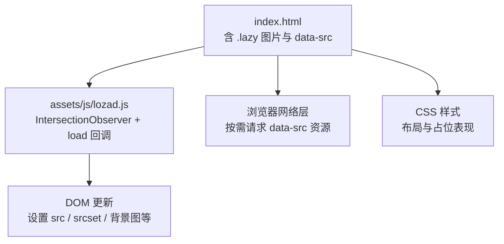
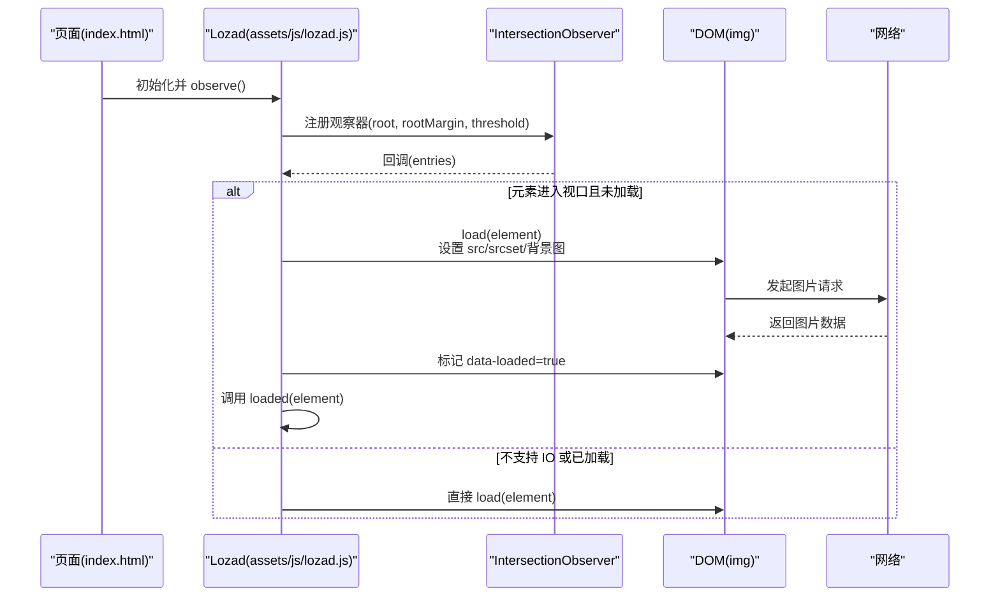
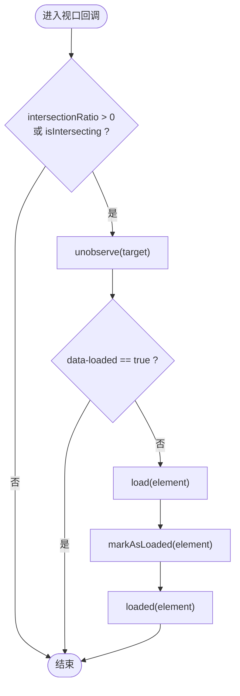
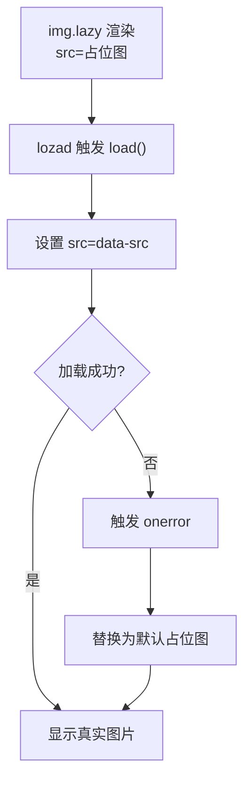
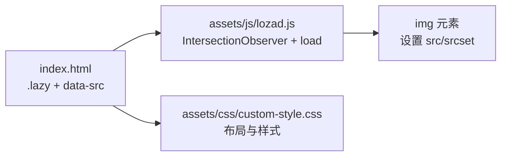

# 图片懒加载

<cite>
**本文引用的文件**
- [index.html](file://index.html)
- [lozad.js](file://assets/js/lozad.js)
- [custom-style.css](file://assets/css/custom-style.css)
</cite>

## 目录
1. [简介](#简介)
2. [项目结构](#项目结构)
3. [核心组件](#核心组件)
4. [架构总览](#架构总览)
5. [详细组件分析](#详细组件分析)
6. [依赖关系分析](#依赖关系分析)
7. [性能考量](#性能考量)
8. [故障排查指南](#故障排查指南)
9. [结论](#结论)
10. [附录：自定义懒加载示例与最佳实践](#附录自定义懒加载示例与最佳实践)

## 简介
本项目在首页大量使用“图片懒加载”以提升首屏性能与滚动体验。实现基于 Lozad.js，利用 Intersection Observer API 监听元素进入视口，按需加载真实图片；同时通过 HTML 的 data-src、onerror 等机制提供占位图与错误处理策略。本文围绕以下目标展开：
- 解释 Intersection Observer 的工作原理与在项目中的使用方法
- 说明占位符显示与错误处理（onerror）机制
- 总结图片加载的性能优化技巧（预加载、缓存、内存管理）
- 给出可落地的自定义懒加载逻辑示例（加载状态指示器、进度反馈、批量优化）

## 项目结构
- 页面入口 index.html 中大量 img 标签采用 class="lazy"，并使用 data-src 指向真实图片地址，onerror 指定默认占位图路径
- assets/js/lozad.js 为 Lozad.js 库，封装了 IntersectionObserver 的使用与加载回调
- assets/css/custom-style.css 包含全局样式，未直接涉及懒加载逻辑

图表来源
- [index.html:604-770](file://index.html#L604-L770)
- [lozad.js:19-77](file://assets/js/lozad.js#L19-L77)
- [lozad.js:117-168](file://assets/js/lozad.js#L117-L168)

章节来源
- [index.html:604-770](file://index.html#L604-L770)
- [lozad.js:19-77](file://assets/js/lozad.js#L19-L77)
- [lozad.js:117-168](file://assets/js/lozad.js#L117-L168)

## 核心组件
- Lozad 实例与配置
  - 默认选择器为 .lozad，但项目中图片使用 class="lazy"，需确保初始化时传入正确的选择器或统一类名
  - 支持 rootMargin、threshold 控制触发时机
  - 支持自定义 load 与 loaded 钩子，便于扩展加载状态、统计埋点等
- 图片标记约定
  - data-src：真实图片地址
  - data-srcset：响应式图片集（Lozad 会将其映射到元素的 srcset）
  - data-background-image / data-background-image-set：用于背景图懒加载
  - onerror：失败时回退到默认占位图
- 占位图与错误处理
  - 每个 .lazy 图片均设置了 onerror，当资源加载失败时替换为默认占位图，提升容错性

章节来源
- [lozad.js:19-77](file://assets/js/lozad.js#L19-L77)
- [lozad.js:87-101](file://assets/js/lozad.js#L87-L101)
- [lozad.js:117-168](file://assets/js/lozad.js#L117-L168)
- [index.html:604-770](file://index.html#L604-L770)

## 架构总览
Lozad 的核心流程如下：
- 创建 IntersectionObserver，监听匹配选择器的元素是否进入视口
- 当元素进入视口且尚未被标记为已加载时，调用 load(element) 执行实际加载
- 加载完成后标记元素并调用 loaded(element) 进行后续处理
- 若不支持 IntersectionObserver，则立即执行 load 并标记

图表来源
- [lozad.js:87-101](file://assets/js/lozad.js#L87-L101)
- [lozad.js:117-168](file://assets/js/lozad.js#L117-L168)

章节来源
- [lozad.js:87-101](file://assets/js/lozad.js#L87-L101)
- [lozad.js:117-168](file://assets/js/lozad.js#L117-L168)

## 详细组件分析

### Intersection Observer 工作原理与使用
- 作用：以较低开销检测元素何时进入视口，避免 scroll/mousemove 等高频率事件带来的性能问题
- 关键参数
  - root：观察根容器（默认文档视口）
  - rootMargin：扩展或收缩根的边界，用于提前触发加载
  - threshold：可见比例阈值，默认 0 表示只要有一点可见即触发
- 在本项目中的应用
  - Lozad 内部创建 IntersectionObserver，并在回调中判断 entry.intersectionRatio > 0 或 isIntersecting
  - 一旦满足条件，解绑该元素观察，防止重复触发
  - 调用 load(element) 完成真实资源加载，并标记 data-loaded

图表来源
- [lozad.js:87-101](file://assets/js/lozad.js#L87-L101)
- [lozad.js:117-168](file://assets/js/lozad.js#L117-L168)

章节来源
- [lozad.js:87-101](file://assets/js/lozad.js#L87-L101)
- [lozad.js:117-168](file://assets/js/lozad.js#L117-L168)

### 占位符显示与错误处理
- 占位图策略
  - 初始 src 指向一个轻量占位图（或直接透明占位），保证布局稳定
  - 当 lozad 触发后，将 data-src 赋值给 src，开始真实图片加载
- 错误处理
  - 每个 .lazy 图片都设置了 onerror，当资源不可用或跨域等问题导致加载失败时，自动切换至默认占位图
  - 这提升了用户体验，避免空白或破损图标

图表来源
- [index.html:604-770](file://index.html#L604-L770)
- [lozad.js:51-75](file://assets/js/lozad.js#L51-L75)

章节来源
- [index.html:604-770](file://index.html#L604-L770)
- [lozad.js:51-75](file://assets/js/lozad.js#L51-L75)

### 图片加载性能优化技巧
- 预加载策略
  - 对首屏关键图片，可在首屏渲染前通过 link rel="preload" 或 IntersectionObserver 的 rootMargin 提前触发加载
  - 非关键图片保持懒加载，减少首屏阻塞
- 缓存机制配置
  - 服务端开启 HTTP 缓存（Cache-Control/ETag），浏览器复用已缓存图片
  - 合理命名资源（带版本哈希），避免缓存污染
- 内存管理与去重
  - Lozad 通过 data-loaded 标记避免重复加载
  - 对于动态插入的图片，确保在插入后调用 observe() 或 triggerLoad()
  - 及时 unobserve 不再需要的元素，释放观察者资源
- 其他优化
  - 使用现代格式（WebP/AVIF）并提供降级
  - 合理使用 srcset 适配不同分辨率设备
  - 控制并发请求数量，避免网络拥塞

章节来源
- [lozad.js:79-85](file://assets/js/lozad.js#L79-L85)
- [lozad.js:117-168](file://assets/js/lozad.js#L117-L168)
- [index.html:604-770](file://index.html#L604-L770)

## 依赖关系分析
- index.html 依赖 assets/js/lozad.js 提供的懒加载能力
- 图片元素通过 class="lazy" 和 data-src 与 Lozad 建立约定
- CSS 样式负责布局与视觉呈现，不直接参与懒加载逻辑

图表来源
- [index.html:604-770](file://index.html#L604-L770)
- [lozad.js:117-168](file://assets/js/lozad.js#L117-L168)
- [custom-style.css:106-110](file://assets/css/custom-style.css#L106-L110)

章节来源
- [index.html:604-770](file://index.html#L604-L770)
- [lozad.js:117-168](file://assets/js/lozad.js#L117-L168)
- [custom-style.css:106-110](file://assets/css/custom-style.css#L106-L110)

## 性能考量
- 首屏关键资源优先：对首屏可见区域图片，可通过减小 rootMargin 或提高 threshold 使其更早触发
- 批量加载优化：对长列表或瀑布流，建议结合虚拟滚动或分页加载，避免一次性观察过多元素
- 资源体积控制：使用合适尺寸与格式的图片，配合 srcset 与 CDN 加速
- 监控与埋点：在 loaded 回调中记录加载耗时、失败率，持续优化

[本节为通用性能指导，不直接分析具体文件]

## 故障排查指南
- 图片未加载
  - 检查是否正确引入 Lozad 并调用 observe()
  - 确认图片元素包含 class="lazy" 与 data-src
  - 查看控制台是否有跨域或 404 错误
- 重复加载
  - 确认 data-loaded 标记未被意外清除
  - 避免对同一元素多次 observe()
- 占位图异常
  - 检查 onerror 回调是否正确设置
  - 验证默认占位图路径可达

章节来源
- [lozad.js:79-85](file://assets/js/lozad.js#L79-L85)
- [index.html:604-770](file://index.html#L604-L770)

## 结论
本项目通过 Lozad.js 与 Intersection Observer API 实现了高效、低侵入的图片懒加载。借助 data-src、onerror 等约定，既保证了首屏性能，又提供了良好的容错体验。结合合理的预加载、缓存与内存管理策略，可进一步提升整体性能与稳定性。

[本节为总结性内容，不直接分析具体文件]

## 附录：自定义懒加载示例与最佳实践
以下为可直接套用的实现思路与步骤（以代码片段路径代替具体代码）：

- 基础用法（选择器与初始化）
  - 在页面中为图片添加 class="lazy" 与 data-src
  - 初始化 Lozad 并传入选择器 ".lazy"，调用 observe()
  - 参考路径：[index.html:604-770](file://index.html#L604-L770)、[lozad.js:117-168](file://assets/js/lozad.js#L117-L168)

- 自定义加载逻辑（加载状态指示器）
  - 在 load 回调中为元素添加 loading 类或显示骨架屏
  - 在 loaded 回调中移除 loading 类，显示真实图片
  - 参考路径：[lozad.js:19-77](file://assets/js/lozad.js#L19-L77)

- 进度反馈（大图片或视频）
  - 对 <video> 或大型图片，可在 load 中逐步提示加载进度（如轮询 readyState 或自定义事件）
  - 参考路径：[lozad.js:36-49](file://assets/js/lozad.js#L36-L49)

- 批量加载优化
  - 对长列表，分批 observe() 或使用 IntersectionObserver 的 root 限制观察范围
  - 结合虚拟滚动，仅观察可视区域内的元素
  - 参考路径：[lozad.js:117-168](file://assets/js/lozad.js#L117-L168)

- 错误处理增强
  - 在 onerror 中记录失败原因并重试或降级到更低分辨率图片
  - 参考路径：[index.html:604-770](file://index.html#L604-L770)

- 预加载与缓存
  - 对首屏关键图片使用 link rel="preload" 或提前触发 lozad.triggerLoad()
  - 服务端启用强缓存与 CDN，客户端利用浏览器缓存
  - 参考路径：[lozad.js:117-168](file://assets/js/lozad.js#L117-L168)

[本节提供实践指引，不直接分析具体文件]