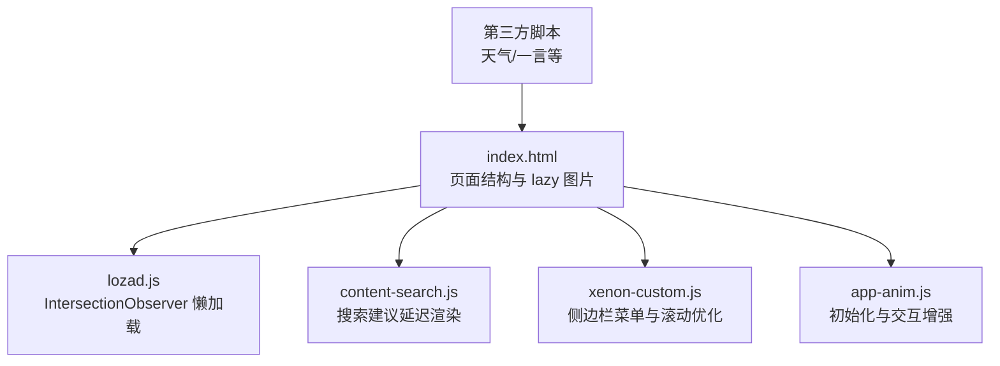
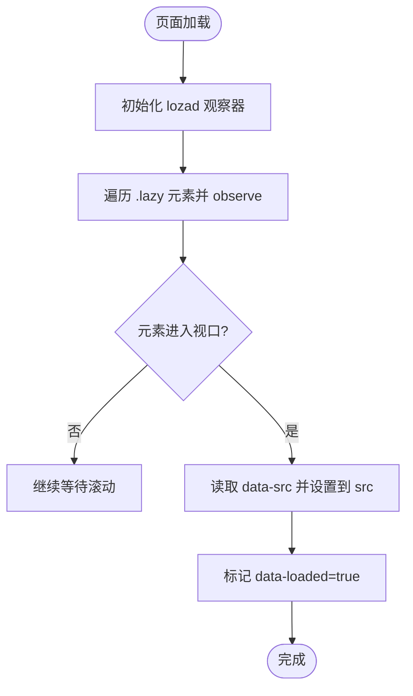
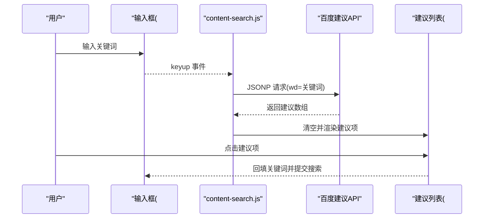
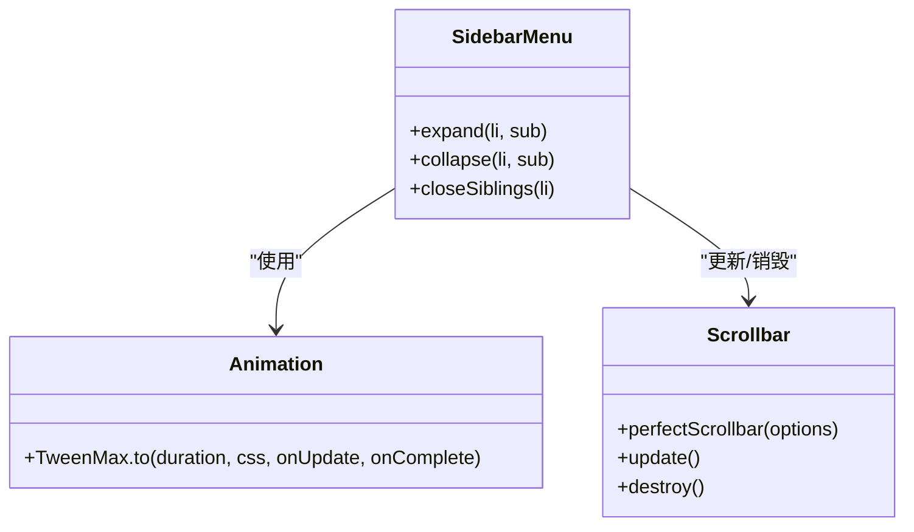
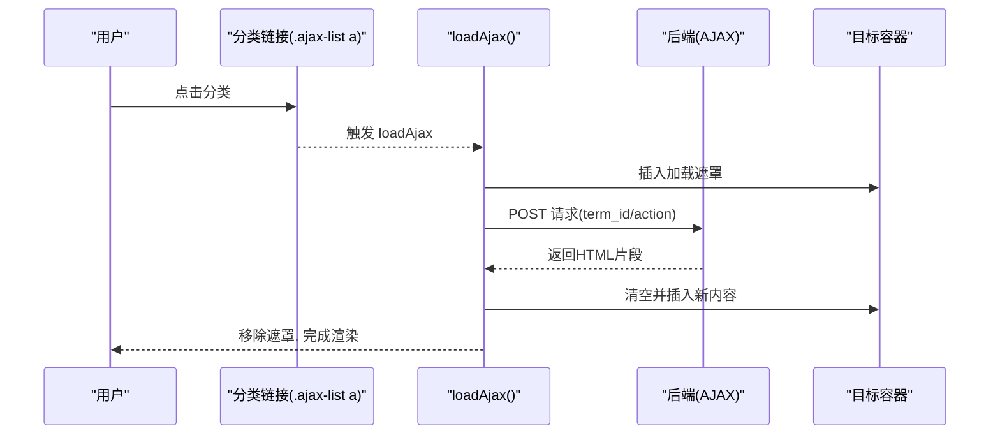
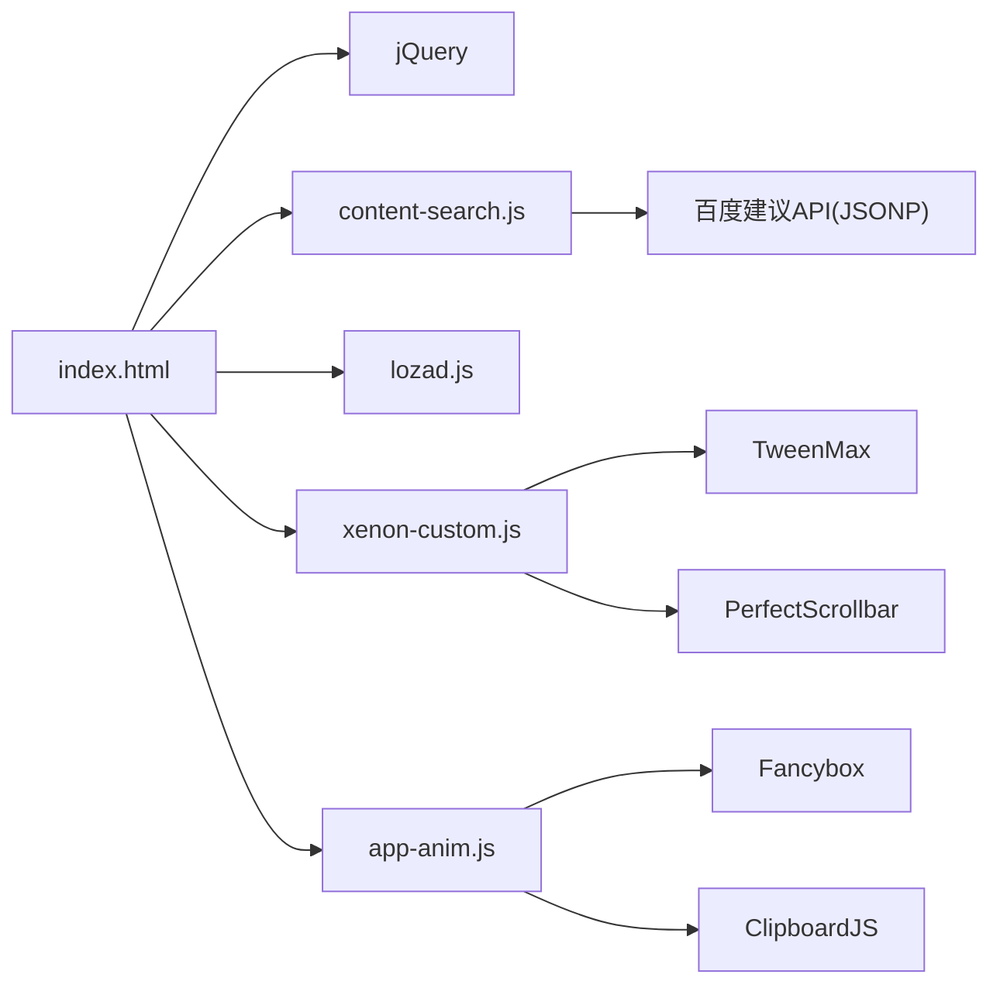

# 懒加载实现

<cite>
**本文引用的文件**
- [index.html](file://index.html)
- [lozad.js](file://assets/js/lozad.js)
- [content-search.js](file://assets/js/content-search.js)
- [app-anim.js](file://assets/js/app-anim.js)
- [xenon-custom.js](file://assets/js/xenon-custom.js)
</cite>

## 目录
1. [简介](#简介)
2. [项目结构](#项目结构)
3. [核心组件](#核心组件)
4. [架构总览](#架构总览)
5. [详细组件分析](#详细组件分析)
6. [依赖关系分析](#依赖关系分析)
7. [性能考量](#性能考量)
8. [故障排查指南](#故障排查指南)
9. [结论](#结论)
10. [附录](#附录)

## 简介
本文件围绕本项目中的“懒加载”实践，系统性梳理图片懒加载、组件按需加载与内容延迟渲染的实现方式，并结合代码定位给出优化建议与监控方法。重点包括：
- 图片懒加载：基于 Intersection Observer API 的可见性检测与资源按需加载，配合占位图与错误兜底。
- 组件按需加载：侧边栏菜单动态展开、搜索建议延迟渲染、大型 DOM 分块加载（AJAX 请求）。
- 内容延迟渲染：首屏关键资源优先、非关键资源异步加载、第三方脚本延迟执行。
- 性能优化：预加载策略、缓存机制、内存管理。
- 监控与排障：可观测指标与常见问题定位。

## 项目结构
本项目为静态站点型导航网站，前端资源集中在 assets 目录下，页面入口为 index.html。懒加载相关的关键点：
- HTML 中大量使用 class="lazy" 与 data-src 标记的图片，用于后续懒加载替换真实 src。
- 引入 lozad.js 作为懒加载库，内部基于 IntersectionObserver 实现。
- 搜索建议通过 content-search.js 在用户输入时发起 AJAX 请求并延迟渲染结果列表。
- 侧边栏菜单通过 xenon-custom.js 控制展开/收起动画与滚动行为。
- app-anim.js 提供页面初始化、交互与部分懒加载开关逻辑。



图表来源
- [index.html:1-35](file://index.html#L1-L35)
- [lozad.js:117-168](file://assets/js/lozad.js#L117-L168)
- [content-search.js:1-91](file://assets/js/content-search.js#L1-L91)
- [xenon-custom.js:1124-1276](file://assets/js/xenon-custom.js#L1124-L1276)
- [app-anim.js:1-25](file://assets/js/app-anim.js#L1-L25)

章节来源
- [index.html:1-35](file://index.html#L1-L35)

## 核心组件
- 图片懒加载器（lozad.js）：封装 IntersectionObserver，支持图片、视频、背景图等资源的延迟加载，并提供 observe/triggerLoad 接口。
- 搜索建议模块（content-search.js）：监听输入事件，按关键词发起 JSONP 请求，延迟渲染建议列表，点击后回填并触发搜索。
- 侧边栏菜单（xenon-custom.js）：处理多级菜单展开/收起、滚动同步、最小化模式切换，提升交互流畅度。
- 页面初始化与交互（app-anim.js）：统一初始化流程，包含工具提示、粘性页脚、滑块、懒加载开关等。

章节来源
- [lozad.js:19-101](file://assets/js/lozad.js#L19-L101)
- [content-search.js:4-83](file://assets/js/content-search.js#L4-L83)
- [xenon-custom.js:1124-1276](file://assets/js/xenon-custom.js#L1124-L1276)
- [app-anim.js:1-25](file://assets/js/app-anim.js#L1-L25)

## 架构总览
整体采用“HTML 标记 + 轻量库 + 业务脚本”的组合：
- HTML 层：以 class="lazy" 和 data-src 标记需要懒加载的资源；同时内联少量第三方脚本（如天气小部件、一言），通过条件或延迟方式执行。
- 资源加载层：lozad.js 负责观察元素进入视口并触发加载；content-search.js 负责搜索建议的按需渲染。
- 交互层：xenon-custom.js 与 app-anim.js 负责菜单、滚动、动画与全局初始化。

```mermaid
sequenceDiagram
participant U as "用户"
participant P as "页面(index.html)"
participant L as "lozad.js"
participant S as "content-search.js"
participant X as "xenon-custom.js"
participant A as "app-anim.js"
U->>P : 打开页面
P-->>A : 初始化(工具提示/粘性页脚/滑块等)
P-->>X : 初始化(侧边栏/滚动/菜单)
P-->>L : 注册观察器(IntersectionObserver)
U->>P : 滚动/输入
P-->>S : 监听输入, 发起JSONP请求
S-->>P : 返回建议数据
P-->>P : 延迟渲染建议列表
P-->>L : 元素进入视口
L-->>P : 将data-src赋值给src, 触发加载
```

图表来源
- [index.html:318-370](file://index.html#L318-L370)
- [lozad.js:117-168](file://assets/js/lozad.js#L117-L168)
- [content-search.js:4-83](file://assets/js/content-search.js#L4-L83)
- [xenon-custom.js:1124-1276](file://assets/js/xenon-custom.js#L1124-L1276)
- [app-anim.js:1-25](file://assets/js/app-anim.js#L1-L25)

## 详细组件分析

### 图片懒加载（Intersection Observer + 占位符）
- 标记规范：HTML 中使用 class="lazy" 与 data-src 指定真实图片地址；src 可放置占位图或空值，避免阻塞首屏。
- 加载时机：lozad.js 创建 IntersectionObserver，当元素进入视口（intersectionRatio > 0 或 isIntersecting）时，将 data-src 赋值给 src，并标记已加载，防止重复加载。
- 兼容性：若不支持 IntersectionObserver，则直接立即加载，保证降级可用。
- 扩展能力：支持 picture、video、背景图等场景，并可切换类名以触发动画或样式变化。



图表来源
- [lozad.js:87-101](file://assets/js/lozad.js#L87-L101)
- [lozad.js:117-168](file://assets/js/lozad.js#L117-L168)
- [index.html:604-800](file://index.html#L604-L800)

章节来源
- [lozad.js:19-101](file://assets/js/lozad.js#L19-L101)
- [index.html:604-800](file://index.html#L604-L800)

### 搜索建议的延迟渲染
- 触发时机：用户在搜索框输入时，content-search.js 监听 keyup 事件，获取关键词并发起 JSONP 请求至百度建议接口。
- 渲染策略：成功回调中清空并显示建议列表，逐条追加 li 节点，并为前几名高亮样式；点击某项后将关键词回填并触发搜索提交。
- 防抖与体验：建议在高频输入场景增加防抖（当前未实现），以减少请求频率；可在无结果时隐藏列表，避免空白闪烁。



图表来源
- [content-search.js:4-83](file://assets/js/content-search.js#L4-L83)
- [index.html:318-370](file://index.html#L318-L370)

章节来源
- [content-search.js:4-83](file://assets/js/content-search.js#L4-L83)
- [index.html:318-370](file://index.html#L318-L370)

### 侧边栏菜单的动态展开与滚动优化
- 展开/收起：xenon-custom.js 中 setup_sidebar_menu 为含子菜单的项绑定点击事件，调用 expand/collapse 函数，使用 TweenMax 进行高度动画，确保平滑过渡。
- 滚动与固定：theiaStickySidebar 用于侧边栏粘性定位；PerfectScrollbar 用于自定义滚动条，减少原生滚动抖动。
- 最小化模式：根据窗口尺寸与配置切换 mini-sidebar，并在最小化模式下通过悬浮面板展示二级菜单，降低空间占用。



图表来源
- [xenon-custom.js:1124-1276](file://assets/js/xenon-custom.js#L1124-L1276)
- [xenon-custom.js:1459-1507](file://assets/js/xenon-custom.js#L1459-L1507)

章节来源
- [xenon-custom.js:1124-1276](file://assets/js/xenon-custom.js#L1124-L1276)
- [xenon-custom.js:1459-1507](file://assets/js/xenon-custom.js#L1459-L1507)

### 大型 DOM 结构的分块加载
- 分类内容按需加载：app-anim.js 中针对 ajax-list 与 ajax-list-home 的点击事件，调用 loadAjax 函数，向服务器发起 POST 请求获取 HTML 片段，插入目标容器，并显示加载中遮罩。
- 首次加载优化：仅在目标区域为空时发起请求，避免重复加载；完成后移除遮罩，必要时重新初始化 tooltip 等插件。



图表来源
- [app-anim.js:466-510](file://assets/js/app-anim.js#L466-L510)

章节来源
- [app-anim.js:466-510](file://assets/js/app-anim.js#L466-L510)

### 内容延迟渲染与首屏优化
- 首屏关键资源：CSS、基础 JS（jQuery、content-search.js）在 head 中优先加载，确保布局与交互可用。
- 非关键资源：图片使用 data-src 延迟加载；第三方脚本（如天气小部件、一言）通过内联脚本或外部脚本延迟执行，避免阻塞首屏。
- 交互增强：app-anim.js 初始化 tooltip、粘性页脚、滑块等，按需启用以提升用户体验。

章节来源
- [index.html:17-35](file://index.html#L17-L35)
- [index.html:270-315](file://index.html#L270-L315)
- [app-anim.js:1-25](file://assets/js/app-anim.js#L1-L25)

## 依赖关系分析
- index.html 依赖 jQuery、content-search.js、lozad.js（通过 HTML 标记与脚本注入）、第三方 CSS/JS。
- lozad.js 依赖浏览器 IntersectionObserver 能力，具备降级策略。
- content-search.js 依赖 jQuery 与百度建议 API（JSONP）。
- xenon-custom.js 依赖 jQuery、TweenMax、theiaStickySidebar、PerfectScrollbar。
- app-anim.js 依赖 jQuery、Tooltip、Fancybox、ClipboardJS 等。



图表来源
- [index.html:17-35](file://index.html#L17-L35)
- [content-search.js:4-83](file://assets/js/content-search.js#L4-L83)
- [lozad.js:117-168](file://assets/js/lozad.js#L117-L168)
- [xenon-custom.js:1124-1276](file://assets/js/xenon-custom.js#L1124-L1276)
- [app-anim.js:1-25](file://assets/js/app-anim.js#L1-L25)

章节来源
- [index.html:17-35](file://index.html#L17-L35)

## 性能考量
- 图片懒加载
  - 使用 IntersectionObserver 精准触发加载，避免 scroll 事件的高频计算。
  - 占位图与 onerror 兜底，保障加载失败时的视觉一致性。
  - 建议：为常见图标使用 WebP/AVIF 格式，结合响应式图片（srcset/picture）进一步减小体积。
- 搜索建议
  - 当前为每次 keyup 即请求，建议加入防抖（如 300ms）与节流，减少无效请求。
  - 对热门词做本地缓存（localStorage），命中则直接渲染。
- 侧边栏与滚动
  - 使用 PerfectScrollbar 与 theiaStickySidebar 提升滚动体验，但需注意在移动端禁用或降级以避免额外开销。
  - 菜单展开动画使用 TweenMax，注意在低端设备上限制动画复杂度。
- 分块加载
  - AJAX 加载分类内容时，仅加载必要 HTML，避免一次性构建大 DOM。
  - 建议在请求前后埋点统计耗时与成功率，便于持续优化。
- 第三方脚本
  - 天气小部件与一言等脚本应延迟执行或在空闲时加载，避免阻塞首屏。
  - 考虑使用 async/defer 或 requestIdleCallback 调度。

[本节为通用性能建议，不直接引用具体代码]

## 故障排查指南
- 图片未加载
  - 检查是否正确使用 class="lazy" 与 data-src；确认 lozad 观察器已初始化且元素未被提前移除。
  - 查看浏览器控制台是否有网络错误或跨域问题；确认 onerror 兜底路径有效。
- 搜索建议不显示
  - 检查 JSONP 请求是否成功返回；确认 #word 容器存在且未被隐藏。
  - 若频繁输入导致卡顿，建议加入防抖与缓存。
- 侧边栏菜单异常
  - 检查窗口尺寸与 mini-sidebar 状态；确认 TweenMax 与 PerfectScrollbar 已正确加载。
  - 在移动端测试触摸交互与滚动冲突。
- 分块加载失败
  - 检查 AJAX 请求参数与后端返回；确认加载遮罩能正确移除。
  - 若多次点击导致重复请求，检查 active 状态与缓存逻辑。

章节来源
- [lozad.js:87-101](file://assets/js/lozad.js#L87-L101)
- [content-search.js:16-72](file://assets/js/content-search.js#L16-L72)
- [xenon-custom.js:1124-1276](file://assets/js/xenon-custom.js#L1124-L1276)
- [app-anim.js:466-510](file://assets/js/app-anim.js#L466-L510)

## 结论
本项目通过 lozad.js 的 IntersectionObserver 实现图片懒加载，结合占位图与错误兜底，显著降低首屏资源压力；搜索建议与分类内容采用 AJAX 按需加载，避免一次性构建大 DOM；侧边栏菜单与滚动优化提升了交互流畅度。为进一步优化，建议引入防抖/节流、本地缓存、更严格的资源优先级控制与性能埋点，以实现更稳定的用户体验。

[本节为总结性内容，不直接引用具体代码]

## 附录
- 关键代码路径参考
  - 图片懒加载标记与加载逻辑：[index.html:604-800](file://index.html#L604-L800)、[lozad.js:117-168](file://assets/js/lozad.js#L117-L168)
  - 搜索建议延迟渲染：[content-search.js:4-83](file://assets/js/content-search.js#L4-L83)
  - 侧边栏菜单展开/收起：[xenon-custom.js:1124-1276](file://assets/js/xenon-custom.js#L1124-L1276)
  - 分类内容分块加载：[app-anim.js:466-510](file://assets/js/app-anim.js#L466-L510)

[本节为索引信息，不直接引用具体代码]