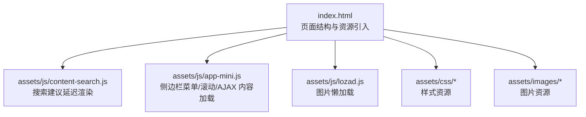
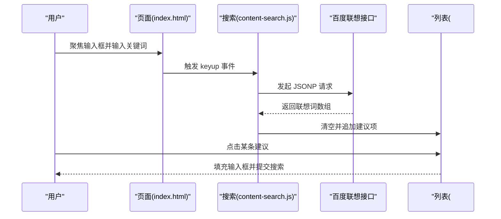
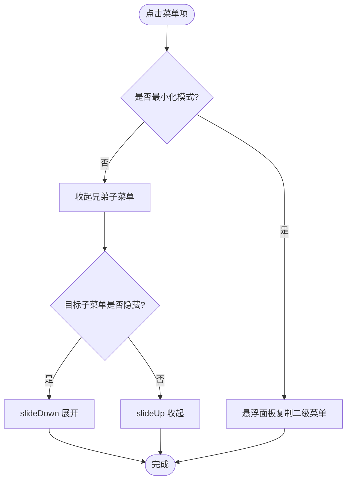
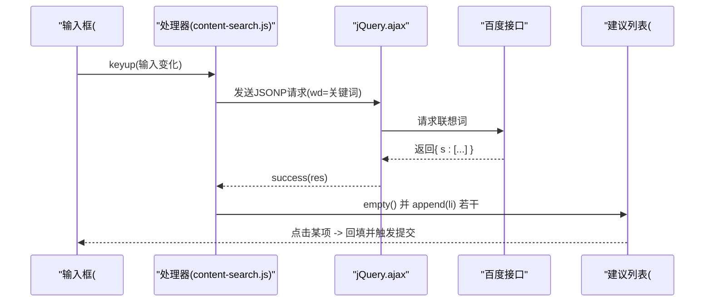
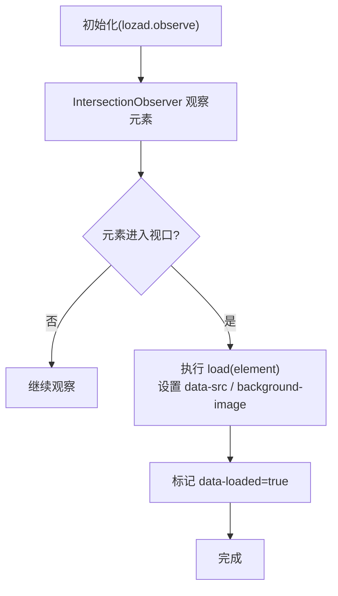
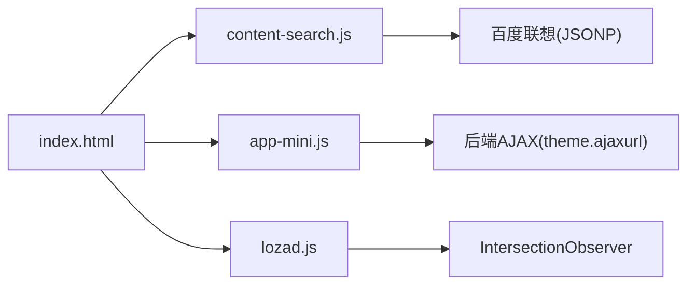

# 组件懒加载

<cite>
**本文引用的文件**
- [index.html](file://index.html)
- [content-search.js](file://assets/js/content-search.js)
- [app-mini.js](file://assets/js/app-mini.js)
- [lozad.js](file://assets/js/lozad.js)
- [README.md](file://README.md)
</cite>

## 目录
1. [简介](#简介)
2. [项目结构](#项目结构)
3. [核心组件](#核心组件)
4. [架构总览](#架构总览)
5. [详细组件分析](#详细组件分析)
6. [依赖关系分析](#依赖关系分析)
7. [性能考量](#性能考量)
8. [故障排查指南](#故障排查指南)
9. [结论](#结论)
10. [附录](#附录)

## 简介
本文件围绕“组件懒加载”主题，结合仓库中的实际实现，系统梳理以下能力：
- 侧边栏菜单的动态展开与子菜单的按需渲染
- 搜索建议的延迟渲染（输入事件处理、异步加载、防抖节流优化）
- 大型 DOM 结构的分块加载（图片懒加载、可视区域内容管理、内存泄漏防护）
并提供可落地的实现示例与性能监控方法，帮助开发者提升页面加载性能与用户体验。

## 项目结构
本项目为纯静态站点，核心入口为 index.html；交互逻辑主要分布在 assets/js 下的多个脚本中：
- content-search.js：搜索建议的延迟渲染与异步请求
- app-mini.js：侧边栏菜单展开/收起、滚动监听、AJAX 内容按需加载等
- lozad.js：基于 IntersectionObserver 的图片懒加载库
- README.md：项目说明与部署指引

图表来源
- [index.html:1-35](file://index.html#L1-L35)
- [content-search.js:1-91](file://assets/js/content-search.js#L1-L91)
- [app-mini.js:1-800](file://assets/js/app-mini.js#L1-L800)
- [lozad.js:1-174](file://assets/js/lozad.js#L1-L174)

章节来源
- [index.html:1-35](file://index.html#L1-L35)
- [README.md:298-314](file://README.md#L298-L314)

## 核心组件
- 侧边栏菜单与动态展开：通过 app-mini.js 绑定点击事件，控制子菜单的显示/隐藏，并支持最小化模式下的悬浮二级菜单面板。
- 搜索建议延迟渲染：content-search.js 在输入框 keyup 时发起 AJAX 请求获取百度联想词，成功后动态构建列表项并展示。
- 图片懒加载：lozad.js 使用 IntersectionObserver 检测元素进入视口后触发加载，避免首屏一次性加载大量图片。
- 内容区块按需加载：app-mini.js 提供 loadAjax 函数，点击分类或标签时通过 AJAX 拉取 HTML 片段并插入容器，减少初始 DOM 体积。

章节来源
- [app-mini.js:349-401](file://assets/js/app-mini.js#L349-L401)
- [content-search.js:1-91](file://assets/js/content-search.js#L1-L91)
- [lozad.js:117-169](file://assets/js/lozad.js#L117-L169)
- [app-mini.js:471-505](file://assets/js/app-mini.js#L471-L505)

## 架构总览
整体采用“页面骨架 + 按需加载”的架构：首屏仅渲染必要结构，交互触发后再加载对应模块或数据。

图表来源
- [content-search.js:5-73](file://assets/js/content-search.js#L5-L73)
- [content-search.js:76-83](file://assets/js/content-search.js#L76-L83)

## 详细组件分析

### 侧边栏菜单的动态展开机制
- 菜单项点击：当点击菜单项时，若当前未处于最小化模式，则先收起兄弟节点的子菜单，再根据目标子菜单的显示状态进行展开或收起，同时维护高亮状态类名。
- 最小化模式：通过切换 mini-sidebar 类控制宽度与动画；在最小化模式下，将二级菜单内容复制到悬浮面板中，鼠标悬停时定位并显示。
- 滚动与粘性：使用 theiaStickySidebar 插件保持侧边栏在滚动时的粘性定位，提升长列表导航体验。

图表来源
- [app-mini.js:349-367](file://assets/js/app-mini.js#L349-L367)
- [app-mini.js:403-425](file://assets/js/app-mini.js#L403-L425)
- [app-mini.js:15-19](file://assets/js/app-mini.js#L15-L19)

章节来源
- [app-mini.js:15-19](file://assets/js/app-mini.js#L15-L19)
- [app-mini.js:349-401](file://assets/js/app-mini.js#L349-L401)
- [app-mini.js:403-425](file://assets/js/app-mini.js#L403-L425)

### 搜索建议的延迟渲染实现
- 输入事件处理：在 #search-text 上监听 keyup，读取当前值，为空时隐藏建议列表。
- 异步加载：使用 jQuery.ajax 以 JSONP 方式调用百度联想接口，成功回调中清空并重建建议列表，对前几名设置不同样式。
- 交互与关闭：点击建议项将文本回填到输入框并触发提交；点击页面空白处也清空并隐藏列表。

图表来源
- [content-search.js:5-73](file://assets/js/content-search.js#L5-L73)
- [content-search.js:76-83](file://assets/js/content-search.js#L76-L83)

章节来源
- [content-search.js:1-91](file://assets/js/content-search.js#L1-L91)

### 大型 DOM 结构的分块加载技术
- 图片懒加载：lozad.js 基于 IntersectionObserver 监听元素进入视口，仅在需要时设置 src/background-image，显著降低首屏压力。
- 可视区域内容管理：首页内容区块可通过 AJAX 按需加载（loadAjax），首次只渲染基础骨架，点击分类或标签再拉取对应 HTML 片段并插入容器。
- 内存泄漏防护：
  - 建议在动态插入的 DOM 上移除旧的事件监听器或销毁插件实例（如 tooltip、sortable）。
  - 在 AJAX 失败或页面卸载时清理定时器、观察者与全局变量引用。
  - 对频繁更新的列表，优先复用节点或使用虚拟滚动思路（仅渲染可视区条目）。

图表来源
- [lozad.js:117-169](file://assets/js/lozad.js#L117-L169)
- [lozad.js:87-101](file://assets/js/lozad.js#L87-L101)

章节来源
- [lozad.js:1-174](file://assets/js/lozad.js#L1-L174)
- [app-mini.js:471-505](file://assets/js/app-mini.js#L471-L505)

### 滚动监听优化
- 返回顶部与头部背景：在 window.scroll 事件中判断滚动位置，控制返回顶部按钮显隐与头部背景类切换。
- 粘性页脚与侧边栏：通过 theiaStickySidebar 与自定义 stickFooter 函数保证布局稳定。
- 建议：对高频滚动事件使用 requestAnimationFrame 或节流策略，避免重排重绘抖动。

章节来源
- [app-mini.js:239-253](file://assets/js/app-mini.js#L239-L253)
- [app-mini.js:294-308](file://assets/js/app-mini.js#L294-L308)
- [app-mini.js:15-19](file://assets/js/app-mini.js#L15-L19)

## 依赖关系分析
- 页面层：index.html 引入 jQuery、Bootstrap、Font Awesome、自定义样式与脚本。
- 交互层：
  - content-search.js 依赖 jQuery 与外部 JSONP 接口。
  - app-mini.js 依赖 jQuery、theiaStickySidebar、Fancybox、ClipboardJS 等。
  - lozad.js 依赖浏览器原生 IntersectionObserver（降级方案直接加载）。
- 数据层：百度联想接口、后端 AJAX 接口（由 theme.ajaxurl 指向）。

图表来源
- [index.html:17-31](file://index.html#L17-L31)
- [content-search.js:8-12](file://assets/js/content-search.js#L8-L12)
- [app-mini.js:471-505](file://assets/js/app-mini.js#L471-L505)
- [lozad.js:130-136](file://assets/js/lozad.js#L130-L136)

章节来源
- [index.html:17-31](file://index.html#L17-L31)
- [content-search.js:8-12](file://assets/js/content-search.js#L8-L12)
- [app-mini.js:471-505](file://assets/js/app-mini.js#L471-L505)
- [lozad.js:130-136](file://assets/js/lozad.js#L130-L136)

## 性能考量
- 首屏优化
  - 图片懒加载：利用 lozad.js 延迟加载非首屏图片，减少带宽与解析时间。
  - 内容分块：通过 AJAX 按需加载分类内容，避免一次性注入大量 DOM。
- 交互优化
  - 搜索建议：当前实现为每次按键即请求，建议增加防抖（如 200-300ms）以减少无效请求。
  - 滚动监听：建议使用 requestAnimationFrame 或节流封装，降低 scroll 事件频率。
- 内存管理
  - 动态 DOM：在替换或移除节点时，确保解绑事件与销毁插件实例，避免闭包与全局引用导致的内存泄漏。
  - 观察者：IntersectionObserver 在元素加载完成后应 unobserve，避免持续监听。

[本节为通用指导，不直接分析具体文件]

## 故障排查指南
- 搜索建议不显示
  - 检查网络请求是否成功（控制台 Network），确认 JSONP 回调参数与域名白名单。
  - 确认 #word 容器存在且未被 CSS 隐藏。
  - 参考实现路径：[content-search.js:5-73](file://assets/js/content-search.js#L5-L73)
- 图片未懒加载
  - 确认元素包含 data-src 或 data-background-image 属性。
  - 检查 IntersectionObserver 是否被正确创建与 observe。
  - 参考实现路径：[lozad.js:117-169](file://assets/js/lozad.js#L117-L169)
- 侧边栏展开异常
  - 检查是否处于最小化模式导致行为差异。
  - 确认 theiaStickySidebar 初始化成功。
  - 参考实现路径：[app-mini.js:349-401](file://assets/js/app-mini.js#L349-L401)、[app-mini.js:15-19](file://assets/js/app-mini.js#L15-L19)

章节来源
- [content-search.js:5-73](file://assets/js/content-search.js#L5-L73)
- [lozad.js:117-169](file://assets/js/lozad.js#L117-L169)
- [app-mini.js:349-401](file://assets/js/app-mini.js#L349-L401)
- [app-mini.js:15-19](file://assets/js/app-mini.js#L15-L19)

## 结论
本项目通过“首屏精简 + 按需加载”的策略，有效降低了初始负载并提升了交互响应性：
- 侧边栏菜单通过点击与最小化模式组合，实现了子菜单的按需渲染与良好的视觉反馈。
- 搜索建议采用异步加载与动态渲染，具备扩展防抖/节流的基础条件。
- 图片懒加载借助 IntersectionObserver，避免了首屏大图阻塞。
- 内容区块通过 AJAX 分块加载，进一步减少了初始 DOM 体积。
建议在此基础上补充防抖节流、滚动优化与更完善的内存管理，以获得更佳的性能与稳定性。

[本节为总结性内容，不直接分析具体文件]

## 附录
- 快速开始与部署请参考项目文档。
- 如需二次开发，可在 index.html 中调整分类区块与链接，或在 assets/js 中扩展交互逻辑。

章节来源
- [README.md:22-44](file://README.md#L22-L44)
- [README.md:242-296](file://README.md#L242-L296)