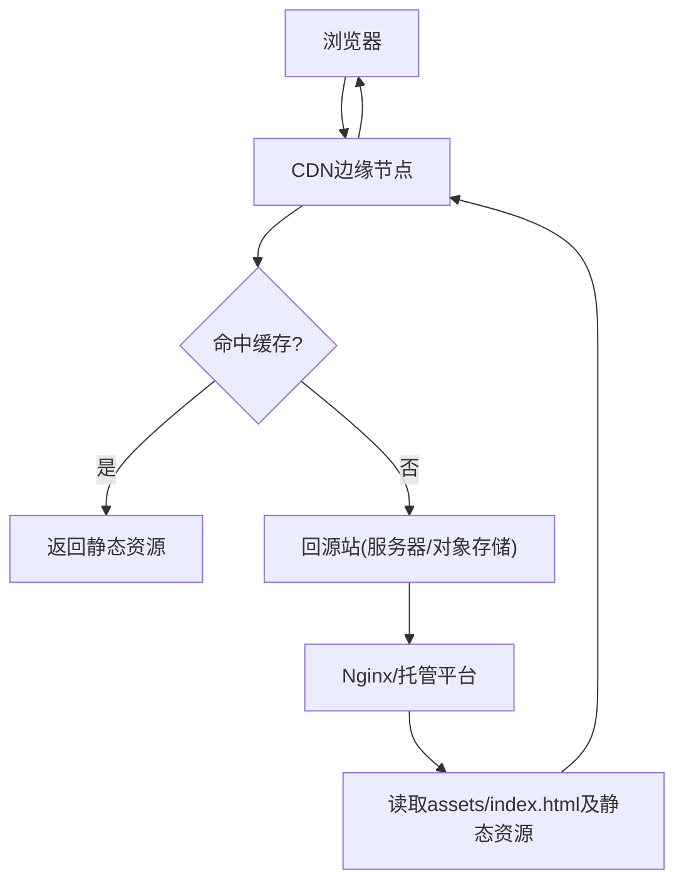
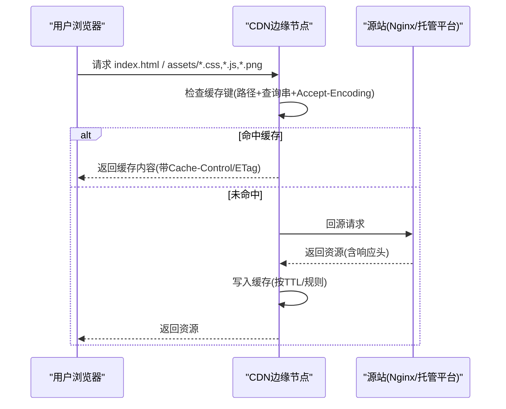
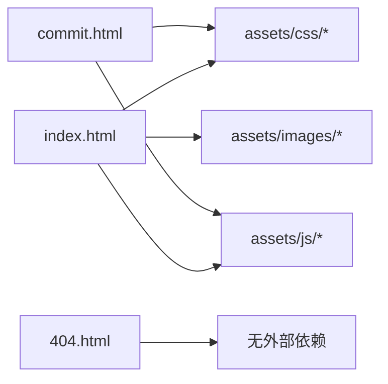

# CDN缓存策略

<cite>
**本文引用的文件**
- [README.md](file://README.md)
- [index.html](file://index.html)
- [commit.html](file://commit.html)
- [404.html](file://404.html)
</cite>

## 目录
1. [简介](#简介)
2. [项目结构](#项目结构)
3. [核心组件](#核心组件)
4. [架构总览](#架构总览)
5. [详细组件分析](#详细组件分析)
6. [依赖关系分析](#依赖关系分析)
7. [性能考量](#性能考量)
8. [故障排查指南](#故障排查指南)
9. [结论](#结论)
10. [附录](#附录)

## 简介
本文件面向“在线网址导航”静态站点，提供一套可落地的CDN缓存策略文档。目标包括：
- 明确静态资源通过CDN加速的缓存优化方案
- 给出缓存时间、缓存键设计、缓存穿透防护等关键概念与落地方法
- 对比阿里云CDN、腾讯云CDN、Cloudflare等主流服务商的配置方法与最佳实践
- 说明缓存预热与回源策略，保障首次访问加载性能
- 区分动态内容与静态内容的处理，并给出API请求的缓存建议
- 提供控制台配置要点与命令行工具使用指引（以通用步骤为主）

## 项目结构
本项目为纯静态站点，主要包含HTML页面与静态资源（CSS/JS/图片/字体）。根据仓库结构，静态资源集中在 assets 目录下，页面入口为 index.html，另有提交页 commit.html 与错误页 404.html。部署方式支持 Nginx、Vercel、GitHub Pages、Cloudflare Pages、Netlify 等。

图表来源
- [README.md:47-132](file://README.md#L47-L132)
- [README.md:149-241](file://README.md#L149-L241)

章节来源
- [README.md:298-314](file://README.md#L298-L314)

## 核心组件
- 静态资源：CSS、JS、图片、字体等，适合长期缓存并配合版本化文件名
- 页面入口：index.html、commit.html、404.html，通常不缓存或短缓存
- 部署与服务器：Nginx 或托管平台（Vercel/Cloudflare Pages/GitHub Pages/Netlify），负责响应头设置与回源行为
- CDN：边缘缓存层，负责缓存命中、预热、回源、压缩、HTTPS等

章节来源
- [README.md:47-132](file://README.md#L47-L132)
- [README.md:149-241](file://README.md#L149-L241)
- [index.html:17-31](file://index.html#L17-L31)

## 架构总览
下图展示用户请求从浏览器到CDN再到源站的完整流程，以及缓存命中与回源的分支逻辑。

图表来源
- [README.md:47-132](file://README.md#L47-L132)
- [README.md:149-241](file://README.md#L149-L241)

## 详细组件分析

### 静态资源缓存策略
- 缓存时间
  - 静态资源（CSS/JS/图片/字体）：建议长缓存（如30天至1年），结合版本号或哈希文件名实现强更新
  - HTML页面：短缓存或不缓存，确保功能更新及时生效
- 缓存键设计
  - 基于URL路径；如需区分语言/主题/设备类型，可将相关参数纳入缓存键
  - 对压缩格式（gzip/br）分别缓存，避免跨编码误用
- 缓存控制头
  - 静态资源：Cache-Control: public, max-age=..., immutable（配合版本化文件名）
  - HTML：Cache-Control: no-cache 或较短max-age，配合ETag进行协商缓存
- 压缩与传输
  - 启用Gzip/Brotli压缩，减少体积
  - 开启HTTP/2或HTTP/3以提升并发能力

章节来源
- [README.md:86-116](file://README.md#L86-L116)
- [index.html:17-31](file://index.html#L17-L31)

### 缓存键与版本化
- 文件名版本化：在构建阶段将版本号或哈希加入文件名（如 app-v1.2.3.js），便于设置immutable
- 查询参数：若无法修改文件名，可使用查询参数作为版本标识，但需注意部分CDN默认忽略查询串，需在控制台显式纳入缓存键
- 多语言/主题：通过路径前缀或查询参数区分，并在CDN中配置对应缓存键

章节来源
- [index.html:17-31](file://index.html#L17-L31)

### 缓存穿透防护
- 热点资源：对高频访问的资源开启CDN侧热点保护，防止突发流量击穿回源
- 空结果缓存：对404等错误响应设置短TTL，避免重复回源
- 限流与黑名单：在CDN或WAF层配置请求频率限制与恶意IP封禁
- 预取与预热：发布前主动预热核心资源，降低冷启动压力

章节来源
- [README.md:47-132](file://README.md#L47-L132)

### 缓存预热与回源策略
- 预热时机：每次发布新版本后，立即对关键资源发起预热请求，使边缘节点提前缓存
- 预热范围：首页HTML、主样式/脚本、常用图片与字体
- 回源策略：
  - 未命中时回源获取最新资源
  - 对大文件或视频类资源，考虑分片回源与断点续传
  - 合理设置源站超时与重试次数，提升稳定性

章节来源
- [README.md:149-241](file://README.md#L149-L241)

### 动态内容与静态内容区分
- 静态内容：CSS/JS/图片/字体等，走CDN长缓存策略
- 动态内容：表单提交、搜索接口等，不应被CDN缓存或仅极短缓存
- API请求：
  - GET接口：可按需缓存，设置合理的TTL与Etag，避免脏读
  - POST/PUT/DELETE：禁止缓存
  - 敏感数据：强制no-store或short max-age，并启用HTTPS

章节来源
- [commit.html:199-371](file://commit.html#L199-L371)

### 各CDN服务商配置要点与最佳实践
以下为通用配置步骤，具体界面可能随平台更新而变化：
- 阿里云CDN
  - 域名接入：添加加速域名，配置CNAME指向CDN提供的域名
  - 缓存规则：按扩展名设置不同TTL（如css/js/png等长缓存，html短缓存）
  - 缓存键：开启“忽略查询参数”或按需纳入特定参数
  - 预热：发布后批量预热核心资源
  - 安全：开启HTTPS、WAF、防盗链、Referer白名单
- 腾讯云CDN
  - 域名管理：绑定域名并验证所有权
  - 缓存配置：按文件类型设置过期时间与是否忽略参数
  - 刷新预热：支持URL/目录刷新与预热任务
  - 监控告警：关注命中率、带宽、回源率指标
- Cloudflare
  - 代理模式：开启Orange Cloud（代理）以获得CDN能力
  - Cache Rules：基于URI/Host/Header创建规则，设置缓存级别与TTL
  - Browser Cache TTL：为静态资源设置较长TTL
  - Purge：支持清理缓存与预热
  - Security：启用Bot Fight Mode、Rate Limiting、WAF

章节来源
- [README.md:47-132](file://README.md#L47-L132)
- [README.md:149-241](file://README.md#L149-L241)

### 控制台配置截图与命令行工具
- 控制台截图
  - 由于当前仓库未包含控制台截图，建议在各自CDN控制台录制以下操作：
    - 添加域名与CNAME解析
    - 配置缓存规则（按扩展名设置TTL）
    - 设置缓存键（是否包含查询参数）
    - 执行预热任务
    - 查看命中率与带宽监控
- 命令行工具
  - 阿里云CLI：aliyun cdn RefreshObjectCaches / SetCdnDomainConfig
  - 腾讯云CLI：tccli cdn RefreshCdnDir / SetCacheRule
  - Cloudflare CLI：wrangler pages deploy、curl用于触发Purge
  - 通用：curl -I 检查响应头（Cache-Control、ETag、Content-Encoding）

章节来源
- [README.md:47-132](file://README.md#L47-L132)
- [README.md:149-241](file://README.md#L149-L241)

## 依赖关系分析
- 页面与资源引用
  - index.html 引用了多个CSS与JS资源，这些资源应通过CDN长缓存策略进行加速
  - commit.html 同样引用相同资源，保持一致的缓存策略
  - 404.html 作为错误页，建议短缓存或不缓存
- 部署与服务器
  - README提供了Nginx与多种托管平台的部署方式，均涉及静态资源响应头与缓存策略

图表来源
- [index.html:17-31](file://index.html#L17-L31)
- [commit.html:15-25](file://commit.html#L15-L25)
- [404.html:1-3](file://404.html#L1-L3)

章节来源
- [index.html:17-31](file://index.html#L17-L31)
- [commit.html:15-25](file://commit.html#L15-L25)
- [404.html:1-3](file://404.html#L1-L3)

## 性能考量
- 首屏加载
  - 优先缓存HTML与关键CSS/JS，启用HTTP/2或HTTP/3
  - 对非关键资源延迟加载或异步加载
- 缓存命中率
  - 通过预热与长TTL提升命中率，降低回源率
  - 监控命中率、带宽、回源率，持续优化
- 压缩与传输
  - 启用Gzip/Brotli压缩，减小资源体积
  - 合并与拆分JS/CSS，平衡请求数与并行度
- 安全性
  - 全站HTTPS，启用HSTS
  - 防盗链与Referer白名单，防止滥用

[本节为通用指导，无需具体文件来源]

## 故障排查指南
- 常见问题
  - 资源未命中：检查CDN缓存规则与缓存键配置，确认是否忽略了查询参数
  - 更新未生效：确认是否启用了immutable且文件名未变更；必要时执行Purge或等待TTL过期
  - 404错误：检查资源路径是否正确，CDN是否缓存了错误的空响应
- 诊断步骤
  - 使用浏览器开发者工具查看网络面板，检查请求与响应头
  - 使用curl -I 检查CDN返回的Cache-Control、ETag、Content-Encoding
  - 在CDN控制台查看命中率与回源日志，定位问题节点
- 修复建议
  - 调整缓存TTL与规则，确保HTML短缓存、静态资源长缓存
  - 对频繁更新的资源采用版本化文件名，避免缓存污染
  - 对热点资源开启热点保护与预热

章节来源
- [README.md:47-132](file://README.md#L47-L132)
- [README.md:149-241](file://README.md#L149-L241)

## 结论
通过对静态资源的长缓存与版本化管理、合理的缓存键设计与预热策略，结合各CDN平台的精细化配置，可以显著提升“在线网址导航”站点的加载速度与稳定性。建议在生产环境持续监控命中率与回源率，并根据业务变化动态调整缓存策略。

[本节为总结性内容，无需具体文件来源]

## 附录
- 快速核对清单
  - 静态资源：长TTL + immutable（配合版本化文件名）
  - HTML：短TTL或no-cache + ETag
  - 压缩：Gzip/Brotli已启用
  - HTTPS：全站HTTPS，HSTS可选
  - 预热：发布后对核心资源执行预热
  - 监控：命中率、带宽、回源率、错误率
- 参考命令
  - curl -I https://your-domain.com/assets/css/style.css
  - 各平台CLI刷新/预热命令见上文“命令行工具”小节

[本节为补充信息，无需具体文件来源]