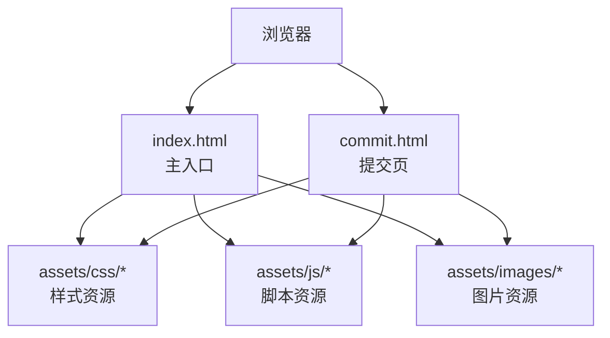
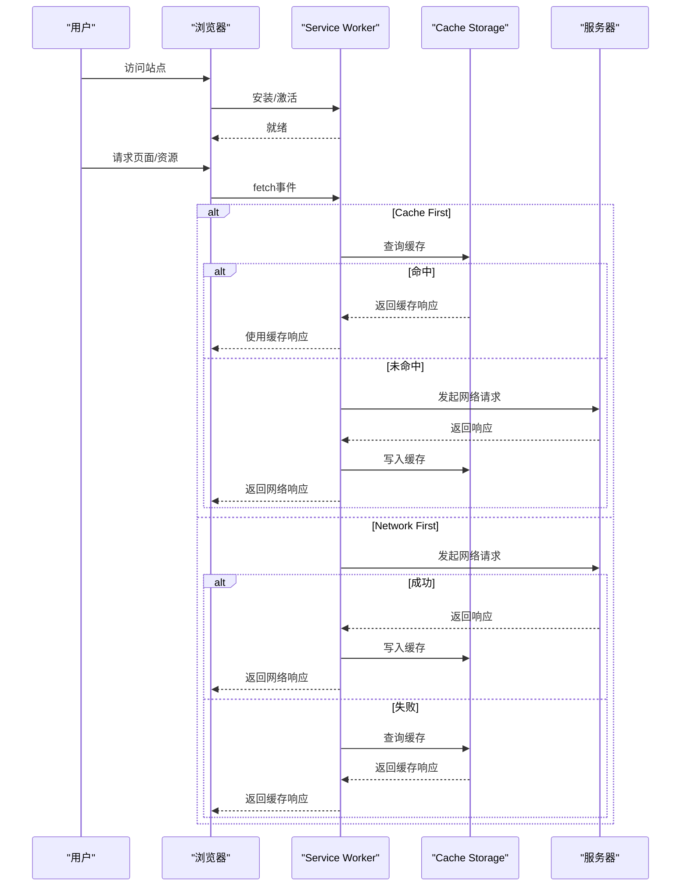
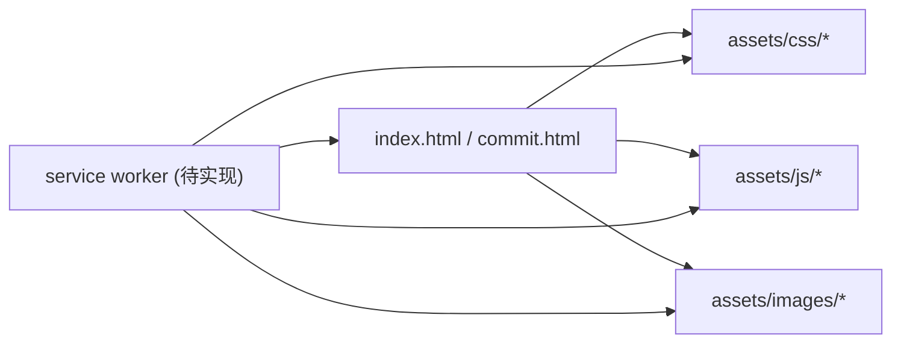

# Service Worker缓存

<cite>
**本文引用的文件**
- [index.html](file://index.html)
- [commit.html](file://commit.html)
- [README.md](file://README.md)
</cite>

## 目录
1. [简介](#简介)
2. [项目结构](#项目结构)
3. [核心组件](#核心组件)
4. [架构总览](#架构总览)
5. [详细组件分析](#详细组件分析)
6. [依赖关系分析](#依赖关系分析)
7. [性能考量](#性能考量)
8. [故障排查指南](#故障排查指南)
9. [结论](#结论)
10. [附录](#附录)

## 简介
本文件面向希望在现代Web应用中引入离线能力的开发者，系统讲解Service Worker的缓存机制与最佳实践。内容覆盖：
- Service Worker生命周期管理（注册、激活、更新）
- 常见缓存策略模式（Cache First、Network First、Stale While Revalidate等）及其适用场景
- 缓存版本管理与更新机制，确保应用升级时缓存正确替换
- 离线访问支持的具体实现思路（页面、API数据、静态资源）
- 完整的代码示例路径指引与调试方法

本项目为纯静态站点，当前仓库未包含Service Worker脚本。本文基于项目结构与部署说明，给出可直接落地的集成方案与落地步骤，帮助你在现有站点上快速启用离线能力。

## 项目结构
- 入口页面：index.html、commit.html
- 静态资源：assets/css、assets/js、assets/images、assets/fontawesome-5.15.4
- 文档与配置：README.md（含Nginx/Vercel/Cloudflare Pages等部署说明）

**图表来源**
- [index.html:1-35](file://index.html#L1-L35)
- [commit.html:1-30](file://commit.html#L1-L30)

**章节来源**
- [index.html:1-35](file://index.html#L1-L35)
- [commit.html:1-30](file://commit.html#L1-L30)
- [README.md:298-314](file://README.md#L298-L314)

## 核心组件
- 服务工作者（Service Worker）：后台线程，拦截网络请求并决定从缓存或网络获取资源，实现离线可用与按需更新。
- 缓存存储（Cache Storage）：键值对形式的缓存容器，用于持久化响应对象。
- 应用壳（App Shell）：最小化的HTML/CSS/JS骨架，保证首屏快速渲染与离线可访问。
- 版本管理：通过版本号或哈希标识区分不同构建产物，配合SW实现灰度/回滚。

在本项目中，建议将以下资源纳入缓存：
- 页面：index.html、commit.html、about/index.html、404.html
- 静态资源：assets下的CSS/JS/图片/字体
- API：可选，根据业务决定是否缓存接口响应（如天气、一言等）

**章节来源**
- [index.html:17-31](file://index.html#L17-L31)
- [commit.html:15-25](file://commit.html#L15-L25)
- [README.md:96-115](file://README.md#L96-L115)

## 架构总览
下图展示浏览器、Service Worker、缓存与服务器之间的交互流程，以及关键事件与策略选择点。

**图表来源**
- [index.html:17-31](file://index.html#L17-L31)
- [commit.html:15-25](file://commit.html#L15-L25)
- [README.md:96-115](file://README.md#L96-L115)

## 详细组件分析

### Service Worker生命周期管理
- 注册：在页面加载后注册SW，通常放在入口页面的末尾或DOMContentLoaded事件中。
- 安装：下载并预缓存关键资源（App Shell），提升首屏速度。
- 激活：清理旧版本缓存，确保新版本的缓存生效。
- 更新：当SW脚本或受控资源发生变化时，触发新的安装/激活流程，实现平滑更新。

建议：
- 在index.html中注册SW，并在SW中监听install/activate/fetch事件。
- 使用版本号或时间戳作为缓存命名空间，避免缓存污染。
- 在activate阶段删除旧版本缓存，确保更新一致性。

**章节来源**
- [index.html:1-35](file://index.html#L1-L35)
- [README.md:96-115](file://README.md#L96-L115)

### 缓存策略模式与实现要点
- Cache First（优先缓存）
  - 适用：静态资源（CSS/JS/图片/字体）、不常变化的页面
  - 优点：速度快、离线可用；缺点：可能返回过期内容
  - 实现：先查缓存，命中则直接返回；未命中再请求网络并回填缓存
- Network First（优先网络）
  - 适用：动态数据（API）、需要最新数据的页面
  - 优点：数据新鲜；缺点：离线不可用
  - 实现：先请求网络，成功则写缓存并返回；失败则回退到缓存
- Stale While Revalidate（陈旧同时重新验证）
  - 适用：既需快速又需更新的资源（如首页、列表页）
  - 实现：立即返回缓存（如有），同时在后台请求网络并更新缓存

结合本项目：
- 静态资源采用Cache First
- 页面采用Stale While Revalidate或Network First（视业务需求）
- API数据采用Network First（必要时加缓存TTL）

**章节来源**
- [index.html:17-31](file://index.html#L17-L31)
- [commit.html:15-25](file://commit.html#L15-L25)
- [README.md:96-115](file://README.md#L96-L115)

### 缓存版本管理与更新机制
- 版本命名：为每个构建产物分配唯一版本号或哈希（例如v1.2.3或带hash的文件名）
- 预缓存清单：在SW安装阶段拉取并缓存关键资源清单
- 差异更新：比较新旧清单，仅更新变更的资源
- 清理旧缓存：在activate阶段删除旧版本缓存，释放空间

建议：
- 在构建阶段生成资源清单（manifest.json）
- SW安装时读取清单并预缓存
- activate时按版本清理历史缓存

**章节来源**
- [README.md:96-115](file://README.md#L96-L115)

### 离线访问支持的具体实现
- 页面缓存：将index.html、commit.html、about/index.html、404.html加入缓存
- API数据缓存：对只读接口采用Network First+缓存，或Cache First（短TTL）
- 静态资源缓存：CSS/JS/图片/字体统一Cache First
- 错误兜底：网络失败时返回404.html或离线提示页

注意：
- 对于第三方CDN资源，谨慎缓存，避免跨域与版本不一致问题
- 敏感数据不建议缓存

**章节来源**
- [index.html:17-31](file://index.html#L17-L31)
- [commit.html:15-25](file://commit.html#L15-L25)
- [README.md:96-115](file://README.md#L96-L115)

### 完整代码示例与调试方法
- 代码示例位置（建议新建sw.js并在index.html中注册）
  - 注册SW：在index.html末尾添加注册逻辑
  - SW脚本：创建sw.js，实现install/activate/fetch事件处理
  - 预缓存清单：定义静态资源与页面清单
- 调试方法
  - 浏览器开发者工具 -> Application -> Service Workers，查看状态与日志
  - 使用Cache Storage面板检查缓存条目与响应体
  - 模拟离线环境测试离线可用性
  - 通过强制刷新与服务端更新验证更新流程

由于当前仓库未包含SW脚本，建议在本地新增sw.js并按上述策略实现，然后在index.html中注册。

**章节来源**
- [index.html:1-35](file://index.html#L1-L35)
- [README.md:96-115](file://README.md#L96-L115)

## 依赖关系分析
- 页面依赖静态资源（CSS/JS/图片/字体）
- Service Worker依赖页面与静态资源的URL映射
- 部署平台（Nginx/Vercel/Cloudflare Pages）提供HTTP头控制（如Cache-Control）以配合SW策略

**图表来源**
- [index.html:17-31](file://index.html#L17-L31)
- [commit.html:15-25](file://commit.html#L15-L25)

**章节来源**
- [index.html:17-31](file://index.html#L17-L31)
- [commit.html:15-25](file://commit.html#L15-L25)
- [README.md:96-115](file://README.md#L96-L115)

## 性能考量
- 预缓存关键资源，减少首屏加载时间
- 合理设置缓存策略，平衡速度与新鲜度
- 使用版本化文件名与长缓存头，降低重复传输
- 按需加载与懒加载图片，减少初始体积
- 利用服务端压缩（Gzip/Brotli）与CDN加速

**章节来源**
- [README.md:96-115](file://README.md#L96-L115)

## 故障排查指南
- 常见问题
  - SW未生效：检查是否HTTPS、是否正确注册、是否在根路径下
  - 缓存不更新：确认版本号/文件名变化、清除旧缓存、检查activate逻辑
  - 离线不可用：确认预缓存清单是否完整、404兜底页是否缓存
- 定位方法
  - 使用Application面板查看SW状态、缓存内容与网络拦截
  - 打开控制台查看fetch事件拦截与错误信息
  - 模拟网络异常验证降级逻辑

**章节来源**
- [README.md:96-115](file://README.md#L96-L115)

## 结论
通过引入Service Worker并结合合适的缓存策略，可以为该静态站点提供稳定的离线体验与更快的首屏加载。建议在现有项目结构中新增sw.js并在index.html中注册，按照“静态资源Cache First、页面Stale While Revalidate、API Network First”的原则实施，并通过版本化与激活清理保障更新一致性。

[无章节来源]

## 附录
- 部署参考：README中提供了Nginx/Vercel/Cloudflare Pages的部署与缓存头配置示例，可作为服务端缓存策略的补充
- 资源清单：建议构建阶段生成资源清单，便于SW预缓存与版本管理

**章节来源**
- [README.md:96-115](file://README.md#L96-L115)