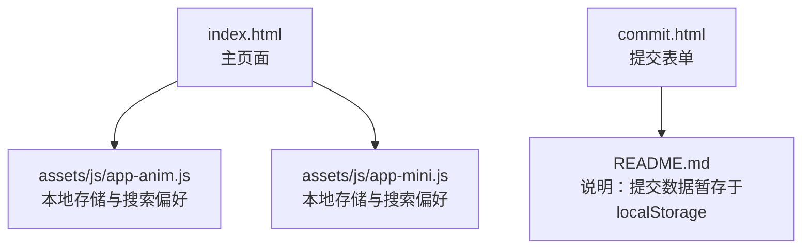
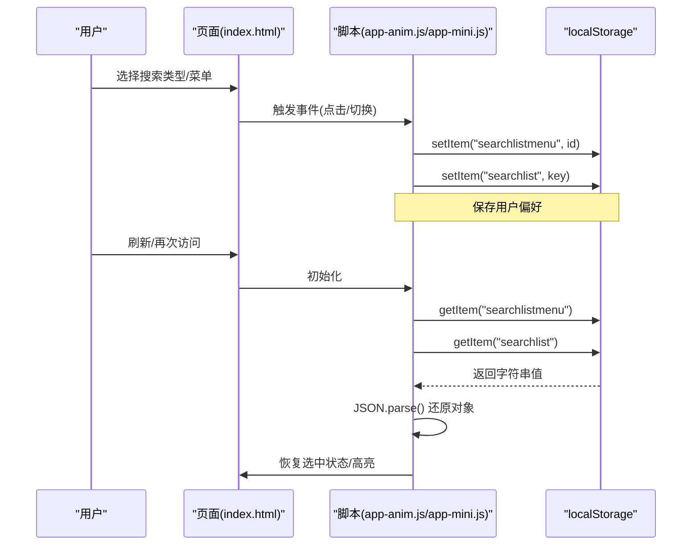
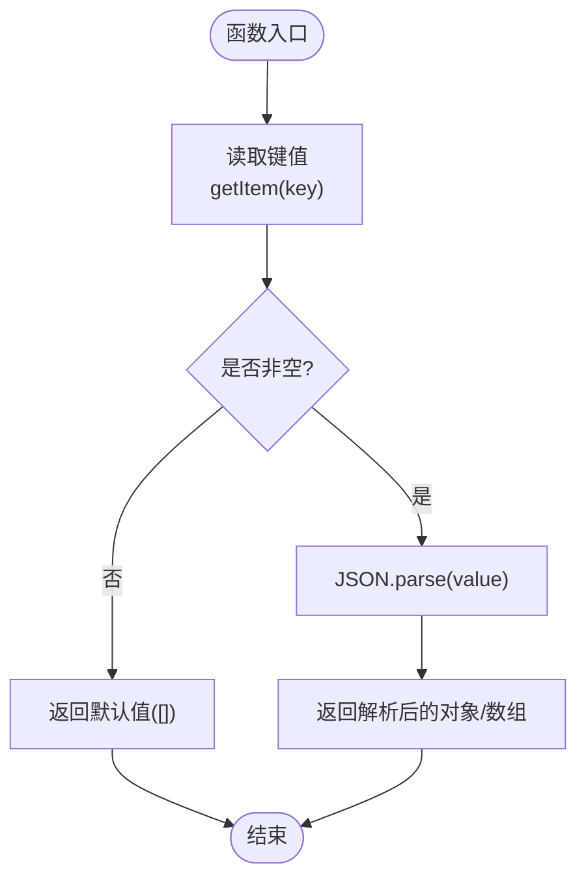
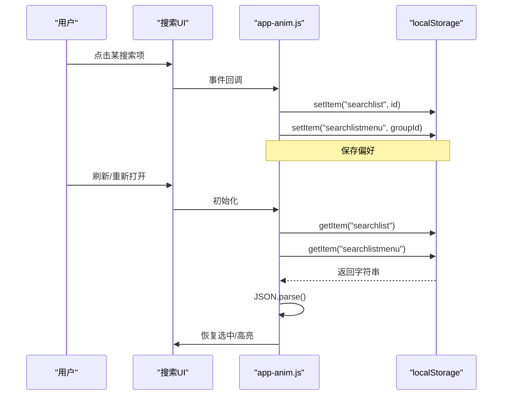
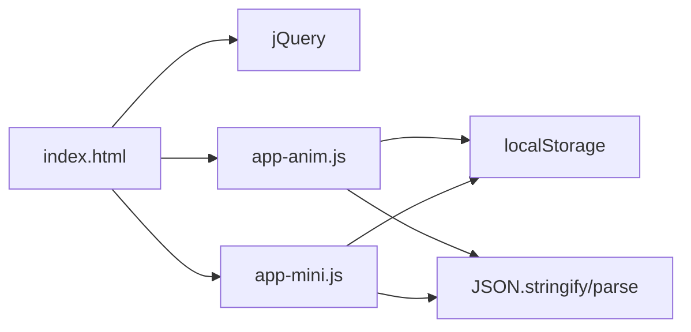

# 应用级缓存存储

<cite>
**本文引用的文件**
- [index.html](file://index.html)
- [README.md](file://README.md)
- [commit.html](file://commit.html)
- [assets/js/app-anim.js](file://assets/js/app-anim.js)
- [assets/js/app-mini.js](file://assets/js/app-mini.js)
</cite>

## 目录
1. [引言](#引言)
2. [项目结构](#项目结构)
3. [核心组件](#核心组件)
4. [架构总览](#架构总览)
5. [详细组件分析](#详细组件分析)
6. [依赖关系分析](#依赖关系分析)
7. [性能考量](#性能考量)
8. [故障排查指南](#故障排查指南)
9. [结论](#结论)
10. [附录](#附录)

## 引言
本文件围绕“应用级缓存存储”的主题，结合仓库中的实际实现与文档说明，系统梳理前端数据存储方案：包括 localStorage/sessionStorage 的使用与差异、IndexedDB 的高级用法、Cookie 的限制与替代方案、Web Storage 最佳实践、数据序列化/反序列化处理，以及基于本项目实践的代码示例路径与性能对比建议。目标是帮助开发者在真实项目中选择合适的存储方案并正确落地。

## 项目结构
该仓库是一个纯静态的网址导航站点，主要使用 HTML/CSS/JavaScript（jQuery）构建，部分功能通过浏览器本地存储实现用户偏好与临时数据的持久化。关键结构与职责如下：
- index.html：主页面，包含导航、搜索等 UI 与交互逻辑入口。
- commit.html：网站提交页，提供表单与校验逻辑。
- assets/js/app-anim.js / app-mini.js：核心业务脚本，封装了本地存储读写、搜索偏好保存、列表管理等逻辑。
- README.md：项目说明与常见问题，其中明确提到“目前提交功能将数据保存在浏览器 localStorage 中”。

图表来源
- [index.html:1-120](file://index.html#L1-L120)
- [assets/js/app-anim.js:590-610](file://assets/js/app-anim.js#L590-L610)
- [assets/js/app-anim.js:810-850](file://assets/js/app-anim.js#L810-L850)
- [commit.html:285-382](file://commit.html#L285-L382)
- [README.md:316-328](file://README.md#L316-L328)

章节来源
- [index.html:1-120](file://index.html#L1-L120)
- [README.md:298-314](file://README.md#L298-L314)

## 核心组件
- 本地存储封装与使用
  - 读取与写入：通过 getItem/setItem 对 JSON 数据进行序列化/反序列化，用于保存“我的链接”、“实时列表”、“搜索类型选择”等用户偏好。
  - 典型键名：myLinks、livelists、searchlist、searchlistmenu。
- 搜索模块
  - 根据用户选择的搜索引擎或分类，将当前选择保存到 localStorage，并在下次进入时恢复选中状态。
- 提交页
  - 表单校验与收集数据；README 指出“目前提交功能将数据保存在浏览器 localStorage 中”，可作为后续接入后端前的过渡方案。

章节来源
- [assets/js/app-anim.js:590-610](file://assets/js/app-anim.js#L590-L610)
- [assets/js/app-anim.js:810-850](file://assets/js/app-anim.js#L810-L850)
- [assets/js/app-mini.js:590-610](file://assets/js/app-mini.js#L590-L610)
- [assets/js/app-mini.js:810-850](file://assets/js/app-mini.js#L810-L850)
- [README.md:316-328](file://README.md#L316-L328)

## 架构总览
从“用户操作 → 本地存储 → 界面恢复”的角度，整体流程如下：

图表来源
- [assets/js/app-anim.js:810-850](file://assets/js/app-anim.js#L810-L850)
- [assets/js/app-mini.js:810-850](file://assets/js/app-mini.js#L810-L850)

## 详细组件分析

### 组件A：本地存储封装与使用（app-anim.js / app-mini.js）
- 设计要点
  - 统一封装 getItem/setItem，内部完成 JSON.stringify/JSON.parse，避免重复处理。
  - 针对不同类型的数据使用不同键名，便于隔离与扩展。
- 复杂度与影响
  - 时间复杂度：setItem/getItem 为 O(1)，但 JSON 序列化/反序列化与 DOM 更新会随数据规模增长而增加开销。
  - 空间限制：受限于浏览器配额（通常约 5-10MB），需关注大对象序列化成本。
- 错误处理
  - 读取空值时返回默认空数组，避免上层逻辑崩溃。
  - 建议在异常捕获处增加降级策略（如清理损坏数据）。

图表来源
- [assets/js/app-anim.js:590-610](file://assets/js/app-anim.js#L590-L610)
- [assets/js/app-mini.js:590-610](file://assets/js/app-mini.js#L590-L610)

章节来源
- [assets/js/app-anim.js:590-610](file://assets/js/app-anim.js#L590-L610)
- [assets/js/app-mini.js:590-610](file://assets/js/app-mini.js#L590-L610)

### 组件B：搜索偏好持久化（app-anim.js / app-mini.js）
- 行为说明
  - 用户切换搜索类型或分组时，将当前选择写入 localStorage。
  - 页面初始化时读取并恢复选中状态，提升用户体验。
- 关键点
  - 键名约定：searchlistmenu（分组）、searchlist（具体搜索项）。
  - 同步 UI：设置 action、placeholder、zhannei 标志等。

图表来源
- [assets/js/app-anim.js:810-850](file://assets/js/app-anim.js#L810-L850)
- [assets/js/app-mini.js:810-850](file://assets/js/app-mini.js#L810-L850)

章节来源
- [assets/js/app-anim.js:810-850](file://assets/js/app-anim.js#L810-L850)
- [assets/js/app-mini.js:810-850](file://assets/js/app-mini.js#L810-L850)

### 组件C：提交页与数据落盘（commit.html + README.md）
- 现状说明
  - 提交页提供表单与校验逻辑，README 明确指出“目前提交功能将数据保存在浏览器 localStorage 中”，作为无后端时的过渡方案。
- 演进建议
  - 短期：继续使用 localStorage 暂存待提交数据，支持离线编辑与重试。
  - 中期：引入服务端 API（如 Vercel Serverless Functions）进行持久化与审核。
  - 长期：结合 IndexedDB 做更复杂的数据管理与离线能力。

章节来源
- [commit.html:285-382](file://commit.html#L285-L382)
- [README.md:316-328](file://README.md#L316-L328)

## 依赖关系分析
- 脚本依赖
  - index.html 引入 jQuery 与业务脚本（app-anim.js、app-mini.js 等）。
  - 业务脚本依赖 window.localStorage 与 JSON 全局对象。
- 数据流
  - 用户交互 → 事件处理 → 本地存储读写 → UI 状态恢复。
- 耦合点
  - 键名约定（myLinks、livelists、searchlist、searchlistmenu）在各脚本间共享，需保持一致性。
  - JSON 序列化/反序列化位置集中，便于统一维护与扩展。

图表来源
- [index.html:1-40](file://index.html#L1-L40)
- [assets/js/app-anim.js:590-610](file://assets/js/app-anim.js#L590-L610)
- [assets/js/app-mini.js:590-610](file://assets/js/app-mini.js#L590-L610)

章节来源
- [index.html:1-40](file://index.html#L1-L40)
- [assets/js/app-anim.js:590-610](file://assets/js/app-anim.js#L590-L610)
- [assets/js/app-mini.js:590-610](file://assets/js/app-mini.js#L590-L610)

## 性能考量
- 存储容量与类型限制
  - Web Storage（localStorage/sessionStorage）适合小体积、简单结构的键值对数据；不适合存储大量二进制或复杂嵌套对象。
  - 每次读写都会触发序列化/反序列化，频繁操作可能带来卡顿。
- 跨标签页共享
  - localStorage 在同一源的所有标签页共享；sessionStorage 仅在当前会话（同一标签页）有效。
- 索引与查询
  - Web Storage 不支持索引与复杂查询；如需高级检索，应使用 IndexedDB。
- 推荐优化
  - 批量写入：合并多次更新为一次 setItem。
  - 延迟写入：防抖/节流后再持久化。
  - 数据分片：按功能域拆分键名，降低单次写入体积。
  - 降级策略：当存储空间不足时提示用户清理或切换到 IndexedDB。

[本节为通用指导，不直接分析具体文件]

## 故障排查指南
- 常见现象
  - 页面刷新后搜索偏好未恢复：检查 localStorage 中对应键是否存在且可被 JSON.parse。
  - 添加/删除链接无效：确认 getItem/setItem 调用是否正确，键名是否一致。
- 定位步骤
  - 打开浏览器开发者工具 → Application → Local Storage，查看 myLinks、livelists、searchlist、searchlistmenu 的值。
  - 在控制台执行 JSON.parse(localStorage.getItem('key')) 验证数据格式。
  - 若出现 SyntaxError，可能是数据损坏，尝试清空对应键后重试。
- 改进建议
  - 在 setItem 前增加 try/catch，捕获异常并记录日志。
  - 提供“重置偏好”按钮，快速恢复默认状态。

章节来源
- [assets/js/app-anim.js:590-610](file://assets/js/app-anim.js#L590-L610)
- [assets/js/app-anim.js:810-850](file://assets/js/app-anim.js#L810-L850)

## 结论
本项目已采用 Web Storage 实现了用户偏好与轻量数据的持久化，具备简单、易用的特点。对于更大体量、更复杂的场景，建议逐步引入 IndexedDB，以获得更好的查询、事务与容量支持。同时，遵循统一的键名规范、完善的序列化/反序列化封装与错误处理，能显著提升稳定性与维护性。

[本节为总结，不直接分析具体文件]

## 附录

### 技术方案对比与建议
- localStorage vs sessionStorage
  - 生命周期：localStorage 永久（除非手动清除），sessionStorage 随标签页关闭而销毁。
  - 共享范围：localStorage 同源所有标签页共享；sessionStorage 仅当前标签页。
  - 适用场景：
    - localStorage：用户偏好、主题、搜索历史等跨会话数据。
    - sessionStorage：一次性任务的状态（如向导步骤、临时表单草稿）。
- IndexedDB
  - 优势：大容量、结构化数据、索引与游标、事务支持。
  - 适用场景：离线应用、复杂查询、大数据集管理。
- Cookie
  - 限制：体积小（约 4KB）、每次请求携带、安全性较弱。
  - 替代方案：优先使用 Web Storage；必要时用 HttpOnly Cookie 存放令牌。
- 最佳实践
  - 统一封装：集中处理序列化/反序列化与异常。
  - 键名规范：按功能域划分，避免冲突。
  - 容量监控：检测 quotaExceeded 并提示用户。
  - 渐进增强：先 Web Storage，再 IndexedDB，最后考虑服务端同步。

[本节为通用指导，不直接分析具体文件]

### 代码示例路径（参考）
- 本地存储封装与使用
  - 读取/写入封装：[assets/js/app-anim.js:590-610](file://assets/js/app-anim.js#L590-L610)、[assets/js/app-mini.js:590-610](file://assets/js/app-mini.js#L590-L610)
  - 搜索偏好保存与恢复：[assets/js/app-anim.js:810-850](file://assets/js/app-anim.js#L810-L850)、[assets/js/app-mini.js:810-850](file://assets/js/app-mini.js#L810-L850)
- 提交页与说明
  - 提交页表单与校验：[commit.html:285-382](file://commit.html#L285-L382)
  - 说明“提交数据暂存于 localStorage”：[README.md:316-328](file://README.md#L316-L328)