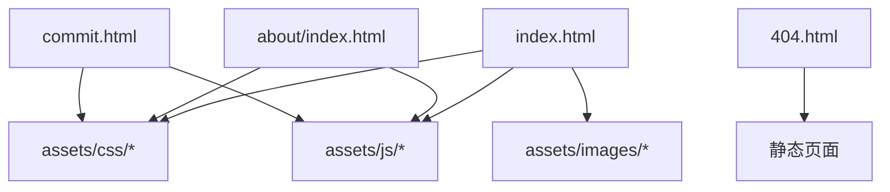
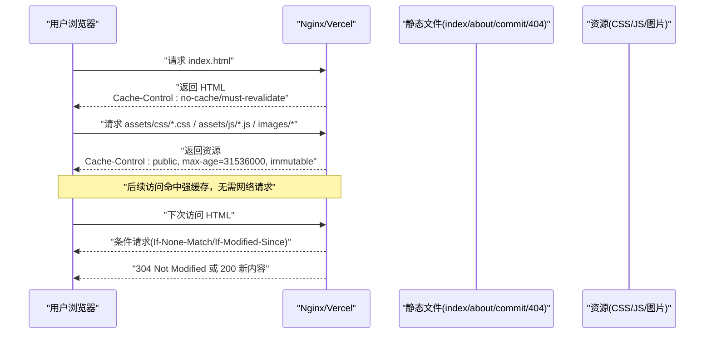
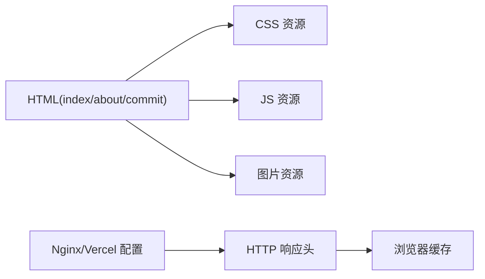

# 浏览器缓存控制

<cite>
**本文引用的文件**
- [index.html](file://index.html)
- [about/index.html](file://about/index.html)
- [commit.html](file://commit.html)
- [404.html](file://404.html)
- [README.md](file://README.md)
- [Readme-en.md](file://Readme-en.md)
</cite>

## 目录
1. [简介](#简介)
2. [项目结构](#项目结构)
3. [核心组件](#核心组件)
4. [架构总览](#架构总览)
5. [详细组件分析](#详细组件分析)
6. [依赖关系分析](#依赖关系分析)
7. [性能考量](#性能考量)
8. [故障排查指南](#故障排查指南)
9. [结论](#结论)
10. [附录](#附录)

## 简介
本文件围绕本项目（纯静态网站）的浏览器缓存控制进行系统化说明，涵盖：
- HTTP 缓存机制在本项目中的落地方式与最佳实践
- Cache-Control 指令（max-age、no-cache、no-store 等）的使用场景与配置建议
- ETag 与 Last-Modified 的工作原理及智能缓存验证方法
- 不同资源类型（HTML、CSS/JS、图片）的差异化缓存策略
- 服务器端缓存头设置示例（Nginx、Apache），以及 Vercel 等平台配置参考
- 缓存失效策略与版本管理方案，帮助构建高效稳定的浏览器缓存体系

## 项目结构
本项目为纯静态站点，包含首页、关于页、提交页和错误页，所有样式与脚本位于 assets 目录下。部署文档提供了 Nginx 与 Vercel 的缓存相关配置片段，可作为生产环境缓存策略的基础。

图表来源
- [index.html:1-35](file://index.html#L1-L35)
- [about/index.html:1-30](file://about/index.html#L1-L30)
- [commit.html:1-30](file://commit.html#L1-L30)
- [404.html:1-3](file://404.html#L1-L3)

章节来源
- [index.html:1-35](file://index.html#L1-L35)
- [about/index.html:1-30](file://about/index.html#L1-L30)
- [commit.html:1-30](file://commit.html#L1-L30)
- [404.html:1-3](file://404.html#L1-L3)

## 核心组件
- HTML 入口与资源引用：index.html、about/index.html、commit.html 引用了 CSS/JS/图片等资源，是缓存策略落地的关键位置。
- 部署与缓存配置：README.md 与 Readme-en.md 提供了 Nginx 静态资源缓存配置片段，以及 Vercel 的 headers 配置示例，用于在生产环境启用强缓存与不可变缓存。
- 错误页：404.html 作为静态错误页，通常不缓存或短缓存，便于快速修复与更新。

章节来源
- [index.html:17-31](file://index.html#L17-L31)
- [about/index.html:15-25](file://about/index.html#L15-L25)
- [commit.html:15-25](file://commit.html#L15-L25)
- [README.md:86-116](file://README.md#L86-L116)
- [Readme-en.md:86-116](file://Readme-en.md#L86-L116)

## 架构总览
下图展示了浏览器请求到服务端响应并应用缓存头的整体流程，结合本项目在 Nginx/Vercel 上的缓存策略。

图表来源
- [README.md:86-116](file://README.md#L86-L116)
- [Readme-en.md:86-116](file://Readme-en.md#L86-L116)

## 详细组件分析

### HTML 页面的缓存策略
- 目标：确保用户始终获取最新页面，避免陈旧 HTML 导致功能异常。
- 建议：
  - 对 HTML 使用较短的 max-age 或 no-cache + must-revalidate，配合 ETag/Last-Modified 实现条件请求，减少带宽同时保证新鲜度。
  - 在 Nginx 中可通过 location 匹配 .html 并设置合适的 Cache-Control；或在平台（如 Vercel）通过 headers 规则覆盖默认行为。
- 本项目现状：
  - README.md 与 Readme-en.md 提供了 Nginx 静态资源缓存配置，未直接给出 HTML 的缓存头设置，可在该基础上补充 HTML 的条件缓存策略。

章节来源
- [README.md:86-116](file://README.md#L86-L116)
- [Readme-en.md:86-116](file://Readme-en.md#L86-L116)

### CSS/JS 文件的强缓存与不可变缓存
- 目标：利用文件名哈希或版本号，使资源可长期强缓存且“不可变”，提升加载性能。
- 建议：
  - 对 CSS/JS 使用 public + max-age=31536000 + immutable，确保浏览器在一年内直接使用本地副本，除非 URL 变化。
  - 若无法添加文件名哈希，可使用 ETag/Last-Modified 进行条件请求，但性能不如不可变强缓存。
- 本项目现状：
  - README.md 与 Readme-en.md 已提供 Nginx 静态资源缓存配置，对常见扩展名（含 css、js）设置 expires 与 Cache-Control "public, immutable"，符合最佳实践。

章节来源
- [README.md:104-108](file://README.md#L104-L108)
- [Readme-en.md:104-108](file://Readme-en.md#L104-L108)

### 图片资源的缓存策略
- 目标：图片通常为静态资源，适合长缓存；动态图或频繁更新的图片需更谨慎。
- 建议：
  - 对 jpg/png/gif/ico/svg/webp 等设置 long-lived 强缓存（如一年），并结合文件名哈希或 CDN 版本化。
  - 对于需要即时更新的图片，可采用 no-cache + ETag 或短 max-age。
- 本项目现状：
  - README.md 与 Readme-en.md 的 Nginx 配置已覆盖常见图片扩展名，启用强缓存与不可变策略。

章节来源
- [README.md:104-108](file://README.md#L104-L108)
- [Readme-en.md:104-108](file://Readme-en.md#L104-L108)

### 404 错误页的缓存策略
- 目标：确保 404 页面能快速更新，避免用户看到过时的错误提示。
- 建议：
  - 对 404.html 使用 no-cache 或极短的 max-age，必要时强制 revalidate。
- 本项目现状：
  - 404.html 为静态页面，建议在 Nginx 或平台层为其单独设置较短缓存或 no-cache。

章节来源
- [404.html:1-3](file://404.html#L1-L3)

### Cache-Control 指令详解与应用
- max-age：指定资源在浏览器缓存中的最大有效时间（秒）。适用于静态资源（CSS/JS/图片）的长缓存。
- no-cache：每次使用前必须向服务器验证（条件请求），适合 HTML 等易变内容。
- no-store：禁止任何缓存，适合敏感数据或绝对需要最新内容的场景（一般不用于静态资源）。
- immutable：告知浏览器即使资源未过期也不应重新验证，常用于带版本化的静态资源。
- 本项目应用：
  - README.md 与 Readme-en.md 中的 Nginx 配置对静态资源启用了 public + immutable，符合现代前端工程化实践。

章节来源
- [README.md:104-108](file://README.md#L104-L108)
- [Readme-en.md:104-108](file://Readme-en.md#L104-L108)

### ETag 与 Last-Modified 的智能验证
- 工作原理：
  - Last-Modified：服务器记录资源最后修改时间，客户端下次请求携带 If-Modified-Since，服务器比较后返回 304 或不修改则返回 200。
  - ETag：服务器生成资源唯一标识（如基于内容哈希），客户端下次请求携带 If-None-Match，服务器比较后返回 304 或 200。
- 适用场景：
  - HTML 等易变内容推荐使用 ETag/Last-Modified 进行条件请求，兼顾新鲜度与带宽节省。
  - 静态资源建议使用不可变强缓存（immutable），避免条件请求开销。
- 本项目现状：
  - README.md 与 Readme-en.md 未显式设置 ETag/Last-Modified，但多数服务器默认开启 ETag；可按需在 Nginx/Vercel 中调整。

章节来源
- [README.md:86-116](file://README.md#L86-L116)
- [Readme-en.md:86-116](file://Readme-en.md#L86-L116)

### 不同资源类型的差异化缓存配置
- HTML：no-cache 或短 max-age + must-revalidate，配合 ETag/Last-Modified。
- CSS/JS：public + max-age=31536000 + immutable，结合文件名哈希或版本参数。
- 图片：长缓存（一年）+ immutable，动态图片按需缩短或 no-cache。
- 字体（woff/woff2/ttf/eot）：同图片策略，长缓存 + immutable。
- 本项目现状：
  - README.md 与 Readme-en.md 的 Nginx 配置已覆盖上述主要类型，可直接复用。

章节来源
- [README.md:104-108](file://README.md#L104-L108)
- [Readme-en.md:104-108](file://Readme-en.md#L104-L108)

### 服务器配置示例（Nginx/Apache/Vercel）
- Nginx：
  - 对静态资源启用 expires 与 Cache-Control "public, immutable"，已在 README.md 与 Readme-en.md 提供。
  - 可对 HTML 单独设置 no-cache 或短 max-age。
- Apache：
  - 使用 ExpiresActive On 与 Header set Cache-Control 实现类似策略。
- Vercel：
  - 通过 vercel.json 的 headers 字段对不同路径设置不同的 Cache-Control，README 英文版提供了示例片段。

章节来源
- [README.md:86-116](file://README.md#L86-L116)
- [Readme-en.md:86-116](file://Readme-en.md#L86-L116)
- [Readme-en.md:217-251](file://Readme-en.md#L217-L251)

### 缓存失效策略与版本管理
- 文件名哈希/版本号：将 CSS/JS 文件名加入哈希（如 app-v1.2.3.js），变更时 URL 变化触发新缓存。
- 查询参数版本：在资源 URL 后追加 ?v=版本号，注意部分代理可能忽略查询参数，优先使用文件名哈希。
- 发布流水线：构建阶段自动生成带哈希的资源名，并在 HTML 中引用新版本。
- 本项目现状：
  - 当前资源文件名已包含版本号（如 bootstrap.min-4.3.1.css），有利于缓存失效；建议在构建流程中持续维护版本命名规范。

章节来源
- [index.html:17-31](file://index.html#L17-L31)
- [about/index.html:15-25](file://about/index.html#L15-L25)
- [commit.html:15-25](file://commit.html#L15-L25)

## 依赖关系分析
- HTML 页面依赖 CSS/JS/图片资源，这些资源通过相对路径引用，缓存策略直接影响首屏加载与后续访问性能。
- 部署配置（Nginx/Vercel）决定响应头，进而影响浏览器缓存行为。
- 404 页面作为兜底，应避免长缓存以确保错误信息及时更新。

图表来源
- [index.html:17-31](file://index.html#L17-L31)
- [README.md:86-116](file://README.md#L86-L116)
- [Readme-en.md:86-116](file://Readme-en.md#L86-L116)

## 性能考量
- 强缓存（immutable）能显著降低重复访问的网络请求，提高性能。
- 条件缓存（ETag/Last-Modified）在 HTML 等易变内容上平衡带宽与新鲜度。
- 合理区分资源类型与缓存策略，避免过度缓存导致更新延迟或缓存不足导致性能下降。
- 建议结合 CDN 与压缩（gzip/brotli）进一步提升性能。

## 故障排查指南
- 问题：HTML 未更新
  - 检查是否对 HTML 设置了过长的 max-age 或未启用 must-revalidate。
  - 确认服务器是否正确返回 304 或 200 新内容。
- 问题：CSS/JS 未生效
  - 检查文件名是否变更（哈希/版本），URL 是否指向新版本。
  - 确认浏览器是否命中强缓存（开发者工具 Network 查看 From disk cache）。
- 问题：图片未更新
  - 对动态图片采用短缓存或 no-cache；对静态图片使用长缓存 + 文件名哈希。
- 问题：404 页面显示旧内容
  - 为 404.html 设置较短缓存或 no-cache，确保快速更新。

章节来源
- [404.html:1-3](file://404.html#L1-L3)
- [README.md:86-116](file://README.md#L86-L116)
- [Readme-en.md:86-116](file://Readme-en.md#L86-L116)

## 结论
本项目为纯静态站点，已通过 README 提供的 Nginx 配置对静态资源启用强缓存与不可变策略，符合现代前端工程化实践。建议在此基础上：
- 对 HTML 启用 no-cache 或短 max-age + must-revalidate，并配合 ETag/Last-Modified 进行条件请求。
- 对 CSS/JS/图片使用文件名哈希或版本化，确保缓存失效可控。
- 根据资源类型差异化配置缓存头，平衡性能与更新及时性。
- 在生产环境（Nginx/Vercel）统一配置缓存策略，确保一致性与可维护性。

## 附录
- 常用 Cache-Control 指令速查：
  - max-age：资源在浏览器缓存中的最大有效时间（秒）。
  - no-cache：每次使用前必须向服务器验证。
  - no-store：禁止任何缓存。
  - immutable：资源未过期也不重新验证。
- 推荐实践：
  - HTML：no-cache 或短 max-age + must-revalidate。
  - CSS/JS：public + max-age=31536000 + immutable。
  - 图片：长缓存 + immutable，动态图片按需缩短或 no-cache。
  - 404：短缓存或 no-cache。