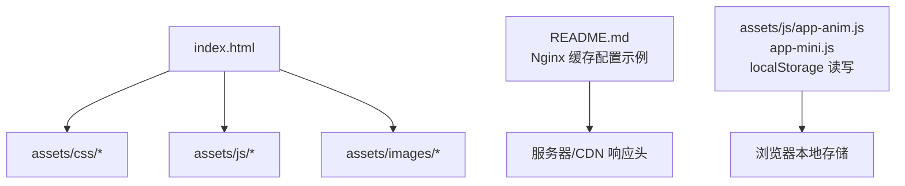
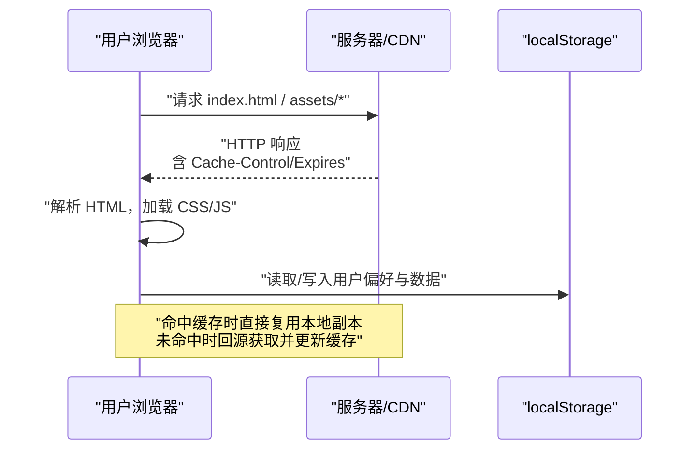
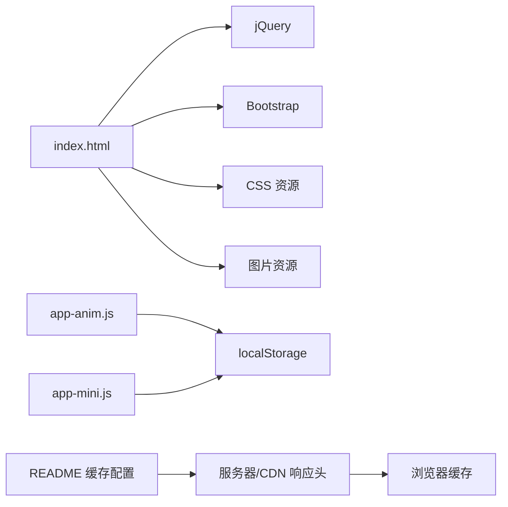

# 缓存策略配置

<cite>
**本文引用的文件**
- [index.html](file://index.html)
- [README.md](file://README.md)
- [Readme-en.md](file://Readme-en.md)
- [assets/js/app-anim.js](file://assets/js/app-anim.js)
- [assets/js/app-mini.js](file://assets/js/app-mini.js)
</cite>

## 目录
1. [简介](#简介)
2. [项目结构](#项目结构)
3. [核心组件](#核心组件)
4. [架构总览](#架构总览)
5. [详细组件分析](#详细组件分析)
6. [依赖关系分析](#依赖关系分析)
7. [性能考量](#性能考量)
8. [故障排查指南](#故障排查指南)
9. [结论](#结论)
10. [附录：配置示例与测试方法](#附录：配置示例与测试方法)

## 简介
本文件围绕该静态导航站点的缓存优化方案，系统梳理浏览器缓存控制、CDN 缓存策略、Service Worker 机制与应用级缓存（localStorage）的使用现状，并给出可操作的配置建议与性能测试方法。项目为纯静态站点，前端资源通过 HTML/CSS/JS 引入，服务端部署文档提供了 Nginx 的缓存头设置示例，便于在服务器或 CDN 层统一生效。

## 项目结构
- 入口页面 index.html 引入 CSS/JS 等静态资源，未内联任何缓存控制逻辑。
- README 提供 Nginx 静态资源缓存配置示例，包含 expires 与 Cache-Control 指令。
- 应用逻辑中广泛使用 localStorage 存储用户偏好与数据，体现应用级缓存能力。
- 未发现 Service Worker 注册代码与 IndexedDB 使用。

图表来源
- [index.html:1-35](file://index.html#L1-L35)
- [README.md:88-116](file://README.md#L88-L116)
- [assets/js/app-anim.js:599-605](file://assets/js/app-anim.js#L599-L605)
- [assets/js/app-mini.js:594-600](file://assets/js/app-mini.js#L594-L600)

章节来源
- [index.html:1-35](file://index.html#L1-L35)
- [README.md:88-116](file://README.md#L88-L116)

## 核心组件
- 浏览器缓存控制：通过服务端响应头（如 Cache-Control、Expires）控制浏览器对静态资源的缓存行为；本项目在 README 中提供了 Nginx 示例。
- CDN 缓存策略：将静态资源部署到 CDN，结合版本化文件名与不可变缓存头，实现高效边缘缓存与快速失效。
- Service Worker 缓存机制：当前仓库未包含 SW 注册与缓存策略代码，可作为后续增强离线体验的方向。
- 应用级缓存：已使用 localStorage 持久化用户选择与数据，具备会话/偏好记忆能力。

章节来源
- [README.md:88-116](file://README.md#L88-L116)
- [assets/js/app-anim.js:599-605](file://assets/js/app-anim.js#L599-L605)
- [assets/js/app-mini.js:594-600](file://assets/js/app-mini.js#L594-L600)

## 架构总览
下图展示从客户端请求到服务端/CDN 返回资源及浏览器缓存利用的整体流程，并结合应用级缓存的数据流。

图表来源
- [README.md:88-116](file://README.md#L88-L116)
- [assets/js/app-anim.js:599-605](file://assets/js/app-anim.js#L599-L605)
- [assets/js/app-mini.js:594-600](file://assets/js/app-mini.js#L594-L600)

## 详细组件分析

### 浏览器缓存控制（HTTP 缓存头）
- 现状：项目 README 提供了 Nginx 静态资源缓存配置示例，针对图片、样式、脚本等资源设置过期时间与不可变缓存头，利于长期缓存与减少回源。
- 关键点：
  - 使用 expires 与 Cache-Control 组合，确保浏览器与中间代理正确缓存。
  - 对频繁更新的资源建议使用文件名哈希或版本号，配合 immutable 提升缓存命中率与安全性。
  - 对于动态内容或 API，应设置较短的 max-age 与 must-revalidate，保证新鲜度。

章节来源
- [README.md:88-116](file://README.md#L88-L116)

### CDN 缓存策略
- 现状：项目支持多平台部署（GitHub Pages、Vercel、Cloudflare Pages），这些平台通常自带 CDN 能力。可通过平台配置或自定义响应头强化缓存策略。
- 建议实践：
  - 静态资源采用带哈希的文件名（如 app.a1b2c3.js），配合 public, max-age=31536000, immutable 实现长效缓存。
  - 对 HTML 主文档设置较短缓存时间并开启协商缓存（ETag/Last-Modified），以便及时拉取更新。
  - 配置 CDN 缓存键包含查询参数或路径前缀，避免污染其他资源。
  - 发布新版本后，通过文件名变更或 CDN 预取/预热加速冷启动。

章节来源
- [README.md:149-233](file://README.md#L149-L233)

### Service Worker 缓存机制
- 现状：仓库中未发现 service worker 注册与缓存策略代码，因此当前不启用离线访问与智能缓存。
- 建议方向：
  - 注册 SW 并实现“先缓存再网络”或“网络优先”的策略，根据资源类型差异化处理。
  - 使用 Cache Storage 管理版本化的资源集合，发布新包时清理旧缓存。
  - 结合 HTTP 缓存头，SW 仅在必要时回源校验，降低带宽与延迟。

[本节为概念性说明，不涉及具体源码]

### 应用级缓存技术（localStorage）
- 现状：项目在两个主要 JS 文件中大量使用 localStorage 进行数据持久化与用户偏好保存，包括：
  - 用户添加的链接列表与最近点击列表
  - 搜索模块的选择状态与菜单高亮
- 影响：
  - 提升用户体验：无需重复选择，刷新后仍保持状态。
  - 注意容量限制与同步阻塞问题，避免存储过大对象。
  - 如需跨标签页共享或更复杂的数据模型，可考虑 sessionStorage 或 IndexedDB。

章节来源
- [assets/js/app-anim.js:599-605](file://assets/js/app-anim.js#L599-L605)
- [assets/js/app-anim.js:815-850](file://assets/js/app-anim.js#L815-L850)
- [assets/js/app-mini.js:594-600](file://assets/js/app-mini.js#L594-L600)
- [assets/js/app-mini.js:810-840](file://assets/js/app-mini.js#L810-L840)

## 依赖关系分析
- 页面资源依赖：index.html 依赖 assets 下的 CSS/JS/图片，这些资源由服务器/CDN 提供并受缓存头控制。
- 应用逻辑依赖：app-anim.js 与 app-mini.js 依赖 jQuery 与 Bootstrap，同时通过 localStorage 维护状态。
- 部署与缓存：README 中的 Nginx 配置是缓存策略的关键外部依赖，直接影响浏览器与 CDN 的缓存行为。

图表来源
- [index.html:17-31](file://index.html#L17-L31)
- [assets/js/app-anim.js:599-605](file://assets/js/app-anim.js#L599-L605)
- [assets/js/app-mini.js:594-600](file://assets/js/app-mini.js#L594-L600)
- [README.md:88-116](file://README.md#L88-L116)

章节来源
- [index.html:17-31](file://index.html#L17-L31)
- [assets/js/app-anim.js:599-605](file://assets/js/app-anim.js#L599-L605)
- [assets/js/app-mini.js:594-600](file://assets/js/app-mini.js#L594-L600)
- [README.md:88-116](file://README.md#L88-L116)

## 性能考量
- 静态资源长缓存：对 CSS/JS/图片等稳定资源使用 long-lived 缓存（如 30 天或 1 年），并配合文件名哈希与 immutable，最大化命中。
- HTML 短缓存：主文档应设置较短缓存并启用协商缓存，确保功能更新及时生效。
- 压缩与传输：启用 gzip/br 压缩，减少体积；合理合并与拆分 JS/CSS，减少请求数。
- 懒加载与按需加载：图片与第三方脚本可延迟加载，降低首屏压力。
- 缓存一致性：发布新版本时，务必更新引用资源的路径或文件名，避免脏缓存。

[本节提供通用指导，不直接分析具体文件]

## 故障排查指南
- 缓存未命中或资源未更新：
  - 检查服务器/CDN 是否正确设置 Cache-Control/Expires。
  - 确认资源是否采用版本化命名，避免同名覆盖导致缓存污染。
  - 使用浏览器开发者工具的 Network 面板查看响应头与缓存命中情况。
- 用户数据异常：
  - 检查 localStorage 是否被安全策略或存储空间限制拦截。
  - 核对 key 命名与数据结构，避免序列化错误。
- 第三方脚本冲突：
  - 若引入多个图标库或 UI 框架，注意全局变量冲突与加载顺序。

章节来源
- [README.md:88-116](file://README.md#L88-L116)
- [assets/js/app-anim.js:599-605](file://assets/js/app-anim.js#L599-L605)
- [assets/js/app-mini.js:594-600](file://assets/js/app-mini.js#L594-L600)

## 结论
该项目为纯静态站点，已通过 README 提供的 Nginx 配置示例启用基础浏览器缓存；应用层使用 localStorage 实现了用户偏好与数据的本地持久化。建议在部署层（Nginx/CDN）统一实施严格的缓存头策略，并对资源进行版本化管理；如需离线能力与更精细的缓存控制，可引入 Service Worker。整体而言，遵循“静态资源长缓存 + HTML 短缓存 + 版本化命名”的原则，即可显著提升加载速度与用户体验。

[本节为总结性内容，不直接分析具体文件]

## 附录：配置示例与测试方法

### 浏览器缓存控制（HTTP 缓存头）
- 静态资源（CSS/JS/图片）：
  - 建议设置：public, max-age=31536000, immutable
  - 配合文件名哈希，确保更新即新 URL
- HTML 主文档：
  - 建议设置：no-cache 或 short max-age，并启用协商缓存（ETag/Last-Modified）
- 动态接口：
  - 建议设置：no-store 或 short max-age + must-revalidate

章节来源
- [README.md:88-116](file://README.md#L88-L116)

### CDN 缓存策略
- 静态资源：
  - 使用 CDN 缓存公共库与业务资源，设置长缓存与不可变标志
- 缓存失效：
  - 通过文件名哈希或 CDN 路径前缀实现精准失效
- 边缘节点优化：
  - 启用压缩、HTTP/2 与缓存预热，缩短冷启动时间

章节来源
- [README.md:149-233](file://README.md#L149-L233)

### Service Worker 缓存机制（建议）
- 注册 SW 并定义缓存策略：
  - 静态资源：Cache First
  - HTML：Network First 并回退到缓存
  - 接口：Network First 并缓存失败响应
- 缓存更新：
  - 发布新版本时清理旧缓存，仅保留最新集合

[本节为概念性说明，不涉及具体源码]

### 应用级缓存（localStorage）
- 用途：
  - 保存用户选择的搜索分类、菜单状态与自定义链接
- 注意事项：
  - 控制数据大小，避免超过配额
  - 使用 JSON 序列化与容错解析，防止脏数据

章节来源
- [assets/js/app-anim.js:599-605](file://assets/js/app-anim.js#L599-L605)
- [assets/js/app-anim.js:815-850](file://assets/js/app-anim.js#L815-L850)
- [assets/js/app-mini.js:594-600](file://assets/js/app-mini.js#L594-L600)
- [assets/js/app-mini.js:810-840](file://assets/js/app-mini.js#L810-L840)

### 性能测试方法
- 浏览器开发者工具：
  - Network 面板：观察首次加载与缓存命中，检查响应头与耗时
  - Performance 面板：记录关键指标（FCP/LCP/TTI）
- 线上监控：
  - 使用 Web Vitals 或 RUM 采集真实用户性能数据
- 压测与对比：
  - 对比开启/关闭缓存的首屏加载时间，验证优化效果

[本节提供通用测试方法，不直接分析具体文件]