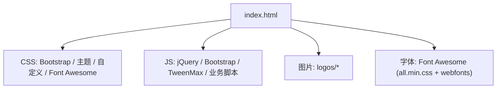
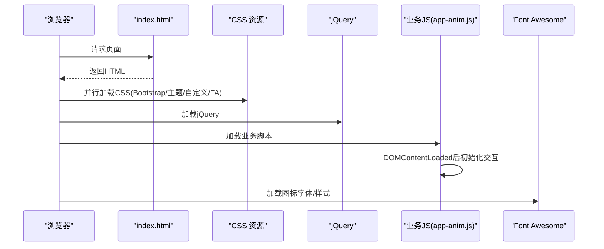
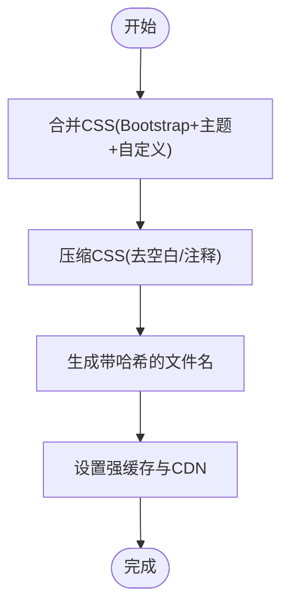
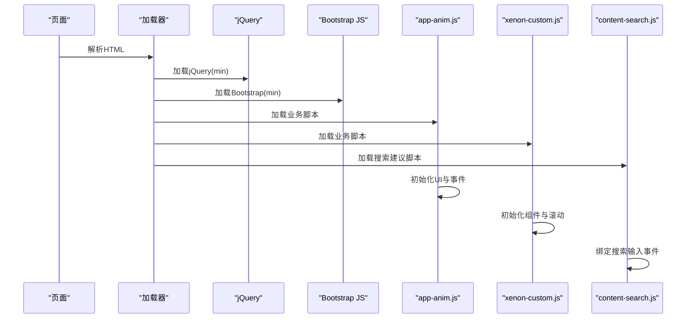
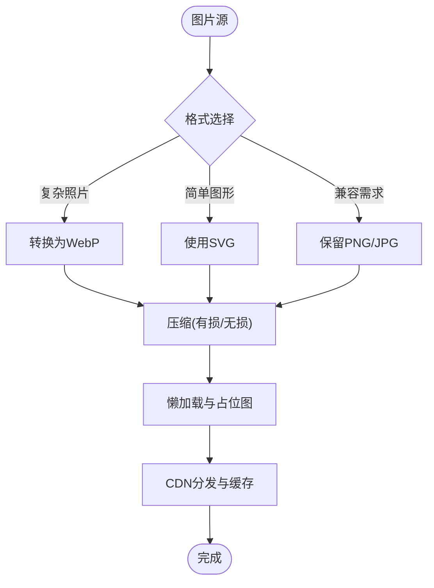
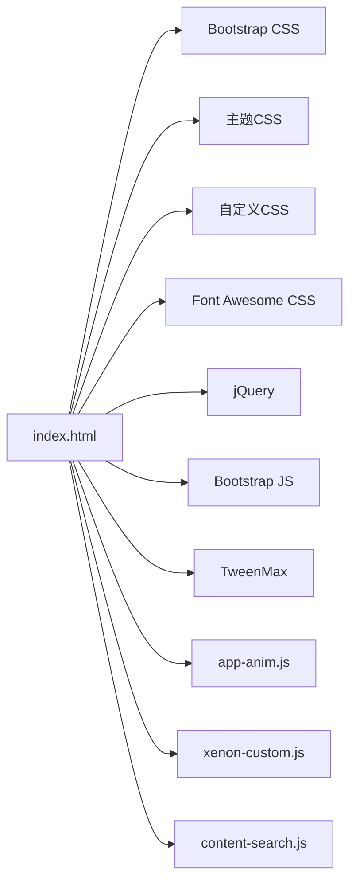

# 资源压缩优化

<cite>
**本文引用的文件**
- [index.html](file://index.html)
- [README.md](file://README.md)
- [assets/css/custom-style.css](file://assets/css/custom-style.css)
- [assets/css/style-3.03029.1.css](file://assets/css/style-3.03029.1.css)
- [assets/js/app-anim.js](file://assets/js/app-anim.js)
- [assets/js/xenon-custom.js](file://assets/js/xenon-custom.js)
- [assets/js/content-search.js](file://assets/js/content-search.js)
- [assets/fontawesome-5.15.4/css/all.min.css](file://assets/fontawesome-5.15.4/css/all.min.css)
</cite>

## 目录
1. [简介](#简介)
2. [项目结构](#项目结构)
3. [核心组件](#核心组件)
4. [架构总览](#架构总览)
5. [详细组件分析](#详细组件分析)
6. [依赖关系分析](#依赖关系分析)
7. [性能考量](#性能考量)
8. [故障排查指南](#故障排查指南)
9. [结论](#结论)
10. [附录](#附录)

## 简介
本文件聚焦于本项目中静态资源的压缩与优化策略，覆盖 CSS/JavaScript 的压缩合并、图片格式优化（含 WebP、SVG）、字体按需加载与子集化裁剪，并提供可操作的配置建议与性能对比方法。目标是帮助开发者有效减少传输体积、提升首屏加载速度与整体用户体验。

## 项目结构
项目为纯静态站点，主要资源位于 assets 目录：
- CSS：框架样式（Bootstrap）、主题样式（style-3.03029.1.css）、自定义样式（custom-style.css）以及图标库样式（Font Awesome all.min.css）。
- JS：jQuery、Bootstrap、动画库（TweenMax）、业务交互脚本（app-anim.js、xenon-custom.js、content-search.js）等。
- 图片：网站 logo 等静态图片。
- 字体：通过 Font Awesome 提供矢量图标字体。

图表来源
- [index.html:17-31](file://index.html#L17-L31)

章节来源
- [index.html:17-31](file://index.html#L17-L31)
- [README.md:298-314](file://README.md#L298-L314)

## 核心组件
- CSS 层
  - Bootstrap 基础布局与组件样式
  - 主题样式 style-3.03029.1.css
  - 自定义样式 custom-style.css
  - 图标样式 Font Awesome all.min.css
- JS 层
  - jQuery（页面交互基础）
  - Bootstrap JS（组件行为）
  - TweenMax（动画）
  - 业务脚本 app-anim.js、xenon-custom.js、content-search.js
- 图片与字体
  - 图片以 PNG/JPG/WebP 形式存在，部分使用懒加载
  - 图标通过 Font Awesome 矢量图标实现

章节来源
- [index.html:17-31](file://index.html#L17-L31)
- [assets/css/custom-style.css:1-126](file://assets/css/custom-style.css#L1-L126)
- [assets/css/style-3.03029.1.css:1-200](file://assets/css/style-3.03029.1.css#L1-L200)
- [assets/js/app-anim.js:1-800](file://assets/js/app-anim.js#L1-L800)
- [assets/js/xenon-custom.js:1-800](file://assets/js/xenon-custom.js#L1-L800)
- [assets/js/content-search.js:1-91](file://assets/js/content-search.js#L1-L91)

## 架构总览
页面在 head 中按顺序引入 CSS，body 中引入 jQuery 与业务脚本，确保 DOM 就绪后再执行交互逻辑。第三方库与业务脚本职责清晰：
- CSS：框架 + 主题 + 自定义 + 图标样式
- JS：基础库 + UI 组件 + 业务逻辑
- 图片：懒加载与占位图
- 字体：通过 Font Awesome 按需引入最小化样式

图表来源
- [index.html:17-31](file://index.html#L17-L31)
- [assets/js/app-anim.js:1-25](file://assets/js/app-anim.js#L1-L25)

## 详细组件分析

### CSS 压缩与合并策略
- 现状
  - 已引入压缩版 Bootstrap 与主题样式，减少体积
  - 自定义样式独立文件，便于维护
  - 图标样式使用 Font Awesome 的 all.min.css，避免全量字体下载
- 建议
  - 合并策略：将 Bootstrap、主题、自定义样式合并为一个 CSS 包，减少 HTTP 请求数；保留 Font Awesome 单独引入以便按需更新
  - 压缩策略：启用构建时 CSS 压缩（去除空白、注释），并开启服务端 Gzip/Brotli 压缩
  - 去重与树摇：移除未使用的类名（如仅用少量 Bootstrap 组件时可考虑裁剪）
  - 缓存策略：对合并后的 CSS 添加内容哈希文件名，配合强缓存

章节来源
- [index.html:17-31](file://index.html#L17-L31)
- [assets/css/custom-style.css:1-126](file://assets/css/custom-style.css#L1-L126)
- [assets/css/style-3.03029.1.css:1-200](file://assets/css/style-3.03029.1.css#L1-L200)

### JavaScript 压缩与体积优化
- 现状
  - 使用 jQuery、Bootstrap、TweenMax 等库
  - 业务逻辑集中在 app-anim.js、xenon-custom.js、content-search.js
- 建议
  - 使用 min 版本库：jQuery、Bootstrap、Fancybox 等已提供 min 版本，优先使用
  - 代码混淆与压缩：构建阶段启用 JS 压缩与混淆，移除调试信息
  - 按需加载：将非首屏功能脚本延迟加载或异步加载
  - 模块拆分：将搜索建议、动画、表单校验等拆分为独立 chunk，按需加载
  - 依赖管理：统一版本管理，避免重复引入

图表来源
- [index.html:30-31](file://index.html#L30-L31)
- [assets/js/app-anim.js:1-25](file://assets/js/app-anim.js#L1-L25)
- [assets/js/xenon-custom.js:1-800](file://assets/js/xenon-custom.js#L1-L800)
- [assets/js/content-search.js:1-91](file://assets/js/content-search.js#L1-L91)

章节来源
- [index.html:30-31](file://index.html#L30-L31)
- [assets/js/app-anim.js:1-800](file://assets/js/app-anim.js#L1-L800)
- [assets/js/xenon-custom.js:1-800](file://assets/js/xenon-custom.js#L1-L800)
- [assets/js/content-search.js:1-91](file://assets/js/content-search.js#L1-L91)

### 图片资源优化（WebP、SVG、压缩工具）
- 现状
  - 图片位于 assets/images/logos，部分使用懒加载属性
  - 页面中存在 WebP 占位图回退逻辑
- 建议
  - 格式选择：优先使用 WebP（现代浏览器），回退到 PNG/JPG；Logo 与简单图形优先 SVG
  - 压缩工具：使用 tinypng、imagemin、svgo 等进行无损/有损压缩
  - 懒加载：对长列表图片启用懒加载，减少首屏压力
  - CDN 与缓存：图片上传至 CDN，开启强缓存与版本控制

章节来源
- [index.html:604-606](file://index.html#L604-L606)

### 字体优化（Font Awesome 按需加载与子集化）
- 现状
  - 使用 Font Awesome all.min.css，减少样式体积
  - 字体文件由 Font Awesome 提供
- 建议
  - 按需加载：仅引入所需图标集合（solid/regular/brands），避免全量
  - 子集化：根据实际使用图标生成子集字体，进一步减小体积
  - 自托管 vs CDN：评估网络与缓存策略，必要时自托管以提升可控性

章节来源
- [index.html:29](file://index.html#L29)
- [assets/fontawesome-5.15.4/css/all.min.css](file://assets/fontawesome-5.15.4/css/all.min.css)

## 依赖关系分析
- HTML 依赖
  - CSS：Bootstrap、主题、自定义、Font Awesome
  - JS：jQuery、Bootstrap、TweenMax、业务脚本
- 运行时依赖
  - 业务脚本依赖 jQuery 与 Bootstrap 提供的 API
  - 搜索建议脚本依赖 jQuery 与外部 API

图表来源
- [index.html:17-31](file://index.html#L17-L31)

章节来源
- [index.html:17-31](file://index.html#L17-L31)

## 性能考量
- 传输压缩
  - 启用服务器端 Gzip/Brotli 压缩（参考 README 中的 Nginx 配置示例）
- 缓存策略
  - 静态资源使用强缓存与内容哈希文件名，减少重复请求
- 资源合并与分片
  - CSS 合并减少请求数；JS 按功能拆分，首屏只加载必要脚本
- 图片与字体
  - 使用 WebP/SVG 与懒加载；Font Awesome 按需与子集化
- 监控与对比
  - 使用浏览器开发者工具 Network 面板测量首屏时间、总请求数与资源大小
  - 记录优化前后关键指标（TTFB、FCP、LCP、总字节数）进行对比

章节来源
- [README.md:86-116](file://README.md#L86-L116)

## 故障排查指南
- 资源加载失败
  - 检查路径是否正确，确保相对路径引用准确
- 样式冲突
  - 若合并 CSS 后出现样式覆盖问题，检查优先级与选择器作用域
- JS 报错
  - 确认 jQuery/Bootstrap 版本兼容，检查控制台错误堆栈
- 图片不显示
  - 检查懒加载逻辑与占位图路径，确认 WebP 回退是否生效

章节来源
- [README.md:316-341](file://README.md#L316-L341)

## 结论
本项目已采用多份压缩资源与合理的脚本组织方式。通过进一步的 CSS/JS 合并与压缩、图片格式优化与懒加载、字体按需与子集化，以及完善的缓存与 CDN 策略，可显著降低传输体积并提升加载性能。建议在构建流程中固化这些优化步骤，并通过持续的性能监控验证效果。

## 附录
- 构建与部署
  - 本地预览：可直接使用任意 HTTP 服务器运行
  - 生产部署：推荐使用 Vercel/Cloudflare Pages/GitHub Pages，并启用自动 HTTPS 与缓存
- 参考配置
  - Nginx 启用 Gzip 与静态资源缓存（见 README 示例）

章节来源
- [README.md:22-43](file://README.md#L22-L43)
- [README.md:86-116](file://README.md#L86-L116)