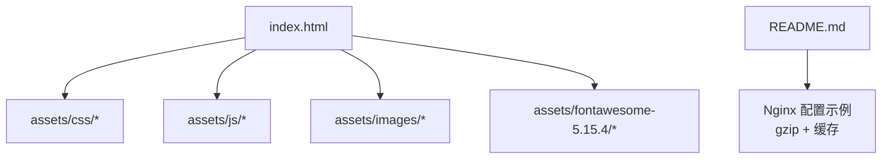
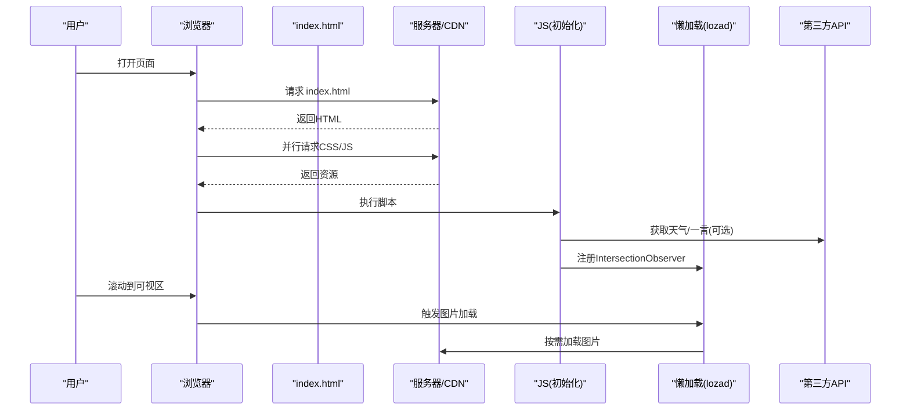
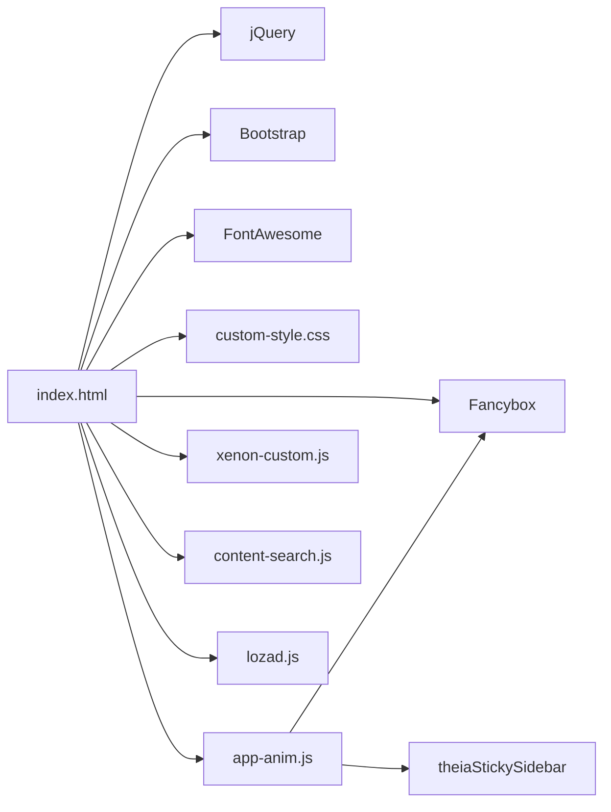

# 性能优化

<cite>
**本文引用的文件**
- [index.html](file://index.html)
- [README.md](file://README.md)
- [custom-style.css](file://assets/css/custom-style.css)
- [app-anim.js](file://assets/js/app-anim.js)
- [xenon-custom.js](file://assets/js/xenon-custom.js)
- [content-search.js](file://assets/js/content-search.js)
- [lozad.js](file://assets/js/lozad.js)
</cite>

## 目录
1. [简介](#简介)
2. [项目结构](#项目结构)
3. [核心组件](#核心组件)
4. [架构总览](#架构总览)
5. [详细组件分析](#详细组件分析)
6. [依赖关系分析](#依赖关系分析)
7. [性能考量](#性能考量)
8. [故障排查指南](#故障排查指南)
9. [结论](#结论)
10. [附录](#附录)

## 简介
本文件面向本项目（纯静态 HTML/CSS/JS 的网址导航站）的性能优化，覆盖页面加载、运行时、SEO、移动端与监控工具等维度。文档基于仓库中的实际代码与配置进行梳理，并提供可操作的优化建议与测试方法，帮助开发者持续改进性能。

## 项目结构
- 入口与内容：index.html 为主页，包含大量链接卡片与搜索模块；about/index.html 为关于页；commit.html 为提交页；404.html 为错误页。
- 资源组织：assets/css 存放样式，assets/js 存放脚本，assets/images 存放图片，assets/fontawesome-5.15.4 为图标库。
- 部署说明：README.md 提供 Nginx/Vercel/GitHub Pages/Cloudflare Pages/Netlify 等部署方式，并给出 gzip 压缩与静态资源缓存示例。

图表来源
- [index.html:1-35](file://index.html#L1-L35)
- [README.md:86-116](file://README.md#L86-L116)

章节来源
- [index.html:1-35](file://index.html#L1-L35)
- [README.md:86-116](file://README.md#L86-L116)

## 核心组件
- 页面骨架与资源引入：index.html 中集中引入 CSS/JS，包含 Bootstrap、Fancybox、FontAwesome、自定义样式与脚本。
- 动画与交互：app-anim.js 负责侧边栏、滚动、夜间模式、AJAX 列表、点赞、统计等交互逻辑。
- 主题与全局行为：xenon-custom.js 提供主题初始化、滚动条、表单、日期选择器等通用能力。
- 搜索建议：content-search.js 通过百度建议接口实现输入联想。
- 懒加载：lozad.js 用于按需加载图片等资源。

章节来源
- [index.html:17-31](file://index.html#L17-L31)
- [app-anim.js:1-25](file://assets/js/app-anim.js#L1-L25)
- [xenon-custom.js:13-50](file://assets/js/xenon-custom.js#L13-L50)
- [content-search.js:1-20](file://assets/js/content-search.js#L1-L20)
- [lozad.js:117-169](file://assets/js/lozad.js#L117-L169)

## 架构总览
下图展示了首页加载时的关键流程：浏览器解析 HTML，并行请求 CSS/JS，执行脚本后初始化 UI、监听事件、发起异步请求（如天气、一言、搜索建议），并通过懒加载在可视区域触发图片加载。

图表来源
- [index.html:17-31](file://index.html#L17-L31)
- [app-anim.js:1-25](file://assets/js/app-anim.js#L1-L25)
- [lozad.js:117-169](file://assets/js/lozad.js#L117-L169)
- [content-search.js:1-20](file://assets/js/content-search.js#L1-L20)

## 详细组件分析

### 页面加载性能优化
- 资源压缩与传输
  - 服务端启用 gzip：README 提供了 Nginx 开启 gzip 的配置片段，适用于文本类资源（CSS/JS/JSON/XML）。
  - 静态资源缓存：README 给出了对图片、字体、CSS/JS 设置长期缓存与不可变策略的示例，减少重复请求。
- 资源加载顺序与并行化
  - 将关键 CSS 置于 head，非关键 JS 放在底部或延迟加载，避免阻塞首屏渲染。
  - 使用 CDN 分发静态资源（CSS/JS/图片/字体），降低网络时延。
- 图片与媒体优化
  - 图片懒加载：index.html 中大量图片使用 class="lazy" 与 data-src，配合 lozad.js 实现 IntersectionObserver 驱动的按需加载，显著减少首屏带宽与内存占用。
  - 图片格式与尺寸：优先使用 WebP/AVIF，按设备分辨率提供不同尺寸，避免大图缩放。
- 预加载与优先级控制
  - 对首屏关键资源使用 preload/prefetch，提升关键路径速度。
  - 对非关键第三方脚本（如天气、一言）采用 defer 或动态加载，避免阻塞主线程。

章节来源
- [README.md:86-116](file://README.md#L86-L116)
- [index.html:604-802](file://index.html#L604-L802)
- [lozad.js:117-169](file://assets/js/lozad.js#L117-L169)

### 运行时性能优化
- 内存管理
  - 避免长生命周期闭包持有大对象；及时移除不再使用的 DOM 引用与事件监听器。
  - 合理使用 localStorage/sessionStorage，定期清理过期数据，避免存储膨胀。
- 事件监听优化
  - 使用事件委托减少监听器数量；对高频事件（scroll、resize）进行节流/防抖处理。
  - app-anim.js 中对 window.resize 使用了定时器节流，避免频繁重排重绘。
- 渲染性能提升
  - 批量 DOM 操作，减少回流与重绘；避免在循环中直接修改布局属性。
  - 使用 CSS transform/opacity 做动画，利用 GPU 加速；避免强制同步布局。
  - 复杂列表采用虚拟滚动或分页加载，降低初始渲染压力。

章节来源
- [app-anim.js:35-45](file://assets/js/app-anim.js#L35-L45)
- [app-anim.js:239-253](file://assets/js/app-anim.js#L239-L253)

### SEO 优化
- Meta 标签
  - 标题、描述、关键词已在 index.html 中设置，确保语义准确且长度适中。
  - 添加 theme-color、viewport、favicon 等基础元信息，改善移动端体验与站点标识。
- 结构化数据
  - 可为网站增加 JSON-LD 结构化数据（如 Organization/WebSite），增强搜索引擎理解。
- 站点地图与收录
  - 生成 sitemap.xml 并提交至搜索引擎控制台；确保 robots.txt 允许抓取必要资源。
- 可访问性与语义化
  - 使用语义化标签（nav、main、section、article）、alt 文本、aria 属性，提升可访问性。

章节来源
- [index.html:7-15](file://index.html#L7-L15)

### 移动端性能优化
- 触摸交互优化
  - 使用 fastclick 或现代 touch 事件优化点击响应；避免 300ms 延迟。
  - 合理设置 viewport，禁用不必要的缩放，提升触控体验。
- 网络请求优化
  - 合并小图标为雪碧图或使用 SVG；减少 HTTP 请求数。
  - 对第三方 API（天气、一言）进行缓存与降级处理，失败时不影响主流程。
- 电池使用优化
  - 减少后台轮询与高耗能动画；尽量使用 CSS 动画替代 JS 动画。
  - 避免在不可见页面继续执行密集任务（使用 Page Visibility API）。

章节来源
- [index.html:9-11](file://index.html#L9-L11)
- [content-search.js:1-20](file://assets/js/content-search.js#L1-L20)

### 性能监控与分析工具
- Chrome DevTools
  - Performance 面板录制关键路径，识别长任务与阻塞点；Network 面板分析请求耗时与缓存命中。
  - Memory 面板检测内存泄漏与堆快照对比。
- Lighthouse
  - 运行性能审计，获取可访问性、最佳实践、SEO 评分与优化建议。
- 埋点与指标
  - 采集核心指标：FCP/LCP/CLS/TBT/INP；结合日志平台进行分析与告警。

[本节为通用指导，不直接分析具体文件]

## 依赖关系分析
- 脚本依赖链
  - index.html 引入 jQuery、Bootstrap、Fancybox、FontAwesome、自定义样式与脚本。
  - app-anim.js 依赖 jQuery 与部分第三方插件（如 theiaStickySidebar、fancybox）。
  - xenon-custom.js 提供主题与通用 UI 能力，被整体页面复用。
  - content-search.js 依赖 jQuery 与外部建议接口。
  - lozad.js 独立模块，通过 IntersectionObserver 驱动懒加载。

图表来源
- [index.html:17-31](file://index.html#L17-L31)
- [app-anim.js:1-25](file://assets/js/app-anim.js#L1-L25)

章节来源
- [index.html:17-31](file://index.html#L17-L31)
- [app-anim.js:1-25](file://assets/js/app-anim.js#L1-L25)

## 性能考量
- 首屏时间优化
  - 关键 CSS 内联或尽早加载；非关键 JS 延迟加载。
  - 图片懒加载已启用，进一步可减少首屏带宽。
- 缓存策略
  - 服务端对静态资源设置长期缓存与不可变头；对 HTML 使用短缓存或无缓存。
  - 浏览器缓存与 CDN 缓存协同，提高命中率。
- 资源体积控制
  - 仅引入必要的 CSS/JS；移除未使用样式与脚本。
  - 图片压缩与格式转换；字体子集化。
- 网络优化
  - 启用 HTTP/2 与 TLS 1.3；使用 CDN 就近分发。
  - 合并请求、减少重定向；对第三方脚本进行异步加载。
- 渲染优化
  - 减少重排重绘；使用 will-change、transform 优化动画。
  - 列表虚拟化与分页加载，避免一次性渲染过多节点。

[本节为通用指导，不直接分析具体文件]

## 故障排查指南
- 图片加载失败
  - 检查 lazy 图片的 data-src 路径是否正确；确认 onerror 回退逻辑生效。
  - 使用 Network 面板查看 404/跨域问题。
- 搜索建议不显示
  - 检查 content-search.js 的接口调用是否成功；确认 JSONP 回调与域名白名单。
- 夜间模式切换异常
  - 检查 app-anim.js 中切换逻辑与主题类名是否正确应用。
- 滚动卡顿
  - 使用 Performance 面板定位长任务；对 scroll/resize 事件进行节流/防抖。

章节来源
- [index.html:604-802](file://index.html#L604-L802)
- [content-search.js:1-20](file://assets/js/content-search.js#L1-L20)
- [app-anim.js:201-237](file://assets/js/app-anim.js#L201-L237)

## 结论
本项目已具备较好的性能基础：静态资源组织清晰、图片懒加载启用、服务端可配置 gzip 与缓存。进一步优化方向包括：全面启用 CDN、精细化资源优先级控制、运行时事件与渲染优化、完善 SEO 与监控体系。通过持续的指标采集与工具审计，可稳步提升用户体验与搜索表现。

[本节为总结，不直接分析具体文件]

## 附录
- 快速优化清单
  - 启用 gzip 与静态资源长期缓存
  - 图片懒加载与格式优化
  - 第三方脚本异步/延迟加载
  - 关键 CSS 尽早加载，非关键 JS 延迟
  - 使用 CDN 分发静态资源
  - 完善 meta 与结构化数据
  - 建立性能监控与告警

[本节为补充信息，不直接分析具体文件]