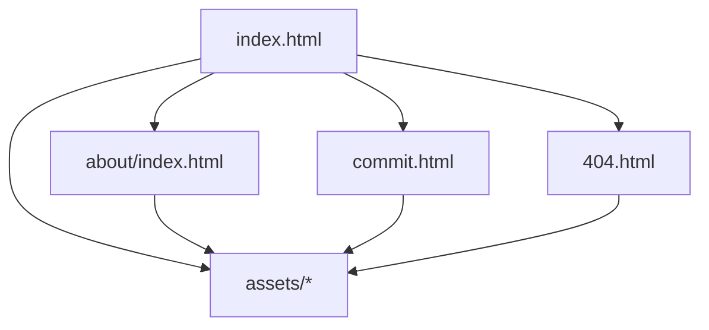
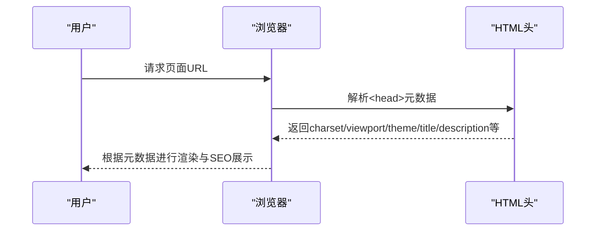
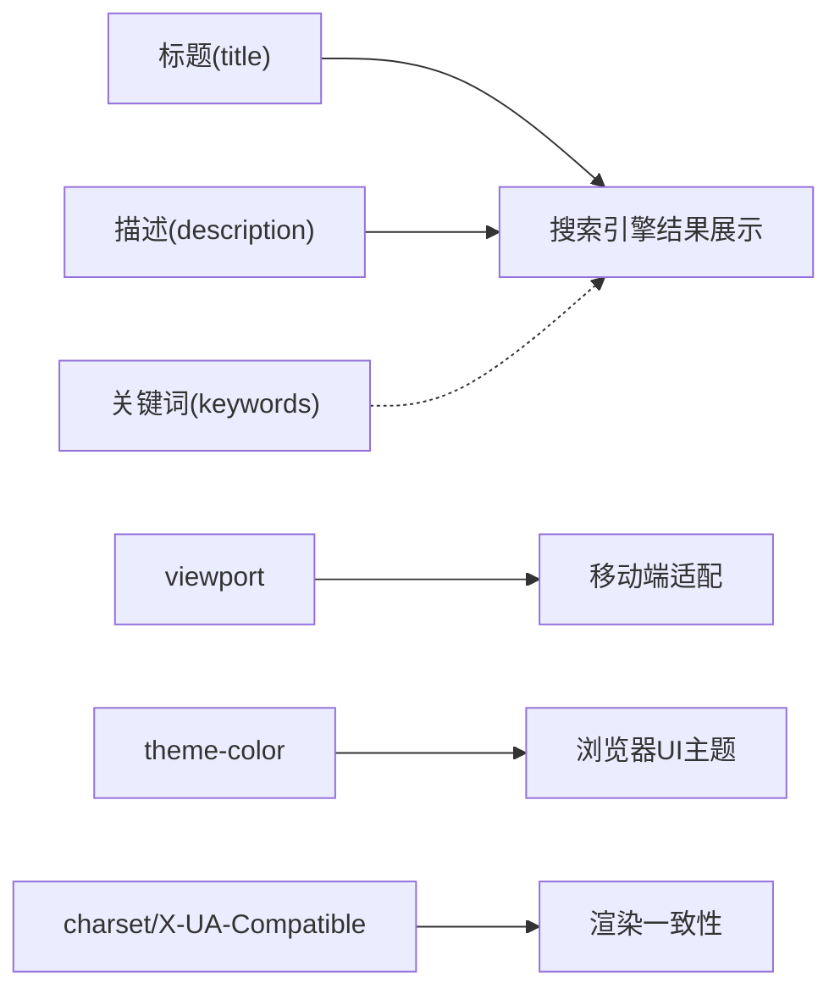

# Meta标签优化

<cite>
**本文引用的文件**
- [index.html](file://index.html)
- [about/index.html](file://about/index.html)
- [commit.html](file://commit.html)
- [404.html](file://404.html)
- [README.md](file://README.md)
</cite>

## 目录
1. [简介](#简介)
2. [项目结构](#项目结构)
3. [核心组件](#核心组件)
4. [架构总览](#架构总览)
5. [详细组件分析](#详细组件分析)
6. [依赖关系分析](#依赖关系分析)
7. [性能注意事项](#性能注意事项)
8. [故障排查指南](#故障排查指南)
9. [结论](#结论)
10. [附录](#附录)

## 简介
本文件聚焦于HTML页面中的Meta标签优化，结合仓库中现有页面的实际配置，系统讲解以下要点：
- 标题标签<title>的优化策略（关键词布局、长度控制、品牌展示）
- 描述标签<meta name="description">的最佳实践（内容撰写规范、字符限制、吸引力提升）
- 关键词标签<meta name="keywords">的配置要点与现代搜索引擎处理方式
- viewport标签设置与移动端友好性
- 主题颜色、字符编码等基础meta标签的配置方法
- 具体代码示例路径与最佳实践建议

## 项目结构
本项目为纯静态网站，包含首页、关于页、提交页和404页。各页面均在<head>中配置了基础的Meta标签，用于SEO与渲染行为控制。

图表来源
- [index.html:1-35](file://index.html#L1-L35)
- [about/index.html:1-30](file://about/index.html#L1-L30)
- [commit.html:1-30](file://commit.html#L1-L30)
- [404.html:1-3](file://404.html#L1-L3)

章节来源
- [index.html:1-35](file://index.html#L1-L35)
- [about/index.html:1-30](file://about/index.html#L1-L30)
- [commit.html:1-30](file://commit.html#L1-L30)
- [404.html:1-3](file://404.html#L1-L3)

## 核心组件
- 标题标签<title>：每个页面均设置了独立的标题，体现页面用途与品牌信息。
- 描述标签<meta name="description">：提供页面摘要，影响搜索结果的显示文案。
- 关键词标签<meta name="keywords">：当前页面存在该标签，但现代搜索引擎通常忽略其权重。
- viewport：<meta name="viewport">确保移动端正确缩放与交互。
- 主题颜色：<meta name="theme-color">用于浏览器地址栏或系统UI的主题色。
- 字符编码与兼容模式：<meta charset>与<meta http-equiv="X-UA-Compatible">保证编码一致与IE兼容。

章节来源
- [index.html:7-15](file://index.html#L7-L15)
- [about/index.html:5-13](file://about/index.html#L5-L13)
- [commit.html:5-13](file://commit.html#L5-L13)
- [404.html:1-3](file://404.html#L1-L3)

## 架构总览
从Meta标签的角度看，各页面遵循统一的头部结构：先声明文档类型与语言，再设置字符集、兼容性、视口、主题色，随后是标题、图标、关键词与描述。这种顺序有利于浏览器快速解析并渲染页面。

图表来源
- [index.html:1-15](file://index.html#L1-L15)
- [about/index.html:1-13](file://about/index.html#L1-L13)
- [commit.html:1-13](file://commit.html#L1-L13)

## 详细组件分析

### 标题标签<title>优化策略
- 关键词布局：将核心业务词置于标题前部，便于搜索引擎识别；例如“网址导航 - 实用的资源导航综合网站”将“网址导航”前置。
- 长度控制：建议控制在约20–60个字符（中文按字节估算），避免过长被截断；当前首页标题长度适中。
- 品牌展示技巧：在标题末尾附加品牌名或站点名，如“- 在线工具网”，增强品牌曝光。
- 页面差异化：每个页面应有唯一且具描述性的标题，避免重复。

章节来源
- [index.html:12](file://index.html#L12)
- [about/index.html:10](file://about/index.html#L10)
- [commit.html:10](file://commit.html#L10)

### 描述标签<meta name="description">最佳实践
- 内容撰写规范：用一句话清晰表达页面价值与主要内容，突出功能点与目标用户；例如首页描述强调“在线网址导航”及工具类别。
- 字符限制：建议控制在约70–160个字符（中文按字节估算），避免在搜索结果中被截断；当前各页描述长度合理。
- 吸引力提升：使用动词与利益点（如“免费”“一键”“高效”），提高点击率；保持自然可读，避免堆砌关键词。
- 页面差异化：不同页面提供不同的描述，匹配各自内容与意图。

章节来源
- [index.html:15](file://index.html#L15)
- [about/index.html:13](file://about/index.html#L13)
- [commit.html:13](file://commit.html#L13)

### 关键词标签<meta name="keywords">配置要点
- 现代搜索引擎处理：主流搜索引擎（Google、Bing、百度等）通常不将keywords作为排名因素，但仍可保留以辅助内部检索或特定平台。
- 配置要点：若保留，应简洁相关，避免冗余与堆砌；当前页面已包含keywords，建议精简至最相关的几个词。
- 替代方案：更重视title、description与页面内容的质量，以及结构化数据与外链建设。

章节来源
- [index.html:14](file://index.html#L14)
- [about/index.html:12](file://about/index.html#L12)
- [commit.html:12](file://commit.html#L12)

### viewport标签设置与移动端友好性
- 基本设置：width=device-width, initial-scale=1.0确保基于设备宽度渲染与初始缩放。
- 缩放控制：minimum-scale与maximum-scale限制用户缩放范围；user-scalable=no可能影响无障碍访问，需谨慎使用。
- 建议：对于需要良好可访问性的站点，允许用户缩放（移除user-scalable=no），并确保文本与控件在不同尺寸下可读。

章节来源
- [index.html:9-10](file://index.html#L9-L10)
- [about/index.html:7-8](file://about/index.html#L7-L8)
- [commit.html:7-8](file://commit.html#L7-L8)

### 主题颜色、字符编码等基础meta标签
- 主题颜色：<meta name="theme-color">设置浏览器UI主题色，提升沉浸感；当前值为浅灰色背景色。
- 字符编码：<meta charset="UTF-8">统一编码，避免乱码。
- 兼容模式：<meta http-equiv="X-UA-Compatible" content="IE=edge, chrome=1">启用IE最新渲染引擎与Chrome Frame（旧版）。
- 建议：保持charset在最前面，确保尽早解析；对现代浏览器，X-UA-Compatible可逐步弃用以简化。

章节来源
- [index.html:7-11](file://index.html#L7-L11)
- [about/index.html:5-9](file://about/index.html#L5-L9)
- [commit.html:5-9](file://commit.html#L5-L9)

### 404页面的Meta与体验
- 404页面当前仅含简单提示，缺少head与Meta标签；建议补充title、description与viewport，以提升SEO与用户体验。
- 建议：为404页面添加明确的错误说明与返回首页链接，同时提供必要的Meta标签。

章节来源
- [404.html:1-3](file://404.html#L1-L3)

## 依赖关系分析
各页面的Meta标签相互独立，无直接依赖；但整体SEO效果受全站一致性影响：
- 标题与描述需与页面内容一致，避免误导。
- viewport与主题色需与整体设计一致，确保跨端体验统一。
- 关键词标签虽非关键排名因素，但应与页面主题保持一致。

图表来源
- [index.html:7-15](file://index.html#L7-L15)
- [about/index.html:5-13](file://about/index.html#L5-L13)
- [commit.html:5-13](file://commit.html#L5-L13)

章节来源
- [index.html:7-15](file://index.html#L7-L15)
- [about/index.html:5-13](file://about/index.html#L5-L13)
- [commit.html:5-13](file://commit.html#L5-L13)

## 性能注意事项
- Meta标签本身对性能影响极小，但错误的charset可能导致重解析与渲染延迟。
- 将<meta charset="UTF-8">放在<head>最前面，减少编码猜测成本。
- 避免过多第三方脚本阻塞首屏；当前项目已在head中引入CSS与少量JS，注意按需加载。

[本节为通用指导，不直接分析具体文件]

## 故障排查指南
- 中文乱码：检查<meta charset="UTF-8">是否位于<head>顶部，服务器响应头Content-Type是否与页面一致。
- 移动端缩放异常：检查viewport参数是否正确，必要时移除user-scalable=no以提升可访问性。
- 搜索结果摘要不正确：确认<meta name="description">内容准确且长度合适；搜索引擎可能自行生成摘要，但高质量描述更易被采用。
- 404页面缺失Meta：为404页面补充head与必要Meta标签，改善SEO与用户体验。

章节来源
- [index.html:7-11](file://index.html#L7-L11)
- [about/index.html:5-9](file://about/index.html#L5-L9)
- [commit.html:5-9](file://commit.html#L5-L9)
- [404.html:1-3](file://404.html#L1-L3)

## 结论
本项目在各页面中已具备基础的Meta标签配置，覆盖了标题、描述、关键词、viewport、主题色与字符编码等关键点。为进一步提升SEO与用户体验，建议：
- 精细化标题与描述，确保每页独特且具吸引力
- 谨慎使用keywords，重点优化title与description
- 评估user-scalable=no的必要性，优先保障可访问性
- 为404页面补充完整Meta与友好提示
- 保持charset与兼容设置的一致性，确保渲染稳定

[本节为总结性内容，不直接分析具体文件]

## 附录
- 参考文档：项目README中提及“完善 meta 标签（title、description、keywords）”作为SEO优化项之一。

章节来源
- [README.md:336-341](file://README.md#L336-L341)