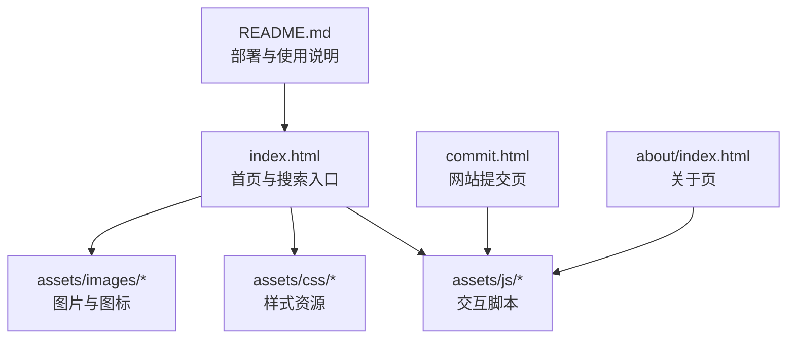
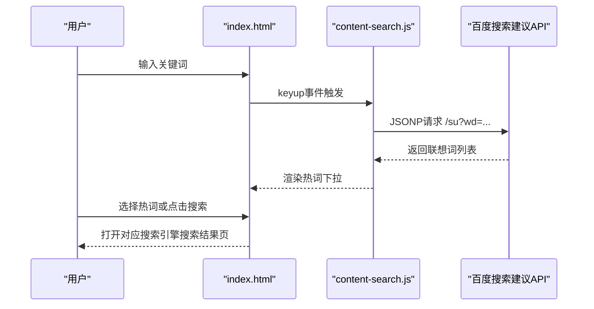
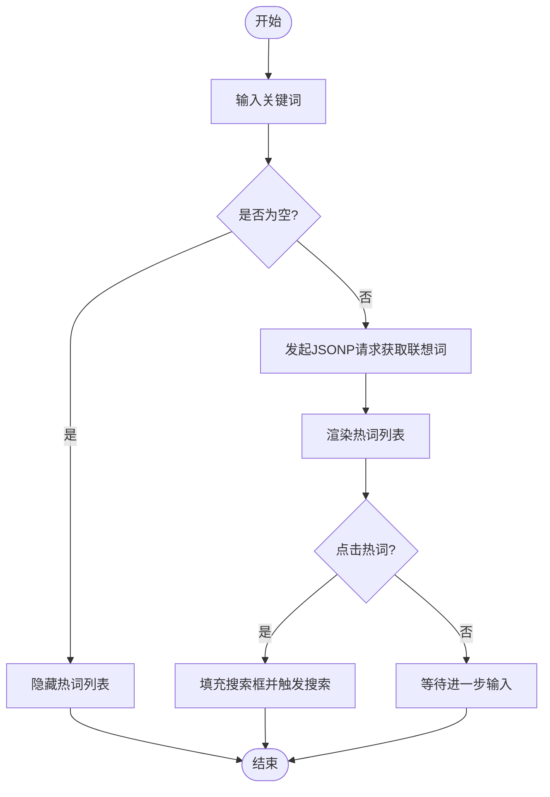
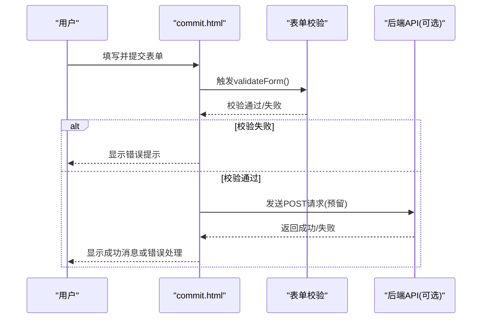
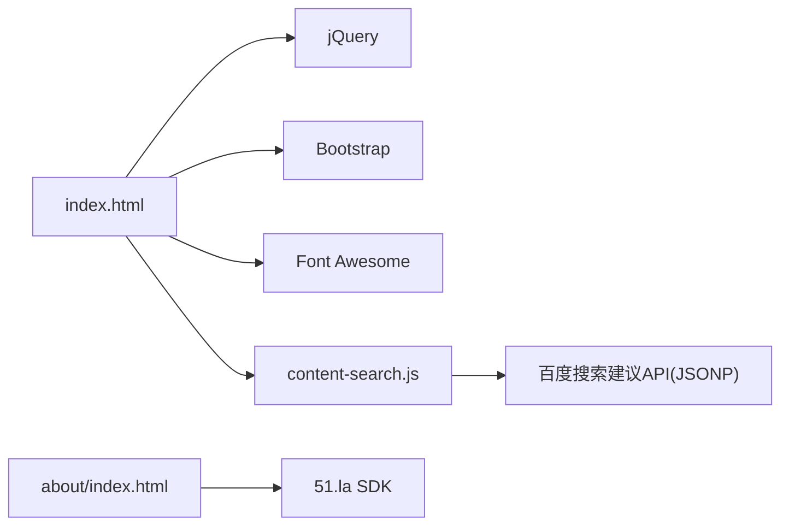

# SEO分析工具

<cite>
**本文引用的文件**
- [README.md](file://README.md)
- [index.html](file://index.html)
- [commit.html](file://commit.html)
- [about/index.html](file://about/index.html)
- [assets/js/content-search.js](file://assets/js/content-search.js)
- [assets/css/custom-style.css](file://assets/css/custom-style.css)
</cite>

## 目录
1. [简介](#简介)
2. [项目结构](#项目结构)
3. [核心组件](#核心组件)
4. [架构总览](#架构总览)
5. [详细组件分析](#详细组件分析)
6. [依赖关系分析](#依赖关系分析)
7. [性能与SEO优化建议](#性能与seo优化建议)
8. [故障排查指南](#故障排查指南)
9. [结论](#结论)
10. [附录：SEO工具配置与使用指南](#附录seo工具配置与使用指南)

## 简介
本项目是一个纯静态的在线网址导航站点，提供分类导航、多引擎搜索、网站提交等能力。虽然它本身不是“SEO分析工具”，但为SEO工作提供了基础载体：可集成统计与分析脚本、便于部署到CDN/静态托管平台以提升访问速度，并通过内置搜索入口快速跳转到各类SEO分析与监控工具（如Google Search Console、百度站长平台、PageSpeed Insights、GTmetrix等）。

本仓库还包含一个“网站提交”页面，可用于收集待收录或待优化的站点信息，配合外部表单服务实现持久化存储。

**章节来源**
- [README.md:1-15](file://README.md#L1-L15)
- [README.md:298-314](file://README.md#L298-L314)

## 项目结构
项目采用纯前端静态结构，核心由HTML页面、CSS样式与少量JavaScript组成，资源集中在assets目录下。

**图表来源**
- [index.html:1-35](file://index.html#L1-L35)
- [commit.html:1-26](file://commit.html#L1-L26)
- [about/index.html:1-26](file://about/index.html#L1-L26)
- [README.md:298-314](file://README.md#L298-L314)

**章节来源**
- [README.md:298-314](file://README.md#L298-L314)

## 核心组件
- 首页与搜索聚合：提供多搜索引擎切换与关键词联想，便于快速跳转至SEO相关工具或查询结果。
- 网站提交页：表单校验与数据收集，便于后续人工审核或接入第三方表单服务。
- 关于页：已集成51.la统计SDK，可作为网站流量分析的参考示例。
- 自定义样式：对导航、搜索框、热词下拉等进行视觉优化。

**章节来源**
- [index.html:334-567](file://index.html#L334-L567)
- [commit.html:178-382](file://commit.html#L178-L382)
- [about/index.html:239-241](file://about/index.html#L239-L241)
- [assets/css/custom-style.css:1-126](file://assets/css/custom-style.css#L1-L126)

## 架构总览
整体为无后端静态站点，所有逻辑在浏览器端执行。搜索功能通过表单直接跳转到各搜索引擎；关键词联想通过JSONP调用百度搜索接口；提交表单在前端完成校验并预留了接入后端API的位置。

**图表来源**
- [index.html:334-567](file://index.html#L334-L567)
- [assets/js/content-search.js:1-91](file://assets/js/content-search.js#L1-L91)

**章节来源**
- [assets/js/content-search.js:1-91](file://assets/js/content-search.js#L1-L91)
- [index.html:334-567](file://index.html#L334-L567)

## 详细组件分析

### 首页与搜索聚合
- 多引擎搜索：支持百度、必应、谷歌、360、搜狗、神马等，通过单选按钮切换目标搜索引擎URL模板。
- 关键词联想：监听输入框keyup事件，调用百度搜索建议接口，动态展示热词列表，点击后自动填充并触发搜索。
- 响应式布局：基于Bootstrap栅格与自定义样式，适配移动端与桌面端。

**图表来源**
- [assets/js/content-search.js:1-91](file://assets/js/content-search.js#L1-L91)
- [index.html:334-567](file://index.html#L334-L567)

**章节来源**
- [index.html:334-567](file://index.html#L334-L567)
- [assets/js/content-search.js:1-91](file://assets/js/content-search.js#L1-L91)

### 网站提交页
- 表单字段：网站名称、地址、分类、描述、关键词、邮箱、联系方式。
- 前端校验：必填项检查、URL格式校验、邮箱格式校验，错误时高亮并提示。
- 提交逻辑：当前仅在前端收集数据，预留了接入后端API或第三方表单服务的扩展点。

**图表来源**
- [commit.html:178-382](file://commit.html#L178-L382)

**章节来源**
- [commit.html:178-382](file://commit.html#L178-L382)

### 关于页与统计集成
- 已集成51.la统计SDK，用于采集页面访问与用户行为数据，可作为SEO效果评估的基础数据来源之一。
- 页面结构与样式清晰，便于二次开发与内容维护。

**章节来源**
- [about/index.html:239-241](file://about/index.html#L239-L241)
- [about/index.html:1-338](file://about/index.html#L1-L338)

### 自定义样式
- 针对侧边栏宽度、滚动条隐藏、搜索框颜色、热词下拉样式等进行定制，提升用户体验。
- 网格背景与主题色调整，增强视觉一致性。

**章节来源**
- [assets/css/custom-style.css:1-126](file://assets/css/custom-style.css#L1-L126)

## 依赖关系分析
- 页面依赖jQuery、Bootstrap、Font Awesome等前端库，位于assets目录中。
- 搜索联想依赖百度搜索建议接口（JSONP），跨域通过回调函数处理。
- 统计依赖51.la SDK，异步加载，不影响首屏渲染。

**图表来源**
- [index.html:17-31](file://index.html#L17-L31)
- [assets/js/content-search.js:1-91](file://assets/js/content-search.js#L1-L91)
- [about/index.html:239-241](file://about/index.html#L239-L241)

**章节来源**
- [index.html:17-31](file://index.html#L17-L31)
- [assets/js/content-search.js:1-91](file://assets/js/content-search.js#L1-L91)
- [about/index.html:239-241](file://about/index.html#L239-L241)

## 性能与SEO优化建议
- 静态资源缓存：已在Nginx示例中启用静态资源缓存策略，有助于降低重复请求开销。
- 压缩传输：启用gzip压缩可减少CSS/JS体积，提升加载速度。
- 元信息完善：确保title、description、keywords准确，利于搜索引擎理解页面主题。
- 站点地图：建议添加sitemap.xml并主动提交给搜索引擎，加速收录。
- 部署优化：推荐使用Vercel/Cloudflare Pages/GitHub Pages等静态托管，结合CDN提升全球访问速度。

**章节来源**
- [README.md:47-147](file://README.md#L47-L147)
- [README.md:336-341](file://README.md#L336-L341)

## 故障排查指南
- 图片或样式加载失败：检查相对路径是否正确，确认资源文件存在且路径引用无误。
- 搜索联想不生效：确认网络可达，JSONP回调正常；若被拦截，需考虑同源策略或代理方案。
- 提交表单无效：当前未实现后端持久化，如需保存数据，请接入后端API或第三方表单服务。
- 统计不记录：确认51.la SDK正确加载且未被广告拦截器屏蔽。

**章节来源**
- [README.md:318-327](file://README.md#L318-L327)
- [assets/js/content-search.js:67-71](file://assets/js/content-search.js#L67-L71)
- [commit.html:347-371](file://commit.html#L347-L371)
- [about/index.html:239-241](file://about/index.html#L239-L241)

## 结论
该项目提供了一个轻量、易部署的静态导航站点，具备多引擎搜索、关键词联想与网站提交能力，适合作为SEO工作的入口与辅助平台。通过集成统计与分析工具、完善元信息与站点地图、利用CDN与静态托管优化性能，可以显著提升SEO效果与用户体验。

[本节为总结性内容，不直接分析具体文件]

## 附录：SEO工具配置与使用指南

说明：以下内容为通用操作指南，帮助你在该站点基础上开展SEO分析与监控工作。由于本项目不包含后端与专用分析模块，以下步骤以“在该站点中集成与跳转”的方式呈现。

- Google Search Console（GSC）
  - 网站验证：在GSC中添加你的站点域名，按官方指引完成所有权验证（如DNS TXT记录、HTML文件上传或Meta标签）。
  - 索引状态监控：定期查看“索引编制”报告，关注已索引页面数、覆盖率问题与手动操作通知。
  - 搜索表现分析：在“搜索外观”与“性能”报告中跟踪点击量、展示量、平均排名与点击率变化，识别高潜力页面与问题页面。
  - 在本项目中：可在index.html的<head>区域添加GSC验证所需的Meta标签或上传验证文件，并在README中记录部署步骤。

- 百度站长平台
  - 站点收录检测：使用“普通收录”或“批量提交”功能，提交重要页面URL，观察收录状态。
  - 关键词排名监控：通过“关键词排名”工具追踪核心词的排名变化，结合“搜索分析”了解流量来源。
  - 用户体验报告：关注“移动适配”、“网页加速”等报告，修复影响体验的问题（如首屏时间过长、移动端适配不佳）。
  - 在本项目中：可将百度统计代码插入页面，或在README中补充百度站长平台的接入说明。

- SEO分析工具（关键词研究、竞争对手分析、链接建设监控）
  - 关键词研究：借助Ahrefs、SEMrush、百度指数、5118等工具进行关键词挖掘与难度评估。
  - 竞争对手分析：对比竞品外链数量与质量、内容覆盖度、技术SEO指标，制定差异化策略。
  - 链接建设监控：使用Ahrefs Site Explorer或Majestic监控外链增长与流失，避免低质链接风险。
  - 在本项目中：可通过首页搜索入口快捷跳转到上述工具的查询页面，形成一站式导航。

- 页面性能分析工具（PageSpeed Insights、GTmetrix）
  - PageSpeed Insights：输入目标URL，获取移动端与桌面端的性能评分与优化建议（如减少阻塞资源、启用压缩、优化图片）。
  - GTmetrix：生成瀑布图与性能报告，定位大资源、慢请求与缓存策略问题。
  - 在本项目中：建议在README中增加“如何运行本地预览并进行性能测试”的步骤，便于开发者快速复现与优化。

- SEO审计工具（技术SEO检查、内容质量评估）
  - 技术SEO：使用Screaming Frog、Sitebulb等爬虫工具抓取站点，检查重定向、死链、重复标题、缺失Meta、结构化数据等问题。
  - 内容质量：评估内容完整性、可读性、内链密度与关键词布局，确保符合搜索引擎质量指南。
  - 在本项目中：将审计结果整理为清单，优先修复高优先级问题，并在迭代中持续回归验证。

- SEO监控仪表板搭建与关键指标跟踪策略
  - 数据源整合：将GSC、百度统计、GA、51.la等数据导出或通过API汇总到统一看板（如Data Studio、Metabase、Tableau）。
  - 关键指标：自然搜索流量、点击率、平均排名、收录率、跳出率、页面加载时长、核心Web指标（LCP、FID、CLS）。
  - 告警与复盘：设置阈值告警（如流量骤降、排名大幅下滑），定期复盘并输出优化建议。
  - 在本项目中：可在about或新增的仪表盘页面嵌入可视化图表，或在README中提供搭建指引。

[本节为概念性指导，不直接映射到具体源码文件]